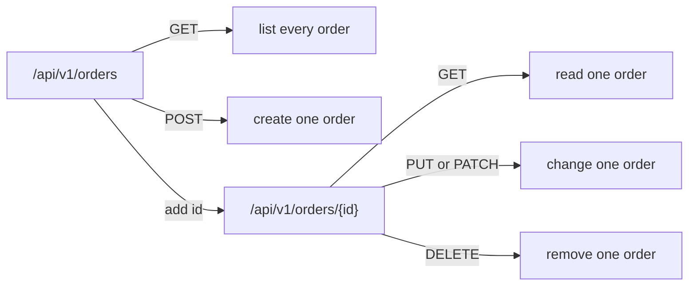

## Bạn cần biết trước

- [[backend.l1.hosting-and-program-cs]] — bạn đã biết endpoint là một cặp method và đường dẫn, và `app.MapControllers()` tìm các cặp này trên những class như `ProductsController`.
- [[foundation.l1.http-methods]] — bạn đã biết GET để đọc, POST để tạo, PUT để thay thế, PATCH để sửa một phần, còn DELETE để xóa.

## Tình huống

Một đồng nghiệp nhờ bạn thêm chức năng hủy đơn hàng và đề xuất đường dẫn `/api/v1/cancelOrder`. Nó chạy được, bạn hoàn toàn có thể viết một method trả lời đường dẫn đó. Nhưng đặt cạnh các đường dẫn đơn hàng Đơn Hàng đã có thì nó trông lạc lõng: `/api/v1/orders` để tạo đơn hàng, và `/api/v1/orders/1` để đọc lại một đơn theo id. Vậy điều gì nên quyết định đường dẫn của một endpoint mới, nếu không đơn thuần là "miễn sao nhìn vào hiểu ngay hành động"?

## Khái niệm cốt lõi

- **resource** (một thứ được đặt tên bằng danh từ trong URL, vd. `/api/v1/orders`; method quyết định làm gì với nó) — theo quy ước của bài này, là một thứ được gọi tên bằng danh từ trong URL (nửa đường dẫn của cặp method và đường dẫn ở bài trước), như một đơn hàng hay một sản phẩm. URL cho biết đó là thứ nào, HTTP method cho biết làm gì với nó.
- collection URL — URL đặt tên cho mọi resource cùng loại (`/api/v1/orders`). Khi URL này có GET, GET đó liệt kê chúng.
- item URL — URL đặt tên cho đúng một resource cụ thể (`/api/v1/orders/1`). GET trên URL này chỉ đọc đúng resource đó.
- động từ nằm ở method, không nằm ở URL — cùng một item URL mang nghĩa khác nhau tùy method: GET đọc nó, PUT hoặc PATCH sửa nó, DELETE xóa nó. Một hành động có tên riêng của server có thể đứng sau item URL thành một đoạn riêng, nhưng không bao giờ thay chỗ danh từ.

## Cơ chế hoạt động



Sơ đồ này là khuôn chung mà mọi resource có thể theo, không phải lời hứa rằng Đơn Hàng trả lời mọi nhánh của nó. Với đơn hàng, GET trên collection chỉ liệt kê đơn của chính khách hàng đang đăng nhập, không phải mọi đơn hàng.

`/api/v1/orders` và `/api/v1/orders/{id}` là hai resource khác nhau, không phải hai cách viết của cùng một đường dẫn. Đường dẫn trần, ở dạng số nhiều, đặt tên cho cả tập hợp, còn thêm id vào thì thu hẹp xuống một item. Trên cả hai, mỗi method giữ nguyên nghĩa quen thuộc từ [[foundation.l1.http-methods]]: GET để đọc, POST trao cho collection thứ gì đó để xử lý, mà ở Đơn Hàng là tạo đơn hàng mới.

Động từ không bao giờ chiếm chỗ danh từ của resource trong đường dẫn. Khi một hành động cần tên riêng, tên đó được thêm vào sau item URL. Theo quy ước này, đoạn hành động như vậy hợp lý khi server thực hiện một hành động có tên, với quy tắc riêng: những bước vượt ra ngoài chuyện lưu lại thứ client gửi lên, như thông báo mà Đơn Hàng gửi đi khi một đơn bị hủy. Khi client chỉ gán một giá trị, chẳng hạn ghi đè một trường của đơn hàng, thì một PATCH thông thường trên `/api/v1/orders/{id}` mang giá trị mới là đủ. `/api/v1/cancelOrder` đặt động từ vào chỗ của danh từ, nên theo quy ước này nó không phải tên của một resource.

Theo quy ước, POST đi với collection URL, còn PUT, PATCH và DELETE đi với item URL, vì mỗi method này tác động lên một resource cụ thể. Bản thân HTTP không bắt buộc cách chia này. Đó là quy ước mà Đơn Hàng tuân theo.

Từ đó ra một thứ tự quyết định: đặt tên resource trước, rồi xác định bạn muốn nói cả collection hay một item, sau cùng mới viết đường dẫn.

## Trong hệ thống Đơn Hàng

Mọi resource trong Đơn Hàng đều theo cùng một hình dạng: mỗi class một tiền tố `/api/v1/<plural-noun>`, rồi mỗi việc tiền tố đó cần làm là một method. Với bài này, chỉ các dòng `[Route(...)]` và `[Http...]` là quan trọng. Phần còn lại, gồm `[ApiController]`, `[Authorize]`, kiểu tham số và kiểu trả về, thân mỗi method làm gì, các comment `//` trỏ tới bài khác, thuộc về các bài sau. `ProductsController` ánh xạ collection URL của nó và item URL bên dưới, cả hai đều bằng GET:

```csharp file=DonHang.Api/Controllers/ProductsController.cs tag=stage-1 lines=8-28
[ApiController]
[Route("api/v1/products")]
public sealed class ProductsController(DonHangDbContext db) : ControllerBase
{
    // lesson: backend.l1.get-and-status-codes
    [HttpGet]
    public async Task<ActionResult<List<ProductDto>>> List()
    {
        var products = await db.Products
            .Select(p => new ProductDto(p.Id, p.Name, p.PriceVnd))
            .ToListAsync();
        return Ok(products);
    }

    [HttpGet("{id:int}")]
    public async Task<ActionResult<ProductDto>> Get(int id)
    {
        var product = await db.Products.FindAsync(id);
        if (product is null) return NotFound();
        return Ok(new ProductDto(product.Id, product.Name, product.PriceVnd));
    }
```

`[Route("api/v1/products")]` trên class cố định tiền tố chung một lần. `[HttpGet]` không kèm id, đặt trên `List()`, trả lời collection URL trần, `GET /api/v1/products`. `[HttpGet("{id:int}")]`, đặt trên `Get(int id)`, thêm `{id}` vào tiền tố đó. Đây là chỗ trống được lấp bằng id thật trong request, với `:int` quy định chỉ số nguyên nằm trong phạm vi 32-bit mới khớp. Nhờ vậy method này trả lời item URL, `GET /api/v1/products/{id}`, chính là URL mà phần Thử ngay bên dưới gọi tới.

`OrdersController` mang cùng kiểu attribute ở mức class, `[Route("api/v1/orders")]`. Class này còn có một method `[HttpPost]` là `Create` và một method `[HttpGet]` là `List` (không trích ở đây, chỉ riêng attribute của chúng là đáng kể), cả hai trả lời collection URL: `POST /api/v1/orders` tạo đơn hàng, `GET /api/v1/orders` liệt kê đơn của chính khách hàng đang đăng nhập. Xuống dưới trong cùng class, hai method nữa trả lời item URL và trả lời luôn câu hỏi của người đồng nghiệp ở phần tình huống:

```csharp file=DonHang.Api/Controllers/OrdersController.cs tag=stage-1 lines=30-46
    [HttpGet("{id:int}")]
    public async Task<ActionResult<OrderDto>> Get(int id)
    {
        var order = await repository.FindAsync(id);
        if (order is null) return NotFound();
        return Ok(ToDto(order));
    }

    // lesson: management.l1.reviewing-for-tests
    // Deliberately missing a check: see OrderService.CancelOrderAsync.
    [Authorize]
    [HttpPatch("{id:int}/cancel")]
    public async Task<ActionResult<OrderDto>> Cancel(int id)
    {
        var order = await orderService.CancelOrderAsync(id);
        return Ok(ToDto(order));
    }
```

`[HttpGet("{id:int}")]` trả lời item URL, `GET /api/v1/orders/{id}`, cho từng đơn hàng một, cùng hình dạng với `ProductsController.Get` ở trên. `[HttpPatch("{id:int}/cancel")]`, đặt trên `Cancel`, là câu trả lời thật cho người đồng nghiệp: `PATCH /api/v1/orders/{id}/cancel`, không phải `/api/v1/cancelOrder`. Đường dẫn riêng của đơn hàng, `/api/v1/orders/{id}`, không hề biến mất. `cancel` là một hành động có tên riêng: server đặt trạng thái thành `cancelled`, lưu lại và gửi thông báo, thay vì để client tự ghi thẳng giá trị trạng thái. Vì thế nó có một đoạn riêng sau item URL chứ không thay thế item URL.

Không phải đường dẫn `/api/v1/...` nào cũng đặt tên resource theo cách này. Class thứ ba, `AuthController`, gom endpoint duy nhất của nó dưới tiền tố `/api/v1/auth`: `POST /api/v1/auth/login`. `login` là động từ, giống `cancel`, và vẫn ổn với cùng lý do: ở đây không có đơn hàng, sản phẩm hay thứ gì khác đang được đặt tên, nên chẳng có danh từ nào bị gạt đi cả. `/api/v1/cancelOrder` thì khác, vì đơn hàng đã tồn tại và đã có đường dẫn riêng cần giữ.

## Người mới hay nghĩ rằng…

- **"Một URL như `/api/v1/cancelOrder` vẫn ổn, miễn nhìn vào là biết nó làm gì."** → Thực ra dễ hiểu không phải là thước đo, và cách sửa cũng không phải một đường dẫn cấp cao nhất hoàn toàn mới. Cách Đơn Hàng thật sự làm cho đúng hành động này là `PATCH /api/v1/orders/{id}/cancel`: đường dẫn riêng của đơn hàng vẫn còn, `cancel` được thêm vào sau. Bạn nhận ra điều này ở `OrdersController` phía trên, nơi URL của resource giữ nguyên dù thao tác hủy được đưa ra thành một hành động có tên riêng, thay vì để client tự ghi thẳng giá trị trạng thái của đơn.
- **"Tạo đơn hàng và liệt kê đơn hàng cần hai URL khác nhau, vì đó là hai hành động khác nhau."** → Thực ra chúng dùng chung một URL, `/api/v1/orders`, do các method mà resource đó cần trả lời. POST để tạo, như `OrdersController.Create`. GET để liệt kê, như `OrdersController.List`. Cả hai nằm trên `/api/v1/orders`, trong cùng một class. (`List` của Đơn Hàng chỉ trả về đơn của khách hàng đang đăng nhập. Ai được xem gì thuộc về các bài sau.)
- **"Chữ `v1` trong `/api/v1/orders` chỉ phiên bản của từng đơn hàng, không phải của cả bộ endpoint này."** → Thực ra `v1` đánh dấu phiên bản của cả bộ endpoint, cố định một lần cho mọi endpoint server này trả lời, không tính theo từng đơn: `/api/v1/orders/1` và `/api/v1/orders/2` mang cùng `v1`, kể cả khi một đơn đã đổi trạng thái nhiều lần còn đơn kia thì chưa lần nào.

## Thử ngay (3 phút)

1. Từ thư mục gốc của dự án Đơn Hàng, khởi động hệ thống ví dụ bằng `scripts/up.sh` và chờ tới khi nó in ra `The lab is up.`, rồi chạy `curl -i http://localhost:8080/api/v1/products` (`curl` gửi một request từ terminal và in ra response, `-i` khiến nó in cả dòng trạng thái và header chứ không chỉ body, `localhost` là tên chỉ chính máy của bạn, còn `8080` là port mà hệ thống ví dụ lắng nghe). Đây là collection URL, không có id.
2. Rồi chạy `curl -i http://localhost:8080/api/v1/products/1` (item URL, id `1`).

Kết quả mong đợi: lệnh đầu trả về `200` kèm một mảng JSON chứa mọi sản phẩm. Lệnh hai trả về `200` kèm một object sản phẩm, không bọc trong mảng. Cùng `ProductsController`, cùng nghĩa của method GET ở cả hai lần, chỉ có URL đổi thứ mà nó đọc. Vì sao lệnh thứ hai trả về một object thay vì một mảng?

<details><summary>Gợi ý đáp án</summary>

`ProductsController` ánh xạ hai URL tới hai method khác nhau. `List()` trả lời collection URL trần và luôn trả về một mảng, kể cả khi sau này chỉ có không hoặc một sản phẩm. `Get(int id)` trả lời item URL, lấy `{id}` từ URL làm tham số của chính nó và dùng nó để hỏi database đúng một sản phẩm. Chính lần tra cứu theo từng request đó khiến response là một object thay vì một mảng.

</details>

## Liên hệ

- [[backend.l1.hosting-and-program-cs]] — khái niệm endpoint mà bài này biến thành một quy ước đặt tên.
- [[foundation.l1.http-methods]] — nghĩa của các method mà bài này giữ cố định trên mọi resource.
- [[backend.l1.dtos-and-serialization]] — hình dạng của thứ mà các endpoint này thực sự trả về.
- [[backend.l1.get-and-status-codes]] — các status code mà `List()` và `Get()` nên trả về, ngoài những `200` bạn thấy ở đây.

## Tóm tắt 5 dòng

1. Resource là danh từ trong URL, method nói làm gì với nó. Một hành động có tên đứng sau item URL, không bao giờ thay thế nó.
2. Collection URL (`/api/v1/orders`) và item URL (`/api/v1/orders/1`) là hai resource khác nhau, không phải hai cách viết của cùng một thứ.
3. GET trên collection liệt kê các resource trong đó, GET trên item chỉ đọc đúng resource đó. Nghĩa của method không đổi giữa hai trường hợp.
4. POST thường đi với collection URL, còn PUT, PATCH và DELETE thường đi với item URL, vì mỗi method tác động lên một resource chứ không phải cả tập.
5. `/api/v1/cancelOrder` đặt động từ vào chỗ của danh từ. Cách sửa của Đơn Hàng giữ đường dẫn riêng của đơn hàng và thêm hành động vào sau: `PATCH /api/v1/orders/{id}/cancel`.
