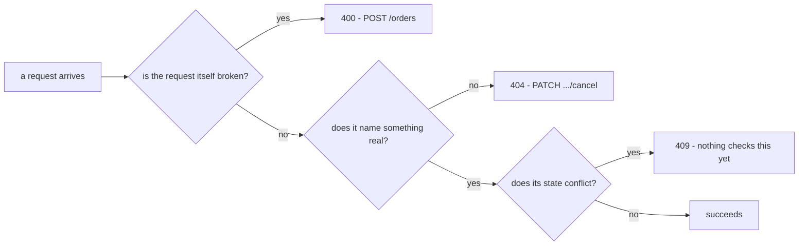

## Before you start

- [[backend.l1.validating-input]] — you know `PlaceOrderAsync` throws `ArgumentException` for an empty item list, and something outside it catches that exception and answers `400` naming the problem.

## The situation

You're extending `PATCH /api/v1/orders/{id}/cancel`. Cancelling order `99999`, which doesn't exist, needs its own answer — separate from `validating-input`'s empty-items case, where the request itself was malformed. Sending `PATCH /api/v1/orders/99999/cancel` gets `404` with `{"title":"Not found","status":404,"detail":"order 99999 not found"}`. Same `title`/`status`/`detail` shape as that `400` — only the number and the text changed. Nothing about this request was malformed; the id it named just doesn't exist. What decides which status code fits?

## Core concepts

- `400 Bad Request` — the request itself is invalid, the way `validating-input`'s empty-items check rejects one; that specific check fails the same way regardless of which order it would have applied to.
- `404 Not Found` — the request is well-formed, but names something that doesn't currently exist; the id is the problem, not the request's shape.
- `409 Conflict` — the request is well-formed and names something real, but conflicts with that thing's current state; nothing about the request itself was wrong, only its timing.
- Problem Details' shared shape — in this app, every one of these three status codes comes back with the same `title`/`status`/`detail` fields; RFC 9457 allows more optional fields than that, but this app's own exception handling only ever fills these three.

## How it works



The three status codes answer three different questions about a failing request — not necessarily three checks inside one single endpoint; the diagram's three status boxes each name which endpoint illustrates them. First: is the request itself broken? That's `validating-input`'s territory, illustrated by `POST /api/v1/orders`: a missing or invalid value in the request body, like an empty item list, is `400` no matter which order it would have applied to. `PATCH /api/v1/orders/{id}/cancel` takes no request body at all, so this question never comes up for it — every request that reaches `CancelOrderAsync` has already passed it trivially, with nothing to be malformed.

Second: does the thing the request names exist? `PATCH /api/v1/orders/99999/cancel` is a perfectly well-formed request — there's nothing wrong with its shape — but no order `99999` exists to cancel. That's `404`: the id is what's missing, not the request. This holds even when the id itself looks like an obviously wrong number: as long as it's a value the route accepts, a lookup that finds nothing is still `404`, never `400` — the request's shape was fine, so only the id was missing.

Third, if the named thing does exist: does acting on it conflict with its current state right now? Every order carries a `status` — `"new"`, `"paid"`, `"shipped"`, then `"cancelled"` — and cancelling one that's already `"shipped"` would be exactly this case: the request is well-formed, and the order is real, but shipping already happened, and cancelling now conflicts with that. If a check for this existed, it would answer `409`, not `400`: nothing about the request was ever wrong, only its timing relative to the order's state. `CancelOrderAsync` doesn't run that check yet, so this branch describes what should happen, not what happens today.

## In the Đơn Hàng system

`OrderService.CancelOrderAsync` is where the `404` case in the situation above comes from:

```csharp file=DonHang.Domain/OrderService.cs tag=stage-1 lines=29-35
    public async Task<Order> CancelOrderAsync(int orderId)
    {
        var order = await repository.FindAsync(orderId)
            ?? throw new KeyNotFoundException($"order {orderId} not found");

        order.Status = "cancelled";
        await repository.SaveChangesAsync();
```

`repository.FindAsync(orderId)` returns `null` when no order has that id; the `??` throws `KeyNotFoundException` right there, before any other line in the method runs. The same catching mechanism `validating-input` described for `ArgumentException` recognizes `KeyNotFoundException` too, answering `404` with the exception's own message as `detail` — which is why the situation's response reads `"order 99999 not found"` verbatim.

Nothing in this method checks whether `order.Status` is already `"shipped"` before the `order.Status = "cancelled"` line on the block above sets it. That's the missing `409` case: cancelling a shipped order today succeeds, silently, exactly like cancelling a `"new"` or `"paid"` one — the method has no branch that would answer anything else.

## Beginners often think…

- **"404 and 400 are interchangeable for 'something about this request didn't work'."** → Actually `400` means the request itself is broken; `404` means the request is fine but what it names isn't there. You notice this when a `404` retried with a corrected id — one that actually exists — can succeed, while a `400` retried with the exact same broken request fails on the same defect every time.
- **"A conflict, like cancelling an already-shipped order, should be `400`, since the client's request was 'wrong'."** → Actually the request is perfectly well-formed and names a real order; what's wrong is the order's current state, not the request. You'll meet this exact gap in `CancelOrderAsync`, which doesn't check for it yet — a shipped order can be cancelled today, silently, with no conflict response of any kind.

## Try it (3 minutes)

1. Run step 1 of [[backend.l1.creating-a-resource]]'s Try it to log in as `anh.tran@example.com` (`donhang-dev-password`) and copy the token.
2. Cancel an order that doesn't exist: `curl -sS -i -X PATCH http://localhost:8080/api/v1/orders/99999/cancel -H "Authorization: Bearer <token>"`.

Expected result: `404` with `{"title":"Not found","status":404,"detail":"order 99999 not found"}` — the same `title`/`status`/`detail` shape `validating-input`'s `400` used, just a different status code and message, because a different question was being answered.

Compare this body with `validating-input`'s `400`: what's identical, what differs, and which of the two could a retry ever fix?

<details><summary>Suggested answer</summary>

Both responses are Problem Details bodies with `title`/`status`/`detail`, so a client parses them the same way — but the numbers mean different things. `400` says the request itself couldn't be understood or accepted as sent. `404` says the request was accepted just fine, but `99999` doesn't name a real order. Retrying the `404` with a real order's id can succeed; retrying the `400` with the same empty item list, unchanged, fails on the same defect again, since nothing about which order it names was ever the problem.

</details>

## Connections

- [[backend.l1.validating-input]] — the `400` case this lesson assumes already, now joined by two more status codes for two other kinds of failure.
- [[backend.l1.errors-and-problem-details]] — the shared `title`/`status`/`detail` shape every one of these three status codes uses.
- [[backend.l1.structured-logging]] — the next lesson.
- [[backend.l1.creating-a-resource]] — the login command this lesson's Try it reuses to get a token.

## Five-line summary

1. `400` means the request is invalid; `404` means it names something missing; `409` means it names something real that conflicts with its current state.
2. All three share the same `title`/`status`/`detail` body shape; only the numbers and text differ.
3. `CancelOrderAsync` throws `KeyNotFoundException` for a missing order id, answered as `404` with the exception's own message.
4. Cancelling a shipped order would be a `409` if anything checked for it; `CancelOrderAsync` doesn't yet, so it's cancelled anyway.
5. Retrying a `404` with a real id can succeed; retrying a `400` with the same broken request won't, since the request itself was the problem.
