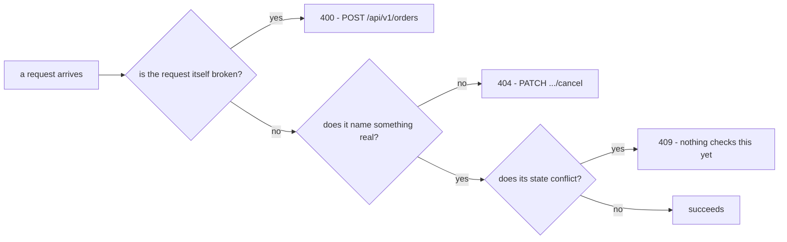

## Bạn cần biết trước

- [[backend.l1.validating-input]] — bạn biết `PlaceOrderAsync` throw `ArgumentException` cho một danh sách item rỗng, và có gì đó bên ngoài nó bắt exception đó rồi trả về `400` nêu tên vấn đề.
- [[backend.l1.creating-a-resource]] — bạn biết cách đăng nhập và lấy một token để gửi kèm request.

## Tình huống

Bạn đang mở rộng `PATCH /api/v1/orders/{id}/cancel`. Hủy order `99999`, thứ không tồn tại, cần câu trả lời riêng của nó — khác với ca items rỗng của `validating-input`, nơi chính request sai. Gửi `PATCH /api/v1/orders/99999/cancel` (đã đăng nhập, như ở Thử ngay bên dưới) nhận `404` với `{"title":"Not found","status":404,"detail":"order 99999 not found"}`. Cùng hình dạng `title`/`status`/`detail` như `400` đó — chỉ con số và text đổi. Không gì về request này sai cả; chỉ là id nó nêu tên không tồn tại. Điều gì quyết định status code nào phù hợp?

## Khái niệm cốt lõi

- `400 Bad Request` — bản thân request sai, giống cách check items rỗng của `validating-input` từ chối một request; đúng check đó thất bại y hệt mỗi lần nó chạy.
- `404 Not Found` — request đúng định dạng, nhưng nêu tên thứ hiện không tồn tại; id là vấn đề, không phải hình dạng request.
- `409 Conflict` — request đúng định dạng và nêu tên thứ có thật, nhưng xung đột với trạng thái hiện tại của thứ đó; không gì về bản thân request sai cả, chỉ là thời điểm của nó.
- Hình dạng chung của Problem Details — trong app này, cả ba status code đều trả về cùng các field `title`/`status`/`detail`; RFC 9457 cho phép nhiều field tùy chọn hơn thế, nhưng phần xử lý exception của chính app này chỉ bao giờ điền đúng ba field đó.

## Cơ chế hoạt động



Ba status code trả lời ba câu hỏi khác nhau về một request thất bại. Ba ô không phải các chặng của một request — mỗi ô tới từ một ca riêng, giải thích bên dưới. Đầu tiên: bản thân request có hỏng không? Đó là địa hạt của `validating-input`, minh họa bằng `POST /api/v1/orders`: một giá trị thiếu hoặc sai trong body của request, như một danh sách item rỗng, luôn là `400` bất kể gì. `PATCH /api/v1/orders/{id}/cancel` hoàn toàn không nhận body request nào, nên câu hỏi này không bao giờ đặt ra cho nó — mọi request tới được `CancelOrderAsync` đã hiển nhiên pass nó, không gì để sai cả.

Thứ hai: thứ request nêu tên có tồn tại không? `PATCH /api/v1/orders/99999/cancel` là một request hoàn toàn đúng định dạng — không gì sai về hình dạng của nó cả — nhưng không order `99999` nào tồn tại để hủy. Đó là `404`: id mới là thứ thiếu, không phải request. Điều này vẫn đúng kể cả khi bản thân id trông như một con số rõ ràng sai: miễn nó là một giá trị endpoint chấp nhận, một lượt tra cứu không tìm thấy gì vẫn là `404` trong app này, không phải `400` — hình dạng request vẫn ổn, chỉ id là thiếu.

Thứ ba, nếu thứ được nêu tên có tồn tại: hành động lên nó có xung đột với trạng thái hiện tại của nó ngay bây giờ không? Mỗi order mang `Status` của riêng nó — `"new"`, `"paid"`, `"shipped"`, hoặc `"cancelled"` — và hủy một order đã `"shipped"` sẽ chính xác là ca này: request đúng định dạng, và order có thật, nhưng việc shipped đã xảy ra rồi, và hủy ngay bây giờ xung đột với điều đó. Nếu có một check cho điều này, nó sẽ trả lời `409`, không phải `400`: không gì về request từng sai cả, chỉ là thời điểm của nó so với trạng thái của order. `CancelOrderAsync` chưa chạy check đó, nên nhánh này mô tả điều LẼ RA nên xảy ra, không phải điều đang xảy ra hôm nay.

## Trong hệ thống Đơn Hàng

`OrderService.CancelOrderAsync` là nơi ca `404` ở tình huống trên tới từ:

```csharp file=DonHang.Domain/OrderService.cs tag=stage-1 lines=29-35
    public async Task<Order> CancelOrderAsync(int orderId)
    {
        var order = await repository.FindAsync(orderId)
            ?? throw new KeyNotFoundException($"order {orderId} not found");

        order.Status = "cancelled";
        await repository.SaveChangesAsync();
```

`repository.FindAsync(orderId)` trả về `null` khi không order nào có id đó; `??` throw `KeyNotFoundException` ngay tại đó, trước bất kỳ dòng nào khác trong method chạy. Cùng cơ chế bắt exception mà `validating-input` mô tả cho `ArgumentException` cũng nhận diện `KeyNotFoundException` — trả lời `404` với đúng message của exception làm `detail` — nó tự cung cấp `title` và `status`, nên chỉ `detail` tới từ exception, đó là lý do response của tình huống đọc đúng `"order 99999 not found"`.

Không gì trong method này kiểm tra `order.Status` đã là `"shipped"` chưa trước khi dòng `order.Status = "cancelled"` ở block trên đặt nó. Đó là ca `409` còn thiếu: hủy một order đã shipped hôm nay thành công, âm thầm, y hệt hủy một order `"new"` hay `"paid"` — method không có nhánh nào trả lời khác đi.

## Người mới hay nghĩ rằng…

- **"404 và 400 dùng thay nhau được cho 'có gì đó về request này không hoạt động'."** → Thực ra `400` nghĩa là bản thân request hỏng; `404` nghĩa là request ổn nhưng thứ nó nêu tên không có ở đó. Bạn sẽ nhận ra điều này khi một `404` thử lại với id đã sửa — một id thực sự tồn tại — có thể thành công, còn một `400` thử lại với đúng request hỏng cũ thất bại vì đúng lỗi đó mỗi lần.
- **"Một xung đột, như hủy một order đã shipped, nên là `400`, vì request của client 'sai'."** → Thực ra request hoàn toàn đúng định dạng và nêu tên một order có thật; điều sai là trạng thái hiện tại của order, không phải request. Bạn sẽ gặp đúng lỗ hổng này trong `CancelOrderAsync`, thứ chưa check điều đó — một order đã shipped có thể bị hủy hôm nay, âm thầm, không có response xung đột nào cả.

## Thử ngay (3 phút)

1. Với hệ thống Đơn Hàng đang chạy (`scripts/up.sh`), chạy bước 1 của phần Thử ngay ở bài `creating-a-resource` để đăng nhập với `anh.tran@example.com` (`donhang-dev-password`) và copy token.
2. Hủy một order không tồn tại: `curl -sS -i -X PATCH http://localhost:8080/api/v1/orders/99999/cancel -H "Authorization: Bearer <token>"`.

Kết quả mong đợi: `404` với `{"title":"Not found","status":404,"detail":"order 99999 not found"}` — cùng hình dạng `title`/`status`/`detail` mà `400` của `validating-input` đã dùng, chỉ khác status code và message, vì một câu hỏi khác đang được trả lời.

So sánh body này với `400` của `validating-input`: cái gì giống nhau, cái gì khác, và cái nào trong hai loại có thể được thử lại sửa được?

<details><summary>Gợi ý đáp án</summary>

Cả hai response đều là body Problem Details với `title`/`status`/`detail`, nên client parse chúng theo cùng cách — nhưng hai con số mang ý nghĩa khác nhau. `400` nói bản thân request không hiểu được hoặc không chấp nhận được như đã gửi. `404` nói request được chấp nhận ổn thỏa, nhưng `99999` không nêu tên một order có thật. Thử lại `404` với id của một order thật có thể thành công; thử lại `400` với đúng danh sách item rỗng đó, không đổi gì, thất bại vì đúng lỗi đó lần nữa, vì không gì về order nào nó nêu tên từng là vấn đề.

</details>

## Liên hệ

- [[backend.l1.validating-input]] — ca `400` bài này giả định bạn đã biết, giờ có thêm hai status code nữa cho hai loại lỗi khác.
- [[backend.l1.errors-and-problem-details]] — hình dạng `title`/`status`/`detail` chung cả ba status code này dùng.
- [[backend.l1.structured-logging]] — bài kế tiếp.

## Tóm tắt 5 dòng

1. `400` nghĩa là request sai; `404` nghĩa là nó nêu tên thứ thiếu; `409` nghĩa là nó nêu tên thứ có thật xung đột với trạng thái hiện tại của nó.
2. Cả ba dùng chung một hình dạng body `title`/`status`/`detail`; chỉ con số và text khác nhau.
3. `CancelOrderAsync` throw `KeyNotFoundException` cho một order id thiếu, trả lời bằng `404` với đúng message của exception.
4. Hủy một order đã shipped sẽ là một `409` nếu có gì kiểm tra điều đó; `CancelOrderAsync` thì chưa, nên nó vẫn bị hủy.
5. Thử lại một `404` với id thật có thể thành công; thử lại một `400` với đúng request hỏng cũ thì không, vì bản thân request là vấn đề.
