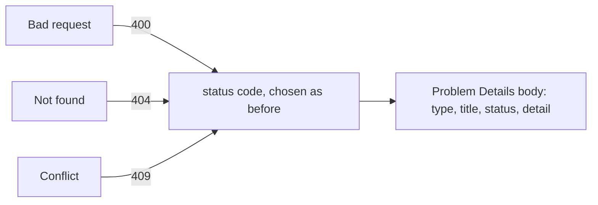

## Before you start

- [[backend.l1.creating-a-resource]] — you know a real endpoint picks its own status code for what happened and controls its response body.
- [[foundation.l1.http-status-codes]] — you know what a status code's class means (`4xx` your request, `5xx` the server) before reading its body at all.

## The situation

You're writing the Đơn Hàng client's error handling. At stage-0 the lab answered `GET /api/v1/orders/999` with `404` and the body `{"error":"order not found"}` — a fixed stand-in for a real endpoint. But `/conflict` already answers `409` with one line of plain text — no `error` field, nothing in common with the body above. Your client code would need a separate parser for every endpoint's error shape, just to show the user a reason. What should every failing response's body look like, so one piece of client code can read all of them?

## Core concepts

- **Problem Details (RFC 9457)** — a standard JSON shape for an error response, defined by RFC 9457, the standards document that names it; this lesson uses four of its fields, `type`, `title`, `status`, `detail`, instead of a shape each endpoint invents on its own.
- `type` — a URI reference, a string in the form of a URL, used only as a name for this kind of problem, not as an address the client fetches; when it's left out, it defaults to `"about:blank"`, meaning nothing more specific than the status code itself.
- `title` — a short, human-readable summary of that problem kind, meant to read the same on every occurrence of this kind of error.
- `status` — the same HTTP status code already on the response's status line (the first line of an HTTP/1.1 response, outside the body), repeated here inside the body.
- `detail` — a human-readable explanation specific to this one occurrence, naming the field or id involved.

RFC 9457 defines one more field, `instance`, and lets an API add fields of its own — a body carrying extra fields beyond these four is still Problem Details.

## How it works



Problem Details doesn't change which status code an endpoint returns for a given failure — that decision is exactly what it was before, made by whichever code path fails. What it standardizes is the body that comes back alongside that status code: instead of every endpoint inventing its own JSON, or plain text, for an error, every one of them returns the same fields.

`type` and `title` describe the *kind* of problem, so they stay fixed across every response of that kind — every "order not found" response would use the same `title`. `status` copies the exact number already sitting on the response's status line. The status line is still the authoritative one; the body's copy is there for code that kept only the parsed body, having already turned the body's JSON into an object and no longer holding the response it came from. `detail` is the one field that changes per response: it names the specific thing that went wrong this time — which order id, which field, which conflict — while `type` and `title` stay fixed for that error kind.

None of this touches which status code gets picked for which failure. A `400` still means the request itself was malformed, a `404` still means the server has no current representation for that resource, a `409` still means a conflict with the resource's current state — Problem Details only fixes the shape of what rides along with whichever one of those an endpoint returns.

## In the Đơn Hàng system

At stage-0, fixed responses from Caddy (a web server) stood in for a real API, and they already showed what having no shared shape looks like — the blocks below are copied from Caddy's own file, and you only need to read what each one sends back, not its syntax. A missing order returned JSON — `@missingOrder` is the name this file gives to requests for `/api/v1/orders/999`:

```caddyfile file=Caddyfile tag=stage-0 lines=52-55
		handle @missingOrder {
			header Content-Type "application/json; charset=utf-8"
			respond `{"error":"order not found"}` 404
		}
```

That body has one field, `error`, holding a sentence written for this one path. Nothing about its shape comes from a standard — a different endpoint could just as easily call the same idea `message` or `reason` instead. `/conflict` shows exactly that: a different endpoint, a different idea of what an error body looks like.

```caddyfile file=Caddyfile tag=stage-0 lines=80-82
		handle /conflict {
			respond "Conflict: this order was already paid" 409
		}
```

`/conflict` returns the same kind of information the stage-0 `/api/v1/orders/999` handler did — what went wrong, and why — but not even as JSON: the whole response is one plain-text string, no `error` field, no structure at all. A client reading order errors needs one parser for the JSON above and a completely different one for plain text here; a third endpoint could invent a third shape again. Problem Details replaces every one of these with the same fields, no matter which endpoint or which status code produced them.

## Beginners often think…

- **"Problem Details is its own status code, separate from 400/404/etc."** → Actually Problem Details is just a body shape; the response still carries whichever status code the failure would have returned anyway — a `404` stays a `404`, only the body's fields change. You notice this when you look at the response's status line: it's still a plain three-digit number, never something else standing in for it.
- **"Only server errors (500) need a structured error body — a 400 can just return a bare error field."** → Actually Problem Details describes the shape for every failing response, `4xx` and `5xx` alike; a `400` gets the same `type`/`title`/`status`/`detail` fields a `500` would, not a shortcut. You notice this when a client written to parse one shape breaks on the first `400` it receives, because nothing said `4xx` bodies were exempt.

## Try it (3 minutes)

1. With the lab running (`scripts/up.sh`), run `curl -sS -i http://localhost:8080/conflict` (`-i` prints the response's headers above its body, so you can see `Content-Type`). `/conflict` still answers exactly as the block above shows.
2. Compare it to the stage-0 `/api/v1/orders/999` handler quoted above — don't curl that path; a later stage replaced that fixed body with a real endpoint, and what it answers now is a different lesson's subject.

Expected result: `/conflict` answers `409` with `Content-Type: text/plain; charset=utf-8` and a single line of plain text, no `error` field or any structure at all — a completely different shape from `/api/v1/orders/999`'s stage-0 JSON, even though both are "a failure with a reason".

<details><summary>Suggested answer</summary>

Two endpoints, two failures, two unrelated bodies: one is a JSON object with an `error` field, the other is one line of plain text with no structure a client could reliably parse. A client written to read one would silently mishandle the other. Problem Details fixes this by giving every failing response, regardless of which endpoint or status code, the same fields to read.

</details>

## Connections

- [[backend.l1.creating-a-resource]] — the same status-code decision this lesson never changes; Problem Details only standardizes what rides along with it.
- [[foundation.l1.http-status-codes]] — the numbers `status` repeats, read here without a body at all.
- [[backend.l1.validating-input]] — the next lesson, deciding when a `400`'s Problem Details body gets sent in the first place.

## Five-line summary

1. Problem Details (RFC 9457) is one JSON shape for every failing response — `type`, `title`, `status`, `detail` — instead of a shape each endpoint invents.
2. The endpoint still picks its own status code for each kind of failure; Problem Details only standardizes the body that comes with it.
3. `type` and `title` describe the kind of problem and stay fixed for every occurrence; `detail` is what changes each time.
4. The stage-0 lab's `/api/v1/orders/999` and `/conflict` show two unrelated ad-hoc shapes — one JSON, one plain text — exactly what Problem Details replaces.
5. A client that expects Problem Details can read every endpoint's errors the same way, instead of writing one parser per endpoint.
