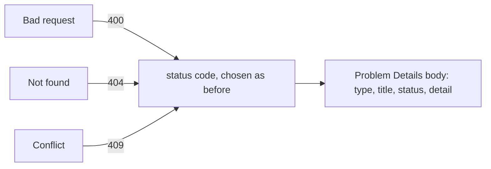

## Bạn cần biết trước

- [[backend.l1.creating-a-resource]] — bạn biết một endpoint thật tự chọn status code cho việc đã xảy ra và tự kiểm soát response body của nó.
- [[foundation.l1.http-status-codes]] — bạn biết class của một status code nghĩa là gì (`4xx` do request của bạn, `5xx` do server) trước cả khi đọc body của nó.

## Tình huống

Bạn đang viết phần xử lý lỗi cho client Đơn Hàng. Ở stage-0, lab trả lời `GET /api/v1/orders/999` bằng `404` và body `{"error":"order not found"}` — một bản cố định đứng thay cho một endpoint thật. Nhưng `/conflict` đã trả lời `409` bằng một dòng plain text — không có field `error`, chẳng có gì chung với body ở trên. Client code của bạn sẽ cần một parser riêng cho hình dạng lỗi của từng endpoint, chỉ để cho người dùng thấy một lý do. Body của mọi response lỗi nên trông như thế nào, để một đoạn client code có thể đọc được tất cả?

## Khái niệm cốt lõi

- **Problem Details (RFC 9457)** — một hình dạng JSON chuẩn cho response lỗi, do RFC 9457 định nghĩa, tài liệu chuẩn đặt tên cho nó; bài này dùng bốn field của nó, `type`, `title`, `status`, `detail`, thay vì một hình dạng mỗi endpoint tự chế.
- `type` — một URI reference, một chuỗi có dạng URL, chỉ dùng làm tên cho kiểu vấn đề này, không phải một địa chỉ client sẽ gọi tới; khi bị bỏ trống, nó mặc định là `"about:blank"`, nghĩa là không có gì cụ thể hơn ngoài chính status code.
- `title` — một tóm tắt ngắn, dễ đọc, của kiểu vấn đề đó, được thiết kế để đọc giống nhau ở mọi lần loại lỗi này xảy ra.
- `status` — đúng HTTP status code đã có sẵn trên status line của response (dòng đầu tiên của một response HTTP/1.1, nằm ngoài body), được lặp lại ở đây bên trong body.
- `detail` — một giải thích dễ đọc riêng cho đúng lần này, nêu tên field hay id liên quan.

RFC 9457 còn định nghĩa thêm một field nữa, `instance`, và cho phép một API thêm field riêng của nó — một body mang thêm field ngoài bốn field này vẫn là Problem Details.

## Cơ chế hoạt động



Problem Details không đổi status code nào một endpoint trả về cho một lỗi cụ thể — quyết định đó vẫn y hệt như trước, do đúng nhánh code gây lỗi quyết định. Điều nó chuẩn hóa là body đi kèm status code đó: thay vì mỗi endpoint tự chế JSON, hoặc plain text, riêng cho lỗi của nó, tất cả đều trả về cùng các field.

`type` và `title` mô tả *kiểu* vấn đề, nên chúng giữ nguyên qua mọi response cùng kiểu — mọi response "order not found" đều dùng chung một `title`. `status` sao chép đúng con số đã có sẵn trên status line của response. Status line vẫn là nơi có thẩm quyền; bản sao trong body dành cho code chỉ còn giữ phần body đã parse, sau khi đã biến JSON của body thành một object và không còn giữ response gốc nữa. `detail` là field duy nhất đổi theo từng response: nó nêu đúng điều cụ thể đã sai lần này — order id nào, field nào, conflict nào — trong khi `type` và `title` giữ nguyên cho kiểu lỗi đó.

Không gì trong số này đụng tới việc status code nào được chọn cho lỗi nào. Một `400` vẫn nghĩa là bản thân request sai định dạng, một `404` vẫn nghĩa là server không có representation hiện tại cho resource đó, một `409` vẫn nghĩa là xung đột với trạng thái hiện tại của resource — Problem Details chỉ cố định hình dạng của thứ đi kèm bất kỳ status code nào trong số đó mà một endpoint trả về.

## Trong hệ thống Đơn Hàng

Ở stage-0, các response cố định từ Caddy (một web server) đứng thay cho một API thật, và chúng đã cho thấy tình trạng không có hình dạng chung trông ra sao — các block dưới đây được chép từ chính file của Caddy, và bạn chỉ cần đọc mỗi cái trả về gì, không cần đọc cú pháp của nó. Một order không tìm thấy trả về JSON — `@missingOrder` là tên file này đặt cho các request tới `/api/v1/orders/999`:

```caddyfile file=Caddyfile tag=stage-0 lines=52-55
		handle @missingOrder {
			header Content-Type "application/json; charset=utf-8"
			respond `{"error":"order not found"}` 404
		}
```

Body đó có một field, `error`, chứa một câu viết riêng cho đường dẫn này. Không gì về hình dạng của nó đến từ một chuẩn nào cả — một endpoint khác có thể dễ dàng gọi cùng ý tưởng đó là `message` hay `reason` thay vì `error`. `/conflict` cho thấy đúng điều đó: một endpoint khác, một ý tưởng khác về error body trông ra sao.

```caddyfile file=Caddyfile tag=stage-0 lines=80-82
		handle /conflict {
			respond "Conflict: this order was already paid" 409
		}
```

`/conflict` trả về đúng loại thông tin mà handler `/api/v1/orders/999` ở stage-0 từng trả — cái gì đã sai, và vì sao — nhưng còn không phải JSON: toàn bộ response chỉ là một chuỗi plain text, không field `error`, không cấu trúc gì cả. Một client đọc lỗi order cần một parser cho JSON ở trên và một parser hoàn toàn khác cho plain text ở đây; một endpoint thứ ba có thể lại tự chế ra một hình dạng thứ ba. Problem Details thay mọi thứ này bằng cùng các field, bất kể endpoint nào hay status code nào tạo ra chúng.

## Người mới hay nghĩ rằng…

- **"Problem Details là một status code riêng, tách khỏi 400/404/v.v."** → Thực ra Problem Details chỉ là một hình dạng body; response vẫn mang đúng status code mà lỗi đó vốn sẽ trả về — một `404` vẫn là `404`, chỉ các field trong body thay đổi. Bạn sẽ nhận ra điều này khi nhìn vào status line của response: nó vẫn là một con số ba chữ số trần, không gì khác đứng thay cho nó.
- **"Chỉ lỗi server (500) mới cần một error body có cấu trúc — một 400 có thể chỉ cần trả một field lỗi trần."** → Thực ra Problem Details mô tả hình dạng cho mọi response lỗi, `4xx` lẫn `5xx` như nhau; một `400` có cùng các field `type`/`title`/`status`/`detail` như một `500`, không có đường tắt nào cả. Bạn sẽ nhận ra điều này khi một client viết để parse một hình dạng bị hỏng ngay ở `400` đầu tiên nó nhận, vì không gì nói rằng body `4xx` được miễn.

## Thử ngay (3 phút)

1. Với lab đang chạy (`scripts/up.sh`), chạy `curl -sS -i http://localhost:8080/conflict` (`-i` in headers của response phía trên body, để bạn thấy được `Content-Type`). `/conflict` vẫn trả lời đúng như block ở trên cho thấy.
2. So sánh nó với handler `/api/v1/orders/999` ở stage-0 đã trích dẫn ở trên — đừng curl đường dẫn đó; một stage sau đã thay body cố định đó bằng một endpoint thật, và nó trả lời gì bây giờ là chủ đề của một bài khác.

Kết quả mong đợi: `/conflict` trả lời `409` với `Content-Type: text/plain; charset=utf-8` và một dòng plain text, không field `error` hay cấu trúc nào cả — một hình dạng hoàn toàn khác với JSON của `/api/v1/orders/999` ở stage-0, dù cả hai đều là "một lỗi kèm lý do".

<details><summary>Gợi ý đáp án</summary>

Hai endpoint, hai lỗi, hai body chẳng liên quan gì nhau: một là JSON object có field `error`, cái kia là một dòng plain text không cấu trúc nào client có thể parse đáng tin cậy. Một client viết để đọc cái này sẽ âm thầm xử lý sai cái kia. Problem Details sửa điều này bằng cách cho mọi response lỗi, bất kể endpoint hay status code nào, cùng các field để đọc.

</details>

## Liên hệ

- [[backend.l1.creating-a-resource]] — cùng quyết định status code mà bài này không hề đổi; Problem Details chỉ chuẩn hóa thứ đi kèm nó.
- [[foundation.l1.http-status-codes]] — những con số `status` lặp lại, đọc ở đây mà không cần body nào cả.
- [[backend.l1.validating-input]] — bài kế tiếp, quyết định khi nào body Problem Details của một `400` được gửi đi ngay từ đầu.

## Tóm tắt 5 dòng

1. Problem Details (RFC 9457) là một hình dạng JSON cho mọi response lỗi — `type`, `title`, `status`, `detail` — thay vì một hình dạng mỗi endpoint tự chế.
2. Endpoint vẫn tự chọn status code cho từng kiểu lỗi; Problem Details chỉ chuẩn hóa body đi kèm nó.
3. `type` và `title` mô tả kiểu vấn đề và giữ nguyên qua mọi lần xảy ra; `detail` là thứ thay đổi mỗi lần.
4. `/api/v1/orders/999` và `/conflict` ở lab stage-0 cho thấy hai hình dạng tự chế chẳng liên quan nhau — một JSON, một plain text — đúng thứ Problem Details thay thế.
5. Một client mong đợi Problem Details có thể đọc lỗi của mọi endpoint theo cùng cách, thay vì viết một parser cho mỗi endpoint.
