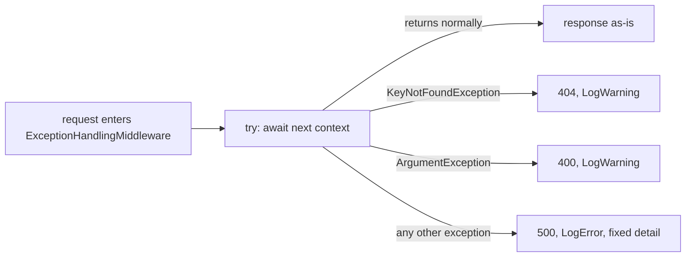

## Before you start

- [[backend.l1.structured-logging]] — you know `RequestLoggingMiddleware`'s own log line never runs when a handler throws, since the exception unwinds past it before that call.
- [[backend.l1.middleware-pipeline]] — you know a middleware runs code before and after `next()`, and that being registered first among the app's own middleware means wrapping everything after it.
- [[backend.l1.validating-input]] — you know `PlaceOrderAsync`'s `ArgumentException`, for an empty item list, is caught and answered `400` with the exception's own message as `detail`.
- [[backend.l1.choosing-an-error-status]] — you know `CancelOrderAsync`'s `KeyNotFoundException`, for an order that doesn't exist, is caught the same way and answered `404`.

## The situation

The Postgres database restarts mid-request while a customer is browsing an order: `GET /api/v1/orders/1` reaches `OrdersController.Get`, which asks its ORM to load the order, but the connection drops before the database comes back. This isn't `PlaceOrderAsync`'s `ArgumentException` or `CancelOrderAsync`'s `KeyNotFoundException` — a lost database connection is a case neither of those specific catches ever anticipated. The request still comes back `500` with `{"title":"Server error","status":500,"detail":"something went wrong"}`, a body a client can parse. What answers a request when the exception thrown is one nobody wrote a specific case for?

## Core concepts

- catch clause order — C# tries a `try` block's `catch` clauses top to bottom; the first one whose type matches the thrown exception runs, so a specific type listed before `catch (Exception)` intercepts it there instead.
- generic `500` response — the same `title`/`status`/`detail` shape `400` and `404` use, but with a fixed `title` and a `detail` that never repeats the exception's own message, unlike those two.
- log severity — this middleware calls `LogWarning` for the two failure shapes it has a specific case for and `LogError` for anything else, so filtering on `Error` finds the unclassified ones.

## How it works



In the situation above, `ExceptionHandlingMiddleware.InvokeAsync` wraps one `try` around `await next(context)` — since [[backend.l1.middleware-pipeline]] already showed this class is the first of Đơn Hàng's own middleware, every middleware `Program.cs` registers after it and the endpoint itself run inside that single `try`. When `next(context)` returns normally, nothing here changes the response, exactly as the diagram's `C` shows.

When it throws instead, C# checks this method's `catch` clauses in the order they're written. `KeyNotFoundException` is listed first, so `CancelOrderAsync`'s missing-order case is caught there, answering `404`. `ArgumentException` is listed second, catching `PlaceOrderAsync`'s empty-item-list case as `400`. Both of those are already familiar from [[backend.l1.validating-input]] and [[backend.l1.choosing-an-error-status]].

What's new here is the last clause: `catch (Exception ex)` matches anything neither of the two more specific types above it already claimed, including the situation's lost connection. That branch answers `500` with the same fixed `detail` whatever the underlying exception was — unless a middleware after it has already started sending the response, in which case nothing here can still change what the client sees.

## In the Đơn Hàng system

`ExceptionHandlingMiddleware.InvokeAsync` is where the situation's `500` comes from. `next` and `logger` are constructor parameters of this class — the next middleware to call, and this class's own logger; `WriteProblemAsync` is a private helper, further down in the same file, that writes the `title`/`status`/`detail` body from whatever status code, title, and detail its caller hands it:

```csharp file=DonHang.Api/Middleware/ExceptionHandlingMiddleware.cs tag=stage-1 lines=10-31
    public async Task InvokeAsync(HttpContext context)
    {
        try
        {
            await next(context);
        }
        catch (KeyNotFoundException ex)
        {
            logger.LogWarning(ex, "request for a resource that does not exist");
            await WriteProblemAsync(context, StatusCodes.Status404NotFound, "Not found", ex.Message);
        }
        catch (ArgumentException ex)
        {
            logger.LogWarning(ex, "request rejected as invalid");
            await WriteProblemAsync(context, StatusCodes.Status400BadRequest, "Invalid request", ex.Message);
        }
        catch (Exception ex)
        {
            logger.LogError(ex, "unhandled exception");
            await WriteProblemAsync(context, StatusCodes.Status500InternalServerError, "Server error", "something went wrong");
        }
    }
```

The two specific catches pass `ex.Message` as `detail`, the pattern [[backend.l1.choosing-an-error-status]] already showed for `404` and [[backend.l1.validating-input]] for `400`; both log at `LogWarning`, which is new here. The last catch uses `LogError` instead, and its `detail` is the fixed string `"something went wrong"`, never `ex.Message` — nothing about a lost connection, a null reference, or any other unclassified failure ever reaches the client. The exception itself, type and stack trace included, never leaves the server: the `LogError` call puts it in the log, printed with a `fail:` prefix, and the response body never carries it.

## Beginners often think…

- **"An exception an endpoint doesn't catch just means that one request fails silently; nothing else needs to run."** → Actually it never fails silently: this app is set up to show full error detail while developing, so without this middleware a `500` still comes back, but carrying a raw stack trace instead of a body a client could parse. This middleware's `catch (Exception)` clause intercepts the exception first, replacing that stack trace with one fixed, parseable body instead. You notice this when the situation's lost connection still comes back with a body a client can parse, not a stack trace.
- **"Logging the exception and returning a response to the client are the same step; doing one does the other."** → Actually `logger.LogError(ex, "unhandled exception")` and `await WriteProblemAsync(...)` are two separate calls in the same `catch` block; the first records the real exception, the second decides what the client sees, and only the second ever reaches the client. You notice this when the response reads `"something went wrong"` while the log line right above it carries the real exception and its stack trace.

## Try it (3 minutes)

1. From the Đơn Hàng project's root folder, start the example system with `scripts/up.sh` if it isn't already running. Then stop only its database, leaving the app itself up: `docker compose stop db`.
2. Send `curl -sS -i http://localhost:8080/api/v1/orders/1`.
3. Restart the database before continuing: `docker compose start db`.

Expected result: `500` with `{"title":"Server error","status":500,"detail":"something went wrong"}`. `docker logs donhang-api --since 1m` shows three `fail:` blocks for that one request — two from the ORM, then `fail: DonHang.Api.Middleware.ExceptionHandlingMiddleware[0] / unhandled exception`, the last of the three and this middleware's own. No `RequestLoggingMiddleware` line appears for this request.

Would the response body look any different if the underlying failure were something else entirely, like a missing configuration value instead of a lost database connection?

<details><summary>Suggested answer</summary>

No — the response would be identical either way. `catch (Exception ex)` matches any type not already claimed by `KeyNotFoundException` or `ArgumentException`, and its `detail` is the fixed string `"something went wrong"`, never derived from `ex`. The client's body can't distinguish a lost database connection from a missing configuration value from any other unclassified failure; only `docker logs`, reading the `LogError` call's exception object, can.

</details>

## Connections

- [[backend.l1.structured-logging]] — the same middleware pipeline, now read for where an exception is caught instead of what gets logged around it.
- [[backend.l1.choosing-an-error-status]] — the `400`/`404` cases this lesson's generic `500` catch sits behind; all three write the same Problem Details shape.
- [[backend.l1.middleware-pipeline]] — being registered first among the app's own middleware is what lets this one `try` wrap every middleware and endpoint after it.

## Five-line summary

1. An exception-handling middleware, first among the app's own middleware, wraps everything after it in one `try` and turns any unclassified exception into a generic `500`.
2. `catch` clauses run top to bottom; `KeyNotFoundException` and `ArgumentException` are caught before `catch (Exception)` ever sees them.
3. The generic catch always answers `{"title":"Server error","status":500,"detail":"something went wrong"}`, never the exception's own message.
4. `LogWarning` marks the two specific, expected-shape failures; `LogError` marks the one nothing anticipated.
5. The client only ever sees the generic `detail`; the real exception and its stack trace exist only in the log line beside it.
