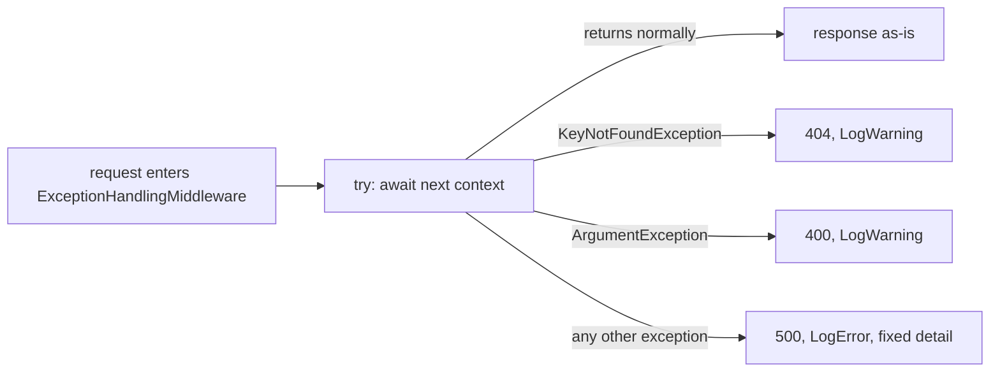

## Bạn cần biết trước

- [[backend.l1.structured-logging]] — bạn biết dòng log riêng của `RequestLoggingMiddleware` không bao giờ chạy khi một handler throw, vì exception đã đi ngược lên qua nó trước khi tới lời gọi đó.
- [[backend.l1.middleware-pipeline]] — bạn biết một middleware chạy code trước và sau `next()`, và đăng ký đầu tiên trong `Program.cs` nghĩa là bọc mọi thứ đăng ký sau nó.
- [[backend.l1.validating-input]] — bạn biết `ArgumentException` của `PlaceOrderAsync`, cho một danh sách item rỗng, bị bắt và trả lời `400` với chính message của exception làm `detail`.
- [[backend.l1.choosing-an-error-status]] — bạn biết `KeyNotFoundException` của `CancelOrderAsync`, cho một order không tồn tại, bị bắt theo cùng cách và trả lời `404`.

## Tình huống

Database khởi động lại giữa chừng khi một khách hàng đang xem order: `GET /api/v1/orders/1` tới `OrdersController.Get`, method này nhờ ORM tải order, nhưng kết nối rớt trước khi database kịp lên lại. Đây không phải `ArgumentException` của `PlaceOrderAsync` hay `KeyNotFoundException` của `CancelOrderAsync` — mất kết nối database là ca mà cả hai lệnh catch cụ thể kia chưa từng tính tới. Request vẫn trả về `500` với `{"title":"Server error","status":500,"detail":"something went wrong"}`. App của khách hiện đúng body đó, còn bạn đọc nó và thắc mắc nó từ đâu ra: chưa đoạn code nào bạn từng thấy bắt lỗi mất kết nối. Vậy cái gì trả lời request khi exception bị throw là loại chưa ai viết ca riêng cho?

## Khái niệm cốt lõi

- Thứ tự các mệnh đề catch — C# thử các mệnh đề `catch` của một khối `try` từ trên xuống, mệnh đề đầu tiên có kiểu khớp với exception bị throw sẽ chạy, nên một kiểu cụ thể đặt trước `catch (Exception)` sẽ chặn exception ngay tại đó.
- Response `500` chung — cùng hình dạng `title`/`status`/`detail` mà `400` và `404` dùng, nhưng `title` cố định và `detail` không bao giờ lặp lại message của exception, khác với hai status code kia.
- Mức độ nghiêm trọng của log — middleware này gọi `LogWarning` cho hai dạng lỗi nó có ca riêng và `LogError` cho mọi thứ còn lại, nên lọc các entry của middleware này theo `Error` sẽ ra đúng những lỗi chưa được phân loại.

## Cơ chế hoạt động



Trong tình huống trên, `ExceptionHandlingMiddleware.InvokeAsync` đặt một `try` duy nhất quanh `await next(context)`. `Program.cs` đăng ký class này trước `RequestLoggingMiddleware` và mọi lời gọi `app.Use...` khác, nên mọi middleware đăng ký sau nó cùng chính endpoint đều chạy bên trong `try` đó. Khi `next(context)` trả về bình thường, không gì ở đây đổi response, đúng như ô `C` trên sơ đồ.

Còn khi nó throw, C# xét các mệnh đề `catch` của method này theo đúng thứ tự viết. `KeyNotFoundException` đứng đầu, nên ca order không tồn tại của `CancelOrderAsync` bị bắt ở đó, log bằng `LogWarning` và trả lời `404`. `ArgumentException` đứng thứ hai, bắt ca danh sách item rỗng của `PlaceOrderAsync`, log bằng `LogWarning` và trả lời `400`.

Điểm mới ở đây là mệnh đề cuối: `catch (Exception ex)` khớp với bất cứ thứ gì hai kiểu cụ thể hơn phía trên chưa nhận, kể cả lỗi mất kết nối trong tình huống. Nhánh đó log exception bằng `LogError` và trả lời `500` với cùng một `detail` cố định, bất kể exception bên dưới là gì.

Có một ca lọt ra ngoài: code bên trong `next(context)`, chẳng hạn một endpoint đã ghi một phần body rồi mới lỗi, có thể đã bắt đầu gửi response trước khi throw. Khi response đã bắt đầu, status code và header của nó đã tới client và không đổi được nữa, nên `WriteProblemAsync` không còn đặt `500` được. Thay vào đó ASP.NET Core throw một exception mới, từ ngay bên trong `catch` này. Một mệnh đề `catch` không bao giờ bắt exception throw từ bên trong chính nó hay các mệnh đề anh em của nó, nên exception đó đi tiếp ra ngoài, vượt qua middleware này, và client giữ nguyên phần response dở dang đã gửi đi, bị cắt ngang. Lúc đó dòng `LogError` đã chạy rồi, nên log vẫn ghi lại exception gốc.

## Trong hệ thống Đơn Hàng

`ExceptionHandlingMiddleware.InvokeAsync` là nơi `500` trong tình huống sinh ra. `next` và `logger` là tham số constructor của class này — middleware kế tiếp cần gọi, và logger riêng của class. `WriteProblemAsync` là một helper private, nằm phía dưới trong cùng file, ghi body `title`/`status`/`detail` từ status code, title và detail mà nơi gọi truyền vào:

```csharp file=DonHang.Api/Middleware/ExceptionHandlingMiddleware.cs tag=stage-1 lines=10-31
    public async Task InvokeAsync(HttpContext context)
    {
        try
        {
            await next(context);
        }
        catch (KeyNotFoundException ex)
        {
            logger.LogWarning(ex, "request for a resource that does not exist");
            await WriteProblemAsync(context, StatusCodes.Status404NotFound, "Not found", ex.Message);
        }
        catch (ArgumentException ex)
        {
            logger.LogWarning(ex, "request rejected as invalid");
            await WriteProblemAsync(context, StatusCodes.Status400BadRequest, "Invalid request", ex.Message);
        }
        catch (Exception ex)
        {
            logger.LogError(ex, "unhandled exception");
            await WriteProblemAsync(context, StatusCodes.Status500InternalServerError, "Server error", "something went wrong");
        }
    }
```

Hai lệnh catch cụ thể truyền `ex.Message` làm `detail`, đúng khuôn mà [[backend.l1.choosing-an-error-status]] đã cho thấy với `404` và [[backend.l1.validating-input]] với `400`. Cả hai log ở mức `LogWarning`, điều này mới xuất hiện ở bài này. Lệnh catch cuối dùng `LogError`, và `detail` của nó là chuỗi cố định `"something went wrong"`, không bao giờ là `ex.Message` — không chi tiết nào về mất kết nối, null reference hay bất kỳ lỗi chưa phân loại nào khác tới được client. Bản thân exception, gồm cả kiểu và stack trace, không bao giờ rời server: lời gọi `LogError` đưa nó vào log, in ra với tiền tố `fail:` (entry của `LogWarning` in ra `warn:`), còn body response không bao giờ mang nó theo.

## Người mới hay nghĩ rằng…

- **"Exception mà endpoint không bắt chỉ có nghĩa request đó lỗi âm thầm, không cần gì khác chạy nữa."** → Thực ra luôn có thứ chạy: mệnh đề `catch (Exception)` của middleware này chặn exception trước và biến nó thành `500` với một body chung, cố định, không để lộ gì về chỗ thật sự hỏng. Không có middleware này thì vẫn có `500` trả về. Nhưng app ví dụ được cấu hình cho môi trường phát triển local (hệ thống ví dụ đặt biến môi trường `ASPNETCORE_ENVIRONMENT` là `Development`), và ở đó ASP.NET Core đưa kiểu, message và stack trace của exception vào body cho bất kỳ client nào đọc. Ngoài môi trường phát triển local, body sẽ rỗng. Bạn sẽ nhận ra khi lỗi mất kết nối trong tình huống vẫn trả về một body không hề nhắc tới database hay kết nối.
- **"Log exception và trả response cho client là cùng một bước, làm cái này là xong cái kia."** → Thực ra `logger.LogError(ex, "unhandled exception")` và `await WriteProblemAsync(...)` là hai lời gọi riêng trong cùng khối `catch`. Lời gọi đầu ghi lại exception thật, lời gọi sau quyết định client thấy gì, và chỉ lời gọi sau tới được client. Bạn sẽ nhận ra khi response ghi `"something went wrong"` trong khi dòng log ngay phía trên mang exception thật cùng stack trace của nó.

## Thử ngay (3 phút)

1. Từ thư mục gốc của project Đơn Hàng, khởi động hệ thống ví dụ bằng `scripts/up.sh` nếu nó chưa chạy. Sau đó chỉ dừng database, để app vẫn chạy: `docker compose stop db`.
2. Gửi `curl -sS -i http://localhost:8080/api/v1/orders/1`.
3. Khởi động lại database trước khi làm tiếp: `docker compose start db`.

Kết quả mong đợi: `500` với `{"title":"Server error","status":500,"detail":"something went wrong"}`. `docker logs donhang-api --since 1m` (log console của API, nơi logger ghi ra) cho thấy ba khối `fail:` cho đúng một request đó — hai khối từ ORM, vốn tự log lời gọi database thất bại trước khi exception tới middleware này, rồi tới khối của chính middleware này, khối cuối trong ba: `fail: DonHang.Api.Middleware.ExceptionHandlingMiddleware[0]` (bỏ qua `[0]`), với `unhandled exception` ở dòng kế tiếp. Không có dòng `RequestLoggingMiddleware` nào cho request này.

Body response có khác đi không nếu lỗi bên dưới là thứ hoàn toàn khác, như null reference thay vì mất kết nối database?

<details><summary>Gợi ý đáp án</summary>

Không — response giống hệt nhau trong cả hai trường hợp. `catch (Exception ex)` khớp với mọi kiểu chưa bị `KeyNotFoundException` hay `ArgumentException` nhận, và `detail` của nó là chuỗi cố định `"something went wrong"`, không bao giờ lấy từ `ex`. Body mà client nhận không phân biệt được mất kết nối database với null reference hay bất kỳ lỗi chưa phân loại nào khác. Chỉ `docker logs`, nơi đọc được exception object của lời gọi `LogError`, mới phân biệt được.

</details>

## Liên hệ

- [[backend.l1.structured-logging]] — vẫn middleware pipeline đó, giờ đọc để xem exception bị bắt ở đâu thay vì cái gì được log quanh nó.
- [[backend.l1.choosing-an-error-status]] — các ca `400`/`404` mà lệnh catch `500` chung của bài này đứng phía sau. Cả ba đều ghi cùng hình dạng Problem Details.
- [[backend.l1.middleware-pipeline]] — được đăng ký đầu tiên trong `Program.cs` là điều cho phép một `try` này bọc mọi middleware và endpoint sau nó.

## Tóm tắt 5 dòng

1. Đăng ký đầu tiên trong `Program.cs`, middleware bắt exception bọc mọi thứ sau nó trong một `try`, biến exception chưa phân loại thành `500` chung, trừ khi response đã bắt đầu.
2. Các mệnh đề `catch` chạy từ trên xuống, `KeyNotFoundException` và `ArgumentException` bị bắt trước khi `catch (Exception)` kịp thấy chúng.
3. Trừ khi response đã bắt đầu, lệnh catch chung trả lời `{"title":"Server error","status":500,"detail":"something went wrong"}`, không bao giờ là message của exception.
4. `LogWarning` đánh dấu hai lỗi cụ thể, có dạng đã lường trước, còn `LogError` đánh dấu lỗi không ai lường trước.
5. Client chỉ thấy `detail` chung, còn exception thật và stack trace của nó chỉ nằm trong dòng log bên cạnh.
