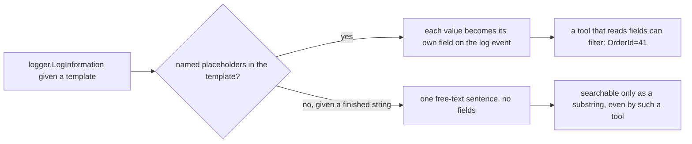

## Before you start

- [[backend.l1.validating-input]] — you know an application-level check can name exactly what's wrong, instead of leaving a failure generic.
- [[foundation.l2.debugger-and-logging]] — you know a log line should carry the inputs a function received and the decision it took, not just the fact that the code ran.

## The situation

A customer says order `41`'s confirmation notification never arrived. `docker logs donhang-api` holds thousands of lines from every order today. Searching the text `order 41` finds the line — this time. Next week, a different customer reports order `410`, and that same search also matches order `41`'s line, since `order 41` is a substring of `order 410` too — now both customers' lines look alike in the results. Nothing in the log line promises a number sits in a place you can search for precisely; the sentence just happens to contain it somewhere, close enough to other numbers to be confused with them. What would make one specific order's log line findable on purpose, not by luck?

## Core concepts

- **structured logging** — writing each piece of information a log line carries as its own named field (like `OrderId`), instead of interpolating it into one free-text sentence.
- message template — the fixed part of a log call, written with `{Placeholder}` names marking where each field goes, kept separate from the values themselves.
- field — one named value inside a log event, exact and on its own, unlike a substring buried inside free text where `41` and `410` overlap.
- log event — the one record a single logging call produces. Its fields exist on this record regardless of how any particular tool later prints it.

## How it works



`logger.LogInformation`'s first argument is a template, not a finished sentence: `{OrderId}` names where a value goes and what to call it, and the value itself arrives as a separate argument, matched to its placeholder by position, not by name. The logger keeps that value as its own field on the log event, independent of whatever sentence gets displayed later.

`$"order {orderId} failed"` works differently: C# finishes building that string before `LogInformation` is ever called, so by the time the logger sees it, there is one piece of text and no field boundary left — `orderId` is in there somewhere, but nothing marks where.

This app's console happens to print a structured call's fields back into a sentence that reads exactly like an interpolated one would — this console itself is not the kind of tool the diagram's `D` describes. That printed line is only one way of displaying the same log event; the field boundary a template creates still exists underneath it, which is what would make filtering by `OrderId` possible for a tool built to read the event's fields instead of its printed text.

## In the Đơn Hàng system

`LoggingNotifier.Send` is the smallest example — two fields, one call, one line:

```csharp file=DonHang.Infrastructure/LoggingNotifier.cs tag=stage-1 lines=9-13
public sealed class LoggingNotifier(ILogger<LoggingNotifier> logger) : INotifier
{
    public void Send(int orderId, string subject) =>
        logger.LogInformation("notification for order {OrderId}: {Subject}", orderId, subject);
}
```

`{OrderId}` and `{Subject}` name two fields; `orderId` and `subject` are passed as their own arguments, never spliced into the template string first. The log event this produces carries `OrderId` as a field of its own, the same one `saving-changes`' `notifier.Send(order.Id, "order placed")` call already fills in on every order placed.

`RequestLoggingMiddleware.InvokeAsync` shows a template with four fields in a single call, not just two:

```csharp file=DonHang.Api/Middleware/RequestLoggingMiddleware.cs tag=stage-1 lines=9-24
public sealed class RequestLoggingMiddleware(RequestDelegate next, ILogger<RequestLoggingMiddleware> logger)
{
    public async Task InvokeAsync(HttpContext context)
    {
        var stopwatch = Stopwatch.StartNew();
        await next(context);
        stopwatch.Stop();

        logger.LogInformation(
            "{Method} {Path} responded {StatusCode} in {ElapsedMs}ms",
            context.Request.Method,
            context.Request.Path,
            context.Response.StatusCode,
            stopwatch.ElapsedMilliseconds);
    }
}
```

`Method`, `Path`, `StatusCode`, and `ElapsedMs` are four separate fields, each named once in the template and filled once from its own argument — not one long sentence describing the request that happens to mention four numbers. The two lines don't share a field — `LoggingNotifier` never logs a status code, and `RequestLoggingMiddleware` never logs an order id — but each answers a different question precisely because its own values are fields, not text: filtering `OrderId=41` finds the notification for that exact order; filtering `StatusCode=500` finds every request that failed, regardless of which order it was for. Neither search is a guess about where a number sits in a sentence.

## Beginners often think…

- **"Logging is `Console.WriteLine` with more steps; the format doesn't matter as long as a human can read it."** → Actually readable-to-a-human and structured aren't the same goal: a free-text sentence is easy to read once, but nothing about it stays findable across thousands of other lines. You notice this when searching logs for one order's activity turns into scanning text instead of filtering a field.
- **"A log message built with string interpolation, with the order id typed directly into the sentence, already counts as structured logging."** → Actually string interpolation finishes building that sentence before the logger ever runs, so there is no separate field left by the time `LogInformation` sees it — just text that happens to contain a number. You notice this when trying to filter by `OrderId` and finding there is no such field, only a sentence that mentions one.

## Try it (3 minutes)

1. With the Đơn Hàng system running (`scripts/up.sh`), run steps 1 and 2 of [[backend.l1.creating-a-resource]]'s Try it to place an order.
2. Read the notification's line in the logs: `docker logs donhang-api --since 1m`.

Expected result: that window also holds a `RequestLoggingMiddleware` line for the request you just made — ignore it. Look instead for this pair: `info: DonHang.Infrastructure.LoggingNotifier[0]`, then an indented `notification for order <id>: order placed` — plain text, indistinguishable at a glance from a hand-built sentence.

<details><summary>Suggested answer</summary>

The line looks identical either way, but it isn't built the same way underneath. `LoggingNotifier.Send` calls `logger.LogInformation` with the template `"notification for order {OrderId}: {Subject}"` and `orderId` as its own argument — the field exists on the log event before this console ever prints it as a sentence. A version built with `$"notification for order {orderId}: {subject}"` would print the exact same text, but by the time `LogInformation` saw it, there would be no `OrderId` field left to filter on — only the sentence you're looking at.

</details>

## Connections

- [[backend.l1.saving-changes]] — the same `notifier.Send(order.Id, "order placed")` call, now read for what it logs rather than when it runs.
- [[foundation.l2.debugger-and-logging]] — logging in general, narrowed here to one shape worth committing to.
- [[backend.l1.exception-handling-middleware]] — the next lesson, whose middleware logs before turning an exception into a response.

## Five-line summary

1. Structured logging writes each piece of information as its own named field, not spliced into one free-text sentence.
2. `logger.LogInformation("... {OrderId} ...", orderId, ...)` keeps `orderId` as a separate field; string interpolation finishes it into text before the logger ever runs.
3. `LoggingNotifier` logs every notification with `OrderId` and `Subject` as named fields, from one line.
4. `RequestLoggingMiddleware` logs `Method`, `Path`, `StatusCode`, and `ElapsedMs` as four separate fields in one call.
5. The console prints a structured call's fields as readable text, but the field boundary still exists — searching that text works by luck, not design.
