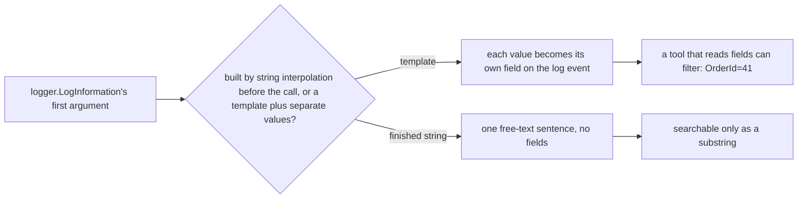

## Bạn cần biết trước

- [[backend.l1.validating-input]] — bạn biết một application-level check có thể nêu đúng thứ gì sai, thay vì để lỗi trôi đi chung chung.
- [[foundation.l2.debugger-and-logging]] — bạn biết một dòng log nên mang theo input mà hàm nhận được và quyết định nó đã đưa ra, không chỉ báo rằng code đã chạy.

## Tình huống

Một khách hàng báo notification xác nhận của order `41` không bao giờ tới. `docker logs donhang-api` (lệnh in ra mọi thứ API Đơn Hàng đang chạy đã log) chứa hàng nghìn dòng từ mọi order trong ngày. Tìm chuỗi `order 41` thì ra dòng cần tìm — lần này thôi. Tuần sau, một khách hàng khác báo về order `410`, và giờ cùng lệnh tìm `order 41` cũng khớp luôn dòng của order `410`, vì `order 41` là chuỗi con của `order 410`. Ngay cả `order 41:` có dấu hai chấm cũng chỉ chạy được vì câu này tình cờ đặt dấu hai chấm sau con số. Không gì trong một dòng log hứa trước con số nằm ở đâu. Điều gì giúp dòng log của một order cụ thể tìm được có chủ đích, không nhờ may mắn?

## Khái niệm cốt lõi

- **structured logging** (ghi log theo field có tên riêng (vd. orderId=41), thay vì chỉ một câu văn bản tự do) — ghi từng mẩu thông tin mà dòng log mang theo thành một field có tên riêng (như `OrderId`), thay vì chèn nó vào một câu văn bản tự do.
- message template — phần cố định của một lệnh gọi log, viết với các tên `{Placeholder}` đánh dấu chỗ từng field sẽ nằm, tách riêng khỏi chính các giá trị.
- field — một giá trị có tên bên trong một log event, chính xác và đứng riêng, khác với một chuỗi con vùi trong văn bản tự do, nơi `41` và `410` chồng lên nhau.
- log event — bản ghi mà một lệnh gọi log tạo ra, mỗi lần lệnh gọi đó chạy trong app này. Các field của nó tồn tại trên bản ghi đó, bất kể sau này một công cụ in nó ra thế nào.

## Cơ chế hoạt động



Tham số đầu tiên của `logger.LogInformation` là một template, không phải một câu đã hoàn chỉnh: `{OrderId}` cho biết giá trị đặt ở đâu và gọi nó là gì, còn chính giá trị thì tới dưới dạng một tham số riêng, được ghép với placeholder của nó theo vị trí, không theo tên. Logger giữ giá trị đó thành một field riêng trên log event, độc lập với câu văn nào được hiển thị sau này.

`$"order {orderId} failed"` hoạt động khác: C# dựng xong chuỗi đó trước khi `LogInformation` được gọi, nên tới lúc logger nhìn thấy, chỉ còn một khối văn bản và không còn ranh giới field nào — `orderId` nằm đâu đó trong đó, nhưng không gì đánh dấu nó ở đâu.

Console của app này không phải công cụ đọc field. Nó in các field của một lệnh gọi có cấu trúc thành một câu văn trông y hệt câu dựng bằng string interpolation. Logger chuyển từng log event, kèm cả field, cho bộ phận ghi output. Bộ ghi của console này biến nó thành câu văn đó. Một bộ ghi khác có thể giữ nguyên từng field — ví dụ thành thuộc tính JSON `"OrderId": 41` — nên khi hỏi `OrderId` bằng `41` thì không bao giờ khớp `410`. App này chưa chạy công cụ nào như vậy. Nhưng vì lệnh gọi dùng template đã mang sẵn field `OrderId`, sau này thêm một công cụ như thế là các lệnh log có sẵn lọc được ngay, không phải viết lại.

## Trong hệ thống Đơn Hàng

`LoggingNotifier.Send` là ví dụ nhỏ nhất — hai field, một lệnh gọi, một dòng. `logger` là object mà app trao cho class này để ghi log. Bỏ qua phần còn lại của khai báo class, chỉ phần thân `Send` là đáng chú ý:

```csharp file=DonHang.Infrastructure/LoggingNotifier.cs tag=stage-1 lines=9-13
public sealed class LoggingNotifier(ILogger<LoggingNotifier> logger) : INotifier
{
    public void Send(int orderId, string subject) =>
        logger.LogInformation("notification for order {OrderId}: {Subject}", orderId, subject);
}
```

`{OrderId}` và `{Subject}` đặt tên cho hai field. `orderId` và `subject` được truyền thành tham số riêng, không bao giờ bị ghép vào chuỗi template trước. Log event tạo ra mang `OrderId` thành một field riêng. `notifier.Send(order.Id, "order placed")` trong [[backend.l1.saving-changes]] điền field đó mỗi khi một order được đặt.

`RequestLoggingMiddleware.InvokeAsync` cho thấy một template có bốn field trong cùng một lệnh gọi, không chỉ hai:

```csharp file=DonHang.Api/Middleware/RequestLoggingMiddleware.cs tag=stage-1 lines=9-24
public sealed class RequestLoggingMiddleware(RequestDelegate next, ILogger<RequestLoggingMiddleware> logger)
{
    public async Task InvokeAsync(HttpContext context)
    {
        var stopwatch = Stopwatch.StartNew();
        await next(context);
        stopwatch.Stop();

        logger.LogInformation(
            "{Method} {Path} responded {StatusCode} in {ElapsedMs}ms",
            context.Request.Method,
            context.Request.Path,
            context.Response.StatusCode,
            stopwatch.ElapsedMilliseconds);
    }
}
```

Các tham số constructor, `HttpContext` và `next(context)` là phần hạ tầng của ASP.NET Core. `Stopwatch` là tiện ích đo thời gian của .NET. Không thứ nào trong đó là trọng tâm của bài này — chỉ chuỗi template và bốn tham số của nó là đáng chú ý. `Method`, `Path`, `StatusCode` và `ElapsedMs` là bốn field riêng, mỗi field được đặt tên một lần trong template và điền một lần từ tham số của chính nó. Hai dòng log này không chung field nào — `LoggingNotifier` không bao giờ log status code, còn `RequestLoggingMiddleware` không bao giờ log order id. Dù vậy, một công cụ đọc field vẫn lọc được từng dòng theo cách riêng: `OrderId=41` cho notification của đúng order đó, hoặc `ElapsedMs` vượt một ngưỡng nào đó để tìm request chậm, bất kể request đó làm gì. Không cách tra nào phải đoán con số nằm ở đâu trong câu.

Dòng này chỉ xuất hiện khi `next(context)` trả về bình thường. Lỗi mà [[backend.l1.validating-input]] đã xem xét — `PlaceOrderAsync` throw `ArgumentException` cho một order rỗng — bỏ qua dòng này, vì exception bị throw khiến `InvokeAsync` thoát ngay, trước khi tới lệnh gọi log. Response `400` đó, kể cả `detail`, đến từ `ExceptionHandlingMiddleware` (một middleware đặt sớm hơn trong pipeline, bắt exception và biến nó thành `400` đó). Thứ gì log exception trên đường nó trở thành `400` là chủ đề của [[backend.l1.exception-handling-middleware]], bài kế tiếp.

## Người mới hay nghĩ rằng…

- **"Log chỉ là `Console.WriteLine` thêm vài bước; định dạng không quan trọng, miễn người đọc hiểu."** → Thực ra dễ đọc với người và có cấu trúc là hai mục tiêu khác nhau: một câu văn tự do đọc một lần thì dễ, nhưng không gì trong nó giúp tìm lại được giữa hàng nghìn dòng khác. Bạn sẽ nhận ra khi thêm một công cụ đọc field và một dòng văn bản tự do không cho nó thứ gì để lọc.
- **"Một message log dựng bằng string interpolation, gõ thẳng order id vào câu, đã tính là structured logging rồi."** → Thực ra string interpolation dựng xong câu đó trước khi logger kịp chạy, nên tới lúc `LogInformation` nhìn thấy, không còn field riêng nào — chỉ là văn bản tình cờ chứa một con số. Bạn sẽ nhận ra khi thử lọc theo `OrderId` và thấy không có field nào như vậy, chỉ có một câu văn nhắc tới nó.

## Thử ngay (3 phút)

1. Với hệ thống Đơn Hàng đang chạy (`scripts/up.sh`), chạy bước 1 và 2 của phần Thử ngay ở bài [[backend.l1.creating-a-resource]] để đặt một order.
2. Đọc dòng log của notification: `docker logs donhang-api --since 1m` (`--since 1m` chỉ giữ lại một phút gần nhất).
3. Nếu `LoggingNotifier.Send` được viết bằng `$"notification for order {orderId}: {subject}"` thay vì template, nó có in ra gì khác ở đây không?

Kết quả mong đợi: khoảng thời gian đó cũng chứa một dòng `RequestLoggingMiddleware` cho mỗi request mà các bước trên tạo ra (đăng nhập, rồi đặt order), cộng thêm một dòng cho mọi request khác API phục vụ trong phút đó — bỏ qua chúng. Thay vào đó, hãy tìm cặp này: `info: DonHang.Infrastructure.LoggingNotifier[0]` (`info` là nhãn `LogInformation` gắn lên dòng của nó, `[0]` có thể bỏ qua), rồi một dòng thụt lề `notification for order <id>: order placed` — văn bản thuần, nhìn qua không phân biệt được với một câu dựng bằng tay.

<details><summary>Gợi ý đáp án</summary>

Dòng in ra trông giống hệt nhau ở cả hai cách, nhưng bên dưới được dựng khác nhau. `LoggingNotifier.Send` gọi `logger.LogInformation` với template `"notification for order {OrderId}: {Subject}"` và `orderId` là một tham số riêng — field đã tồn tại trên log event trước khi console này in nó thành câu văn. Một phiên bản dựng bằng `$"notification for order {orderId}: {subject}"` sẽ in ra đúng văn bản đó, nhưng tới lúc `LogInformation` nhìn thấy, không còn field `OrderId` nào để lọc — chỉ còn câu văn bạn đang đọc.

</details>

## Liên hệ

- [[backend.l1.saving-changes]] — cùng lệnh gọi `notifier.Send(order.Id, "order placed")`, giờ đọc để xem nó log gì thay vì khi nào nó chạy.
- [[foundation.l2.debugger-and-logging]] — log nói chung, ở đây thu hẹp về một dạng: field có tên từ một message template.
- [[backend.l1.exception-handling-middleware]] — bài kế tiếp, nơi middleware log trước khi biến một exception thành response.

## Tóm tắt 5 dòng

1. Structured logging ghi từng mẩu thông tin thành một field có tên riêng, không ghép vào một câu văn bản tự do.
2. `logger.LogInformation("... {OrderId} ...", orderId, ...)` giữ `orderId` thành một field riêng. String interpolation dựng nó thành văn bản trước khi logger kịp chạy.
3. `LoggingNotifier` log mọi notification với `OrderId` và `Subject` là field có tên, từ một dòng code.
4. `RequestLoggingMiddleware` log `Method`, `Path`, `StatusCode` và `ElapsedMs` thành bốn field riêng trong một lệnh gọi.
5. Console in các field của một lệnh gọi có cấu trúc thành văn bản dễ đọc, nhưng ranh giới field vẫn tồn tại — tìm theo văn bản đó chạy được là nhờ may, không phải nhờ thiết kế.
