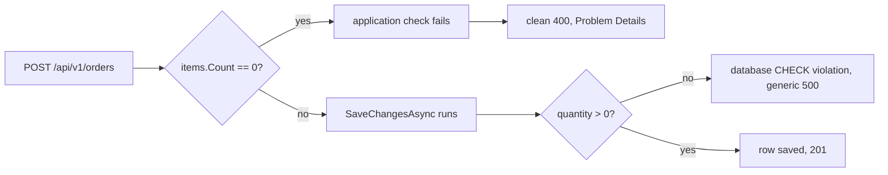

## Before you start

- [[backend.l1.errors-and-problem-details]] — you know a failing response's body carries `title`/`status`/`detail` (and optionally a `type`), the same shape no matter which endpoint failed.
- [[backend.l1.saving-changes]] — you know `PlaceOrderAsync` stages an order with `AddAsync`, then `SaveChangesAsync` is the call that actually writes it.

## The situation

A teammate tests `POST /api/v1/orders` two ways. Sending `{"items": []}` fails cleanly: `400`, with a body naming exactly what's wrong. Sending a real item with `quantity` set to `0` fails too, but as `500`, with a body that only says `something went wrong` — even though `order_items.quantity` already has `CHECK (quantity > 0)` in the database. Both requests are equally invalid. Why does one failure read cleanly, and the other doesn't?

## Core concepts

- `CHECK (quantity > 0)` — a row-level database rule, a *constraint*: PostgreSQL tests it against the new row on every `INSERT` and `UPDATE`, and rejects a row that breaks it. It can see that row's own columns and nothing else.
- "at least one item" — a rule about the whole request, not any single row; no `CHECK` can express it, because a `CHECK` only ever sees the row being inserted — never other rows, and never another table's rows.
- application-level check — code the endpoint runs before calling `SaveChangesAsync()`, catching what a database's row-level rules structurally cannot.
- raw database error — a bad value that reaches `SaveChangesAsync()` unchecked and violates a constraint there, surfacing as an exception the endpoint never asked about, instead of a clean, expected failure.

## How it works



Two different rules guard the same request, from two different places. `items.Count == 0` is checked in application code, before `SaveChangesAsync()` ever runs — because only application code holds the whole list of items at once. No `CHECK` in `orders` or `order_items` could express "this order has zero items": that would mean counting rows across the whole `order_items` table for one order, and a `CHECK` never sees past the row it's testing. When that check fails, it throws — the endpoint already knows exactly what's wrong, and can hand back a `400` naming it, because something outside `PlaceOrderAsync` catches that specific exception and turns the exception's own message into the response's `detail`. What catches it, and how, is `exception-handling-middleware`'s subject, not this lesson's.

`quantity > 0` is a different story: nothing in application code checks it before saving, so a bad value only gets caught when `SaveChangesAsync()` sends the `INSERT` and PostgreSQL enforces its own `CHECK` constraint. The database's rejection isn't wrong, but it arrives as a different, unrecognized kind of exception, not one the endpoint was watching for. Nothing there names `quantity`, or says which item, or says a number needed to be positive. That same catching mechanism only recognizes specific exception types, and this isn't one of them, so it writes a fixed generic message instead of whatever the exception actually said.

The database's constraints stay real and enforced either way; what changes is only whether application code checked the same thing first. A check the endpoint runs itself turns a bad request into an expected outcome, with a body describing it. A check left only to the database still stops the bad row, but leaves the endpoint reacting to a failure it did not see coming.

## In the Đơn Hàng system

`orders.customer_id` and `order_items.quantity` are exactly the two constraints this lesson is about; the `id` and `placed_at` lines are just how the `orders` table is declared, and nothing here depends on them:

```sql file=db/schema.sql tag=stage-1 lines=18-32
CREATE TABLE orders (
    id          integer GENERATED BY DEFAULT AS IDENTITY PRIMARY KEY,
    customer_id integer NOT NULL REFERENCES customers (id),
    placed_at   timestamptz NOT NULL,
    status      text NOT NULL
                CHECK (status IN ('new', 'paid', 'shipped', 'cancelled'))
);

CREATE TABLE order_items (
    order_id       integer NOT NULL REFERENCES orders (id),
    product_id     integer NOT NULL REFERENCES products (id),
    quantity       integer NOT NULL CHECK (quantity > 0),
    unit_price_vnd integer NOT NULL CHECK (unit_price_vnd > 0),
    PRIMARY KEY (order_id, product_id)
);
```

`orders.customer_id REFERENCES customers (id)` rejects an order for a customer that doesn't exist; `order_items.quantity CHECK (quantity > 0)` rejects a non-positive quantity. Both are real, enforced constraints — PostgreSQL never lets either bad row exist. Neither one, on its own, could reject an order with zero items: that rule is about how many rows are in `order_items` for one order, not about any one row's own columns.

`OrderService.PlaceOrderAsync`, from `saving-changes`, receives the request's item list as its `items` parameter, and its very first statement, before `AddAsync` or `SaveChangesAsync` run at all, already checks the one thing no column here can: `if (items.Count == 0) throw new ArgumentException("an order needs at least one item");`. Nothing in that same method checks `quantity` or `productId` before saving — those are left entirely to the constraints above.

Sending the two requests to the running system shows exactly that gap. `{"items": []}` gets `400` with `{"title":"Invalid request","status":400,"detail":"an order needs at least one item"}` — the application check's own message, in a Problem Details-shaped body. A real item with `quantity` `0` gets `500` with `{"title":"Server error","status":500,"detail":"something went wrong"}` — the database did reject the row, but nothing in the endpoint was watching for that specific failure, so the response says nothing about `quantity` at all.

## Beginners often think…

- **"Letting the database reject bad data with its own constraints is enough; a `400` needs no separate check in the endpoint."** → Actually the `quantity > 0` case shows what that produces: not a `400`, but a `500` with a body that names nothing about what was wrong. The constraint stopped the bad row, but nobody translated that into a response worth reading. You notice this when a client can't tell a real server crash from a value it sent being invalid — both come back as the same opaque failure.
- **"A validation failure — one of those application-level checks failing — should still return `201`, with an error field in the body explaining what went wrong."** → Actually failing validation means the order was never created — nothing was saved, so there is no new resource to answer `201` about. You notice this when a `201`-with-an-error response leaves a client unsure whether to retry, since `201` already promised something was made.

## Try it (3 minutes)

1. With the Đơn Hàng system running (`scripts/up.sh`), run step 1 of [[backend.l1.creating-a-resource]]'s Try it to log in as `anh.tran@example.com` (`donhang-dev-password`) and copy the token.
2. Send an order with no items: `curl -sS -i -X POST http://localhost:8080/api/v1/orders -H 'Content-Type: application/json' -H "Authorization: Bearer <token>" -d '{"items":[]}'`.
3. Send an order with a zero quantity instead: `curl -sS -i -X POST http://localhost:8080/api/v1/orders -H 'Content-Type: application/json' -H "Authorization: Bearer <token>" -d '{"items":[{"productId":1,"quantity":0,"unitPriceVnd":10000}]}'` — product `1` is already in the seeded data, so `quantity` is the only thing wrong with this request.

Expected result: step 2 answers `400` with `detail` naming the missing items directly. Step 3 answers `500` with `detail` reading only `something went wrong` — the same database rule from the code above stopped the row, but the response never says `quantity` was the problem.

<details><summary>Suggested answer</summary>

Step 2's `400` and step 3's `500` come from the same kind of mistake — a value the request sent was invalid — but only one path was ever checked by application code before saving. `items.Count == 0` is checked explicitly, so the endpoint already has a message ready. `quantity > 0` is checked only by the database, so the endpoint learns about the problem the same way it would learn about any other unexpected failure: too late to say anything specific about it.

</details>

## Connections

- [[backend.l1.saving-changes]] — the same `PlaceOrderAsync`, now read for the line before `AddAsync` instead of the two lines after it.
- [[backend.l1.errors-and-problem-details]] — the shape a clean `400` uses; this lesson is about which failures actually get to use it yet.
- [[backend.l1.choosing-an-error-status]] — the next lesson, choosing between `400`, `404`, and `409` for different kinds of failure.
- [[backend.l1.exception-handling-middleware]] — the mechanism that catches `PlaceOrderAsync`'s exceptions and turns each one into a response, named here but not explained until then.

## Five-line summary

1. A database `CHECK` or foreign key rejects a bad row, but neither can see "does this order have any items" — that spans rows.
2. `PlaceOrderAsync` already checks `items.Count == 0` before calling `SaveChangesAsync()`, because only application code sees the whole item list at once.
3. That check turns a bad request into a `400` with a `detail` naming exactly what was wrong, before anything is saved.
4. `quantity > 0` isn't checked in application code yet; violating it surfaces as a raw exception and a generic `500`, not a clean `400`.
5. A validation failure is not success — the empty-items check answers `400`, never `201` with an error field bolted on.
