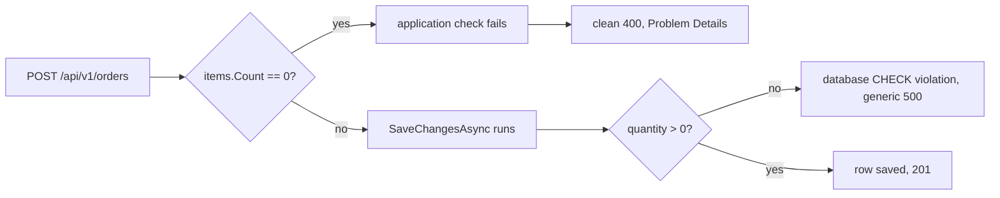

## Bạn cần biết trước

- [[backend.l1.errors-and-problem-details]] — bạn biết body của một response lỗi mang `title`/`status`/`detail` (và có thể có thêm `type`), cùng một hình dạng bất kể endpoint nào thất bại.
- [[backend.l1.saving-changes]] — bạn biết `PlaceOrderAsync` staging một order bằng `AddAsync`, rồi `SaveChangesAsync` mới là lệnh gọi thực sự ghi nó.

## Tình huống

Một đồng nghiệp thử `POST /api/v1/orders` theo hai cách. Gửi `{"items": []}` thất bại sạch sẽ: `400`, với body nêu đúng thứ gì sai. Gửi một item thật với `quantity` là `0` cũng thất bại, nhưng là `500`, với body chỉ nói `something went wrong` — dù `order_items.quantity` đã có `CHECK (quantity > 0)` trong database. Cả hai request đều sai như nhau. Vì sao một lỗi đọc sạch sẽ, còn lỗi kia thì không?

## Khái niệm cốt lõi

- `CHECK (quantity > 0)` — một quy tắc database ở mức dòng, một *constraint*: PostgreSQL kiểm tra nó trên dòng mới ở mỗi `INSERT` và `UPDATE`, và từ chối một dòng vi phạm nó. Nó chỉ thấy được các cột của chính dòng đó, không gì khác.
- "ít nhất một item" — một quy tắc về toàn bộ request, không phải về một dòng đơn lẻ nào; không `CHECK` nào diễn đạt được điều đó, vì một `CHECK` chỉ bao giờ thấy đúng dòng đang được insert — không bao giờ thấy dòng khác, hay dòng của bảng khác.
- application-level check — code endpoint chạy trước khi gọi `SaveChangesAsync()`, bắt được điều mà quy tắc ở mức dòng của database về cấu trúc không thể.
- raw database error — một giá trị sai tới `SaveChangesAsync()` mà không được kiểm tra và vi phạm một constraint ở đó, lộ ra thành một exception mà endpoint chưa từng hỏi tới, thay vì một lỗi sạch, đã được lường trước.

## Cơ chế hoạt động



Hai quy tắc khác nhau canh gác cùng một request, từ hai chỗ khác nhau. `items.Count == 0` được kiểm tra trong application code, trước khi `SaveChangesAsync()` chạy — vì chỉ application code mới giữ toàn bộ danh sách item cùng lúc. Không `CHECK` nào trong `orders` hay `order_items` diễn đạt được "order này có zero item": điều đó nghĩa là phải đếm dòng trên toàn bảng `order_items` cho một order, và một `CHECK` không bao giờ thấy quá dòng nó đang kiểm tra. Khi check đó thất bại, nó throw — endpoint đã biết chính xác điều gì sai, và có thể trả về một `400` nêu tên nó, vì có gì đó bên ngoài `PlaceOrderAsync` bắt đúng exception đó và biến message của chính exception thành `detail` của response. Cái gì bắt nó, và bằng cách nào, là chủ đề của `exception-handling-middleware`, không phải bài này.

`quantity > 0` là một câu chuyện khác: không gì trong application code kiểm tra nó trước khi lưu, nên một giá trị sai chỉ bị bắt khi `SaveChangesAsync()` gửi `INSERT` và PostgreSQL áp đặt `CHECK` của chính nó. Việc database từ chối không sai, nhưng nó tới dưới dạng một loại exception khác, không được nhận diện, không phải loại endpoint đang chờ. Không gì trong đó nêu tên `quantity`, hay nói item nào, hay nói một con số cần phải dương. Chính cơ chế bắt đó chỉ nhận diện những loại exception cụ thể, và đây không phải một trong số đó, nên nó viết ra một message cố định chung chung thay vì đúng thứ exception thực sự nói.

Constraint của database vẫn có thật và được áp đặt dù thế nào; điều thay đổi chỉ là application code có kiểm tra cùng điều đó trước hay không. Một check endpoint tự chạy biến một request sai thành một kết quả đã lường trước, với một body mô tả nó. Một check chỉ để lại cho database vẫn ngăn được dòng sai, nhưng để endpoint phản ứng với một lỗi nó không thấy trước.

## Trong hệ thống Đơn Hàng

`orders.customer_id` và `order_items.quantity` chính xác là hai constraint bài này nói tới; dòng `id` và `placed_at` chỉ là cách bảng `orders` được khai báo, không gì ở đây phụ thuộc vào chúng:

```sql file=db/schema.sql tag=stage-1 lines=18-32
CREATE TABLE orders (
    id          integer GENERATED BY DEFAULT AS IDENTITY PRIMARY KEY,
    customer_id integer NOT NULL REFERENCES customers (id),
    placed_at   timestamptz NOT NULL,
    status      text NOT NULL
                CHECK (status IN ('new', 'paid', 'shipped', 'cancelled'))
);

CREATE TABLE order_items (
    order_id       integer NOT NULL REFERENCES orders (id),
    product_id     integer NOT NULL REFERENCES products (id),
    quantity       integer NOT NULL CHECK (quantity > 0),
    unit_price_vnd integer NOT NULL CHECK (unit_price_vnd > 0),
    PRIMARY KEY (order_id, product_id)
);
```

`orders.customer_id REFERENCES customers (id)` từ chối một order cho một customer không tồn tại; `order_items.quantity CHECK (quantity > 0)` từ chối một quantity không dương. Cả hai đều là constraint có thật, được áp đặt — PostgreSQL không bao giờ để dòng sai nào trong hai loại đó tồn tại. Không cái nào, tự nó, từ chối được một order có zero item: quy tắc đó là về có bao nhiêu dòng trong `order_items` cho một order, không phải về các cột của riêng một dòng nào.

`OrderService.PlaceOrderAsync`, từ bài `saving-changes`, nhận danh sách item của request làm tham số `items`, và statement đầu tiên của nó, trước cả khi `AddAsync` hay `SaveChangesAsync` chạy, đã kiểm tra đúng điều không cột nào ở đây làm được: `if (items.Count == 0) throw new ArgumentException("an order needs at least one item");`. Không gì trong cùng method đó kiểm tra `quantity` hay `productId` trước khi lưu — những thứ đó hoàn toàn để lại cho các constraint ở trên.

Gửi hai request đó tới hệ thống đang chạy cho thấy chính xác lỗ hổng đó. `{"items": []}` nhận `400` với `{"title":"Invalid request","status":400,"detail":"an order needs at least one item"}` — chính message của application check, trong một body có hình dạng Problem Details. Một item thật với `quantity` `0` nhận `500` với `{"title":"Server error","status":500,"detail":"something went wrong"}` — database có từ chối dòng đó, nhưng không gì trong endpoint đang chờ đúng lỗi cụ thể này, nên response không nói gì về `quantity` cả.

## Người mới hay nghĩ rằng…

- **"Để database tự từ chối dữ liệu sai bằng constraint của nó là đủ; một `400` không cần check riêng trong endpoint."** → Thực ra trường hợp `quantity > 0` cho thấy điều đó tạo ra gì: không phải một `400`, mà một `500` với body không nêu gì về điều đã sai. Constraint có ngăn được dòng sai, nhưng không ai chuyển điều đó thành một response đáng đọc. Bạn sẽ nhận ra điều này khi một client không phân biệt được một server crash thật với một giá trị nó gửi bị sai — cả hai đều trả về cùng một lỗi mù mờ như nhau.
- **"Một lỗi validate — một trong các application-level check đó thất bại — vẫn nên trả `201`, kèm một field lỗi trong body giải thích điều đã sai."** → Thực ra validate thất bại nghĩa là order chưa từng được tạo — không gì được lưu, nên không có resource mới nào để trả lời bằng `201`. Bạn sẽ nhận ra điều này khi một response `201` kèm lỗi khiến client không chắc có nên thử lại hay không, vì `201` đã hứa hẹn có gì đó được tạo ra.

## Thử ngay (3 phút)

1. Với hệ thống Đơn Hàng đang chạy (`scripts/up.sh`), chạy bước 1 của phần Thử ngay ở bài [[backend.l1.creating-a-resource]] để đăng nhập với `anh.tran@example.com` (`donhang-dev-password`) và copy token.
2. Gửi một order không có item nào: `curl -sS -i -X POST http://localhost:8080/api/v1/orders -H 'Content-Type: application/json' -H "Authorization: Bearer <token>" -d '{"items":[]}'`.
3. Gửi một order với quantity bằng 0 thay vào đó: `curl -sS -i -X POST http://localhost:8080/api/v1/orders -H 'Content-Type: application/json' -H "Authorization: Bearer <token>" -d '{"items":[{"productId":1,"quantity":0,"unitPriceVnd":10000}]}'` — product `1` đã có sẵn trong dữ liệu seed, nên `quantity` là thứ duy nhất sai trong request này.

Kết quả mong đợi: bước 2 trả lời `400` với `detail` nêu thẳng việc thiếu item. Bước 3 trả lời `500` với `detail` chỉ đọc `something went wrong` — chính quy tắc database từ code ở trên đã ngăn dòng đó, nhưng response không bao giờ nói `quantity` là vấn đề.

<details><summary>Gợi ý đáp án</summary>

`400` của bước 2 và `500` của bước 3 tới từ cùng một loại lỗi — một giá trị request gửi bị sai — nhưng chỉ một nhánh từng được application code kiểm tra trước khi lưu. `items.Count == 0` được kiểm tra tường minh, nên endpoint đã có sẵn một message. `quantity > 0` chỉ được database kiểm tra, nên endpoint biết về vấn đề theo đúng cách nó sẽ biết về bất kỳ lỗi bất ngờ nào khác: quá muộn để nói được gì cụ thể về nó.

</details>

## Liên hệ

- [[backend.l1.saving-changes]] — cùng `PlaceOrderAsync`, giờ đọc ở dòng trước `AddAsync` thay vì hai dòng sau nó.
- [[backend.l1.errors-and-problem-details]] — hình dạng một `400` sạch dùng; bài này nói về việc lỗi nào thực sự dùng được nó.
- [[backend.l1.choosing-an-error-status]] — bài kế tiếp, chọn giữa `400`, `404`, và `409` cho các loại lỗi khác nhau.
- [[backend.l1.exception-handling-middleware]] — cơ chế bắt các exception của `PlaceOrderAsync` và biến mỗi cái thành một response, được nhắc tới ở đây nhưng chưa giải thích tới tận bài đó.

## Tóm tắt 5 dòng

1. Một `CHECK` hay khóa ngoại của database từ chối một dòng sai, nhưng cả hai đều không thấy được "order này có item nào không" — điều đó trải trên nhiều dòng.
2. `PlaceOrderAsync` đã kiểm tra `items.Count == 0` trước khi gọi `SaveChangesAsync()`, vì chỉ application code mới thấy toàn bộ danh sách item cùng lúc.
3. Check đó biến một request sai thành một `400` với `detail` nêu đúng điều đã sai, trước khi bất cứ gì được lưu.
4. `quantity > 0` chưa được kiểm tra trong application code; vi phạm nó lộ ra thành một exception thô và một `500` chung chung, không phải một `400` sạch.
5. Một lỗi validate không phải là thành công — check items rỗng trả lời `400`, không bao giờ `201` kèm một field lỗi gắn thêm vào.
