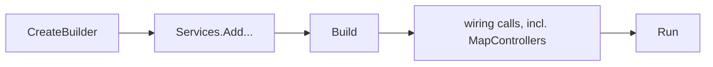

## Before you start

- [[backend.l1.what-kestrel-does]] — you know Kestrel accepts a connection and hands the request to your code; this lesson is about where that code begins.

## The situation

Kestrel hands a request to your code, the previous lesson said, but never showed where that code begins. You open `DonHang.Api/Program.cs` for the first time and find about seventy lines: some register things, some look like plain method calls, one is named `Run`. A teammate points at a single line, `app.MapControllers();`, and says "that line is what makes the API answer `/api/v1/products`." You do not see a URL anywhere near it. Where does an ASP.NET Core app actually start, and how does one line connect to a specific path?

## Core concepts

- WebApplicationBuilder — the object `WebApplication.CreateBuilder(args)` returns; an app registers what it needs on this object before anything runs.
- WebApplication — what `builder.Build()` produces; the same object the app configures next, and the object whose `Run()` call starts Kestrel.
- **endpoint** — a method-and-path pair mapped to handler code; a request reaches that code only when both match. A method is attribute-routed when the method and its class carry attributes stating the HTTP method and the path, so the pair is written right next to the code itself.
- request-answering class (for example `ProductsController`) — a class whose attribute-routed methods `app.MapControllers()` finds and turns into endpoints.

## How it works



`WebApplication.CreateBuilder(args)` returns a `WebApplicationBuilder`. Everything an ASP.NET Core app needs before it can run — a database connection, a way to issue tokens, and so on — gets registered on that one object. When two calls register different things, as every call in this file does, the order between them only decides what is available to the app, not how a later request is answered.

Calling `builder.Build()` ends the registration half of Program.cs and produces the `WebApplication` itself, the object Program.cs configures next. Its `Run()` call, at the very end, is what actually starts Kestrel. Between `Build()` and `Run()`, Program.cs does the rest of its startup work, including wiring up (through `app.Use...`/`app.Map...` calls) the steps every incoming request will pass through before reaching your code; what order those wiring calls run in, and why it matters, is the next lesson's subject.

One of those wiring calls, `app.MapControllers()`, is what makes an **endpoint** exist at all: it looks at request-answering classes like `ProductsController` and turns each attribute-routed method on them into a method-and-path pair the app can match an incoming request to. `app.MapControllers()` itself runs once, at startup; it does not run again for every request — only the methods it finds do that. That is why your teammate could point at this one line: the path `/api/v1/products` is written on `ProductsController` itself, and `app.MapControllers()` is what makes the app notice it.

## In the Đơn Hàng system

The registration half of `Program.cs` — before `Build()` — only ever adds things the app might need:

```csharp file=DonHang.Api/Program.cs tag=stage-1 lines=10-20
var builder = WebApplication.CreateBuilder(args);

// lesson: backend.l1.hosting-and-program-cs
builder.Services.AddControllers();
builder.Services.AddProblemDetails();

var connectionString = builder.Configuration.GetConnectionString("Default")
    ?? throw new InvalidOperationException("ConnectionStrings:Default is not set");
builder.Services.AddDonHangInfrastructure(connectionString);
builder.Services.AddScoped<OrderService>();
builder.Services.AddSingleton<JwtTokenService>();
```

`AddControllers()` is what makes `app.MapControllers()` further down able to find request-answering classes like `ProductsController` at all. The rest read the connection string and register a database connection, a standard error format (`AddProblemDetails()`), an order service, and a way to issue tokens. Reordering the `builder.Services.Add...` calls among themselves changes nothing a client would ever see; the `connectionString` line has to come before the line that uses it for an ordinary C# reason — a variable must exist before something else can read it — not because of anything this lesson is about.

`Build()` and `Run()` sit at the two ends of a longer block — read only its first and last lines for now; everything between them, comments included, belongs to later lessons (what runs against the database, and what order the wiring calls happen in):

```csharp file=DonHang.Api/Program.cs tag=stage-1 lines=52-74
var app = builder.Build();

// lesson: backend.l1.migrations
// Applies pending migrations on start, so a fresh `db` container ends up on
// the same schema a developer gets from `dotnet ef database update`.
using (var scope = app.Services.CreateScope())
{
    var context = scope.ServiceProvider.GetRequiredService<DonHangDbContext>();
    MigrationBaseline.ApplyIfNeeded(context);
    context.Database.Migrate();
}

// lesson: backend.l1.middleware-pipeline
// Order matters: exceptions caught first, then every request logged, then
// the terminal middleware (auth, routing) that decides how to answer it.
app.UseMiddleware<ExceptionHandlingMiddleware>();
app.UseMiddleware<RequestLoggingMiddleware>();
app.UseCors();
app.UseAuthentication();
app.UseAuthorization();
app.MapControllers();

app.Run();
```

`app.MapControllers()` is the one line in between that this lesson cares about: it is what makes `ProductsController`'s attribute-routed methods into real endpoints, exactly as described above.

## Beginners often think…

- **"Program.cs only matters when the app starts; nothing in it affects how an individual request is handled later."** → Actually the wiring calls between `Build()` and `Run()` decide exactly how every later request is handled; only the order among `builder.Services.Add...` calls that register different things is free to vary. You notice this the first time a request behaves differently after a wiring line moves — which is what the next lesson is about.
- **"`app.MapControllers()`'s handler code runs immediately, when that line executes, not when a matching request later arrives."** → Actually `app.MapControllers()` only registers which method-and-path pairs exist; each method's own body runs later, once per matching request. You notice this when a change you make inside one of these methods only shows up after you send a new request, never at startup.

## Try it (3 minutes)

1. With the lab running (`scripts/up.sh`), add a temporary `Console.WriteLine("list ran");` as the first line inside `ProductsController`'s method for `GET /api/v1/products`, then restart the app once and watch its startup log.
2. Once startup finishes with no such line printed, run `curl http://localhost:8080/api/v1/products` twice.

Expected result: the startup log never prints "list ran" — `app.MapControllers()` only registered the method, it did not run it. Both curls do print it, once each, in the app's log, showing the method's body runs fresh per matching request, never once at startup.

<details><summary>Suggested answer</summary>

`app.MapControllers()` only recorded that a method exists for that path; the method's own body — including the `Console.WriteLine` — never runs until a request actually matches, which is why the startup log stays silent and each curl adds one more line.

</details>

## Connections

- [[backend.l1.what-kestrel-does]] — Kestrel is what `Run()` finally starts; this lesson is everything Program.cs sets up before that call.
- [[backend.l1.middleware-pipeline]] — the exact order of the wiring calls skipped over here.
- [[backend.l1.rest-resources]] — real endpoint design for Đơn Hàng: which paths exist and what each one should do, now that "endpoint" is a familiar word.

## Five-line summary

1. `WebApplication.CreateBuilder` returns a `WebApplicationBuilder`; `Build()` turns it into the `WebApplication` whose `Run()` call starts Kestrel.
2. When `builder.Services.Add...` calls register different things, their order only decides what is available to the app, not how any request is handled.
3. An endpoint is a method-and-path pair mapped to handler code; `app.MapControllers()` creates one for every attribute-routed method it finds.
4. Such a method's code runs once per matching request, never when `app.MapControllers()` itself executes at startup.
5. What order the wiring calls between `Build()` and `Run()` happen in, and why that order matters, is the next lesson's subject.
