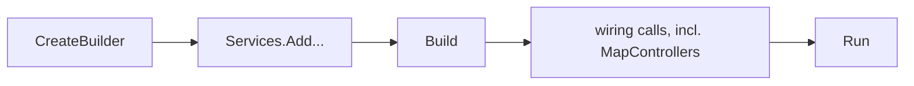

## Before you start

- [[backend.l1.what-kestrel-does]] — you know Kestrel accepts a connection and hands the request to your code; this lesson is about where that code begins.

## The situation

Kestrel hands a request to your code, the previous lesson said, but never showed where that code begins. You open `DonHang.Api/Program.cs` for the first time and find about seventy lines: some register things, some look like plain method calls, one is named `Run`. A teammate points at a single line, `app.MapControllers();`, and says "that line is what makes the app answer `/api/v1/products`." You do not see that path anywhere near it. Where does an ASP.NET Core app actually start, and how does one line connect to a specific path?

## Core concepts

- WebApplicationBuilder — the object `WebApplication.CreateBuilder(args)` returns; an app registers what it needs on this object before anything runs.
- WebApplication — what `builder.Build()` produces; the same object the app configures next, and the object whose `Run()` call starts Kestrel.
- **endpoint** — a method-and-path pair mapped to handler code; a request reaches that code only when both match. In `ProductsController`, each such method is attribute-routed: it and its class carry attributes stating the HTTP method and the path, so the pair is written right next to the code itself.
- request-answering class (for example `ProductsController`) — a class whose attribute-routed methods `app.MapControllers()` finds and turns into endpoints.

## How it works


```mermaid
flowchart LR
  A[CreateBuilder] --> B[Services.Add...]
  B --> C[Build]
  C --> D[wiring calls, incl. MapControllers]
  D --> F[Run]
```

`WebApplication.CreateBuilder(args)` returns a `WebApplicationBuilder`. Much of what an ASP.NET Core app needs before it can run — a database connection, a way to prove a customer has signed in, and so on — gets registered on that one object. Registering only records that something is available; nothing registered is used until later code asks for it. So when two calls register different things, as the last two lines of the next section's code do (`AddScoped<OrderService>` and `AddSingleton<JwtTokenService>`), their order makes no difference to how a later request is answered. It can matter when two calls register the same kind of thing, a case you do not need to look for in this lesson.

Calling `builder.Build()` ends the registration half of Program.cs and produces the `WebApplication` itself, the object Program.cs configures next. Its `Run()` call, at the very end, is what actually starts Kestrel. Between `Build()` and `Run()`, Program.cs wires up, through `app.Use...`/`app.Map...` calls, the steps every incoming request will pass through before reaching your code. What order those wiring calls run in, and why it matters, is the next lesson's subject.

One of those wiring calls, `app.MapControllers()`, is the one that creates every **endpoint** this app has: it looks at request-answering classes like `ProductsController` and turns each attribute-routed method on them into a method-and-path pair the app can match an incoming request to. `app.MapControllers()` itself runs once, at startup; it does not run again for every request — only the methods it finds do that. That is why your teammate could point at this one line: in `ProductsController.cs`, the class carries `[Route("api/v1/products")]` and its `List()` method carries `[HttpGet]`. Together they give the pair `GET /api/v1/products`, and `app.MapControllers()` is what makes the app notice it.

## In the Đơn Hàng system

The registration half of `Program.cs` — before `Build()` — only ever adds things the app might need:

```csharp file=DonHang.Api/Program.cs tag=stage-1 lines=10-20
var builder = WebApplication.CreateBuilder(args);

// lesson: backend.l1.hosting-and-program-cs
builder.Services.AddControllers();
builder.Services.AddProblemDetails();

var connectionString = builder.Configuration.GetConnectionString("Default")
    ?? throw new InvalidOperationException("ConnectionStrings:Default is not set");
builder.Services.AddDonHangInfrastructure(connectionString);
builder.Services.AddScoped<OrderService>();
builder.Services.AddSingleton<JwtTokenService>();
```

`AddControllers()` is what makes `app.MapControllers()` further down able to find request-answering classes like `ProductsController` at all. The rest read the connection string (the text that tells the app which database to reach and how to log in to it) and register the pieces the app needs to reach the database and send notifications (`AddDonHangInfrastructure()`), a standard error format (`AddProblemDetails()`), an order service, and a way to hand out proof that a customer has signed in. (What makes one registration `Scoped` and another `Singleton` is a later lesson's subject; here, both simply make something available.)

Reordering `AddScoped<OrderService>` and `AddSingleton<JwtTokenService>` changes nothing a client would see, because they register different things; the `connectionString` line has to come before the line that uses it for an ordinary C# reason — a variable must exist before something else can read it — not because of anything this lesson is about.

`Build()` and `Run()` sit at the two ends of a longer block — read only its first line, its last line, and the `app.MapControllers();` line for now; everything else between them, comments included, belongs to later lessons (what runs against the database, and what order the wiring calls happen in):

```csharp file=DonHang.Api/Program.cs tag=stage-1 lines=52-74
var app = builder.Build();

// lesson: backend.l1.migrations
// Applies pending migrations on start, so a fresh `db` container ends up on
// the same schema a developer gets from `dotnet ef database update`.
using (var scope = app.Services.CreateScope())
{
    var context = scope.ServiceProvider.GetRequiredService<DonHangDbContext>();
    MigrationBaseline.ApplyIfNeeded(context);
    context.Database.Migrate();
}

// lesson: backend.l1.middleware-pipeline
// Order matters: exceptions caught first, then every request logged, then
// the terminal middleware (auth, routing) that decides how to answer it.
app.UseMiddleware<ExceptionHandlingMiddleware>();
app.UseMiddleware<RequestLoggingMiddleware>();
app.UseCors();
app.UseAuthentication();
app.UseAuthorization();
app.MapControllers();

app.Run();
```

`app.MapControllers()` is the one line in between that this lesson cares about: it is what makes `ProductsController`'s attribute-routed methods into real endpoints, exactly as described above.

## Beginners often think…

- **"Program.cs only matters when the app starts; nothing in it affects how an individual request is handled later."** → Actually the wiring calls between `Build()` and `Run()` decide exactly how every later request is handled. Only the order among `builder.Services.Add...` calls that register different things is free to vary. You notice this the first time a request behaves differently after a wiring line moves — which is what the next lesson is about.
- **"`app.MapControllers()`'s handler code runs immediately, when that line executes, not when a matching request later arrives."** → Actually `app.MapControllers()` only registers which method-and-path pairs exist; each method's own body runs later, once per matching request. You notice this when a change you make inside one of these methods only shows up after you send a new request, never at startup.

## Try it (3 minutes)

1. Start the lab (the whole Đơn Hàng system on your machine) by running `scripts/up.sh` if it is not already running.
2. Open `DonHang.Api/Controllers/ProductsController.cs`; under the class line carrying `[Route("api/v1/products")]`, find `List()`, the method marked plain `[HttpGet]` with nothing inside the brackets, and add a temporary `Console.WriteLine("list ran");` as its first line.
3. Run `docker compose up -d --build api` (this rebuilds the Đơn Hàng API from your edited code and restarts it).
4. Run `docker compose logs api` (this prints what the API has written so far, `Console.WriteLine` output included; run it again to see newer lines) a few times, until new lines stop appearing.
5. With no "list ran" line printed yet, run `curl http://localhost:8080/api/v1/products` (localhost means your own machine; this sends one GET request to that path from your terminal, like a browser would) twice, then run `docker compose logs api` again.

Expected result: the startup portion of the log never prints "list ran" — `app.MapControllers()` only registered the method, it did not run it. After the two curls, the log shows it printed twice, once per matching request, never once at startup.

<details><summary>Suggested answer</summary>

`app.MapControllers()` only recorded that a method exists for that path; the method's own body — including the `Console.WriteLine` — never runs until a request actually matches, which is why the startup portion of the log stays silent and the two curls add one line each.

</details>

## Connections

- [[backend.l1.what-kestrel-does]] — Kestrel is what `Run()` finally starts; this lesson is everything Program.cs sets up before that call.
- [[backend.l1.middleware-pipeline]] — the exact order of the wiring calls skipped over here.
- [[backend.l1.rest-resources]] — real endpoint design for Đơn Hàng: which paths exist and what each one should do, now that "endpoint" is a familiar word.

## Five-line summary

1. `WebApplication.CreateBuilder` returns a `WebApplicationBuilder`; `Build()` turns it into the `WebApplication` whose `Run()` call starts Kestrel.
2. `builder.Services.Add...` calls that register different things, such as `AddScoped<OrderService>` and `AddSingleton<JwtTokenService>`, can run in any order without changing how a later request is answered.
3. An endpoint is a method-and-path pair mapped to handler code; in this app, `app.MapControllers()` creates one for every attribute-routed method it finds.
4. Such a method's code runs once per matching request, never when `app.MapControllers()` itself executes at startup.
5. What order the wiring calls between `Build()` and `Run()` happen in, and why that order matters, is the next lesson's subject.
