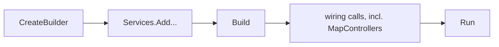

## Bạn cần biết trước

- [[backend.l1.what-kestrel-does]] — bạn đã biết Kestrel nhận kết nối rồi chuyển request cho code của bạn. Bài này nói về chỗ đoạn code đó bắt đầu.

## Tình huống

Bài trước nói Kestrel chuyển request cho code của bạn, nhưng chưa chỉ ra đoạn code đó bắt đầu ở đâu. Lần đầu mở `DonHang.Api/Program.cs`, bạn thấy khoảng bảy mươi dòng: vài dòng đăng ký thứ gì đó, vài dòng trông như lời gọi method bình thường, một dòng tên là `Run`. Một đồng nghiệp chỉ vào đúng một dòng, `app.MapControllers();`, và nói "chính dòng này làm app trả lời `/api/v1/products`." Bạn chẳng thấy đường dẫn đó ở đâu gần dòng ấy. Vậy thực ra một app ASP.NET Core bắt đầu từ đâu, và làm sao một dòng lại nối được tới một đường dẫn cụ thể?

## Khái niệm cốt lõi

- WebApplicationBuilder — đối tượng mà `WebApplication.CreateBuilder(args)` trả về. App đăng ký mọi thứ nó cần lên đối tượng này trước khi bất cứ thứ gì chạy.
- WebApplication — thứ mà `builder.Build()` tạo ra. App cấu hình tiếp chính đối tượng này, và lời gọi `Run()` của nó là thứ khởi động Kestrel.
- **endpoint** (một cặp HTTP method và đường dẫn được ánh xạ tới code xử lý, khai báo bằng app.Map…) — một cặp method và đường dẫn gắn với code xử lý. Request chỉ tới được đoạn code đó khi khớp cả hai. Trong `ProductsController`, mỗi method như vậy dùng attribute routing: bản thân method và class chứa nó mang attribute ghi rõ HTTP method và đường dẫn, nên cặp này được viết ngay cạnh code.
- class trả lời request (ví dụ `ProductsController`) — class có các method dùng attribute routing mà `app.MapControllers()` tìm ra và biến thành endpoint.

## Cơ chế hoạt động



`WebApplication.CreateBuilder(args)` trả về một `WebApplicationBuilder`. Phần lớn những gì một app ASP.NET Core cần trước khi chạy được — kết nối tới database, cách chứng minh một khách hàng đã đăng nhập, v.v. — đều được đăng ký lên đúng đối tượng này. Đăng ký chỉ ghi nhận rằng có một thứ sẵn sàng để dùng. Chưa thứ gì đã đăng ký được dùng tới cho đến khi code phía sau yêu cầu nó. Vì vậy khi hai lời gọi đăng ký hai thứ khác nhau, như hai dòng cuối trong đoạn code ở mục sau (`AddScoped<OrderService>` và `AddSingleton<JwtTokenService>`), thứ tự của chúng không ảnh hưởng gì tới cách một request sau này được trả lời. Thứ tự có thể quan trọng khi hai lời gọi đăng ký cùng một loại thứ, nhưng bài này chưa cần bạn để ý tới trường hợp đó.

Gọi `builder.Build()` là kết thúc nửa đăng ký của Program.cs và tạo ra chính `WebApplication`, đối tượng mà Program.cs cấu hình tiếp theo. Lời gọi `Run()` của nó, ở tận cuối file, mới thực sự khởi động Kestrel. Giữa `Build()` và `Run()`, Program.cs nối các bước mà mọi request đi vào phải đi qua trước khi tới code của bạn, bằng các lời gọi `app.Use...`/`app.Map...`. Các lời gọi nối đó chạy theo thứ tự nào, và vì sao thứ tự đó quan trọng, là chủ đề của bài kế tiếp.

Một trong các lời gọi nối đó, `app.MapControllers()`, chính là lời gọi tạo ra mọi endpoint mà app này có. Nó xem các class trả lời request như `ProductsController` và biến từng method dùng attribute routing trên đó thành một cặp method và đường dẫn để app so khớp với request đến. Bản thân `app.MapControllers()` chỉ chạy một lần, lúc khởi động. Nó không chạy lại với mỗi request — chỉ các method nó tìm ra mới làm vậy. Đó là lý do đồng nghiệp của bạn có thể chỉ vào đúng dòng này: trong `ProductsController.cs`, class mang `[Route("api/v1/products")]` và method `List()` mang `[HttpGet]`. Gộp lại, chúng cho ra cặp `GET /api/v1/products`, và `app.MapControllers()` là thứ khiến app nhận ra cặp đó.

## Trong hệ thống Đơn Hàng

Nửa đăng ký của `Program.cs` — phần trước `Build()` — chỉ thêm vào những thứ app có thể cần:

```csharp file=DonHang.Api/Program.cs tag=stage-1 lines=10-20
var builder = WebApplication.CreateBuilder(args);

// lesson: backend.l1.hosting-and-program-cs
builder.Services.AddControllers();
builder.Services.AddProblemDetails();

var connectionString = builder.Configuration.GetConnectionString("Default")
    ?? throw new InvalidOperationException("ConnectionStrings:Default is not set");
builder.Services.AddDonHangInfrastructure(connectionString);
builder.Services.AddScoped<OrderService>();
builder.Services.AddSingleton<JwtTokenService>();
```

`AddControllers()` là thứ giúp `app.MapControllers()` ở phía dưới tìm được các class trả lời request như `ProductsController`. Các dòng còn lại đọc connection string (chuỗi văn bản cho app biết phải kết nối tới database nào và đăng nhập vào đó ra sao), rồi đăng ký các thành phần app cần để tới database và gửi thông báo (`AddDonHangInfrastructure()`), một định dạng lỗi chuẩn (`AddProblemDetails()`), một service xử lý đơn hàng, và một thành phần cấp bằng chứng rằng khách hàng đã đăng nhập. (Điều gì làm một đăng ký là `Scoped` còn đăng ký kia là `Singleton` là chủ đề của một bài sau. Ở đây cả hai chỉ đơn giản làm cho một thứ sẵn sàng để dùng.)

Đổi chỗ `AddScoped<OrderService>` và `AddSingleton<JwtTokenService>` không thay đổi gì mà client thấy được, vì chúng đăng ký hai thứ khác nhau. Dòng `connectionString` phải đứng trước dòng dùng nó vì một lý do C# thông thường — biến phải tồn tại trước khi thứ khác đọc được nó — chứ không liên quan tới nội dung bài này.

`Build()` và `Run()` nằm ở hai đầu một khối dài hơn. Tạm thời chỉ đọc dòng đầu, dòng cuối và dòng `app.MapControllers();`. Mọi thứ khác ở giữa, kể cả comment, thuộc về các bài sau (những gì chạy trên database, và các lời gọi nối diễn ra theo thứ tự nào):

```csharp file=DonHang.Api/Program.cs tag=stage-1 lines=52-74
var app = builder.Build();

// lesson: backend.l1.migrations
// Applies pending migrations on start, so a fresh `db` container ends up on
// the same schema a developer gets from `dotnet ef database update`.
using (var scope = app.Services.CreateScope())
{
    var context = scope.ServiceProvider.GetRequiredService<DonHangDbContext>();
    MigrationBaseline.ApplyIfNeeded(context);
    context.Database.Migrate();
}

// lesson: backend.l1.middleware-pipeline
// Order matters: exceptions caught first, then every request logged, then
// the terminal middleware (auth, routing) that decides how to answer it.
app.UseMiddleware<ExceptionHandlingMiddleware>();
app.UseMiddleware<RequestLoggingMiddleware>();
app.UseCors();
app.UseAuthentication();
app.UseAuthorization();
app.MapControllers();

app.Run();
```

`app.MapControllers()` là dòng duy nhất ở giữa mà bài này quan tâm: nó biến các method dùng attribute routing của `ProductsController` thành endpoint thật, đúng như mô tả ở trên.

## Người mới hay nghĩ rằng…

- **"Program.cs chỉ có ý nghĩa lúc app khởi động, không có gì trong đó ảnh hưởng tới cách từng request được xử lý sau này."** → Thực ra các lời gọi nối giữa `Build()` và `Run()` quyết định chính xác cách mọi request sau này được xử lý. Chỉ thứ tự giữa các lời gọi `builder.Services.Add...` đăng ký những thứ khác nhau là được tự do thay đổi. Bạn sẽ nhận ra khi lần đầu thấy một request cư xử khác đi sau khi một dòng nối bị dời chỗ — đó chính là nội dung bài kế tiếp.
- **"Code xử lý của `app.MapControllers()` chạy ngay khi dòng đó thực thi, chứ không phải khi request khớp tới sau này."** → Thực ra `app.MapControllers()` chỉ ghi nhận những cặp method và đường dẫn nào tồn tại. Thân của từng method chạy sau, mỗi lần một request khớp. Bạn sẽ nhận ra khi một thay đổi bạn làm bên trong một trong các method này chỉ hiện ra sau khi bạn gửi request mới, không bao giờ lúc khởi động.

## Thử ngay (3 phút)

1. Khởi động lab (toàn bộ hệ thống Đơn Hàng trên máy bạn) bằng `scripts/up.sh` nếu nó chưa chạy.
2. Mở `DonHang.Api/Controllers/ProductsController.cs`. Bên dưới dòng khai báo class mang `[Route("api/v1/products")]`, tìm `List()`, method chỉ đánh dấu `[HttpGet]` trơn, không có gì trong ngoặc, rồi thêm tạm `Console.WriteLine("list ran");` làm dòng đầu tiên của nó.
3. Chạy `docker compose up -d --build api` (lệnh này build lại API của Đơn Hàng từ code bạn vừa sửa rồi khởi động lại nó).
4. Chạy `docker compose logs api` (lệnh này in ra những gì API đã ghi tới lúc đó, kể cả output của `Console.WriteLine`; chạy lại để xem các dòng mới hơn) vài lần, cho tới khi không còn dòng mới xuất hiện.
5. Khi chưa có dòng "list ran" nào được in ra, chạy `curl http://localhost:8080/api/v1/products` (localhost là chính máy của bạn; lệnh này gửi một GET request tới đường dẫn đó từ terminal, giống như trình duyệt) hai lần, rồi chạy lại `docker compose logs api`.

Kết quả mong đợi: phần log lúc khởi động không hề in "list ran" — `app.MapControllers()` chỉ đăng ký method, không chạy nó. Sau hai lần curl, log cho thấy dòng đó được in hai lần, mỗi lần ứng với một request khớp, không bao giờ in lúc khởi động.

<details><summary>Gợi ý đáp án</summary>

`app.MapControllers()` chỉ ghi nhận rằng có một method cho đường dẫn đó. Thân method — kể cả `Console.WriteLine` — không chạy cho tới khi thực sự có request khớp, nên phần log lúc khởi động im lặng còn mỗi lần curl thêm đúng một dòng.

</details>

## Liên hệ

- [[backend.l1.what-kestrel-does]] — Kestrel là thứ mà `Run()` cuối cùng khởi động. Bài này là mọi thứ Program.cs chuẩn bị trước lời gọi đó.
- [[backend.l1.middleware-pipeline]] — thứ tự chính xác của các lời gọi nối mà bài này bỏ qua.
- [[backend.l1.rest-resources]] — thiết kế endpoint thật cho Đơn Hàng: có những đường dẫn nào và mỗi đường dẫn nên làm gì, khi "endpoint" đã là từ quen thuộc.

## Tóm tắt 5 dòng

1. `WebApplication.CreateBuilder` trả về một `WebApplicationBuilder`. `Build()` biến nó thành `WebApplication`, và lời gọi `Run()` của đối tượng này khởi động Kestrel.
2. Các lời gọi `builder.Services.Add...` đăng ký những thứ khác nhau, như `AddScoped<OrderService>` và `AddSingleton<JwtTokenService>`, có thể chạy theo bất kỳ thứ tự nào mà không đổi cách một request sau này được trả lời.
3. Endpoint là một cặp method và đường dẫn gắn với code xử lý. Trong app này, `app.MapControllers()` tạo một endpoint cho mỗi method dùng attribute routing mà nó tìm thấy.
4. Code của method đó chạy một lần cho mỗi request khớp, không bao giờ chạy khi bản thân `app.MapControllers()` thực thi lúc khởi động.
5. Các lời gọi nối giữa `Build()` và `Run()` diễn ra theo thứ tự nào, và vì sao thứ tự đó quan trọng, là chủ đề của bài kế tiếp.
