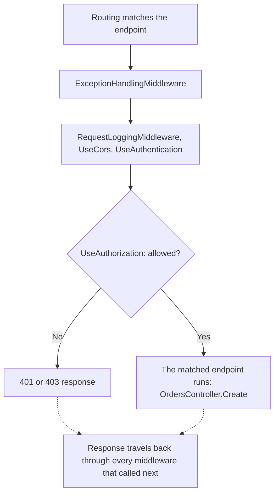

## Before you start

- [[backend.l1.hosting-and-program-cs]] — you know `app.MapControllers()` is one of several wiring calls between `Build()` and `Run()`; this lesson is about the calls next to it, and the order they run in.

## The situation

You send `POST /api/v1/orders` with no `Authorization` header and get back `401` almost at once. From the previous lesson you know `OrdersController.Create()` is the method behind that path, but nothing you add inside `Create()` ever seems to matter for this response — it comes back the same whether or not `Create()` even runs. A teammate says one of the wiring calls in `Program.cs` is what stopped the request, and that its position among the others is why. Which call, and what decides whether a request gets stopped there at all?

## Core concepts

- **middleware** — one step in the pipeline, the fixed sequence every request passes through, in the order its `app.Use...` call was registered; each step can run code both before and after the rest of the pipeline runs.
- **short-circuit (the pipeline)** — when a middleware stops calling the next step, usually after writing a response itself, so nothing registered after it in the pipeline runs for that request.
- pipeline order — the order the `app.Use...` calls appear in Program.cs, which is the order a request travels through them; `app.MapControllers()` registers endpoints, which are invoked only after every middleware has run.
- `[Authorize]` — a mark on a method saying it requires a signed-in caller; it is what `UseAuthorization` checks for.

## How it works



Before any of Đơn Hàng's own middleware runs, routing already works out which endpoint a request's path and method match — an automatic step with no line in `Program.cs`, and why a teammate can name `OrdersController.Create()` at all. In the situation above, the request never reaches that method because one of the middleware steps decided it could go no further first. That is a short-circuit: the middleware stops the request instead of calling the next step, so every step after it, including the already-matched endpoint, sees nothing.

Each `app.Use...` call in `Program.cs` registers one middleware, in the order a request meets them, top to bottom. Each step can act twice: once on the way in, before it calls the next step, and once on the way out, after that call returns. A step that only reads the request and always calls next uses just the top half of that shape; a step that also touches the response afterward uses the bottom half too. The endpoint itself, once reached, is terminal: it writes the response and calls nothing further, and that response travels back out through every middleware that did call `next`.

`UseAuthentication` works out who is asking; `UseAuthorization` decides what an already-identified caller may do, and is what can short-circuit here: for an endpoint marked `[Authorize]`, it stops the request instead of calling next when not allowed, and a `401` (or `403`) is written on its behalf. `RequestLoggingMiddleware`, registered earlier, already called `next` and is simply waiting for it to return — which is why it still logs the outcome, even though the endpoint never ran.

## In the Đơn Hàng system

The order of the wiring calls is not incidental; a comment above them says why:

```csharp file=DonHang.Api/Program.cs tag=stage-1 lines=64-74
// lesson: backend.l1.middleware-pipeline
// Order matters: exceptions caught first, then every request logged, then
// the terminal middleware (auth, routing) that decides how to answer it.
app.UseMiddleware<ExceptionHandlingMiddleware>();
app.UseMiddleware<RequestLoggingMiddleware>();
app.UseCors();
app.UseAuthentication();
app.UseAuthorization();
app.MapControllers();

app.Run();
```

`ExceptionHandlingMiddleware` is the first of Đơn Hàng's own middleware calls, so it can catch a failure from anything below it; `RequestLoggingMiddleware` comes next so it logs every request regardless of what happens later; `UseCors` (whether a browser page from another site may call this API) is not this lesson's subject, only its fixed position is; `UseAuthorization` comes last among them, because it is the last thing allowed to say no before an allowed request's endpoint runs. The comment's "auth, routing" names this whole last group — the routing it means is `app.MapControllers()` choosing which method to call, a later and different step from the automatic routing in "How it works" that first matched the endpoint. Moving `RequestLoggingMiddleware` below `UseAuthorization` would not just reorder two lines: a rejected request would then short-circuit before `RequestLoggingMiddleware` ever called `next`, so it would stop appearing in the log at all — exactly what Try it below checks for.

`RequestLoggingMiddleware` itself shows the before/after shape from "How it works". ASP.NET Core calls its `InvokeAsync` once for every request, passing an `HttpContext` — the request and the response bundled into one object — and `next`, a callable (a `RequestDelegate`) pointing at the rest of the pipeline:

```csharp file=DonHang.Api/Middleware/RequestLoggingMiddleware.cs tag=stage-1 lines=9-24
public sealed class RequestLoggingMiddleware(RequestDelegate next, ILogger<RequestLoggingMiddleware> logger)
{
    public async Task InvokeAsync(HttpContext context)
    {
        var stopwatch = Stopwatch.StartNew();
        await next(context);
        stopwatch.Stop();

        logger.LogInformation(
            "{Method} {Path} responded {StatusCode} in {ElapsedMs}ms",
            context.Request.Method,
            context.Request.Path,
            context.Response.StatusCode,
            stopwatch.ElapsedMilliseconds);
    }
}
```

Everything before `await next(context)` runs on the way in; everything after runs on the way out, once `next` has returned — however far it got. `context.Response.StatusCode` is read only in that second half, after the rest of the pipeline (including a short-circuit further down) has already decided it.

## Beginners often think…

- **"Middleware order in the code doesn't matter — ASP.NET Core figures out the right order to run things in."** → Actually your own `app.Use...` calls run in exactly the order you wrote them; ASP.NET Core never reorders them. You notice this when moving a line changes what a request experiences, as it would for `UseAuthorization`.
- **"Every middleware always calls the next one, so nothing can stop a request partway through the pipeline."** → Actually a middleware can short-circuit: write a response and return without calling next. You notice this every time an unauthenticated request gets `401` without ever reaching `OrdersController.Create()`.

## Try it (3 minutes)

1. With the lab running (`scripts/up.sh`), run `curl -i -X POST http://localhost:8080/api/v1/orders` with no `Authorization` header.
2. Run `docker compose logs api` and find the line for that request.

Expected result: curl prints `401`; the log line still reads `POST /api/v1/orders responded 401 in ...ms` — `RequestLoggingMiddleware` ran and logged the outcome even though `UseAuthorization` short-circuited the request before `OrdersController.Create()` ever ran.

<details><summary>Suggested answer</summary>

`RequestLoggingMiddleware` is registered before `UseAuthorization`, so it already called `next` and is only waiting for it to return; a short-circuit further down still counts as `next` returning, just earlier and with a `401` already written. Whatever the short-circuiting middleware stops the request short of — here, the endpoint `OrdersController.Create()` that routing had already matched — never runs at all.

</details>

## Connections

- [[backend.l1.hosting-and-program-cs]] — the wiring calls this lesson orders were only named as a group there.
- [[backend.l1.request-lifecycle]] — the full round trip, including the way back out through every middleware that did run.
- [[backend.l1.protecting-an-endpoint]] — the same `UseAuthorization` short-circuit, read from the angle of what `RequestLoggingMiddleware` records about a rejected request.

## Five-line summary

1. Middleware runs in the exact order its `app.Use...` calls are written in `Program.cs`; ASP.NET Core never reorders your own calls.
2. Each middleware can act before it calls the next step and again after that call returns, once the rest of the pipeline has run.
3. A middleware short-circuits by stopping instead of calling the next step, usually after writing a response itself; nothing after it then runs.
4. `UseAuthorization` short-circuits an unauthorized request before the endpoint routing already matched (`OrdersController.Create`) is ever invoked.
5. Middleware registered before a short-circuit still completes its own after-`next` work, since from its own view `next` simply returned.
