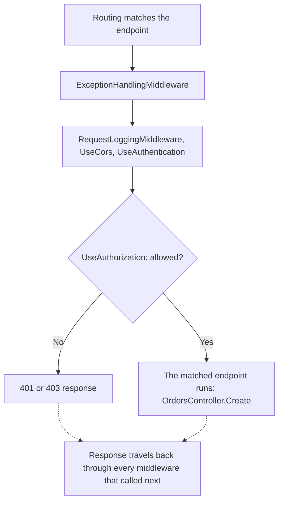

## Bạn cần biết trước

- [[backend.l1.hosting-and-program-cs]] — bạn biết `app.MapControllers()` là một trong mấy lời gọi nối dây nằm giữa `Build()` và `Run()`. Bài này nói về các lời gọi đứng cạnh nó, và thứ tự chúng chạy.

## Tình huống

Bạn gửi `POST /api/v1/orders` không kèm header `Authorization` và gần như nhận ngay `401`. Từ bài trước, bạn biết `OrdersController.Create()` là method đứng sau đường dẫn đó, nhưng thêm gì vào trong `Create()` cũng chẳng ảnh hưởng tới response này — nó trả về y hệt, dù `Create()` có chạy hay không. Một đồng nghiệp bảo rằng chính một lời gọi nối dây trong `Program.cs` đã chặn request lại, và vị trí của nó giữa các lời gọi khác là lý do. Đó là lời gọi nào, và điều gì quyết định một request có bị chặn ở đó hay không?

## Khái niệm cốt lõi

- **middleware** — một bước trong pipeline, tức chuỗi bước cố định mà mọi request đi qua, theo thứ tự lời gọi `app.Use...` của nó được đăng ký. Mỗi bước có thể chạy code cả trước lẫn sau khi phần còn lại của pipeline chạy.
- **short-circuit (the pipeline)** — khi một middleware thôi không gọi bước tiếp theo, thường là sau khi tự viết response, nên với request đó không có gì đăng ký sau nó trong pipeline được chạy.
- thứ tự pipeline — thứ tự các lời gọi `app.Use...` xuất hiện trong Program.cs, cũng là thứ tự request đi qua chúng. `app.MapControllers()` đăng ký các endpoint, và endpoint chỉ được gọi sau khi mọi middleware đã chạy.
- `[Authorize]` — dấu đặt trên một method, nói rằng method đó cần người gọi đã đăng nhập. Đây là thứ `UseAuthorization` kiểm tra.

## Cơ chế hoạt động



ASP.NET Core tự thêm một số bước của riêng nó, chẳng hạn routing bên dưới. Còn middleware "của Đơn Hàng" là các dòng `app.Use...` trong `Program.cs`. Trước khi bất kỳ dòng nào trong số đó chạy, một bước được thêm sẵn như vậy, routing, xác định đường dẫn và method của request khớp với endpoint nào. Trong tình huống trên, request không bao giờ tới được method đó vì một bước middleware đã chặn nó lại. Đó là short-circuit: middleware dừng lại thay vì gọi bước tiếp theo, nên mọi bước sau nó, kể cả endpoint đã khớp sẵn, không nhận được gì.

Mỗi lời gọi `app.Use...` trong `Program.cs` đăng ký một middleware, theo đúng thứ tự request gặp chúng, từ trên xuống. Mỗi bước có thể làm việc hai lần: một lần ở chiều vào, trước khi nó gọi bước tiếp theo, và một lần ở chiều ra, sau khi lời gọi đó trả về. Endpoint là điểm cuối: nó viết response và không gọi gì thêm. Response đó đi ngược ra qua mọi middleware đã thật sự gọi `next`, theo thứ tự ngược lại (các mũi tên nét đứt trong sơ đồ). Vì vậy middleware đăng ký đầu tiên (ở đây là `ExceptionHandlingMiddleware`) thường là cái xong việc sau cùng.

`UseAuthentication` xác định ai đang hỏi. Khi request không mang gì để đọc, nó không từ chối request mà để người gọi ở trạng thái chưa xác định, rồi gọi next. `UseAuthorization` quyết định người gọi đã được xác định được phép làm gì, và đây là bước có thể short-circuit ở đây: với một endpoint có đánh dấu `[Authorize]` — như `OrdersController.Create()` — nó chặn request lại thay vì gọi next khi không được phép. Câu trả lời là `401` khi chưa xác định được người gọi, như trong tình huống này, và `403` khi người gọi đã biết là ai nhưng không được phép. `RequestLoggingMiddleware`, đăng ký từ trước đó, đã gọi `next` và đang chờ nó trả về — vì thế nó vẫn ghi log kết quả, dù endpoint chưa hề chạy.

## Trong hệ thống Đơn Hàng

Thứ tự các lời gọi nối dây không phải ngẫu nhiên. Một comment phía trên chúng giải thích lý do:

```csharp file=DonHang.Api/Program.cs tag=stage-1 lines=64-74
// lesson: backend.l1.middleware-pipeline
// Order matters: exceptions caught first, then every request logged, then
// the terminal middleware (auth, routing) that decides how to answer it.
app.UseMiddleware<ExceptionHandlingMiddleware>();
app.UseMiddleware<RequestLoggingMiddleware>();
app.UseCors();
app.UseAuthentication();
app.UseAuthorization();
app.MapControllers();

app.Run();
```

Chữ "terminal" trong comment dùng khá lỏng: theo nghĩa của bài này, chỉ endpoint là điểm cuối, còn các bước auth chỉ chặn những request mà chúng từ chối. `ExceptionHandlingMiddleware` là lời gọi middleware đầu tiên của Đơn Hàng, nên nó bắt được lỗi từ bất cứ thứ gì bên dưới. Lỗi đó quay ra qua lời gọi `next` của nó, giống hệt một response. `RequestLoggingMiddleware` đứng kế tiếp, nên nó ghi log mọi request quay ra qua nó, kể cả request bị một middleware phía sau short-circuit. `UseCors` (một trang web từ site khác có được gọi server của Đơn Hàng hay không) không phải chủ đề của bài này, chỉ vị trí cố định của nó là đáng chú ý. `UseAuthorization` cần người gọi mà `UseAuthentication` đã xác định, nên nó phải đứng sau `UseAuthentication`, và vẫn phải đứng trước endpoint mà nó bảo vệ.

Cụm "auth, routing" trong comment chỉ cả nhóm cuối này. Trong comment, "routing" nghĩa là chạy endpoint mà `app.MapControllers()` đã đăng ký. Việc chọn endpoint nào đã xảy ra từ trước, ở bước routing riêng của ASP.NET Core.

Dời `RequestLoggingMiddleware` xuống dưới `UseAuthorization` không chỉ là đổi chỗ hai dòng: khi đó một request bị từ chối sẽ short-circuit trước khi `RequestLoggingMiddleware` kịp gọi `next`, nên nó sẽ biến mất khỏi log hoàn toàn — đúng điều mà phần Thử ngay bên dưới kiểm tra.

Chính `RequestLoggingMiddleware` cho thấy hình dạng trước/sau trong phần "Cơ chế hoạt động". ASP.NET Core tạo nó một lần, truyền vào constructor `next`, một thứ gọi được (một `RequestDelegate`) trỏ tới phần còn lại của pipeline, và một `logger` dùng để ghi output. Sau đó, với mỗi request, ASP.NET Core gọi `InvokeAsync`, method mà nó tìm theo đúng cái tên đó, và chỉ truyền vào `HttpContext` của request ấy — request và response gói chung trong một object:

```csharp file=DonHang.Api/Middleware/RequestLoggingMiddleware.cs tag=stage-1 lines=9-24
public sealed class RequestLoggingMiddleware(RequestDelegate next, ILogger<RequestLoggingMiddleware> logger)
{
    public async Task InvokeAsync(HttpContext context)
    {
        var stopwatch = Stopwatch.StartNew();
        await next(context);
        stopwatch.Stop();

        logger.LogInformation(
            "{Method} {Path} responded {StatusCode} in {ElapsedMs}ms",
            context.Request.Method,
            context.Request.Path,
            context.Response.StatusCode,
            stopwatch.ElapsedMilliseconds);
    }
}
```

Mọi thứ trước `await next(context)` chạy ở chiều vào. Mọi thứ sau đó chạy ở chiều ra, khi `next` đã trả về — dù request đi được tới đâu. `context.Response.StatusCode` chỉ được đọc ở nửa sau này, khi phần còn lại của pipeline (kể cả một short-circuit ở phía sau) đã quyết định xong. Sau đó `logger.LogInformation` ghi một dòng vào output của server (một dòng `info:` nêu tên class, rồi tới thông điệp), điền `{Method}`, `{Path}` và các chỗ còn lại bằng những giá trị liệt kê sau nó — output đó chính là thứ `docker compose logs api` hiện ra ở phần Thử ngay.

## Người mới hay nghĩ rằng…

- **"Thứ tự middleware trong code không quan trọng — ASP.NET Core tự tìm ra thứ tự đúng để chạy."** → Thực ra các lời gọi `app.Use...` của chính bạn chạy đúng theo thứ tự bạn viết, ASP.NET Core không bao giờ sắp xếp lại chúng. Bạn sẽ nhận ra khi dời một dòng làm thay đổi những gì một request trải qua, như khi dời `RequestLoggingMiddleware` xuống dưới `UseAuthorization`: các request bị từ chối sẽ biến mất khỏi log.
- **"Middleware nào cũng luôn gọi middleware tiếp theo, nên không gì chặn được request giữa chừng pipeline."** → Thực ra một middleware có thể short-circuit: viết response rồi trả về mà không gọi next. Bạn sẽ nhận ra mỗi lần một request chưa xác thực nhận `401` mà không hề tới được `OrdersController.Create()`.

## Thử ngay (3 phút)

1. Từ thư mục gốc của Đơn Hàng, khi Docker đang chạy và đã cài Flutter SDK (Docker khởi động các phần của Đơn Hàng trên máy bạn, Flutter SDK là bộ công cụ build app của Đơn Hàng trước khi app khởi động, và `scripts/up.sh` tự dùng cả hai cho bạn), khởi động lab bằng `scripts/up.sh` để chạy Đơn Hàng trên máy. Rồi chạy `curl -i -X POST http://localhost:8080/api/v1/orders` (`localhost` là chính máy của bạn) không kèm header `Authorization` (`curl` gửi request từ terminal, `-X POST` đặt method, `-i` in status line và header, nơi bạn sẽ thấy `401`).
2. Chạy `docker compose logs api` để xem phần `api` của lab đã in ra gì khi chạy, rồi tìm dòng của request đó. Vì sao dòng đó vẫn xuất hiện dù `Create()` chưa hề chạy?

Kết quả mong đợi: curl in ra `401`. Dòng log vẫn ghi `POST /api/v1/orders responded 401 in ...ms` — `RequestLoggingMiddleware` đã chạy và ghi log kết quả, dù `UseAuthorization` đã short-circuit request trước khi `OrdersController.Create()` kịp chạy.

<details><summary>Gợi ý đáp án</summary>

`RequestLoggingMiddleware` được đăng ký trước `UseAuthorization`, nên nó đã gọi `next` và chỉ đang chờ lời gọi đó trả về. Một short-circuit ở phía sau vẫn tính là `next` đã trả về, chỉ là sớm hơn và đã có sẵn `401`. Thứ mà middleware short-circuit chặn request lại trước khi tới — ở đây là endpoint `OrdersController.Create()` mà routing đã khớp sẵn — hoàn toàn không chạy.

</details>

## Liên hệ

- [[backend.l1.hosting-and-program-cs]] — các lời gọi nối dây mà bài này sắp thứ tự, ở bài đó chỉ được nhắc tên chung cả nhóm.
- [[backend.l1.request-lifecycle]] — trọn vòng đi và về, kể cả chặng quay ra qua mọi middleware đã chạy.
- [[backend.l1.protecting-an-endpoint]] — cùng cú short-circuit của `UseAuthorization`, nhìn từ góc những gì `RequestLoggingMiddleware` ghi lại về một request bị từ chối.

## Tóm tắt 5 dòng

1. Middleware chạy đúng theo thứ tự các lời gọi `app.Use...` được viết trong `Program.cs`, ASP.NET Core không bao giờ sắp xếp lại các lời gọi của bạn.
2. Mỗi middleware có thể làm việc trước khi gọi bước tiếp theo, và làm tiếp sau khi lời gọi đó trả về, lúc phần còn lại của pipeline đã chạy xong.
3. Một middleware short-circuit bằng cách dừng lại thay vì gọi bước tiếp theo, thường là sau khi tự viết response, khi đó không gì đứng sau nó được chạy.
4. `UseAuthorization` short-circuit một request không được phép trước khi endpoint mà routing đã khớp (`OrdersController.Create`) kịp được gọi.
5. Middleware đăng ký trước chỗ short-circuit vẫn làm xong phần việc sau `next` của mình, vì từ góc nhìn của nó, `next` chỉ đơn giản là đã trả về.
