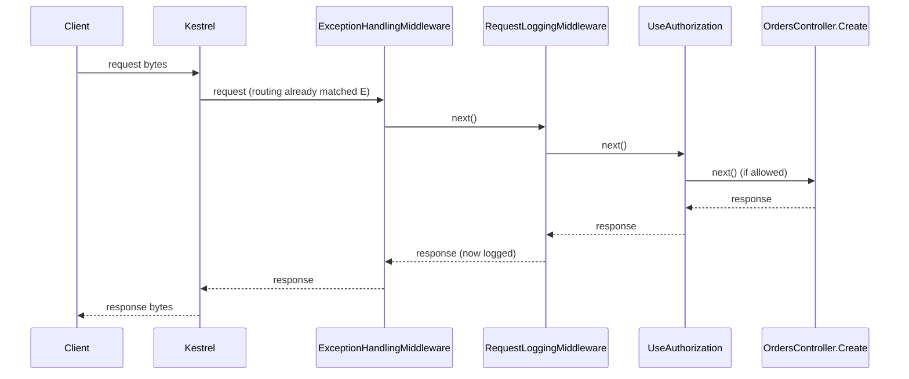

## Before you start

- [[backend.l1.middleware-pipeline]] — you know middleware runs in registration order and any of it can short-circuit; this lesson follows one request the whole way through, out as well as in.

## The situation

You can now recite the order `DonHang.Api/Program.cs` puts things in: exceptions, logging, CORS, `UseAuthentication`, `UseAuthorization`, then the endpoint. A teammate asks two questions you cannot yet answer from that list alone: when `RequestLoggingMiddleware` logs a `401` it never caused, has anything told it the request was rejected, or is it guessing? And when `UseAuthorization` rejects a request, does `ExceptionHandlingMiddleware` still see the response on its way out, or is it skipped along with the endpoint? What actually happens to a response between the moment it is decided and the moment the client receives it?

## Core concepts

- request lifecycle — the complete path one request takes: Kestrel, routing, every middleware in order, the endpoint (or a short-circuit), then back out through the same middleware in reverse.
- on the way in — the first half of each middleware's work, the code before its `next` call, which every middleware up to a short-circuit runs once, in registration order.
- on the way out — the second half of each middleware's work, the code after its `next` call, which runs once a response exists, whichever step produced it.

## How it works



The diagram skips `UseCors` and `UseAuthentication` to keep the shape visible; the full six-step order is in "In the Đơn Hàng system" below. For the requests this lesson covers, a request travels forward once: in through Kestrel, in through every middleware in registration order, then into the endpoint if nothing stopped it first. The response travels the same path backward, middleware by middleware, in the reverse of that order — the diagram's arrows going right are that forward trip; the arrows going left are the way out. `RequestLoggingMiddleware` is not guessing when it logs a status code: it is on the way out, its `next(context)` call has already returned because a response now exists — whether the endpoint produced it or a short-circuit further down did — and `context.Response.StatusCode` already holds the answer by the time its own code after `next` runs.

A short-circuit does not skip the way out; it only skips what comes after it on the way in. If `UseAuthorization` rejects a request, `ExceptionHandlingMiddleware` and `RequestLoggingMiddleware` — both registered before it — still run their after-`next` code, because from where they stand, `next` returned; a request that a middleware rejects still finishes the trip back through everything that ran before that middleware, including the exception handler.

## In the Đơn Hàng system

The whole trip is visible in one file, top to bottom:

```csharp file=DonHang.Api/Program.cs tag=stage-1 lines=64-74
// lesson: backend.l1.middleware-pipeline
// Order matters: exceptions caught first, then every request logged, then
// the terminal middleware (auth, routing) that decides how to answer it.
app.UseMiddleware<ExceptionHandlingMiddleware>();
app.UseMiddleware<RequestLoggingMiddleware>();
app.UseCors();
app.UseAuthentication();
app.UseAuthorization();
app.MapControllers();

app.Run();
```

Reading top to bottom names the forward order once: exception handling, logging, CORS, `UseAuthentication`, `UseAuthorization`, then whichever method routing matched. Nothing in this file spells out the reverse order — it does not need to, because the reverse order is always exactly this list backward, for every request, whether it reaches `app.MapControllers()` or stops one line earlier, at `UseAuthorization`. A `POST /api/v1/orders` with no `Authorization` header travels in only as far as `UseAuthorization`, but travels out through `RequestLoggingMiddleware` and `ExceptionHandlingMiddleware` regardless — confirmed by running the request against the stage-1 lab: it comes back `401`, and `docker compose logs api` still shows `RequestLoggingMiddleware`'s line for it.

## Beginners often think…

- **"The response leaves the app the moment the endpoint's code finishes, without passing back through the middleware that ran earlier."** → Actually the response travels back out through every middleware that called `next` on the way in, in reverse order, before Kestrel ever sends it. You notice this when `RequestLoggingMiddleware` reports a status code the endpoint decided several steps earlier.
- **"A request that a middleware rejects never reaches any of the app's own code at all, including the middleware after it."** → Actually "after it" is the part that never runs; middleware registered *before* the one that rejected the request still runs its own after-`next` code on the way back out. You notice this in the previous lesson's Try it, where a rejected request still gets logged.

## Try it (3 minutes)

1. With the lab running (`scripts/up.sh`), run `curl -i http://localhost:8080/api/v1/orders/999999` (a `GET` for an order that does not exist).
2. Run `docker compose logs api` and find the line for that request.

Expected result: curl prints `404`; the log line reads `GET /api/v1/orders/999999 responded 404 in ...ms`. Nothing about `OrdersController.Get`'s `404` was known to `RequestLoggingMiddleware` when the request went in — only on the way back out, once the endpoint had already decided, does the status code exist for it to log.

<details><summary>Suggested answer</summary>

`RequestLoggingMiddleware` reads `context.Response.StatusCode` after `await next(context)` returns, and by then the whole rest of the trip — routing, every later middleware, and `OrdersController.Get` itself — has already run and decided the answer. The middleware does not know or care whether that answer came from the endpoint or from an earlier short-circuit; it logs whatever is there once its own `next` call comes back.

</details>

## Connections

- [[backend.l1.middleware-pipeline]] — the forward order and the idea of short-circuiting, which this lesson extends with the trip back out.
- [[backend.l1.what-kestrel-does]] — inside `DonHang.Api` itself, Kestrel is both ends of this trip: the first thing that sees the request and the last thing that sees the response before it leaves the app (the stage-1 lab also puts Caddy in front of Kestrel, but that is outside this trip).
- [[backend.l1.errors-and-problem-details]] — the same reverse trip, read from the angle of what a middleware does with an error on the way back out.

## Five-line summary

1. A request travels forward once, through Kestrel, routing, every middleware in registration order, and then the endpoint if nothing stopped it first.
2. The response travels the same path backward, through every middleware that ran on the way in, in the reverse of that order.
3. A middleware's after-`next` code runs once a response exists, whichever step — the endpoint or a short-circuit — actually produced it.
4. A short-circuit skips everything registered after it on the way in, but not the way out for middleware registered before it.
5. Reading `Program.cs` top to bottom gives you the forward order for every request; the reverse order is always that same list backward.
