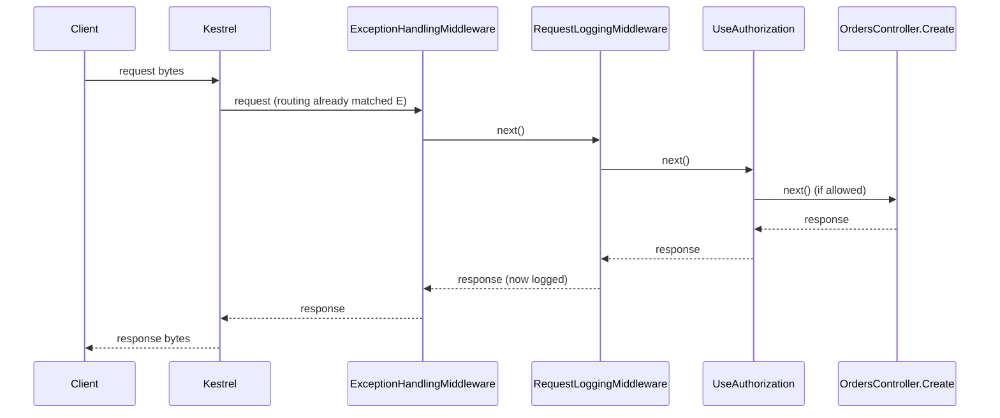

## Before you start

- [[backend.l1.middleware-pipeline]] — you know middleware runs in registration order and any of it can short-circuit; this lesson follows one request the whole way through, out as well as in.

## The situation

You can now recite the order `DonHang.Api/Program.cs` puts things in: exceptions, logging, `UseCors`, `UseAuthentication`, `UseAuthorization`, then the endpoint. A teammate points out that `RequestLoggingMiddleware` logs a `401` it never caused, and asks whether `ExceptionHandlingMiddleware` still gets its turn when `UseAuthorization` rejects the request before the endpoint. That list alone cannot answer either. In what order does the response pass back through these calls, and who sees it last before the client?

## Core concepts

- request lifecycle — the complete path one request takes: Kestrel, routing, every middleware in order, then the matched endpoint (or a short-circuit), then back out through the same middleware in reverse.
- routing — the automatic step that decides which endpoint a request's path and method match; it runs before any of the middleware registered in `Program.cs` and has no line of its own there.
- on the way in — the first half of each middleware's work, the code before its `next` call, which every middleware up to a short-circuit runs once, in registration order.
- on the way out — the second half of each middleware's work, the code after its `next` call, which runs once the endpoint or a short-circuit has produced a response.
- `context` — the `HttpContext` object each middleware is handed, holding both this one request and the response being built for it.

## How it works



The diagram skips `UseCors` and `UseAuthentication`; the full order is below. It uses `OrdersController.Create`; the same shape applies to `OrdersController.Get`, used in Try it below.

In this pipeline, a request travels forward once: Kestrel turns the incoming bytes into a request, routing matches it to an endpoint, then it passes through every middleware `Program.cs` registers, in registration order, into that endpoint if nothing stopped it first. Once the endpoint or a short-circuit produces a response, it travels the same path backward, middleware by middleware, in the reverse of that order — the diagram's arrows going right are that forward trip; the arrows going left are the way out. When `UseAuthorization` does not allow the request, the `Z->>E` arrow never happens, and the response arrow starts at `Z` instead of `E`, then travels back through `M2` and `M1` exactly the same way. Kestrel is what turns the response into bytes and sends them to the client.

`RequestLoggingMiddleware` is not guessing when it logs a status code: its own `next(context)` call has already returned, so a response now exists, whether the endpoint produced it or a short-circuit further down did. It reads `context.Response.StatusCode` only after that, on the way out — the answer is already there by the time its own code after `next` runs.

A short-circuit does not skip the way out; it only skips what comes after it on the way in. If `UseAuthorization` rejects a request, `ExceptionHandlingMiddleware` and `RequestLoggingMiddleware` — both registered before it — still get their own `next` call back, because from where they stand, `next` simply returned. `RequestLoggingMiddleware` then logs a line; `ExceptionHandlingMiddleware` does nothing, since there was no exception to catch.

## In the Đơn Hàng system

The whole trip is visible in one file, top to bottom:

```csharp file=DonHang.Api/Program.cs tag=stage-1 lines=65-74
// Order matters: exceptions caught first, then every request logged, then
// the terminal middleware (auth, routing) that decides how to answer it.
app.UseMiddleware<ExceptionHandlingMiddleware>();
app.UseMiddleware<RequestLoggingMiddleware>();
app.UseCors();
app.UseAuthentication();
app.UseAuthorization();
app.MapControllers();

app.Run();
```

The comment's "terminal middleware" means `UseAuthorization` here — the call that answers a `POST /api/v1/orders` with no `Authorization` header itself, with a `401`, instead of passing it on. The comment's "auth" is short for the pair `UseAuthentication` and `UseAuthorization`. As `DonHang.Api` is set up, `UseAuthentication` does not reject a request that has no `Authorization` header.

One more word in the comment: "routing" here is not the automatic matching from Core concepts, but `app.MapControllers()`, the line that registers the endpoints so one of them can run. It is not a step the response passes back through; the endpoint it registers is where the trip turns around.

Reading top to bottom names the forward order for these six calls: exception handling, logging, `UseCors`, `UseAuthentication`, `UseAuthorization`, then the matched endpoint. `UseCors` and `UseAuthentication` are only names holding positions in that list here — what each one does is not this lesson's subject. The final `app.Run();` line is not a step of the trip either — it is the call that runs the app, starting the server that then listens for connections, and blocks until the app shuts down.

Nothing in this file spells out the reverse order — it does not need to, because the reverse order of these six calls is always this list backward, for every request the endpoint or `UseAuthorization` answers, whether it reaches `app.MapControllers()` or stops one line earlier, at `UseAuthorization`. A `POST /api/v1/orders` with no `Authorization` header travels in only as far as `UseAuthorization`, but travels out through `RequestLoggingMiddleware` regardless — as you saw in the previous lesson's Try it — and past `ExceptionHandlingMiddleware` too, which simply has nothing to do when no exception was thrown.

## Beginners often think…

- **"The response leaves the app the moment the endpoint's code finishes, without passing back through the middleware that ran earlier."** → Actually the response travels back out through every middleware that called `next` on the way in, in reverse order. You notice this when `RequestLoggingMiddleware` reports a status code the endpoint decided several steps earlier.
- **"A request that a middleware rejects is dropped on the spot, so the middleware registered before it never gets its after-`next` turn."** → Actually only what is registered *after* it is skipped; middleware registered *before* the one that rejected the request still runs its own after-`next` code on the way back out. You notice this above, where a `POST /api/v1/orders` with no `Authorization` header still gets logged by `RequestLoggingMiddleware` even though `UseAuthorization` rejected it.

## Try it (3 minutes)

1. From the Đơn Hàng project's root folder, run `scripts/up.sh` to start the example system locally, then run `curl -i http://localhost:8080/api/v1/orders/999999` (`curl` sends a `GET` for an order that does not exist; `-i` prints the status code and headers too). Unlike creating an order, reading one needs no `Authorization` header here, so `UseAuthorization` lets this request through to `OrdersController.Get`. Any status code back means the example system is up; a connection error means it is not.
2. Run `docker compose logs api` — this prints what the `DonHang.Api` app has logged (the example system runs `DonHang.Api` under the name `api`), including `RequestLoggingMiddleware`'s lines — and find the line for that request.

Expected result: curl prints `404`; the log line reads `GET /api/v1/orders/999999 responded 404 in ...ms`. Nothing about `OrdersController.Get`'s `404` was known to `RequestLoggingMiddleware` when the request went in — only on the way back out, once the endpoint had already decided, does the status code exist for it to log.

Question: how could `RequestLoggingMiddleware` log a `404` it never decided, without knowing anything about orders?

<details><summary>Suggested answer</summary>

`RequestLoggingMiddleware` reads `context.Response.StatusCode` after `await next(context)` returns, and by then the whole rest of the trip — every later middleware and `OrdersController.Get` itself — has already run and decided the answer. (Routing had already matched the endpoint before this middleware ever ran, so it plays no part in what happens after `next`.) The middleware does not know or care whether that answer came from the endpoint or from an earlier short-circuit; it logs whatever is there once its own `next` call comes back.

</details>

## Connections

- [[backend.l1.middleware-pipeline]] — the forward order and the idea of short-circuiting, which this lesson extends with the trip back out.
- [[backend.l1.what-kestrel-does]] — inside `DonHang.Api` itself, Kestrel is both ends of this trip: the first thing that sees the request and the last thing that sees the response before it leaves the app.
- [[backend.l1.errors-and-problem-details]] — the same reverse trip, read from the angle of what a middleware does with an error on the way back out.

## Five-line summary

1. In this pipeline, a request travels forward once: through Kestrel, routing, every middleware in order, then the matched endpoint, if nothing stopped it first.
2. Once the endpoint or a short-circuit answers, the response travels back through every middleware that ran on the way in, in reverse order.
3. A middleware's after-`next` code runs once the endpoint or a short-circuit has produced a response.
4. A short-circuit skips everything registered after it on the way in, but not the way out for middleware registered before it.
5. Reading `Program.cs` top to bottom gives you the forward order for its own middleware; the reverse order is always that same list backward.
