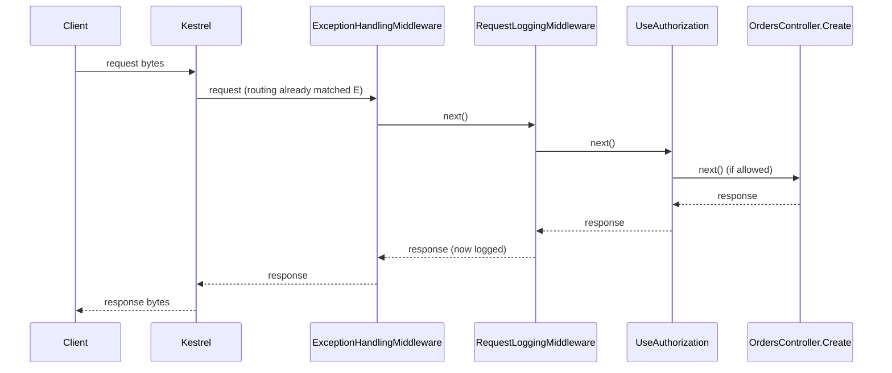

## Bạn cần biết trước

- [[backend.l1.middleware-pipeline]] — bạn biết middleware chạy theo thứ tự đăng ký và bất kỳ middleware nào cũng có thể short-circuit. Bài này đi theo một request suốt cả chặng, cả lúc vào lẫn lúc ra.

## Tình huống

Giờ bạn đã thuộc thứ tự `DonHang.Api/Program.cs` sắp xếp mọi thứ: exception, logging, `UseCors`, `UseAuthentication`, `UseAuthorization`, rồi đến endpoint. Một đồng nghiệp chỉ ra rằng `RequestLoggingMiddleware` ghi log một `401` mà nó không hề gây ra. Anh ấy còn hỏi: khi `UseAuthorization` từ chối request trước khi tới endpoint, `ExceptionHandlingMiddleware` có còn được tới lượt không? Chỉ riêng danh sách đó thì không trả lời được câu nào. Response đi ngược qua các lời gọi này theo thứ tự nào, và ai là người thấy nó cuối cùng trước khi tới client?

## Khái niệm cốt lõi

- vòng đời request (request lifecycle) — toàn bộ chặng đường của một request: Kestrel, routing, từng middleware theo thứ tự, rồi endpoint đã khớp (hoặc một short-circuit), rồi quay ra qua đúng các middleware đó theo thứ tự ngược lại.
- routing — bước tự động quyết định đường dẫn và method của request khớp với endpoint nào. Nó chạy trước mọi middleware đăng ký trong `Program.cs` và không có dòng riêng nào ở đó.
- lượt vào — nửa đầu công việc của mỗi middleware, tức phần code trước lời gọi `next`. Mọi middleware cho tới chỗ short-circuit đều chạy phần này đúng một lần, theo thứ tự đăng ký.
- lượt ra — nửa sau công việc của mỗi middleware, tức phần code sau lời gọi `next`. Phần này chạy khi endpoint hoặc một short-circuit đã tạo ra response.
- `context` — object `HttpContext` mà mỗi middleware nhận được, chứa cả request này lẫn response đang được dựng cho nó.

## Cơ chế hoạt động



Sơ đồ bỏ qua `UseCors` và `UseAuthentication`, thứ tự đầy đủ nằm ở phần dưới. Sơ đồ dùng `OrdersController.Create`, còn `OrdersController.Get` (dùng ở phần Thử ngay) cũng đi theo đúng hình dạng này.

Trong pipeline này, request đi tới đúng một lần. Kestrel biến các byte nhận được thành một request, routing khớp nó với một endpoint, rồi nó đi qua mọi middleware mà `Program.cs` đăng ký, theo thứ tự đăng ký, và vào endpoint đó nếu không có gì chặn lại trước. Khi endpoint hoặc một short-circuit đã tạo ra response, response đi ngược lại đúng con đường đó, qua từng middleware, theo thứ tự ngược lại — các mũi tên sang phải trong sơ đồ là chặng đi tới, các mũi tên sang trái là lượt ra. Khi `UseAuthorization` không cho request đi qua, mũi tên `Z->>E` không bao giờ xảy ra. Mũi tên response khi đó bắt đầu từ `Z` thay vì `E`, rồi đi ngược qua `M2` và `M1` y hệt như trước. Kestrel là thành phần biến response thành byte và gửi về client.

`RequestLoggingMiddleware` không đoán khi ghi log một status code. Lời gọi `next(context)` của chính nó đã trả về, nên response đã tồn tại, dù do endpoint tạo ra hay do một short-circuit ở phía sau. Nó chỉ đọc `context.Response.StatusCode` sau đó, ở lượt ra — lúc phần code sau `next` của nó chạy thì câu trả lời đã có sẵn.

Short-circuit không bỏ qua lượt ra. Nó chỉ bỏ qua những gì đứng sau nó ở lượt vào. Nếu `UseAuthorization` từ chối một request, `ExceptionHandlingMiddleware` và `RequestLoggingMiddleware` — cả hai đều đăng ký trước nó — vẫn nhận lại lời gọi `next` của mình, vì từ chỗ chúng đứng, `next` chỉ đơn giản là đã trả về. Sau đó `RequestLoggingMiddleware` ghi một dòng log, còn `ExceptionHandlingMiddleware` không làm gì, vì không có exception nào để bắt.

## Trong hệ thống Đơn Hàng

Toàn bộ chặng đường hiện ra trong một file, đọc từ trên xuống:

```csharp file=DonHang.Api/Program.cs tag=stage-1 lines=65-74
// Order matters: exceptions caught first, then every request logged, then
// the terminal middleware (auth, routing) that decides how to answer it.
app.UseMiddleware<ExceptionHandlingMiddleware>();
app.UseMiddleware<RequestLoggingMiddleware>();
app.UseCors();
app.UseAuthentication();
app.UseAuthorization();
app.MapControllers();

app.Run();
```

"terminal middleware" trong comment ở đây là `UseAuthorization` — lời gọi tự trả lời một `POST /api/v1/orders` không có header `Authorization` bằng một `401`, thay vì chuyển tiếp nó. Chữ "auth" trong comment là cách viết tắt cho cặp `UseAuthentication` và `UseAuthorization`. Với cách `DonHang.Api` đang được cấu hình, `UseAuthentication` không từ chối request thiếu header `Authorization`.

Thêm một chữ nữa trong comment: "routing" ở đây không phải bước khớp tự động trong phần Khái niệm cốt lõi, mà là `app.MapControllers()`, dòng đăng ký các endpoint để một trong số chúng có thể chạy. Response không đi ngược qua bước này. Endpoint mà nó đăng ký chính là nơi chặng đường quay đầu.

Đọc từ trên xuống cho bạn thứ tự đi tới của sáu lời gọi này: xử lý exception, logging, `UseCors`, `UseAuthentication`, `UseAuthorization`, rồi endpoint đã khớp. Ở đây `UseCors` và `UseAuthentication` chỉ là những cái tên giữ chỗ trong danh sách đó — mỗi cái làm gì không phải chủ đề của bài này. Dòng `app.Run();` cuối cùng cũng không phải một bước của chặng đường — đó là lời gọi chạy app, khởi động server để lắng nghe kết nối, và chặn lại cho tới khi app tắt.

File này không viết ra thứ tự ngược lại ở đâu cả — và cũng không cần. Với mọi request mà endpoint hoặc `UseAuthorization` trả lời, thứ tự ngược của sáu lời gọi này luôn là danh sách trên đọc từ dưới lên, dù request tới được `app.MapControllers()` hay dừng sớm hơn một dòng, ở `UseAuthorization`. Một `POST /api/v1/orders` không có header `Authorization` chỉ đi vào tới `UseAuthorization`, nhưng lúc ra vẫn đi qua `RequestLoggingMiddleware` — như bạn đã thấy ở phần Thử ngay của bài trước — và qua cả `ExceptionHandlingMiddleware`, middleware này đơn giản là không có gì để làm khi không có exception nào bị ném ra.

## Người mới hay nghĩ rằng…

- **"Response rời app ngay khi code của endpoint chạy xong, không đi ngược qua các middleware đã chạy trước đó."** → Thực ra response đi ngược ra qua mọi middleware đã gọi `next` ở lượt vào, theo thứ tự ngược lại. Bạn sẽ nhận ra khi `RequestLoggingMiddleware` báo một status code mà endpoint quyết định từ mấy bước trước.
- **"Request bị một middleware từ chối thì bị bỏ ngay tại chỗ, nên middleware đăng ký trước nó không bao giờ tới lượt chạy phần sau `next`."** → Thực ra chỉ những gì đăng ký *sau* nó mới bị bỏ qua. Middleware đăng ký *trước* middleware đã từ chối request vẫn chạy phần code sau `next` của mình ở lượt ra. Bạn sẽ nhận ra ở ví dụ phía trên: một `POST /api/v1/orders` không có header `Authorization` vẫn được `RequestLoggingMiddleware` ghi log, dù `UseAuthorization` đã từ chối nó.

## Thử ngay (3 phút)

1. Từ thư mục gốc của project Đơn Hàng, chạy `scripts/up.sh` để khởi động hệ thống ví dụ trên máy, rồi chạy `curl -i http://localhost:8080/api/v1/orders/999999` (`curl` gửi một `GET` cho một order không tồn tại, `-i` in thêm status code và header). Khác với tạo order, đọc order ở đây không cần header `Authorization`, nên `UseAuthorization` cho request này đi tiếp tới `OrdersController.Get`. Nhận về status code nào cũng có nghĩa hệ thống ví dụ đang chạy, còn lỗi kết nối nghĩa là chưa chạy.
2. Chạy `docker compose logs api` — lệnh này in ra những gì app `DonHang.Api` đã ghi log (hệ thống ví dụ chạy `DonHang.Api` dưới tên `api`), gồm cả các dòng của `RequestLoggingMiddleware` — rồi tìm dòng của request đó.

Kết quả mong đợi: curl in ra `404`, dòng log ghi `GET /api/v1/orders/999999 responded 404 in ...ms`. Lúc request đi vào, `RequestLoggingMiddleware` chưa biết gì về `404` của `OrdersController.Get`. Chỉ ở lượt ra, khi endpoint đã quyết định xong, mới có status code để nó ghi log.

Câu hỏi: làm sao `RequestLoggingMiddleware` ghi log được một `404` mà nó không hề quyết định, trong khi chẳng biết gì về order?

<details><summary>Gợi ý đáp án</summary>

`RequestLoggingMiddleware` đọc `context.Response.StatusCode` sau khi `await next(context)` trả về. Tới lúc đó, toàn bộ phần còn lại của chặng đường — mọi middleware phía sau và chính `OrdersController.Get` — đã chạy xong và quyết định câu trả lời. (Routing đã khớp endpoint từ trước khi middleware này chạy, nên nó không dính gì tới những gì xảy ra sau `next`.) Middleware không biết và cũng không quan tâm câu trả lời đến từ endpoint hay từ một short-circuit ở phía trước. Nó ghi log bất cứ thứ gì đang có khi lời gọi `next` của chính nó quay về.

</details>

## Liên hệ

- [[backend.l1.middleware-pipeline]] — thứ tự đi tới và ý tưởng short-circuit, bài này mở rộng thêm chặng quay ra.
- [[backend.l1.what-kestrel-does]] — bên trong chính `DonHang.Api`, Kestrel là cả hai đầu của chặng đường này: thứ đầu tiên thấy request và thứ cuối cùng thấy response trước khi nó rời app.
- [[backend.l1.errors-and-problem-details]] — cùng chặng quay ra đó, nhìn từ góc một middleware làm gì với lỗi trên đường ra.

## Tóm tắt 5 dòng

1. Trong pipeline này, request đi tới đúng một lần: qua Kestrel, routing, từng middleware theo thứ tự, rồi endpoint đã khớp, nếu không có gì chặn lại trước.
2. Khi endpoint hoặc một short-circuit đã trả lời, response đi ngược qua mọi middleware đã chạy ở lượt vào, theo thứ tự ngược lại.
3. Phần code sau `next` của một middleware chạy khi endpoint hoặc một short-circuit đã tạo ra response.
4. Short-circuit bỏ qua mọi thứ đăng ký sau nó ở lượt vào, nhưng không bỏ lượt ra của các middleware đăng ký trước nó.
5. Đọc `Program.cs` từ trên xuống cho bạn thứ tự đi tới của các middleware trong đó, còn thứ tự ngược lại luôn là chính danh sách đó đọc từ dưới lên.
