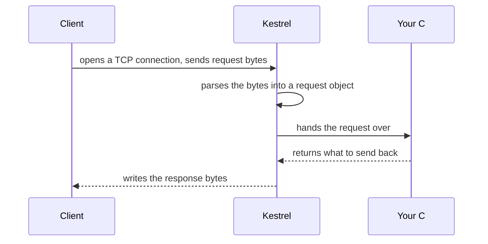

## Before you start

- [[foundation.l1.http-request-response]] — you know a request and a response are plain text with a fixed shape; this lesson is about what turns that text into a decision.
- [[foundation.l1.ip-and-ports]] — you know a process claims a port before anything can reach it; Kestrel, running inside the Đơn Hàng app process, is what will claim its port.

## The situation

You are ready to build the real C# code behind `/api/v1/orders`, but every POST there today gets the same fixed JSON back from Caddy, the web server running the lab, whose whole behaviour is written in one text file, `Caddyfile`. You open it and find a `respond` line with the JSON typed out literally — no C# anywhere. A teammate asks how your future ASP.NET Core code (the C# way of writing web apps in this course) will ever get a chance to run at all, since nothing running in the lab seems to call it. What actually stands between the network and the code you write?

## Core concepts

- **Kestrel** — the default web server for ASP.NET Core apps, the one Đơn Hàng will run on. It turns bytes arriving on a connection — a TCP connection for the HTTP/1.1 traffic in this course — into a request your C# code can read, and turns your code's decision back into response bytes.
- web server — a program that accepts network connections and decides what to send back; Caddy so far, and Kestrel from this lesson on, are both web servers, but they decide answers in very different ways.
- TCP connection — the two-way byte stream Kestrel accepts a request on, the same kind of connection an earlier lesson described.
- request handling — turning an accepted connection's bytes into something a program can act on; Kestrel does this part, and only this part.

## How it works



In the situation above, Caddy plays the role Kestrel will play once Đơn Hàng answers `/api/v1/orders` with C# code: it accepts the connection and decides what goes back. The difference is what happens in the middle. Caddy's decision is a line written into `Caddyfile`, a fixed string chosen before any request ever arrives. Kestrel's decision comes from a running C# program instead.

The diagram shows the shape of every request an ASP.NET Core app running on Kestrel answers, whatever the app does. The client opens a TCP connection to the port Kestrel is listening on and sends request bytes over it, the same first-line-then-headers-then-body shape an earlier lesson described. Kestrel parses those bytes: it does not care what a request means, only that it is well-formed HTTP; getting that shape right for every client that turns up is the work Kestrel exists to do.

Once parsed, Kestrel hands the request to your code — exactly what "your code" is here is the next lesson's subject. Your code inspects the request and decides what to send back; Kestrel takes that decision and writes it onto the same connection as response bytes, in the same shape a response always has.

Nothing in this diagram mentions paths, JSON, or Đơn Hàng specifically, and that is deliberate. Kestrel's job stops at accepting connections and producing request and response objects. It has no idea what `/api/v1/orders` should do; that decision belongs to code running on top of it, not to Kestrel itself.

## In the Đơn Hàng system

The stage-0 `Caddyfile` — stage-0 is the lab as it stands before any C# exists — shows exactly the kind of fixed answer Kestrel replaces. Two of its blocks respond with JSON typed directly into `Caddyfile`, the same string every time, regardless of what a client sent:

```caddyfile file=Caddyfile tag=stage-0 lines=36-44
		handle @postOrder {
			header Content-Type "application/json; charset=utf-8"
			header Location "/api/v1/orders/13"
			respond `{"id":13,"customer_id":1,"status":"new"}` 201
		}
		handle @getOrder {
			header Content-Type "application/json; charset=utf-8"
			respond `{"id":1,"customer_id":1,"status":"paid"}` 200
		}
```

`handle @postOrder` is the part Caddy uses when the request is a POST to `/api/v1/orders` (`handle @getOrder` works the same way, for `GET /api/v1/orders/1`); the `header` lines set response headers and `respond` sets the body and status. Both bodies here are literal strings typed into `Caddyfile`, so `respond` sends exactly that text back on every matching request.

A real `POST /api/v1/orders` should create a different order with a different id on every call; a real `GET /api/v1/orders/1` should read the current row from a database, not print `"status":"paid"` forever. Neither block here can do that — they are strings, not code. Once Kestrel and C# stand behind these paths, an incoming request reaches a C# method (how a request finds that method is the next lesson's subject) that runs fresh each time, reads whatever it needs, and decides its own answer.

## Beginners often think…

- **"Kestrel spreads requests across several machines for you."** → Actually Kestrel is the server inside one app process; it only handles the connections that arrive on its own port. You notice this when every request lands in the same single app process, because that is the only process listening on the port.
- **"Any program listening on a port serves HTTP the way Kestrel does, so Kestrel isn't doing anything special."** → Actually listening on a port only accepts a TCP connection; turning the bytes on it into a well-formed request object, and a decision back into well-formed response bytes, is the parsing work Kestrel exists to do. You notice this when a program you wrote yourself that only reads the bytes off the connection makes a real browser show a connection or protocol error instead of a page.
- **"Caddy runs your C# code the same way it sends back a file from disk."** → Actually Caddy's `respond` blocks are fixed strings written into `Caddyfile`; nothing about them executes a program per request. You notice this when the same `respond` answer comes back no matter what data changed underneath it.

## Try it (3 minutes)

1. With the stage-0 lab running (start it with `scripts/up.sh`), run `scripts/http/methods.sh` twice in a row.
2. Compare the `Location` line each run prints for `POST /api/v1/orders`.

Expected result: both runs print `Location: /api/v1/orders/13`, the identical id, even though a real "create an order" path would hand back a new id each time — nothing behind that path runs code yet.

<details><summary>Suggested answer</summary>

The id never changes because the response is not computed: it is copied verbatim from `Caddyfile` on every request, chosen before you ever sent one.

</details>

## Connections

- [[backend.l1.hosting-and-program-cs]] — the immediate next step: what "your code" in the diagram above actually is.
- [[management.l1.how-software-gets-made]] — the same shift from "a fixed setting describes the answer" to "code computes the answer," one level up from a single request.
- [[devops.l1.what-is-deploy]] — what actually runs Kestrel outside your laptop is a question this lesson leaves open.

## Five-line summary

1. Kestrel is the default web server for ASP.NET Core apps, turning connection bytes into a request object and a code decision into response bytes.
2. Caddy's stage-0 `respond` blocks answer as if real code were answering, always returning the same fixed string; a real Kestrel-backed app replaces that.
3. Kestrel itself decides nothing about what a request means: it only accepts connections and produces request and response objects for other code to use.
4. What that other code is, and how it gets a chance to run, is the next lesson's subject.
5. Serving HTTP the way Kestrel does is deliberate, non-trivial parsing work, not an automatic side effect of listening on a port.
