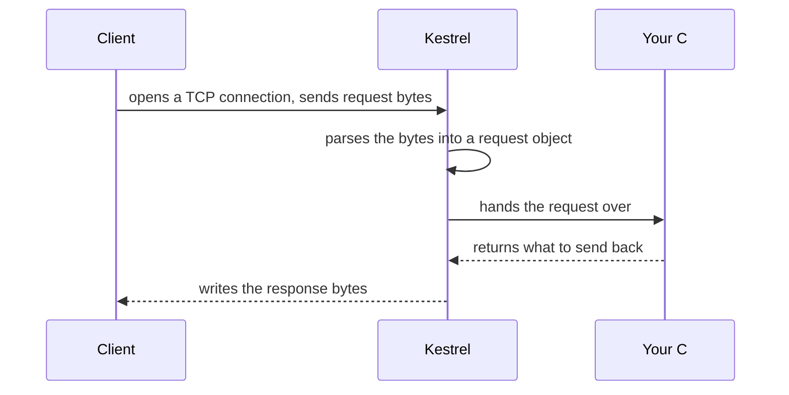

## Bạn cần biết trước

- [[foundation.l1.http-request-response]] — bạn đã biết request và response chỉ là văn bản thuần theo một khuôn cố định; bài này nói về thứ biến đoạn văn bản đó thành một quyết định.
- [[foundation.l1.ip-and-ports]] — bạn đã biết một process phải chiếm một port trước khi bất cứ thứ gì gọi tới được nó; Kestrel, chạy bên trong process của app Đơn Hàng, chính là thứ sẽ chiếm port đó.

## Tình huống

Bạn đã sẵn sàng viết code C# thật đứng sau `/api/v1/orders`, nhưng hiện giờ mọi POST tới đó đều nhận về cùng một đoạn JSON cố định từ Caddy, web server đang chạy bài lab. Toàn bộ hành vi của Caddy nằm trong một file văn bản, `Caddyfile`. Bạn mở nó ra và thấy một dòng `respond` với đoạn JSON gõ sẵn nguyên văn — không có chút C# nào. Một đồng nghiệp hỏi: trong một app ASP.NET Core (cách viết web app bằng C# trong khóa học này), thứ gì sẽ nhận request trước khi code của bạn thấy nó, khi mà chẳng có gì đang chạy trong lab có vẻ gọi tới C# cả? Thực sự thì cái gì đứng giữa mạng và code bạn viết?

## Khái niệm cốt lõi

- **Kestrel** (web server tích hợp trong ASP.NET Core, nhận kết nối TCP và tạo request/response cho code của bạn xử lý) — web server mặc định của app ASP.NET Core, cũng là server mà Đơn Hàng sẽ chạy trên đó. Nó biến các byte đến trên một kết nối — với lưu lượng HTTP/1.1 trong khóa học này là một kết nối TCP — thành một request mà code C# đọc được, rồi biến quyết định của code thành byte của response.
- web server — chương trình nhận kết nối mạng và gửi câu trả lời về. Caddy từ đầu tới giờ, và Kestrel kể từ bài này, đều là web server, nhưng câu trả lời của chúng đến từ hai nơi rất khác nhau.
- kết nối TCP — luồng byte hai chiều mà Kestrel nhận request qua đó, cùng loại kết nối mà một bài trước đã mô tả.

## Cơ chế hoạt động



Trong tình huống trên, Caddy đang đóng đúng vai mà Kestrel sẽ đóng khi Đơn Hàng trả lời `/api/v1/orders` bằng code C#: nhận kết nối và gửi câu trả lời về. Khác biệt nằm ở khúc giữa. Quyết định của Caddy là một dòng viết trong `Caddyfile`, một chuỗi cố định được chọn từ trước khi có request nào đến. Đứng sau Kestrel, quyết định lại đến từ một chương trình C# đang chạy. Caddy có còn ở lại lab khi Kestrel xuất hiện hay không là câu hỏi của một bài sau. Bài này chỉ xem Kestrel làm gì bên trong process của app.

Sơ đồ cho thấy hình dạng của mọi request mà một app ASP.NET Core chạy trên Kestrel trả lời. Client mở một kết nối TCP tới port mà Kestrel đang lắng nghe và gửi byte của request qua đó, theo đúng khuôn dòng đầu, rồi header, rồi body mà một bài trước đã mô tả. Kestrel phân tích các byte đó: nó không quan tâm request mang ý nghĩa gì, chỉ cần đó là HTTP đúng khuôn.

Phân tích xong, Kestrel chuyển request cho code của bạn — "code của bạn" ở đây chính xác là gì thì bài kế tiếp sẽ nói. Code xem request và quyết định gửi gì về. Kestrel nhận quyết định đó và ghi nó lên chính kết nối ấy dưới dạng byte của response, theo đúng khuôn mà response nào cũng có.

Sơ đồ không nhắc gì tới đường dẫn, JSON hay riêng Đơn Hàng, và đó là có chủ ý. Phần việc của Kestrel dừng lại ở chỗ nhận kết nối, biến byte thành request và biến câu trả lời của code thành byte của response. Kestrel không hề biết `/api/v1/orders` phải làm gì. Quyết định đó thuộc về code chạy bên trên nó, không thuộc về bản thân Kestrel.

## Trong hệ thống Đơn Hàng

`Caddyfile` ở stage-0 — stage-0 là lab ở trạng thái trước khi có dòng C# nào — cho thấy đúng loại câu trả lời cố định mà code C# đứng sau Kestrel sẽ thay thế. Hai khối trong đó trả về JSON gõ thẳng vào `Caddyfile`, lần nào cũng cùng một chuỗi, bất kể client gửi gì:

```caddyfile file=Caddyfile tag=stage-0 lines=36-44
		handle @postOrder {
			header Content-Type "application/json; charset=utf-8"
			header Location "/api/v1/orders/13"
			respond `{"id":13,"customer_id":1,"status":"new"}` 201
		}
		handle @getOrder {
			header Content-Type "application/json; charset=utf-8"
			respond `{"id":1,"customer_id":1,"status":"paid"}` 200
		}
```

`handle @postOrder` là phần Caddy dùng cho một POST tới `/api/v1/orders`, một cái tên được định nghĩa vài dòng phía trên trong `Caddyfile`. `handle @getOrder` làm điều tương tự cho `GET /api/v1/orders/1`. Các dòng `header` đặt header cho response. `Location` cho client biết đơn hàng vừa tạo nằm ở đâu, nên nó mang id mới. `respond` đặt body và status. Cả hai body ở đây đều là chuỗi gõ sẵn trong `Caddyfile`, nên `respond` gửi về đúng đoạn văn bản đó cho mọi request khớp.

Một `POST /api/v1/orders` thật phải tạo một đơn hàng khác, với id khác, sau mỗi lần gọi. Một `GET /api/v1/orders/1` thật phải đọc dòng hiện tại từ database, chứ không in `"status":"paid"` mãi mãi. Không khối nào ở đây làm được điều đó — chúng là chuỗi, không phải code. Khi Kestrel và C# đứng sau các đường dẫn này, request gửi đến sẽ tới một method C# (request tìm đến method đó bằng cách nào là chủ đề của bài kế tiếp). Method đó chạy lại từ đầu mỗi lần, đọc những gì nó cần và tự quyết định câu trả lời.

## Người mới hay nghĩ rằng…

- **"Kestrel tự chia request ra nhiều máy giúp bạn."** → Thực ra Kestrel là server nằm bên trong một process của app. Nó chỉ xử lý những kết nối đến trên port của chính nó. Bạn sẽ nhận ra khi dừng process đó và mọi request tới port của nó đồng loạt thất bại.
- **"Chương trình nào lắng nghe trên một port cũng phục vụ HTTP giống Kestrel, nên Kestrel chẳng làm gì đặc biệt."** → Thực ra lắng nghe trên một port chỉ giúp nhận kết nối TCP. Biến byte trên kết nối đó thành một đối tượng request đúng khuôn, và biến quyết định của code thành byte response đúng khuôn, là phần việc phân tích mà Kestrel sinh ra để làm. Bạn sẽ nhận ra khi tự viết một chương trình chỉ đọc byte từ kết nối rồi đóng lại mà không ghi gì về: curl (chương trình dòng lệnh gửi request và in câu trả lời) báo "Empty reply from server" thay vì in ra một response.
- **"Caddy chạy code C# giúp bạn."** → Thực ra các khối `respond` của Caddy là chuỗi cố định viết trong `Caddyfile`, không có gì trong đó chạy một chương trình cho mỗi request. Bạn sẽ nhận ra khi gửi cùng một POST hai lần và nhận về cùng một id.

## Thử ngay (3 phút)

1. Khi lab stage-0 đang chạy (khởi động bằng `scripts/up.sh`), chạy `scripts/http/methods.sh` hai lần liên tiếp.
2. So sánh dòng `Location` mà mỗi lần chạy in ra cho `POST /api/v1/orders`.

Kết quả mong đợi: cả hai lần đều in `Location: /api/v1/orders/13`, cùng một id, dù một đường dẫn "tạo đơn hàng" thật sẽ trả về id mới mỗi lần — phía sau đường dẫn đó chưa có code nào chạy.

<details><summary>Gợi ý đáp án</summary>

Id không bao giờ đổi vì response không được tính ra: nó được chép nguyên văn từ `Caddyfile` cho mọi request, và đã được chọn từ trước khi bạn gửi request nào.

</details>

## Liên hệ

- [[backend.l1.hosting-and-program-cs]] — bước ngay sau: "code của bạn" trong sơ đồ trên thực chất là gì.
- [[management.l1.how-software-gets-made]] — cùng một sự chuyển dịch từ "một thiết lập cố định mô tả câu trả lời" sang "code tính ra câu trả lời", ở tầng cao hơn một request đơn lẻ.
- [[devops.l1.what-is-deploy]] — thứ gì thực sự chạy Kestrel bên ngoài laptop của bạn là câu hỏi mà bài này để ngỏ.

## Tóm tắt 5 dòng

1. Kestrel là web server mặc định của app ASP.NET Core, biến byte trên kết nối thành đối tượng request và biến quyết định của code thành byte response.
2. Các khối `respond` của Caddy ở stage-0 trả lời như thể có code thật đang trả lời, nhưng luôn trả về cùng một chuỗi cố định. Một app thật chạy trên Kestrel sẽ thay thế điều đó.
3. Kestrel không quyết định gì về ý nghĩa của request: nó chỉ nhận kết nối, biến byte thành request và biến câu trả lời của code thành byte response.
4. Đoạn code kia là gì, và nó có cơ hội chạy bằng cách nào, là chủ đề của bài kế tiếp.
5. Phục vụ HTTP như Kestrel là phần việc phân tích có chủ đích và không hề đơn giản, không phải thứ tự động có được chỉ nhờ lắng nghe trên một port.
