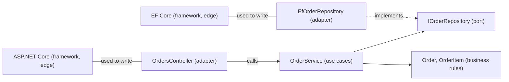

## Before you start

- [[design.l2.driving-and-driven-adapters]] — you know controllers and tests are driving adapters, and repositories and notifiers are driven adapters, all outside the core.
- [[design.l1.why-layers]] — you know a layer groups classes by concern, and that Đơn Hàng's API splits into `DonHang.Api`, `DonHang.Domain` and `DonHang.Infrastructure`.

## The situation

A new teammate asks which architecture Đơn Hàng follows. One colleague answers "layered": three projects, `DonHang.Api`, `DonHang.Domain` and `DonHang.Infrastructure`. Another says "hexagonal": `OrderService` reaches the outside only through its ports. A third says "Clean Architecture", and the new teammate objects that Clean Architecture draws four rings, so Đơn Hàng would need four projects. Three names, three projects, four rings, and each colleague sounds sure. Are these three different designs, and which one describes Đơn Hàng?

## Core concepts

- **Clean Architecture** — a design that draws a system as rings: business rules at the centre, then use cases, then adapters, then frameworks and the database at the edge.
- **use case** — one thing the application does for its user, together with the rules for doing it; in the situation above, placing an order is one.
- ring — one circle of that drawing; the further in a ring sits, the less it knows about the rings around it.

## How it works



The rings run from the edge, on the left, to the centre, on the right. In Đơn Hàng, the centre holds `Order` and `OrderItem`: what an ordering business is about, whatever application uses it. The next ring holds the use cases: `PlaceOrderAsync` and `CancelOrderAsync` in `OrderService`, each one thing Đơn Hàng does for a customer. The ports `IOrderRepository` and `INotifier` belong to the core: they are declared in `DonHang.Domain`, because the use cases are the code that needs them. Around them sit the adapters, driving and driven, in `DonHang.Api` and `DonHang.Infrastructure`. At the edge are the frameworks and the database themselves: ASP.NET Core, EF Core and PostgreSQL.

Solid arrows show which code names which, the dotted arrow means "implements", and the plain lines mean "used to write". Clean Architecture's central rule is the dependency rule you already know: nothing in the two inner rings names an adapter or an edge framework such as ASP.NET Core or EF Core. Adapters are the code written with the frameworks, so they are the one place that names them. `OrderService` names `Order` and the ports, but no controller, no repository class and no EF Core type. That is the direction hexagonal architecture keeps between the core and its adapters; Clean Architecture draws that core as two rings instead of one.

So the three names describe related designs. All three keep HTTP, business rules and data access apart. Classic layering lets the business layer depend on the data-access layer below it. Hexagonal and Clean turn that arrow around: data access depends on the rules, through a port the rules declare.

The rings describe directions, not a count of projects: `Order` and `OrderService` share `DonHang.Domain`, while controllers sit in `DonHang.Api` and repositories in `DonHang.Infrastructure`.

## In the Đơn Hàng system

A use case, `PlaceOrderAsync`:

```csharp file=DonHang.Domain/OrderService.cs tag=stage-1 lines=6-23
public sealed class OrderService(IOrderRepository repository, INotifier notifier)
{
    public async Task<Order> PlaceOrderAsync(int customerId, List<OrderItem> items)
    {
        if (items.Count == 0) throw new ArgumentException("an order needs at least one item");

        var order = new Order
        {
            CustomerId = customerId,
            PlacedAt = DateTimeOffset.UtcNow,
            Status = "new",
            Items = items,
        };
        await repository.AddAsync(order);
        await repository.SaveChangesAsync();
        notifier.Send(order.Id, "order placed");
        return order;
    }
```

This method is one thing Đơn Hàng does for a customer, with its rule: an order needs at least one item. It builds an `Order` from the centre ring and hands the saving and the message to its two ports. Nothing in it names HTTP, a table or a log. `CancelOrderAsync`, below it in the same class, is the second use case.

The project that holds both inner rings:

```xml file=DonHang.Domain/DonHang.Domain.csproj tag=stage-1 lines=1-10
<Project Sdk="Microsoft.NET.Sdk">

  <PropertyGroup>
    <TargetFramework>net10.0</TargetFramework>
    <ImplicitUsings>enable</ImplicitUsings>
    <Nullable>enable</Nullable>
    <RootNamespace>DonHang.Domain</RootNamespace>
  </PropertyGroup>

</Project>
```

There is no `ProjectReference` and no `PackageReference`. The business rules and the use cases live together in `DonHang.Domain`, and neither can name anything in the outer rings, because the project references no other project and no package. It sees only the .NET base library, which any ring may use and which is not one of the edge frameworks. `DonHang.Api.csproj`, by contrast, references both other projects and the ASP.NET Core JWT package: it sits on the outside.

## Beginners often think…

- **"Clean Architecture and hexagonal architecture are rival designs, so a project has to pick one."** → Actually both keep the same direction: nothing in the core names an adapter. Hexagonal's words are about the edge of the core, ports and adapters; Clean Architecture adds names for the rings inside the core, business rules and use cases. Đơn Hàng fits both descriptions at once. You notice the confusion when a team argues "hexagonal or Clean" about Đơn Hàng: the question that decides both, whether `DonHang.Domain` names any adapter, ASP.NET Core or EF Core, has one answer.
- **"Following Clean Architecture means one project per ring."** → Actually the rule is about which code names which. A project boundary is one way to make the compiler check it, not a requirement: `Order` and `OrderService` share `DonHang.Domain`, and `OrderService` still depends only inward. You notice the belief when a design proposal adds a near-empty project per ring and nobody can say which dependency the new boundary prevents.
- **"`DonHang.Api`, `DonHang.Domain` and `DonHang.Infrastructure` are three layers, so Đơn Hàng is just a classic layered design."** → Actually the projects look like layers, but one arrow is reversed. In classic layering the business layer references the data layer; here `DonHang.Infrastructure` references `DonHang.Domain`, and `DonHang.Domain` references nothing. You notice it when you open `DonHang.Domain.csproj` to find the reference to the data project, and there is none.

## Try it (3 minutes)

This is a thinking exercise; keep the diagram above and the text under it in view.

1. Place each of these on a ring: `Order`, `CancelOrderAsync`, `LoggingNotifier`, `OrdersController`, PostgreSQL.
2. Next to each, write the project it lives in, or "none" if it is not Đơn Hàng code.

Expected result: four rings, but only three projects, and one project appears on two rings.

<details><summary>Suggested answer</summary>

`Order` sits at the centre, in `DonHang.Domain`. `CancelOrderAsync` is a use case, also in `DonHang.Domain`. `LoggingNotifier` is a driven adapter in `DonHang.Infrastructure`, and `OrdersController` a driving adapter in `DonHang.Api`. PostgreSQL is at the edge and is not Đơn Hàng code. `DonHang.Domain` holds two rings, and the dependency rule still holds, because nothing in it names anything further out.

</details>

## Connections

- [[design.l2.driving-and-driven-adapters]] — the adapters ring of this lesson, split into the side that calls in and the side that is called.
- [[design.l1.why-layers]] — the layered design this lesson compares against: the same three concerns, with one arrow reversed.
- [[design.l2.dependency-rule]] — Clean Architecture's central rule, which you met first under its own name.
- [[design.l2.unit-of-work]] — the next lesson: how a use case decides when its changes are saved.

## Five-line summary

1. Clean Architecture draws rings: business rules, use cases, adapters, frameworks; nothing in the inner rings names anything further out.
2. A use case is one thing the application does for its user, with its rules; `PlaceOrderAsync` and `CancelOrderAsync` are Đơn Hàng's.
3. Its central rule is the dependency rule, the same direction hexagonal architecture keeps between the core and its adapters.
4. Layered, hexagonal and Clean all separate HTTP, rules and data; only layering lets business code depend on data access.
5. Rings count directions, not projects: `Order` and `OrderService` share `DonHang.Domain`, and the rule still holds.
