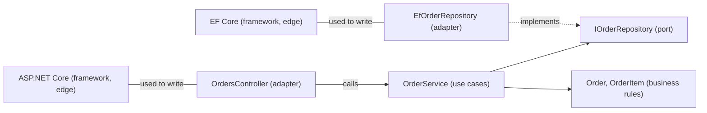

## Bạn cần biết trước

- [[design.l2.driving-and-driven-adapters]] — bạn biết controller và test là driving adapter, còn repository và notifier là driven adapter, tất cả đều nằm ngoài lõi.
- [[design.l1.why-layers]] — bạn biết một tầng gom các class theo mối quan tâm, và API của Đơn Hàng được chia thành `DonHang.Api`, `DonHang.Domain` và `DonHang.Infrastructure`.

## Tình huống

Một đồng đội mới hỏi Đơn Hàng theo kiến trúc nào. Một người trả lời "phân tầng": ba project, `DonHang.Api`, `DonHang.Domain` và `DonHang.Infrastructure`. Người thứ hai nói "hexagonal": `OrderService` chỉ chạm ra bên ngoài qua các port của nó. Người thứ ba nói "Clean Architecture", và người mới phản bác rằng Clean Architecture vẽ bốn vòng, nên Đơn Hàng phải có bốn project. Ba cái tên, ba project, bốn vòng, và ai cũng nói rất chắc. Đây có phải ba thiết kế khác nhau không, và cái nào mô tả đúng Đơn Hàng?

## Khái niệm cốt lõi

- **Clean Architecture** (kiến trúc vẽ hệ thống thành các vòng, nghiệp vụ ở giữa, framework và DB ở ngoài; phụ thuộc chỉ hướng vào trong) — một thiết kế vẽ hệ thống thành các vòng: quy tắc nghiệp vụ ở trung tâm, rồi tới use case, rồi adapter, rồi framework và database ở rìa.
- **use case** (một việc ứng dụng làm cho người dùng, cùng các quy tắc để làm việc đó, như đặt đơn hay hủy đơn) — một việc ứng dụng làm cho người dùng, kèm các quy tắc để làm việc đó. Trong tình huống trên, đặt đơn là một use case.
- vòng — một vòng tròn trong hình vẽ đó. Vòng càng nằm sâu bên trong thì càng biết ít về các vòng bao quanh nó.

## Cơ chế hoạt động



Các vòng đi từ rìa, bên trái, vào trung tâm, bên phải. Trong Đơn Hàng, trung tâm giữ `Order` và `OrderItem`: những thứ mà việc kinh doanh bán hàng xoay quanh, bất kể ứng dụng nào dùng chúng. Vòng kế tiếp giữ các use case: `PlaceOrderAsync` và `CancelOrderAsync` trong `OrderService`, mỗi cái là một việc Đơn Hàng làm cho khách. Các port `IOrderRepository` và `INotifier` thuộc về lõi: chúng được khai báo trong `DonHang.Domain`, vì use case chính là phần code cần chúng. Bao quanh là các adapter, cả driving lẫn driven, nằm trong `DonHang.Api` và `DonHang.Infrastructure`. Ở rìa là chính các framework và database: ASP.NET Core, EF Core và PostgreSQL.

Mũi tên liền cho biết code nào gọi tên code nào, mũi tên chấm nghĩa là "cài đặt", còn các đường không mũi tên nghĩa là "được dùng để viết". Quy tắc trung tâm của Clean Architecture chính là dependency rule bạn đã biết: không gì trong hai vòng bên trong gọi tên một adapter hay một framework ở rìa như ASP.NET Core hoặc EF Core. Adapter là phần code được viết bằng các framework, nên chúng là nơi duy nhất gọi tên framework. `OrderService` gọi tên `Order` và các port, nhưng không gọi tên controller, class repository hay kiểu nào của EF Core. Đó là chiều mà hexagonal architecture giữ giữa lõi và các adapter của nó. Clean Architecture chỉ vẽ lõi đó thành hai vòng thay vì một.

Vậy ba cái tên mô tả những thiết kế có họ hàng với nhau. Cả ba đều tách riêng HTTP, quy tắc nghiệp vụ và phần truy cập dữ liệu. Phân tầng cổ điển để tầng nghiệp vụ phụ thuộc vào tầng truy cập dữ liệu nằm dưới nó. Hexagonal và Clean đảo chiều mũi tên đó: phần truy cập dữ liệu phụ thuộc vào quy tắc, qua một port do chính quy tắc khai báo.

Các vòng mô tả chiều phụ thuộc, không phải số project: `Order` và `OrderService` dùng chung `DonHang.Domain`, trong khi controller nằm trong `DonHang.Api` và repository nằm trong `DonHang.Infrastructure`.

## Trong hệ thống Đơn Hàng

Một use case, `PlaceOrderAsync`:

```csharp file=DonHang.Domain/OrderService.cs tag=stage-1 lines=6-23
public sealed class OrderService(IOrderRepository repository, INotifier notifier)
{
    public async Task<Order> PlaceOrderAsync(int customerId, List<OrderItem> items)
    {
        if (items.Count == 0) throw new ArgumentException("an order needs at least one item");

        var order = new Order
        {
            CustomerId = customerId,
            PlacedAt = DateTimeOffset.UtcNow,
            Status = "new",
            Items = items,
        };
        await repository.AddAsync(order);
        await repository.SaveChangesAsync();
        notifier.Send(order.Id, "order placed");
        return order;
    }
```

Phương thức này là một việc Đơn Hàng làm cho khách, kèm quy tắc của nó: một đơn phải có ít nhất một sản phẩm. Nó dựng một `Order` thuộc vòng trung tâm, rồi giao phần lưu và phần gửi thông báo cho hai port. Không chỗ nào trong đó gọi tên HTTP, bảng hay log. `CancelOrderAsync`, nằm bên dưới trong cùng class, là use case thứ hai.

Project chứa cả hai vòng bên trong:

```xml file=DonHang.Domain/DonHang.Domain.csproj tag=stage-1 lines=1-10
<Project Sdk="Microsoft.NET.Sdk">

  <PropertyGroup>
    <TargetFramework>net10.0</TargetFramework>
    <ImplicitUsings>enable</ImplicitUsings>
    <Nullable>enable</Nullable>
    <RootNamespace>DonHang.Domain</RootNamespace>
  </PropertyGroup>

</Project>
```

Không có `ProjectReference` nào, cũng không có `PackageReference` nào. Quy tắc nghiệp vụ và use case sống chung trong `DonHang.Domain`, và không cái nào gọi tên được thứ gì ở các vòng ngoài, vì project này không tham chiếu project hay package nào. Nó chỉ thấy thư viện nền của .NET, thứ mà vòng nào cũng được dùng và không phải một framework ở rìa. Ngược lại, `DonHang.Api.csproj` tham chiếu cả hai project còn lại và package JWT của ASP.NET Core: nó nằm ở phía ngoài.

## Người mới hay nghĩ rằng…

- **"Clean Architecture và hexagonal architecture là hai thiết kế đối đầu, nên một dự án phải chọn một."** → Thực ra cả hai giữ cùng một chiều: không gì trong lõi gọi tên adapter. Từ ngữ của hexagonal nói về phần rìa của lõi, tức port và adapter. Clean Architecture thêm tên cho các vòng bên trong lõi, tức quy tắc nghiệp vụ và use case. Đơn Hàng khớp với cả hai cách mô tả cùng lúc. Bạn sẽ nhận ra sự nhầm lẫn khi một team tranh cãi "hexagonal hay Clean" về Đơn Hàng, trong khi câu hỏi quyết định cả hai, `DonHang.Domain` có gọi tên adapter nào, ASP.NET Core hay EF Core không, chỉ có một câu trả lời.
- **"Theo Clean Architecture nghĩa là mỗi vòng một project."** → Thực ra quy tắc nói về chuyện code nào gọi tên code nào. Ranh giới project là một trong những cách để compiler kiểm tra quy tắc đó, không phải điều bắt buộc: `Order` và `OrderService` dùng chung `DonHang.Domain`, và `OrderService` vẫn chỉ phụ thuộc vào trong. Bạn sẽ nhận ra niềm tin này khi một đề xuất thiết kế thêm cho mỗi vòng một project gần như rỗng, và không ai nói được ranh giới mới chặn phụ thuộc nào.
- **"`DonHang.Api`, `DonHang.Domain` và `DonHang.Infrastructure` là ba tầng, nên Đơn Hàng chỉ là một thiết kế phân tầng cổ điển."** → Thực ra các project trông giống tầng, nhưng có một mũi tên bị đảo chiều. Trong phân tầng cổ điển, tầng nghiệp vụ tham chiếu tầng dữ liệu. Ở đây `DonHang.Infrastructure` tham chiếu `DonHang.Domain`, còn `DonHang.Domain` không tham chiếu gì. Bạn sẽ nhận ra khi mở `DonHang.Domain.csproj` để tìm tham chiếu tới project dữ liệu, và không thấy.

## Thử ngay (3 phút)

Đây là một bài tập suy nghĩ; hãy để sơ đồ ở trên và phần giải thích bên dưới nó trong tầm mắt.

1. Đặt từng thứ sau vào một vòng: `Order`, `CancelOrderAsync`, `LoggingNotifier`, `OrdersController`, PostgreSQL.
2. Cạnh mỗi thứ, ghi project chứa nó, hoặc "không có" nếu nó không phải code của Đơn Hàng.

Kết quả mong đợi: bốn vòng nhưng chỉ ba project, và có một project xuất hiện ở hai vòng.

<details><summary>Gợi ý đáp án</summary>

`Order` nằm ở trung tâm, trong `DonHang.Domain`. `CancelOrderAsync` là một use case, cũng trong `DonHang.Domain`. `LoggingNotifier` là driven adapter trong `DonHang.Infrastructure`, còn `OrdersController` là driving adapter trong `DonHang.Api`. PostgreSQL nằm ở rìa và không phải code của Đơn Hàng. `DonHang.Domain` giữ hai vòng, và dependency rule vẫn được giữ, vì không gì trong nó gọi tên thứ nằm xa hơn ra ngoài.

</details>

## Liên hệ

- [[design.l2.driving-and-driven-adapters]] — vòng adapter của bài này, được tách thành phía gọi vào và phía được gọi.
- [[design.l1.why-layers]] — thiết kế phân tầng mà bài này đem ra so sánh: cùng ba mối quan tâm, với một mũi tên bị đảo chiều.
- [[design.l2.dependency-rule]] — quy tắc trung tâm của Clean Architecture, mà bạn đã gặp trước đó dưới đúng tên của nó.
- [[design.l2.unit-of-work]] — bài tiếp theo: một use case quyết định khi nào các thay đổi của nó được lưu.

## Tóm tắt 5 dòng

1. Clean Architecture vẽ các vòng: quy tắc nghiệp vụ, use case, adapter, framework; không gì ở vòng trong gọi tên thứ nằm xa hơn ra ngoài.
2. Use case là một việc ứng dụng làm cho người dùng, kèm quy tắc của nó; `PlaceOrderAsync` và `CancelOrderAsync` là use case của Đơn Hàng.
3. Quy tắc trung tâm của nó là dependency rule, cùng chiều mà hexagonal architecture giữ giữa lõi và các adapter.
4. Phân tầng, hexagonal và Clean đều tách HTTP, quy tắc và dữ liệu; chỉ phân tầng để code nghiệp vụ phụ thuộc vào truy cập dữ liệu.
5. Vòng đếm chiều phụ thuộc, không đếm project: `Order` và `OrderService` dùng chung `DonHang.Domain`, và quy tắc vẫn được giữ.
