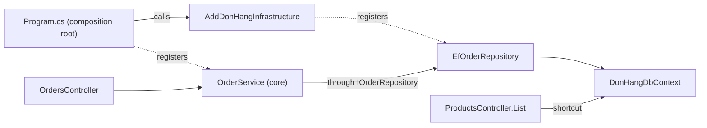

## Before you start

- [[design.l2.driving-and-driven-adapters]] — you know controllers are driving adapters that call into the core, and repositories are driven adapters the core calls through its ports.
- [[design.l1.wiring-the-container]] — you know `Program.cs` calls `AddDonHangInfrastructure`, which registers the repository and the `DbContext`, and then registers `OrderService` itself.

## The situation

At stage-2 you open `DonHang.Api.csproj` and find a `ProjectReference`, the line in a project file that lets one project's classes name another project's public classes, pointing to `DonHang.Infrastructure`. The last lessons kept the adapters away from the core, so an arrow from the API project to the data project looks suspicious. Then you open `ProductsController`. Its constructor asks for `DonHangDbContext`, the class EF Core, the ORM, uses for the database, and the product list queries `db.Products` directly: no service, no port, nothing from `DonHang.Domain` in between. What is that reference for, and what does it let a controller do that you should watch?

## Core concepts

- **composition root** — the one place where the application's objects are wired together; in Đơn Hàng, `Program.cs` together with the `AddDonHangInfrastructure` method it calls.
- wiring — deciding, for each interface a class asks for, which class the DI container creates, such as `EfOrderRepository` for `IOrderRepository`.
- shortcut past the core — a driving adapter that reaches the data through an adapter's own classes, such as `DonHangDbContext`, instead of through the core or one of its ports.

## How it works



Solid arrows are calls: the one from `Program.cs` at startup, the rest while a request runs. Dotted arrows are registrations. `Program.cs` and both controllers live in `DonHang.Api`; `AddDonHangInfrastructure`, `EfOrderRepository` and `DonHangDbContext` in `DonHang.Infrastructure`; `OrderService` in `DonHang.Domain`.

In the situation above, the composition root is `Program.cs`. Something must decide that `IOrderRepository` means `EfOrderRepository`, and that code must name both, which the core cannot do. So the deciding happens at the outer edge: `Program.cs` calls `AddDonHangInfrastructure`, which registers the adapters, then registers `OrderService` itself.

To make those calls, `DonHang.Api` references both other projects. The reference to `DonHang.Infrastructure` runs between two projects outside the core, so the dependency rule is not touched: `DonHang.Domain` still references nothing. The composition root is the one place that has to know every project.

On the usual path, the write endpoints of `OrdersController` call `OrderService`, which reaches `EfOrderRepository` through `IOrderRepository`; its read endpoints call the port `IOrderRepository` directly, which still goes through the core, since the port is declared in `DonHang.Domain`. Either way, only the adapter uses `DonHangDbContext`. But the reference is not limited to `Program.cs`: every class in `DonHang.Api` can name `DonHangDbContext`. At stage-2, `ProductsController.List` does, so a driving adapter reaches the database without going through the core.

The shortcut leaves `DonHang.Domain` untouched. The cost comes later: a business rule added to that endpoint would live in a driving adapter, out of reach of unit tests such as `OrderServiceTests` that drive the core. For an endpoint that only reads rows and applies no rule, skipping the core is a reasonable trade. Once an endpoint has a rule to enforce, sending it through the core keeps that rule in one place.

## In the Đơn Hàng system

The composition root, in `Program.cs`:

```csharp file=DonHang.Api/Program.cs tag=stage-2 lines=17-27
var connectionString = builder.Configuration.GetConnectionString("Default")
    ?? throw new InvalidOperationException("ConnectionStrings:Default is not set");

// lesson: backend.l2.cache-aside
// "redis:6379,abortConnect=false" in the lab: the api finds Redis by its
// Compose service name, the same way it finds db.
var redisConfiguration = builder.Configuration.GetConnectionString("Redis")
    ?? throw new InvalidOperationException("ConnectionStrings:Redis is not set");
var smtp = builder.Configuration.GetSection("Smtp").Get<SmtpSettings>() ?? new SmtpSettings();
builder.Services.AddDonHangInfrastructure(connectionString, redisConfiguration, smtp);
builder.Services.AddScoped<OrderService>();
```

Look at the last two lines. The first hands every adapter decision to `AddDonHangInfrastructure`, passing it the settings read above it: the database and Redis connection strings and the mail settings; the second registers the core's `OrderService`. These two lines name a method and `OrderService`, not the adapters: `EfOrderRepository` and the other adapter classes appear nowhere in `Program.cs`. Which classes stand behind the ports is decided inside `DonHang.Infrastructure`, and the core learns none of it.

The shortcut, at the top of `ProductsController`:

```csharp file=DonHang.Api/Controllers/ProductsController.cs tag=stage-2 lines=10-29
// lesson: backend.l1.rest-resources
// The list reads DonHangDbContext directly: it has no rule to apply, only a
// query to shape. One product at a time goes through IProductRepository.
[ApiController]
[Route("api/v1/products")]
public sealed class ProductsController(DonHangDbContext db, IProductRepository products) : ControllerBase
{
    private const int MaxPageSize = 100;

    // lesson: backend.l2.offset-pagination
    // GET /api/v1/products?limit=20&offset=40. A `limit` outside 1..100 is
    // refused with 400, so no request can ask for the whole table at once.
    // Sorting by the unique id keeps every page in the same, fixed order.
    [HttpGet]
    public async Task<ActionResult<List<ProductDto>>> List(
        [FromQuery, Range(1, MaxPageSize)] int limit = 20,
        [FromQuery, Range(0, int.MaxValue)] int offset = 0,
        [FromQuery] int? maxPriceVnd = null)
    {
        IQueryable<Product> query = db.Products;
```

The constructor asks for `DonHangDbContext`, and `List` starts its query from `db.Products`. The comment at the top states the trade: the list has no rule to apply, only a query to shape. The second constructor parameter, `IProductRepository`, serves the endpoints that work on one product at a time; this lesson leaves it aside.

## Beginners often think…

- **"`DonHang.Api` references `DonHang.Infrastructure`, so Đơn Hàng breaks the dependency rule."** → Actually the rule is about what the core names, and `DonHang.Domain` still references no project. The arrow from the API project to the data project runs between two projects outside the core, and it exists so the composition root can reach the adapters. You notice this belief when someone proposes removing that reference and then cannot say where `AddDonHangInfrastructure` would be called from.
- **"The composition root is just another name for the DI container."** → Actually the container is the object that holds the registrations and creates objects while the application runs. The composition root is the place in your code where those registrations are written: `Program.cs` and `AddDonHangInfrastructure`. You notice the difference when you look for "where `IOrderRepository` becomes `EfOrderRepository`": the answer is a line of code you can open, not the container.
- **"Every endpoint must go through a service in the core, even one that only lists rows."** → Actually a service method for the product list would only pass the query through, since the list applies no rule. Some teams still send every endpoint through the core so there is one path to learn; that pays off when many people add endpoints and rules appear often. You notice the cost of the strict version when a use case exists only to return what a single query returns.

## Try it (3 minutes)

In the root folder of the example repository, checked out at `stage-2`:

1. Run `git grep -n -e "AddDonHangInfrastructure" -e "AddScoped<OrderService>" -- DonHang.Api DonHang.Infrastructure` to find the composition root.
2. Run `git grep -n "DonHangDbContext" -- DonHang.Api/Controllers` to find which controllers reach the database directly.

Expected result: the first command prints three lines: the two calls in `Program.cs` and the declaration of `AddDonHangInfrastructure` in `ServiceCollectionExtensions.cs`. The second prints two lines, both in `ProductsController.cs`: the comment explaining the shortcut and the constructor. `OrdersController` does not appear: it reaches data only through `OrderService` and ports declared in `DonHang.Domain`.

## Connections

- [[design.l1.wiring-the-container]] — the registrations this lesson gives a name to: the place where they are written is the composition root.
- [[design.l2.driving-and-driven-adapters]] — `ProductsController` is a driving adapter, and this lesson shows one that skips the core.
- [[design.l1.tracing-a-request-through-layers]] — the path a request takes through the layers; the shortcut is a request that leaves that path.
- [[design.l2.testing-the-dependency-rule]] — the next lesson: a test that fails if `DonHang.Domain` starts depending on the outer projects.

## Five-line summary

1. The composition root is the one place where the application's objects are wired: `Program.cs` and the `AddDonHangInfrastructure` method it calls.
2. `DonHang.Api` references `DonHang.Infrastructure` so the composition root can reach the adapters; `DonHang.Domain` never needs that reference.
3. That reference also lets any class in `DonHang.Api` use `DonHangDbContext`, as `ProductsController.List` does, skipping the core.
4. The shortcut leaves the core untouched, but a rule added to that endpoint would sit outside the core and its tests.
5. Skipping the core suits an endpoint that only reads rows; once it has a rule, send it through the core.
