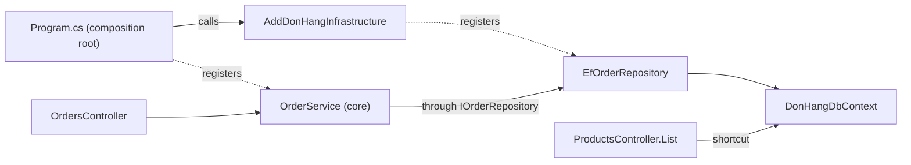

## Bạn cần biết trước

- [[design.l2.driving-and-driven-adapters]] — bạn biết controller là driving adapter gọi vào lõi, còn repository là driven adapter được lõi gọi qua các port của nó.
- [[design.l1.wiring-the-container]] — bạn biết `Program.cs` gọi `AddDonHangInfrastructure`, phương thức đăng ký repository và `DbContext`, rồi tự đăng ký `OrderService`.

## Tình huống

Ở stage-2, bạn mở `DonHang.Api.csproj` và thấy một `ProjectReference`, tức dòng trong file project cho phép các class của một project gọi tên các class public của project khác, trỏ tới `DonHang.Infrastructure`. Mấy bài vừa rồi đều giữ adapter tránh xa lõi, nên một mũi tên từ project API tới project dữ liệu trông khá đáng ngờ. Rồi bạn mở `ProductsController`. Constructor của nó xin `DonHangDbContext`, class mà EF Core, tức ORM, dùng để làm việc với database, và danh sách sản phẩm truy vấn thẳng `db.Products`: không service, không port, không có gì từ `DonHang.Domain` ở giữa. Tham chiếu đó để làm gì, và nó cho phép controller làm điều gì mà bạn cần để mắt tới?

## Khái niệm cốt lõi

- **composition root** (chỗ duy nhất dựng và nối các đối tượng của ứng dụng lại với nhau, như Program.cs) — nơi duy nhất các đối tượng của ứng dụng được nối lại với nhau. Trong Đơn Hàng, đó là `Program.cs` cùng với phương thức `AddDonHangInfrastructure` mà nó gọi.
- nối đối tượng — quyết định, với mỗi interface mà một class xin, DI container sẽ tạo class nào, chẳng hạn `EfOrderRepository` cho `IOrderRepository`.
- lối tắt qua lõi — một driving adapter với tới dữ liệu bằng chính các class của một adapter, như `DonHangDbContext`, thay vì đi qua lõi hoặc một port của lõi.

## Cơ chế hoạt động



Mũi tên liền là lời gọi: lời gọi từ `Program.cs` chạy lúc khởi động, các lời gọi còn lại chạy trong lúc xử lý request. Mũi tên chấm là việc đăng ký. `Program.cs` và cả hai controller nằm trong `DonHang.Api`; `AddDonHangInfrastructure`, `EfOrderRepository` và `DonHangDbContext` nằm trong `DonHang.Infrastructure`; `OrderService` nằm trong `DonHang.Domain`.

Trong tình huống trên, composition root là `Program.cs`. Phải có chỗ quyết định rằng `IOrderRepository` nghĩa là `EfOrderRepository`, và phần code đó phải gọi tên được cả hai, điều mà lõi không làm được. Vì vậy việc quyết định diễn ra ở rìa ngoài: `Program.cs` gọi `AddDonHangInfrastructure`, phương thức đăng ký các adapter, rồi tự đăng ký `OrderService`.

Để thực hiện các lời gọi đó, `DonHang.Api` tham chiếu cả hai project còn lại. Tham chiếu tới `DonHang.Infrastructure` nối hai project đều nằm ngoài lõi, nên dependency rule không bị động tới: `DonHang.Domain` vẫn không tham chiếu gì. Composition root là nơi duy nhất phải biết mọi project.

Ở đường đi thông thường, các endpoint ghi của `OrdersController` gọi `OrderService`, và `OrderService` với tới `EfOrderRepository` qua `IOrderRepository`. Các endpoint đọc của nó gọi thẳng port `IOrderRepository`, như vậy vẫn là đi qua lõi, vì port được khai báo trong `DonHang.Domain`. Đằng nào thì cũng chỉ adapter dùng `DonHangDbContext`. Nhưng tham chiếu không chỉ phục vụ `Program.cs`: mọi class trong `DonHang.Api` đều gọi tên được `DonHangDbContext`. Ở stage-2, `ProductsController.List` làm đúng như vậy, nên một driving adapter với tới database mà không đi qua lõi.

Lối tắt này không động gì tới `DonHang.Domain`. Cái giá đến sau: một quy tắc nghiệp vụ thêm vào endpoint đó sẽ nằm trong một driving adapter, ngoài tầm với của những unit test chạy lõi như `OrderServiceTests`. Với một endpoint chỉ đọc dữ liệu và không áp quy tắc nào, bỏ qua lõi là một đánh đổi hợp lý. Khi endpoint đã có quy tắc cần giữ, cho nó đi qua lõi sẽ giữ quy tắc đó ở một chỗ.

## Trong hệ thống Đơn Hàng

Composition root, trong `Program.cs`:

```csharp file=DonHang.Api/Program.cs tag=stage-2 lines=17-27
var connectionString = builder.Configuration.GetConnectionString("Default")
    ?? throw new InvalidOperationException("ConnectionStrings:Default is not set");

// lesson: backend.l2.cache-aside
// "redis:6379,abortConnect=false" in the lab: the api finds Redis by its
// Compose service name, the same way it finds db.
var redisConfiguration = builder.Configuration.GetConnectionString("Redis")
    ?? throw new InvalidOperationException("ConnectionStrings:Redis is not set");
var smtp = builder.Configuration.GetSection("Smtp").Get<SmtpSettings>() ?? new SmtpSettings();
builder.Services.AddDonHangInfrastructure(connectionString, redisConfiguration, smtp);
builder.Services.AddScoped<OrderService>();
```

Hãy nhìn hai dòng cuối. Dòng đầu giao mọi quyết định về adapter cho `AddDonHangInfrastructure`, kèm các thiết lập đã đọc ở trên: chuỗi kết nối tới database và Redis, cùng thiết lập gửi mail. Dòng thứ hai đăng ký `OrderService` của lõi. Hai dòng này gọi tên một phương thức và `OrderService`, không gọi tên adapter nào: `EfOrderRepository` và các class adapter khác không xuất hiện ở đâu trong `Program.cs`. Class nào đứng sau các port được quyết định bên trong `DonHang.Infrastructure`, và lõi không biết gì về chuyện đó.

Lối tắt, ở đầu `ProductsController`:

```csharp file=DonHang.Api/Controllers/ProductsController.cs tag=stage-2 lines=10-29
// lesson: backend.l1.rest-resources
// The list reads DonHangDbContext directly: it has no rule to apply, only a
// query to shape. One product at a time goes through IProductRepository.
[ApiController]
[Route("api/v1/products")]
public sealed class ProductsController(DonHangDbContext db, IProductRepository products) : ControllerBase
{
    private const int MaxPageSize = 100;

    // lesson: backend.l2.offset-pagination
    // GET /api/v1/products?limit=20&offset=40. A `limit` outside 1..100 is
    // refused with 400, so no request can ask for the whole table at once.
    // Sorting by the unique id keeps every page in the same, fixed order.
    [HttpGet]
    public async Task<ActionResult<List<ProductDto>>> List(
        [FromQuery, Range(1, MaxPageSize)] int limit = 20,
        [FromQuery, Range(0, int.MaxValue)] int offset = 0,
        [FromQuery] int? maxPriceVnd = null)
    {
        IQueryable<Product> query = db.Products;
```

Constructor xin `DonHangDbContext`, và `List` bắt đầu truy vấn từ `db.Products`. Comment ở đầu nói rõ sự đánh đổi: danh sách không có quy tắc nào phải áp, chỉ có một truy vấn cần định hình. Tham số thứ hai của constructor, `IProductRepository`, phục vụ các endpoint làm việc với từng sản phẩm một; bài này để nó sang một bên.

## Người mới hay nghĩ rằng…

- **"`DonHang.Api` tham chiếu `DonHang.Infrastructure`, nên Đơn Hàng phá dependency rule."** → Thực ra quy tắc nói về những gì lõi gọi tên, và `DonHang.Domain` vẫn không tham chiếu project nào. Mũi tên từ project API tới project dữ liệu nối hai project đều nằm ngoài lõi, và nó tồn tại để composition root với tới được các adapter. Bạn sẽ nhận ra niềm tin này khi có người đề xuất bỏ tham chiếu đó rồi không trả lời được `AddDonHangInfrastructure` sẽ được gọi từ đâu.
- **"Composition root chỉ là tên khác của DI container."** → Thực ra container là đối tượng giữ các đăng ký và tạo đối tượng khi ứng dụng chạy. Composition root là chỗ trong code của bạn nơi các đăng ký đó được viết ra: `Program.cs` và `AddDonHangInfrastructure`. Bạn sẽ nhận ra sự khác nhau khi đi tìm "chỗ `IOrderRepository` trở thành `EfOrderRepository`": câu trả lời là một dòng code bạn mở ra được, không phải container.
- **"Endpoint nào cũng phải đi qua một service trong lõi, kể cả endpoint chỉ liệt kê dữ liệu."** → Thực ra một phương thức service cho danh sách sản phẩm chỉ chuyển tiếp truy vấn, vì danh sách không áp quy tắc nào. Có team vẫn cho mọi endpoint đi qua lõi để chỉ có một đường đi phải học; cách đó có lợi khi nhiều người cùng thêm endpoint và quy tắc xuất hiện thường xuyên. Bạn sẽ thấy cái giá của phiên bản cứng nhắc khi có một use case tồn tại chỉ để trả về đúng kết quả của một truy vấn.

## Thử ngay (3 phút)

Ở thư mục gốc của repo ví dụ, đã checkout tại `stage-2`:

1. Chạy `git grep -n -e "AddDonHangInfrastructure" -e "AddScoped<OrderService>" -- DonHang.Api DonHang.Infrastructure` để tìm composition root.
2. Chạy `git grep -n "DonHangDbContext" -- DonHang.Api/Controllers` để tìm controller nào với thẳng tới database.

Kết quả mong đợi: lệnh đầu in ra ba dòng: hai lời gọi trong `Program.cs` và phần khai báo `AddDonHangInfrastructure` trong `ServiceCollectionExtensions.cs`. Lệnh thứ hai in ra hai dòng, đều trong `ProductsController.cs`: comment giải thích lối tắt và constructor. `OrdersController` không xuất hiện: nó chỉ với tới dữ liệu qua `OrderService` và các port khai báo trong `DonHang.Domain`.

## Liên hệ

- [[design.l1.wiring-the-container]] — các đăng ký mà bài này đặt tên: chỗ chúng được viết ra chính là composition root.
- [[design.l2.driving-and-driven-adapters]] — `ProductsController` là một driving adapter, và bài này cho thấy một adapter đi tắt qua lõi.
- [[design.l1.tracing-a-request-through-layers]] — đường đi của một request qua các tầng; lối tắt là một request rời khỏi đường đó.
- [[design.l2.testing-the-dependency-rule]] — bài tiếp theo: một test fail nếu `DonHang.Domain` bắt đầu phụ thuộc vào các project bên ngoài.

## Tóm tắt 5 dòng

1. Composition root là nơi duy nhất các đối tượng của ứng dụng được nối lại: `Program.cs` và phương thức `AddDonHangInfrastructure` mà nó gọi.
2. `DonHang.Api` tham chiếu `DonHang.Infrastructure` để composition root với tới các adapter; `DonHang.Domain` không bao giờ cần tham chiếu đó.
3. Tham chiếu đó cũng cho mọi class trong `DonHang.Api` dùng được `DonHangDbContext`, như `ProductsController.List` đang làm, bỏ qua lõi.
4. Lối tắt không động tới lõi, nhưng một quy tắc thêm vào endpoint đó sẽ nằm ngoài lõi và ngoài các test của lõi.
5. Bỏ qua lõi hợp với endpoint chỉ đọc dữ liệu; khi nó đã có quy tắc, hãy cho nó đi qua lõi.
