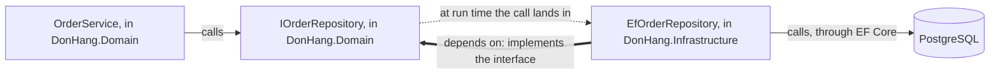

## Before you start

- [[design.l1.the-repository-layer]] — you know `OrderService` depends on `IOrderRepository` in `DonHang.Domain`, while `EfOrderRepository` implements it with EF Core in `DonHang.Infrastructure`.
- [[design.l1.tracing-a-request-through-layers]] — you know `POST /api/v1/orders` goes controller → service → repository → PostgreSQL, each layer calling only the one below it.

## The situation

You trace `POST /api/v1/orders` once more. `OrderService.PlaceOrderAsync` calls `AddAsync` and `SaveChangesAsync`, and the work ends up in `EfOrderRepository`, which uses EF Core to write to PostgreSQL, so the business code calls the data code. You open `DonHang.Domain.csproj`, expecting a reference to `DonHang.Infrastructure`, since that is where the call goes. There is none: the file references no project and no package at all. The only reference between the two projects points the other way. How can `OrderService` call code in a project it cannot even name?

## Core concepts

- run-time call — which code executes which while the program runs; you see it when you step through a request or read a stack trace.
- compile-time dependency — which code must be able to name which other code, through a `ProjectReference` to another project, a `PackageReference` to a library downloaded as a package, such as EF Core, or a `using` that the compiler checks.
- **dependency rule** — no compile-time dependency points out of the code that holds the business rules: that code names only its own types and .NET's, never a class, package or project of the data access or web code around it.

## How it works



In a classic layered design, each layer depends on the one below it. The business layer names classes of the data-access layer, and the data layer names the database library, so the business layer depends, through the data layer, on the database technology. Call and dependency point the same way: down.

Đơn Hàng keeps the call arrow and reverses the dependency arrow. In the situation above, the run-time call goes from `OrderService` to `EfOrderRepository`. But `OrderService` only names `IOrderRepository`, an interface declared in its own project, `DonHang.Domain`. `EfOrderRepository` sits in `DonHang.Infrastructure` and implements that interface, so the data project must name the business project, not the other way round.

In the diagram, thin arrows are run-time calls. `OrderService` also names `IOrderRepository`, but both sit in `DonHang.Domain`, so that dependency never leaves the project. The dotted arrow is no line of code: when the API runs, dependency injection hands `OrderService` an `EfOrderRepository` object behind the interface, and the call lands there. The thick arrow is the compile-time dependency between the projects, from `EfOrderRepository` back to `IOrderRepository`. The interface lets call and dependency point in opposite directions.

That is the dependency rule: no compile-time dependency points out of the code that holds the business rules. In Đơn Hàng that code is `DonHang.Domain`, and apart from .NET's own types it names nothing outside itself: not EF Core, not `DonHang.Api`, not `DonHang.Infrastructure`. The rule does not forbid references. `DonHang.Infrastructure` referencing `DonHang.Domain` is allowed, because it points into the business rules. What the rule forbids is a reference going out of them.

## In the Đơn Hàng system

The data project's file, `DonHang.Infrastructure.csproj`, opens with its only project reference:

```xml file=DonHang.Infrastructure/DonHang.Infrastructure.csproj tag=stage-1 lines=1-12
<Project Sdk="Microsoft.NET.Sdk">

  <PropertyGroup>
    <TargetFramework>net10.0</TargetFramework>
    <ImplicitUsings>enable</ImplicitUsings>
    <Nullable>enable</Nullable>
    <RootNamespace>DonHang.Infrastructure</RootNamespace>
  </PropertyGroup>

  <ItemGroup>
    <ProjectReference Include="..\DonHang.Domain\DonHang.Domain.csproj" />
  </ItemGroup>
```

Line 11 is the whole arrow: `DonHang.Infrastructure` can name the public types of `DonHang.Domain`. `DonHang.Domain.csproj`, which you opened in the situation, has no `ItemGroup` at all, so there is no line that could point back. If a class in `DonHang.Domain` named `EfOrderRepository` or anything from EF Core, the build would fail: `DonHang.Domain` references no project and no package, so the compiler can find only its own types and those of the .NET framework it targets.

The implementation uses what that reference allows:

```csharp file=DonHang.Infrastructure/EfOrderRepository.cs tag=stage-1 lines=1-10
using DonHang.Domain;
using Microsoft.EntityFrameworkCore;

namespace DonHang.Infrastructure;

// lesson: design.l1.the-repository-layer
public sealed class EfOrderRepository(DonHangDbContext db) : IOrderRepository
{
    public Task<Order?> FindAsync(int id) =>
        db.Orders.Include(o => o.Items).FirstOrDefaultAsync(o => o.Id == id);
```

`using DonHang.Domain;` and `: IOrderRepository` are the thick arrow of the diagram: this class names the business project's interface and its `Order` entity. `using Microsoft.EntityFrameworkCore;` and `db.Orders.Include(...)` are EF Core, and they stay in this project. `IOrderRepository.cs`, by contrast, declares its four methods with nothing but `Order`, `List<Order>`, `int` and `Task`: types from `DonHang.Domain` and from .NET itself.

## Beginners often think…

- **"If `OrderService` calls the repository, `DonHang.Domain` must depend on `DonHang.Infrastructure`."** → Actually the call only needs something `OrderService` can name, and `IOrderRepository` is in its own project. The object behind it at run time comes from `DonHang.Infrastructure`, but no line in `DonHang.Domain` mentions that project. You notice this when you search `DonHang.Domain` for `EfOrderRepository` and find nothing, although every placed order passes through it.
- **"Splitting code into layers already guarantees that the business rules don't depend on the database."** → Actually layers only group code; the direction of each reference decides who depends on whom. If `IOrderRepository` had been declared in the data project next to its implementation, the business project would need a reference to the data project, and through it would depend on EF Core: still three layers, with the arrow pointing down. You notice this when a business project's `.csproj` lists the data project, and the business project can no longer build without the data project and the EF Core packages it brings in.
- **"The dependency rule means no project may reference another project."** → Actually the rule limits the direction of references, not their number. `DonHang.Infrastructure` and `DonHang.Tests` both reference `DonHang.Domain`, and both point toward the business rules. You notice the misreading when someone removes the reference from `DonHang.Infrastructure.csproj` to "decouple" the projects, and `EfOrderRepository` stops compiling because it can no longer see `IOrderRepository` or `Order`.

## Try it (3 minutes)

In the root folder of the example repository, checked out at `stage-1`:

1. Run `git grep -n "ProjectReference" -- "DonHang.*/*.csproj"` to list every project reference in the `DonHang.*` project files.
2. On paper, draw one arrow per printed line, from the project whose file contains the line to the project it names.

Expected result: four lines. `DonHang.Api.csproj` names `DonHang.Domain` and `DonHang.Infrastructure`, `DonHang.Infrastructure.csproj` names `DonHang.Domain`, and `DonHang.Tests.csproj` names `DonHang.Domain`. No arrow starts at `DonHang.Domain`, and three of the four end there. Why the API names both projects is the subject of a later lesson.

Which new arrow, or which new line in a `.csproj`, would break the dependency rule?

<details><summary>Suggested answer</summary>

Any reference that starts at `DonHang.Domain`: a `ProjectReference` to `DonHang.Infrastructure` or `DonHang.Api`, or a `PackageReference` to EF Core or another data-access or web library. Each would let the business rules name something outside them. An arrow between two projects outside `DonHang.Domain`, such as the API naming the data project, does not point out of the business rules, so this rule does not decide it.

</details>

## Connections

- [[design.l1.solid-dip]] — the same direction for one class: DIP makes `OrderService` depend on an abstraction; the dependency rule applies that direction to whole projects.
- [[design.l1.the-repository-layer]] — where `IOrderRepository` was introduced; this lesson explains why it lives in `DonHang.Domain` and not next to `EfOrderRepository`.
- [[design.l2.ports-and-adapters]] — the next lesson gives names to the two pieces here: the interfaces the business code declares, and the classes outside that implement them.

## Five-line summary

1. The dependency rule: no compile-time dependency points out of the business rules; they never name the data access or web code around them.
2. In classic layering the business layer depends on data access, and through it on the database technology.
3. `DonHang.Infrastructure.csproj` references `DonHang.Domain`; `DonHang.Domain.csproj` references no project and no package.
4. `OrderService` calls `EfOrderRepository` at run time, but names only `IOrderRepository`, declared in its own project.
5. The rule limits the direction of references, not their number: no reference in Đơn Hàng starts at `DonHang.Domain`.
