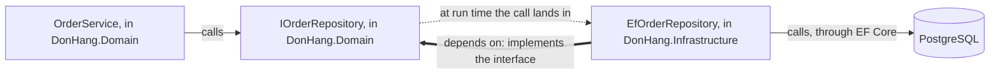

## Bạn cần biết trước

- [[design.l1.the-repository-layer]] — bạn biết `OrderService` phụ thuộc vào `IOrderRepository` trong `DonHang.Domain`, còn `EfOrderRepository` cài đặt interface đó bằng EF Core trong `DonHang.Infrastructure`.
- [[design.l1.tracing-a-request-through-layers]] — bạn biết `POST /api/v1/orders` đi qua controller → service → repository → PostgreSQL, mỗi tầng chỉ gọi tầng ngay bên dưới.

## Tình huống

Bạn lần theo `POST /api/v1/orders` thêm một lần nữa. `OrderService.PlaceOrderAsync` gọi `AddAsync` và `SaveChangesAsync`, và công việc rốt cuộc rơi vào `EfOrderRepository`, class dùng EF Core để ghi xuống PostgreSQL, tức là code nghiệp vụ gọi code dữ liệu. Bạn mở `DonHang.Domain.csproj`, chờ thấy một tham chiếu tới `DonHang.Infrastructure`, vì lời gọi đi về phía đó. Không có gì cả: file này không tham chiếu project nào, cũng không tham chiếu package nào. Tham chiếu duy nhất giữa hai project lại chỉ theo chiều ngược lại. Làm sao `OrderService` gọi được code nằm trong một project mà nó thậm chí không gọi tên được?

## Khái niệm cốt lõi

- lời gọi lúc chạy — code nào chạy code nào khi chương trình đang chạy; bạn thấy nó khi chạy từng bước qua một request hoặc đọc stack trace.
- phụ thuộc lúc biên dịch — code nào phải gọi tên được code nào, thông qua một `ProjectReference` tới project khác, một `PackageReference` tới thư viện tải về dưới dạng package như EF Core, hoặc một `using` mà compiler kiểm tra.
- **dependency rule** (phụ thuộc trong mã nguồn chỉ hướng vào quy tắc nghiệp vụ; code giữ quy tắc không gọi tên thứ gì bên ngoài nó) — không phụ thuộc lúc biên dịch nào đi ra khỏi phần code giữ quy tắc nghiệp vụ: phần code đó chỉ gọi tên kiểu của chính nó và của .NET, không bao giờ gọi tên class, package hay project thuộc phần truy cập dữ liệu hay phần web bao quanh nó.

## Cơ chế hoạt động



Trong cách chia tầng cổ điển, mỗi tầng phụ thuộc vào tầng ngay bên dưới. Tầng nghiệp vụ gọi tên các class của tầng truy cập dữ liệu, còn tầng dữ liệu gọi tên thư viện database, nên qua tầng dữ liệu, tầng nghiệp vụ phụ thuộc vào công nghệ database. Lời gọi và phụ thuộc cùng chỉ một hướng: đi xuống.

Đơn Hàng giữ nguyên mũi tên lời gọi và đảo ngược mũi tên phụ thuộc. Trong tình huống trên, lời gọi lúc chạy đi từ `OrderService` tới `EfOrderRepository`. Nhưng `OrderService` chỉ gọi tên `IOrderRepository`, một interface khai báo ngay trong project của nó là `DonHang.Domain`. `EfOrderRepository` nằm trong `DonHang.Infrastructure` và cài đặt interface đó, nên chính project dữ liệu phải gọi tên project nghiệp vụ, chứ không phải ngược lại.

Trong sơ đồ, mũi tên mảnh là lời gọi lúc chạy. `OrderService` cũng gọi tên `IOrderRepository`, nhưng cả hai nằm trong `DonHang.Domain`, nên phụ thuộc đó không bao giờ rời khỏi project. Mũi tên chấm không ứng với dòng code nào: khi API chạy, dependency injection đưa cho `OrderService` một đối tượng `EfOrderRepository` đứng sau interface, và lời gọi rơi vào đó. Mũi tên đậm là phụ thuộc lúc biên dịch giữa hai project, đi từ `EfOrderRepository` ngược về `IOrderRepository`. Chính interface cho phép lời gọi và phụ thuộc chỉ hai hướng ngược nhau.

Đó là dependency rule: không phụ thuộc lúc biên dịch nào đi ra khỏi phần code giữ quy tắc nghiệp vụ. Trong Đơn Hàng, phần code đó là `DonHang.Domain`, và ngoài các kiểu có sẵn của .NET, nó không gọi tên thứ gì bên ngoài: không EF Core, không `DonHang.Api`, không `DonHang.Infrastructure`. Quy tắc này không cấm tham chiếu. `DonHang.Infrastructure` tham chiếu `DonHang.Domain` là hợp lệ, vì tham chiếu đó hướng vào quy tắc nghiệp vụ. Điều quy tắc cấm là một tham chiếu đi ra khỏi chúng.

## Trong hệ thống Đơn Hàng

File của project dữ liệu, `DonHang.Infrastructure.csproj`, mở đầu bằng tham chiếu project duy nhất của nó:

```xml file=DonHang.Infrastructure/DonHang.Infrastructure.csproj tag=stage-1 lines=1-12
<Project Sdk="Microsoft.NET.Sdk">

  <PropertyGroup>
    <TargetFramework>net10.0</TargetFramework>
    <ImplicitUsings>enable</ImplicitUsings>
    <Nullable>enable</Nullable>
    <RootNamespace>DonHang.Infrastructure</RootNamespace>
  </PropertyGroup>

  <ItemGroup>
    <ProjectReference Include="..\DonHang.Domain\DonHang.Domain.csproj" />
  </ItemGroup>
```

Dòng 11 là toàn bộ mũi tên: `DonHang.Infrastructure` được phép gọi tên các kiểu public của `DonHang.Domain`. `DonHang.Domain.csproj`, file bạn đã mở trong tình huống, không có `ItemGroup` nào, nên không có dòng nào chỉ ngược lại được. Nếu một class trong `DonHang.Domain` gọi tên `EfOrderRepository` hay bất cứ thứ gì của EF Core, build sẽ lỗi: `DonHang.Domain` không tham chiếu project nào, cũng không tham chiếu package nào, nên compiler chỉ tìm thấy kiểu của chính nó và kiểu của .NET framework mà nó nhắm tới.

Phần cài đặt dùng đúng những gì tham chiếu đó cho phép:

```csharp file=DonHang.Infrastructure/EfOrderRepository.cs tag=stage-1 lines=1-10
using DonHang.Domain;
using Microsoft.EntityFrameworkCore;

namespace DonHang.Infrastructure;

// lesson: design.l1.the-repository-layer
public sealed class EfOrderRepository(DonHangDbContext db) : IOrderRepository
{
    public Task<Order?> FindAsync(int id) =>
        db.Orders.Include(o => o.Items).FirstOrDefaultAsync(o => o.Id == id);
```

`using DonHang.Domain;` và `: IOrderRepository` chính là mũi tên đậm trong sơ đồ: class này gọi tên interface và entity `Order` của project nghiệp vụ. `using Microsoft.EntityFrameworkCore;` và `db.Orders.Include(...)` là EF Core, và chúng ở yên trong project này. Ngược lại, `IOrderRepository.cs` khai báo bốn phương thức chỉ bằng `Order`, `List<Order>`, `int` và `Task`: các kiểu của `DonHang.Domain` và của chính .NET.

## Người mới hay nghĩ rằng…

- **"Nếu `OrderService` gọi repository thì `DonHang.Domain` phải phụ thuộc vào `DonHang.Infrastructure`."** → Thực ra lời gọi chỉ cần một thứ mà `OrderService` gọi tên được, và `IOrderRepository` nằm ngay trong project của nó. Đối tượng đứng sau interface lúc chạy đến từ `DonHang.Infrastructure`, nhưng không dòng nào trong `DonHang.Domain` nhắc tới project đó. Bạn sẽ nhận ra khi tìm `EfOrderRepository` trong `DonHang.Domain` mà không thấy gì, dù mọi đơn hàng được đặt đều đi qua class đó.
- **"Chia code thành các tầng là đã đảm bảo quy tắc nghiệp vụ không phụ thuộc vào database."** → Thực ra tầng chỉ gom nhóm code, còn chiều của từng tham chiếu mới quyết định ai phụ thuộc vào ai. Nếu `IOrderRepository` được khai báo trong project dữ liệu, cạnh phần cài đặt của nó, thì project nghiệp vụ sẽ cần một tham chiếu tới project dữ liệu, và qua đó phụ thuộc vào EF Core: vẫn ba tầng, nhưng mũi tên chỉ xuống. Bạn sẽ nhận ra khi file `.csproj` của project nghiệp vụ liệt kê project dữ liệu, và project nghiệp vụ không còn build được nếu thiếu project dữ liệu cùng các package EF Core mà nó kéo theo.
- **"Dependency rule nghĩa là không project nào được tham chiếu tới project khác."** → Thực ra quy tắc giới hạn chiều của tham chiếu, không giới hạn số lượng. `DonHang.Infrastructure` và `DonHang.Tests` đều tham chiếu `DonHang.Domain`, và cả hai đều hướng về quy tắc nghiệp vụ. Bạn sẽ nhận ra cách hiểu sai này khi có người xóa tham chiếu trong `DonHang.Infrastructure.csproj` để "gỡ coupling" giữa các project, và `EfOrderRepository` không còn biên dịch được vì không thấy `IOrderRepository` hay `Order` nữa.

## Thử ngay (3 phút)

Ở thư mục gốc của repo ví dụ, đã checkout tại `stage-1`:

1. Chạy `git grep -n "ProjectReference" -- "DonHang.*/*.csproj"` để liệt kê mọi tham chiếu project trong các file project `DonHang.*`.
2. Trên giấy, vẽ một mũi tên cho mỗi dòng in ra, từ project có file chứa dòng đó tới project mà dòng đó gọi tên.

Kết quả mong đợi: bốn dòng. `DonHang.Api.csproj` gọi tên `DonHang.Domain` và `DonHang.Infrastructure`, `DonHang.Infrastructure.csproj` gọi tên `DonHang.Domain`, và `DonHang.Tests.csproj` gọi tên `DonHang.Domain`. Không mũi tên nào xuất phát từ `DonHang.Domain`, và ba trong bốn mũi tên kết thúc ở đó. Vì sao API gọi tên cả hai project là chủ đề của một bài sau.

Mũi tên mới nào, hay dòng mới nào trong một file `.csproj`, sẽ phá dependency rule?

<details><summary>Gợi ý đáp án</summary>

Bất kỳ tham chiếu nào xuất phát từ `DonHang.Domain`: một `ProjectReference` tới `DonHang.Infrastructure` hoặc `DonHang.Api`, hay một `PackageReference` tới EF Core hoặc một thư viện truy cập dữ liệu hay thư viện web khác. Mỗi tham chiếu như vậy sẽ cho phép quy tắc nghiệp vụ gọi tên thứ nằm ngoài nó. Một mũi tên giữa hai project đều nằm ngoài `DonHang.Domain`, như API gọi tên project dữ liệu, không đi ra khỏi quy tắc nghiệp vụ, nên quy tắc này không quyết định nó.

</details>

## Liên hệ

- [[design.l1.solid-dip]] — cùng một chiều, áp cho một class: DIP khiến `OrderService` phụ thuộc vào một abstraction, còn dependency rule áp chiều đó cho cả project.
- [[design.l1.the-repository-layer]] — nơi `IOrderRepository` xuất hiện lần đầu; bài này giải thích vì sao nó nằm trong `DonHang.Domain` chứ không cạnh `EfOrderRepository`.
- [[design.l2.ports-and-adapters]] — bài tiếp theo đặt tên cho hai mảnh ở đây: các interface do code nghiệp vụ khai báo, và các class bên ngoài cài đặt chúng.

## Tóm tắt 5 dòng

1. Dependency rule: không phụ thuộc lúc biên dịch nào đi ra khỏi quy tắc nghiệp vụ; chúng không bao giờ gọi tên code dữ liệu hay web xung quanh.
2. Trong cách chia tầng cổ điển, tầng nghiệp vụ phụ thuộc vào truy cập dữ liệu, và qua đó phụ thuộc công nghệ database.
3. `DonHang.Infrastructure.csproj` tham chiếu `DonHang.Domain`; `DonHang.Domain.csproj` không tham chiếu project nào, cũng không tham chiếu package nào.
4. Lúc chạy, `OrderService` gọi tới `EfOrderRepository`, nhưng chỉ gọi tên `IOrderRepository`, khai báo ngay trong project của nó.
5. Quy tắc giới hạn chiều của tham chiếu, không giới hạn số lượng: không tham chiếu nào trong Đơn Hàng xuất phát từ `DonHang.Domain`.
