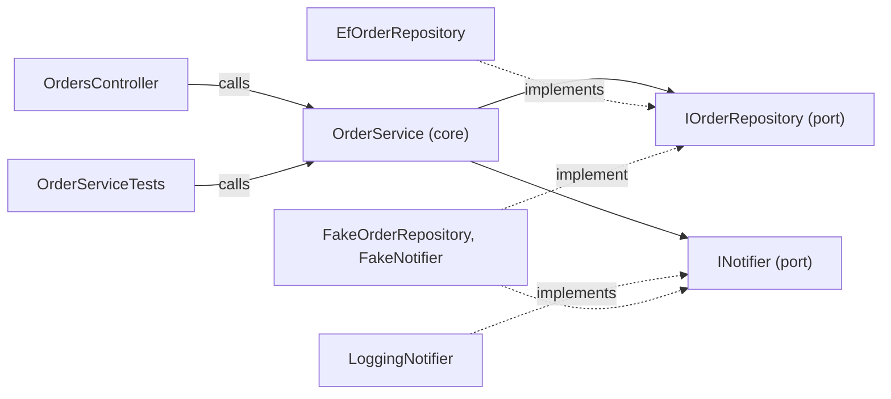

## Before you start

- [[design.l2.ports-and-adapters]] — you know the core reaches the outside only through its ports, and that `EfOrderRepository` and `LoggingNotifier` are adapters for them.
- [[design.l1.testing-with-a-fake-repository]] — you know `OrderServiceTests` builds `OrderService` with `FakeOrderRepository` and `FakeNotifier` and needs no database.
- [[design.l1.the-controller-layer]] — you know `OrdersController.Create` reads the request, calls `OrderService.PlaceOrderAsync` and answers `201`.

## The situation

A teammate says placing an order is covered by tests. You open `OrderServiceTests` and find `service.PlaceOrderAsync(customerId: 1, items: [OneItem])`: no HTTP request, no token, no `201`. You open `OrdersController.Create` and find the same method, called with a customer id taken from the token. The previous lesson called `EfOrderRepository` and `LoggingNotifier` adapters, classes outside the core that translate between the core and one technology. The controller and the test also sit outside the core, and they also translate something into a call. Are they adapters too, and if so, what makes them different from the repository?

## Core concepts

- **driving adapter** — an adapter that calls into the core to ask it to do something; in the situation above, `OrdersController` and `OrderServiceTests`.
- **driven adapter** — an adapter the core calls through a port the core declares; in Đơn Hàng, `EfOrderRepository` and `LoggingNotifier`.
- two sides of the core — the side calls come in from, where driving adapters sit, and the side the core calls out to, where driven adapters sit.

## How it works



Solid arrows are calls. Two driving adapters start the work by calling a public method of `OrderService`; the core then calls its two ports. Dotted arrows mean "implements": each driven adapter points at the port it fills.

In the situation above, `OrdersController` is a driving adapter. It turns an HTTP request into a call: it reads the customer id from the token, builds `OrderItem` objects from the body and calls `PlaceOrderAsync`. It then turns the returned `Order` back into HTTP: `201` with an `OrderDto`. `EfOrderRepository` and `LoggingNotifier`, both in `DonHang.Infrastructure`, are driven adapters: the core calls them, through its ports, to store the order and to send the message.

`OrderServiceTests` is a driving adapter too, with no HTTP at all. It calls `PlaceOrderAsync` directly and plugs `FakeOrderRepository` and `FakeNotifier` into the two driven ports. `OrderService` cannot tell the difference. It receives a customer id and a list of items, whoever sent them, and calls whichever `IOrderRepository` and `INotifier` it was given. So the same class, unchanged, runs behind a controller in the API and behind a test in `DonHang.Tests`.

The two sides differ in who owns the interface. On the driven side the core needs something from outside, so it declares a port and the adapter depends on it; the port lets the core name no technology, as the dependency rule requires. On the driving side the adapter needs the core, and that dependency already points toward the core. So Đơn Hàng declares no interface for this side: `OrdersController` names `OrderService` and calls its public methods.

## In the Đơn Hàng system

The HTTP driving adapter, `OrdersController.Create`:

```csharp file=DonHang.Api/Controllers/OrdersController.cs tag=stage-1 lines=17-28
    [Authorize]
    [HttpPost]
    public async Task<ActionResult<OrderDto>> Create(CreateOrderRequest request)
    {
        var customerId = int.Parse(User.FindFirstValue(JwtRegisteredClaimNames.Sub)!);
        var items = request.Items
            .Select(i => new OrderItem { ProductId = i.ProductId, Quantity = i.Quantity, UnitPriceVnd = i.UnitPriceVnd })
            .ToList();

        var order = await orderService.PlaceOrderAsync(customerId, items);
        return CreatedAtAction(nameof(Get), new { id = order.Id }, ToDto(order));
    }
```

Everything before the `PlaceOrderAsync` call translates HTTP into the core's words: a customer id from the `sub` field of the token, which holds the signed-in customer's id, and `OrderItem` objects from the request body. The `return` line translates back: `CreatedAtAction` answers `201`, and `ToDto` shapes the `Order` into an `OrderDto`. The only line that does business work is the call to `PlaceOrderAsync`. The class's constructor, just above this block, asks for `OrderService` itself, not an interface over it.

The second driving adapter, from `OrderServiceTests`:

```csharp file=DonHang.Tests/Services/OrderServiceTests.cs tag=stage-1 lines=11-22
    [Fact]
    public async Task PlaceOrderAsync_ValidItems_SetsStatusNew()
    {
        var repository = new FakeOrderRepository();
        var notifier = new FakeNotifier();
        var service = new OrderService(repository, notifier);

        var order = await service.PlaceOrderAsync(customerId: 1, items: [OneItem]);

        Assert.Equal("new", order.Status);
        Assert.Equal(1, order.CustomerId);
    }
```

There is no request and no status code. The test plugs a fake into each driven port, then makes the same call the controller makes above, and checks the `Order` it gets back. The code inside `PlaceOrderAsync` runs exactly as it does behind the API.

## Beginners often think…

- **"Only the database and notification code are adapters; controllers belong to the core."** → Actually `OrdersController` lives in `DonHang.Api`, outside the core, and its whole job is translation: HTTP in, a method call out, an `Order` back into `201`. The rules, such as refusing an order with no items, live in `OrderService`. You notice the confusion when a rule starts to appear in a controller method such as `OrdersController.Create`, where a test that drives `OrderService` directly never reaches it.
- **"Every port must be a C# interface, including the one a controller calls."** → Actually a driven port is an interface so that the core names no technology. The dependency from `OrdersController` to `OrderService` already points toward the core, so the dependency rule holds without one; the only interfaces in `DonHang.Domain` are `IOrderRepository` and `INotifier`. An interface on the driving side pays off when you want to test a controller alone, with a fake in place of the service. You notice the habit when an `IOrderService` with a single implementation appears only so the controller can "talk to a port".
- **"Tests sit outside the architecture, so they don't count as using the core."** → Actually `OrderServiceTests` calls the core exactly as the controller does: the same public method, with the same rules running inside it. That is why a passing test says something about `PlaceOrderAsync` at all. You notice the mistake when someone adds a test-only method or a "running in a test" flag to `OrderService`: the test then drives a different core from the one the API drives.

## Try it (3 minutes)

In the root folder of the example repository, checked out at `stage-1`:

1. Run `git grep -n "PlaceOrderAsync(" -- "DonHang.*/*.cs"` to list where the method is declared and where it is called.
2. Run `git grep -n "interface " -- DonHang.Domain DonHang.Api` to list the interfaces in the core and in the API project.

Expected result: the first command prints five lines: the declaration in `OrderService.cs`, one call in `OrdersController.cs` and three calls in `OrderServiceTests.cs`. One core method, two driving adapters. The second command prints two lines, `INotifier` and `IOrderRepository`, both in `DonHang.Domain`: both are driven ports, and the driving side has no interface.

## Connections

- [[design.l2.ports-and-adapters]] — the lesson this one extends: it named the adapters the core calls; this one adds the adapters that call the core.
- [[design.l1.the-controller-layer]] — the same thin controller, now seen as an adapter that translates HTTP into a call to the core.
- [[design.l1.testing-with-a-fake-repository]] — the same test, now seen as a second driving adapter that needs no HTTP.
- [[design.l2.clean-architecture]] — the next lesson: the same dependency direction, drawn as rings instead of sides.

## Five-line summary

1. Adapters sit on two sides of the core: driving adapters call into it, driven adapters are called by it through its ports.
2. `OrdersController` is a driving adapter: it turns an HTTP request into `PlaceOrderAsync` and the result back into `201`.
3. `OrderServiceTests` is a second driving adapter: it calls `PlaceOrderAsync` directly, with fakes plugged into the driven ports.
4. `OrderService` cannot tell who calls it or which adapter it calls, so it runs unchanged behind both.
5. Đơn Hàng declares no interface on the driving side: `OrdersController` calls `OrderService` directly, a dependency that already points toward the core.
