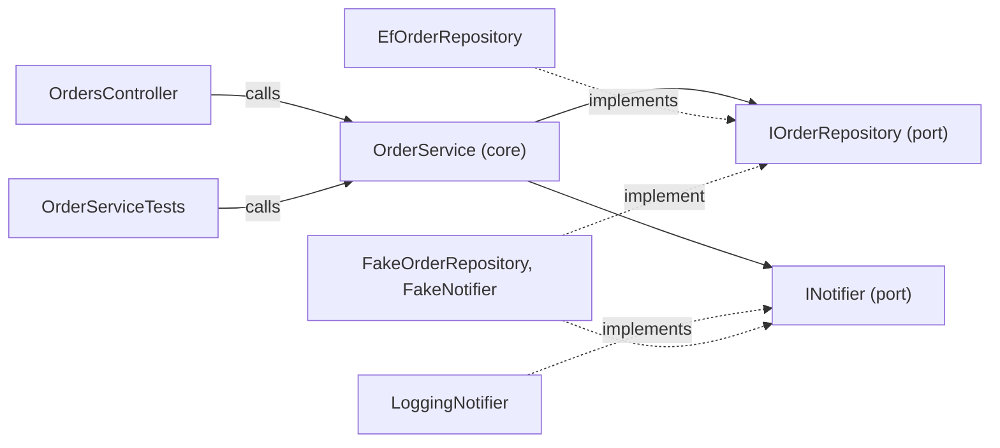

## Bạn cần biết trước

- [[design.l2.ports-and-adapters]] — bạn biết lõi chỉ chạm ra bên ngoài qua các port của nó, và `EfOrderRepository` cùng `LoggingNotifier` là adapter cho các port đó.
- [[design.l1.testing-with-a-fake-repository]] — bạn biết `OrderServiceTests` dựng `OrderService` với `FakeOrderRepository` và `FakeNotifier`, và không cần database nào.
- [[design.l1.the-controller-layer]] — bạn biết `OrdersController.Create` đọc request, gọi `OrderService.PlaceOrderAsync` và trả về `201`.

## Tình huống

Một đồng đội nói phần đặt đơn đã có test. Bạn mở `OrderServiceTests` và thấy `service.PlaceOrderAsync(customerId: 1, items: [OneItem])`: không HTTP request, không token, không `201`. Bạn mở `OrdersController.Create` và thấy đúng phương thức đó, được gọi với mã khách hàng lấy từ token. Bài trước gọi `EfOrderRepository` và `LoggingNotifier` là adapter, tức các class bên ngoài lõi, chuyển đổi giữa lõi và một công nghệ. Controller và test cũng nằm ngoài lõi, và cũng chuyển một thứ gì đó thành lời gọi. Vậy chúng có phải adapter không, và nếu phải thì chúng khác repository ở chỗ nào?

## Khái niệm cốt lõi

- **driving adapter** (adapter gọi vào lõi để yêu cầu nó làm một việc, như controller hoặc một test) — adapter gọi vào lõi để nhờ lõi làm một việc. Trong tình huống trên, đó là `OrdersController` và `OrderServiceTests`.
- **driven adapter** (adapter được lõi gọi qua một port do lõi khai báo, như repository EF Core hay notifier) — adapter mà lõi gọi tới qua một port do chính lõi khai báo. Trong Đơn Hàng, đó là `EfOrderRepository` và `LoggingNotifier`.
- hai phía của lõi — phía lời gọi đi vào, nơi các driving adapter đứng, và phía lõi gọi ra, nơi các driven adapter đứng.

## Cơ chế hoạt động



Mũi tên liền là lời gọi. Hai driving adapter khởi động công việc bằng cách gọi một phương thức public của `OrderService`, rồi lõi gọi tới hai port của nó. Mũi tên chấm nghĩa là "cài đặt": mỗi driven adapter chỉ vào port mà nó đảm nhận.

Trong tình huống trên, `OrdersController` là một driving adapter. Nó biến một HTTP request thành một lời gọi: đọc mã khách hàng từ token, dựng các đối tượng `OrderItem` từ body rồi gọi `PlaceOrderAsync`. Sau đó nó biến `Order` trả về ngược lại thành HTTP: `201` kèm một `OrderDto`. `EfOrderRepository` và `LoggingNotifier`, cả hai nằm trong `DonHang.Infrastructure`, là driven adapter: lõi gọi chúng, qua các port của mình, để lưu đơn và gửi thông báo.

`OrderServiceTests` cũng là một driving adapter, chỉ là không có chút HTTP nào. Nó gọi thẳng `PlaceOrderAsync` và cắm `FakeOrderRepository` cùng `FakeNotifier` vào hai port phía driven. `OrderService` không phân biệt được hai trường hợp. Nó nhận một mã khách hàng và một danh sách sản phẩm, bất kể ai gửi, rồi gọi `IOrderRepository` và `INotifier` nào mà nó được đưa cho. Vì thế cùng một class, không đổi một dòng, chạy phía sau controller trong API và phía sau test trong `DonHang.Tests`.

Hai phía khác nhau ở chỗ ai sở hữu interface. Ở phía driven, lõi cần một thứ từ bên ngoài, nên lõi khai báo một port và adapter phụ thuộc vào port đó. Nhờ port, lõi không phải gọi tên công nghệ nào, đúng như dependency rule đòi hỏi. Ở phía driving, adapter mới là bên cần lõi, và phụ thuộc đó vốn đã hướng về lõi. Vì vậy Đơn Hàng không khai báo interface nào cho phía này: `OrdersController` gọi tên `OrderService` và gọi các phương thức public của nó.

## Trong hệ thống Đơn Hàng

Driving adapter cho HTTP, `OrdersController.Create`:

```csharp file=DonHang.Api/Controllers/OrdersController.cs tag=stage-1 lines=17-28
    [Authorize]
    [HttpPost]
    public async Task<ActionResult<OrderDto>> Create(CreateOrderRequest request)
    {
        var customerId = int.Parse(User.FindFirstValue(JwtRegisteredClaimNames.Sub)!);
        var items = request.Items
            .Select(i => new OrderItem { ProductId = i.ProductId, Quantity = i.Quantity, UnitPriceVnd = i.UnitPriceVnd })
            .ToList();

        var order = await orderService.PlaceOrderAsync(customerId, items);
        return CreatedAtAction(nameof(Get), new { id = order.Id }, ToDto(order));
    }
```

Mọi thứ trước lời gọi `PlaceOrderAsync` đều chuyển HTTP sang từ ngữ của lõi: mã khách hàng lấy từ trường `sub` của token, nơi chứa mã của khách đang đăng nhập, và các đối tượng `OrderItem` lấy từ body của request. Dòng `return` chuyển ngược lại: `CreatedAtAction` trả về `201`, còn `ToDto` đổi `Order` thành một `OrderDto`. Dòng duy nhất làm việc nghiệp vụ là lời gọi `PlaceOrderAsync`. Constructor của class, ngay phía trên đoạn này, xin chính `OrderService`, không phải một interface bọc nó.

Driving adapter thứ hai, trong `OrderServiceTests`:

```csharp file=DonHang.Tests/Services/OrderServiceTests.cs tag=stage-1 lines=11-22
    [Fact]
    public async Task PlaceOrderAsync_ValidItems_SetsStatusNew()
    {
        var repository = new FakeOrderRepository();
        var notifier = new FakeNotifier();
        var service = new OrderService(repository, notifier);

        var order = await service.PlaceOrderAsync(customerId: 1, items: [OneItem]);

        Assert.Equal("new", order.Status);
        Assert.Equal(1, order.CustomerId);
    }
```

Ở đây không có request, cũng không có status code. Test cắm một fake vào mỗi port phía driven, rồi thực hiện đúng lời gọi mà controller ở trên thực hiện, và kiểm tra `Order` nhận về. Code bên trong `PlaceOrderAsync` chạy y hệt như khi nó chạy phía sau API.

## Người mới hay nghĩ rằng…

- **"Chỉ code database và code gửi thông báo mới là adapter, còn controller thuộc về lõi."** → Thực ra `OrdersController` nằm trong `DonHang.Api`, bên ngoài lõi, và toàn bộ việc của nó là chuyển đổi: HTTP đi vào thành một lời gọi phương thức, `Order` quay về thành `201`. Các quy tắc, như từ chối đơn không có sản phẩm nào, nằm trong `OrderService`. Bạn sẽ nhận ra sự nhầm lẫn khi một quy tắc bắt đầu xuất hiện trong một phương thức của controller như `OrdersController.Create`, nơi mà test gọi thẳng `OrderService` không bao giờ chạm tới.
- **"Port nào cũng phải là một interface C#, kể cả thứ mà controller gọi."** → Thực ra port phía driven là interface để lõi không phải gọi tên công nghệ nào. Phụ thuộc từ `OrdersController` tới `OrderService` vốn đã hướng về lõi, nên dependency rule vẫn giữ được mà không cần interface. Các interface duy nhất trong `DonHang.Domain` là `IOrderRepository` và `INotifier`. Một interface ở phía driving có ích khi bạn muốn test riêng controller, với một fake thay cho service. Bạn sẽ nhận ra thói quen này khi một `IOrderService` chỉ có một class cài đặt xuất hiện, chỉ để controller được "nói chuyện qua port".
- **"Test nằm ngoài kiến trúc, nên không tính là đang dùng lõi."** → Thực ra `OrderServiceTests` gọi lõi y như controller gọi: cùng phương thức public, với cùng các quy tắc chạy bên trong. Chính vì vậy một test pass mới nói được điều gì đó về `PlaceOrderAsync`. Bạn sẽ nhận ra sai lầm khi có người thêm vào `OrderService` một phương thức chỉ dành cho test, hoặc một cờ "đang chạy trong test": lúc đó test đang chạy một lõi khác với lõi mà API chạy.

## Thử ngay (3 phút)

Ở thư mục gốc của repo ví dụ, đã checkout tại `stage-1`:

1. Chạy `git grep -n "PlaceOrderAsync(" -- "DonHang.*/*.cs"` để liệt kê nơi phương thức được khai báo và những nơi gọi nó.
2. Chạy `git grep -n "interface " -- DonHang.Domain DonHang.Api` để liệt kê các interface trong lõi và trong project API.

Kết quả mong đợi: lệnh đầu in ra năm dòng: phần khai báo trong `OrderService.cs`, một lời gọi trong `OrdersController.cs` và ba lời gọi trong `OrderServiceTests.cs`. Một phương thức của lõi, hai driving adapter. Lệnh thứ hai in ra hai dòng, `INotifier` và `IOrderRepository`, cả hai trong `DonHang.Domain`: cả hai đều là port phía driven, còn phía driving không có interface nào.

## Liên hệ

- [[design.l2.ports-and-adapters]] — bài mà bài này mở rộng: bài đó gọi tên các adapter được lõi gọi, bài này thêm các adapter gọi vào lõi.
- [[design.l1.the-controller-layer]] — cùng controller mỏng đó, giờ được nhìn như một adapter chuyển HTTP thành lời gọi vào lõi.
- [[design.l1.testing-with-a-fake-repository]] — cùng test đó, giờ được nhìn như driving adapter thứ hai, không cần HTTP.
- [[design.l2.clean-architecture]] — bài tiếp theo: cùng chiều phụ thuộc đó, vẽ thành các vòng tròn thay vì hai phía.

## Tóm tắt 5 dòng

1. Adapter nằm ở hai phía của lõi: driving adapter gọi vào lõi, driven adapter được lõi gọi qua các port của nó.
2. `OrdersController` là một driving adapter: nó biến HTTP request thành lời gọi `PlaceOrderAsync` và biến kết quả ngược lại thành `201`.
3. `OrderServiceTests` là driving adapter thứ hai: nó gọi thẳng `PlaceOrderAsync`, với các fake cắm vào những port phía driven.
4. `OrderService` không biết ai gọi nó hay nó đang gọi adapter nào, nên nó chạy không đổi phía sau cả hai.
5. Đơn Hàng không khai báo interface nào ở phía driving: `OrdersController` gọi thẳng `OrderService`, một phụ thuộc vốn đã hướng về lõi.
