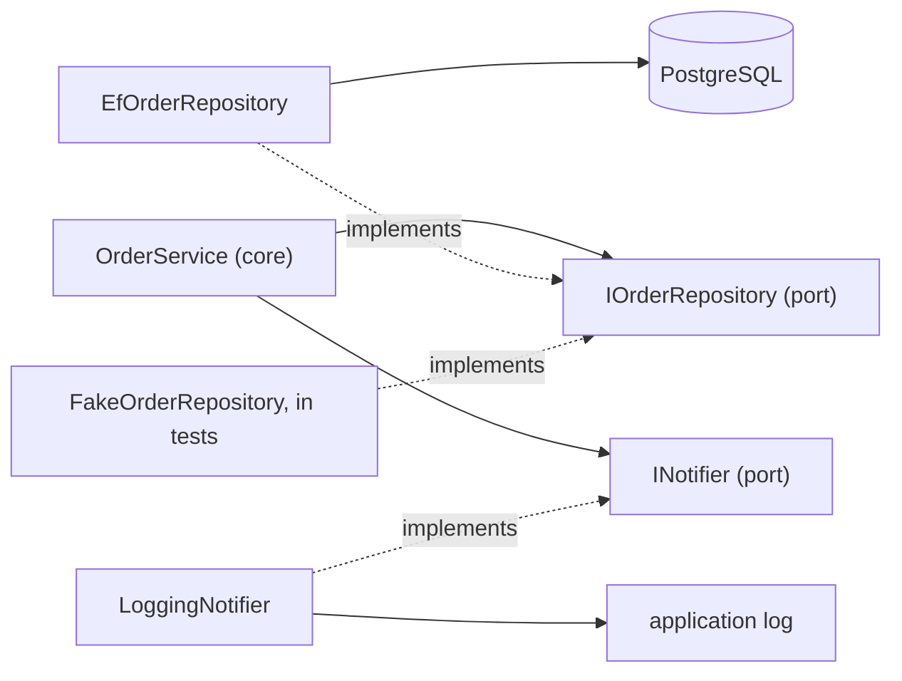

## Before you start

- [[design.l2.dependency-rule]] — you know `DonHang.Domain` references no other project, and that `EfOrderRepository` depends on `IOrderRepository` while the call goes the other way.
- [[design.l2.adapter-pattern]] — you know an adapter implements an interface written in your code's own words and translates each call into a library's calls.

## The situation

At stage-1, every notification in Đơn Hàng is a line in the application log, written by `LoggingNotifier`. The shop now wants a text message to reach the customer when an order is placed. You open `OrderService`, expecting to find logging code to replace. There is none: `PlaceOrderAsync` ends with `notifier.Send(order.Id, "order placed")`, and saving is `repository.AddAsync(order)` followed by `SaveChangesAsync()`. The service never says "log", "PostgreSQL" or "EF Core"; it speaks only through two interfaces of its own project. So what would you write to send a text message, and what would stay untouched?

## Core concepts

- **hexagonal architecture** — a design that keeps the business rules in a core which reaches the outside world only through interfaces the core declares itself; it is also called ports and adapters.
- core — the code that holds the business rules; in Đơn Hàng, `DonHang.Domain`, with `OrderService` and the entities, the classes such as `Order` that describe the business data.
- port — an interface the core declares, in its own words, for something it needs from outside; not the network port a server listens on.
- adapter — a class outside the core that implements one port with one technology.

## How it works



In the situation above, the core is `DonHang.Domain`. `OrderService` needs two things from outside: somewhere to keep orders, and a way to tell someone about an order. For each, the core declares a port in its own words. `IOrderRepository` says: find an order, list a customer's orders, add one, save. `INotifier` says: send a message with a subject about an order. Neither mentions a table, a query, a log or a text message.

Outside the core, each adapter implements one port with one technology. `EfOrderRepository` implements `IOrderRepository` with EF Core and PostgreSQL. `LoggingNotifier` implements `INotifier` by writing to the application log. `FakeOrderRepository`, in `DonHang.Tests`, implements the same `IOrderRepository` with a dictionary in memory, and `FakeNotifier` next to it implements `INotifier` by keeping a list of what was sent. In the diagram, solid arrows are calls, and the dotted arrows go from each adapter to its port: every adapter knows its port, and no port knows any adapter. That is the dependency rule from the previous lesson, now with names on its pieces.

So the answer to the situation is one new adapter: a class outside the core that implements `INotifier` by sending a text message, registered instead of `LoggingNotifier` in `ServiceCollectionExtensions`, the class in `DonHang.Infrastructure` that registers services with the DI container. `OrderService`, the entities and both ports stay as they are, because none of them names the technology. The same holds for storage: another database technology means another adapter for `IOrderRepository`.

The name comes from the usual drawing: the core as a hexagon in the middle, ports on its edges, adapters around it. The shape is only a drawing. What makes a design hexagonal is the direction of the arrows.

## In the Đơn Hàng system

The adapter behind `INotifier`:

```csharp file=DonHang.Infrastructure/LoggingNotifier.cs tag=stage-1 lines=9-13
public sealed class LoggingNotifier(ILogger<LoggingNotifier> logger) : INotifier
{
    public void Send(int orderId, string subject) =>
        logger.LogInformation("notification for order {OrderId}: {Subject}", orderId, subject);
}
```

The port it implements, `INotifier` in `DonHang.Domain`, has one method, `void Send(int orderId, string subject)`, and nothing else. This file starts with `using DonHang.Domain;` and `using Microsoft.Extensions.Logging;`: the adapter knows both the port and the logging library. `INotifier` knows neither `LoggingNotifier` nor any logging library, and no file in `DonHang.Domain` names `LoggingNotifier` or `EfOrderRepository`.

The storage side goes one step further. The entities `Order` and `OrderItem`, in `DonHang.Domain/Entities.cs`, are plain classes with properties, and neither carries an EF Core attribute. Where they are stored is written outside the core:

```csharp file=DonHang.Infrastructure/DonHangDbContext.cs tag=stage-1 lines=38-57
        modelBuilder.Entity<Order>(e =>
        {
            e.ToTable("orders");
            e.Property(o => o.Id).HasColumnName("id");
            e.Property(o => o.CustomerId).HasColumnName("customer_id");
            e.Property(o => o.PlacedAt).HasColumnName("placed_at");
            e.Property(o => o.Status).HasColumnName("status");
            e.HasMany(o => o.Items).WithOne().HasForeignKey(i => i.OrderId);
            e.HasOne(o => o.Customer).WithMany().HasForeignKey(o => o.CustomerId);
        });

        modelBuilder.Entity<OrderItem>(e =>
        {
            e.ToTable("order_items");
            e.HasKey(i => new { i.OrderId, i.ProductId });
            e.Property(i => i.OrderId).HasColumnName("order_id");
            e.Property(i => i.ProductId).HasColumnName("product_id");
            e.Property(i => i.Quantity).HasColumnName("quantity");
            e.Property(i => i.UnitPriceVnd).HasColumnName("unit_price_vnd");
        });
```

`ToTable` names the table, `HasColumnName` the column for each property, `HasMany` and `HasOne` with `HasForeignKey` the foreign keys between tables, and `HasKey` the composite key of `order_items`. All of it lives in `DonHangDbContext`, in `DonHang.Infrastructure`, next to `EfOrderRepository`. The core describes an order; only the adapter side knows it becomes a row in `orders`.

## Beginners often think…

- **"Hexagonal architecture means splitting the application into six layers."** → Actually the hexagon is only how the design is drawn, and its six sides count nothing. Đơn Hàng has one core, two ports and four adapters behind them: two in `DonHang.Infrastructure`, two in `DonHang.Tests`. What makes it hexagonal is that every adapter depends on a port of the core, never the reverse. You notice the confusion when a team creates six projects to "be hexagonal" while the business code still names EF Core.
- **"A port is the network port the API listens on."** → Actually in this lesson a port is an interface of the core, such as `INotifier`; the network port a server listens on is a different idea that happens to share the word. You notice the mix-up when someone looks for the ports among the numbers the API listens on, instead of among the interfaces in `DonHang.Domain`.
- **"An interface belongs next to its implementation, so `IOrderRepository` should live in `DonHang.Infrastructure`."** → Actually a port belongs to the code that needs it, the core, and is written in the core's words. If `IOrderRepository` moved to `DonHang.Infrastructure`, `DonHang.Domain` would need a reference to that project to name it, and the dependency rule would break. You notice the drift when a port's methods start to use types from the technology, such as an EF Core type, instead of the core's own `Order`.

## Try it (3 minutes)

In the root folder of the example repository, checked out at `stage-1`:

1. Run `git grep -n -e ": IOrderRepository" -e ": INotifier" -- "DonHang.*/*.cs"` to list every class in the `DonHang.*` projects that implements one of the two ports.
2. Run `git grep -n -e "EfOrderRepository" -e "LoggingNotifier" -e "FakeOrderRepository" -- DonHang.Domain` to search the core for its adapters.

Expected result: the first command prints four lines: `EfOrderRepository` and `LoggingNotifier` in `DonHang.Infrastructure`, `FakeNotifier` and `FakeOrderRepository` in `DonHang.Tests`. Two ports, two adapters each. The second command prints nothing: the core names none of its adapters.

## Connections

- [[design.l2.dependency-rule]] — the rule this architecture is built on; this lesson names its pieces: the interface in `DonHang.Domain` is a port, the class depending on it from outside is an adapter.
- [[design.l2.adapter-pattern]] — the same move for one library; hexagonal architecture puts such a class at every edge of the core.
- [[design.l1.solid-isp]] — ports are small interfaces shaped by what the core needs, the kind of interface ISP asks for.
- [[design.l2.driving-and-driven-adapters]] — the next lesson: controllers and tests, which call into the core, are adapters too.

## Five-line summary

1. Hexagonal architecture keeps business rules in a core that reaches the outside only through ports, interfaces the core declares itself.
2. `IOrderRepository` and `INotifier` are Đơn Hàng's ports: both live in `DonHang.Domain` and speak in `OrderService`'s words.
3. An adapter implements one port with one technology: `EfOrderRepository` with EF Core and PostgreSQL, `LoggingNotifier` with the application log.
4. `Order` and `OrderItem` carry no EF Core attribute; tables and columns are mapped in `DonHangDbContext`, outside the core.
5. A new technology means a new adapter for the same port, as `FakeOrderRepository` already is for `IOrderRepository`.
