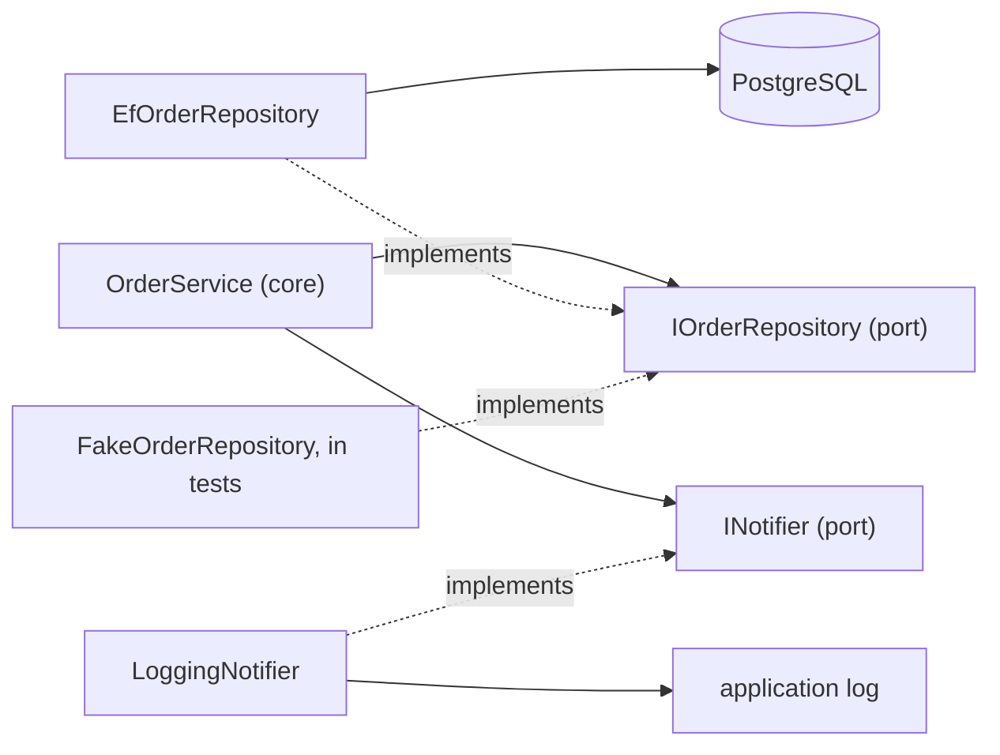

## Bạn cần biết trước

- [[design.l2.dependency-rule]] — bạn biết `DonHang.Domain` không tham chiếu project nào khác, và `EfOrderRepository` phụ thuộc vào `IOrderRepository` trong khi lời gọi đi theo chiều ngược lại.
- [[design.l2.adapter-pattern]] — bạn biết adapter cài đặt một interface viết bằng từ ngữ của chính code bạn và dịch mỗi lời gọi thành các lời gọi của thư viện.

## Tình huống

Ở stage-1, mọi thông báo trong Đơn Hàng chỉ là một dòng trong log của ứng dụng, do `LoggingNotifier` ghi. Giờ shop muốn khách nhận được một tin nhắn khi đặt đơn. Bạn mở `OrderService`, chờ thấy đoạn code ghi log cần thay. Không có: `PlaceOrderAsync` kết thúc bằng `notifier.Send(order.Id, "order placed")`, còn phần lưu là `repository.AddAsync(order)` rồi tới `SaveChangesAsync()`. Service không hề nhắc tới "log", "PostgreSQL" hay "EF Core"; nó chỉ nói chuyện qua hai interface nằm trong chính project của nó. Vậy bạn phải viết gì để gửi tin nhắn, và cái gì giữ nguyên?

## Khái niệm cốt lõi

- **hexagonal architecture** (kiến trúc đặt nghiệp vụ trong một lõi chỉ nói chuyện với bên ngoài qua port, tức interface của lõi, do adapter cài đặt) — một thiết kế giữ quy tắc nghiệp vụ trong một lõi, và lõi chỉ chạm tới thế giới bên ngoài qua các interface do chính nó khai báo. Thiết kế này còn được gọi là ports and adapters.
- lõi — phần code giữ quy tắc nghiệp vụ. Trong Đơn Hàng, đó là `DonHang.Domain`, gồm `OrderService` và các entity, tức các class như `Order` mô tả dữ liệu nghiệp vụ.
- port — một interface do lõi khai báo, bằng từ ngữ của chính nó, cho một thứ nó cần từ bên ngoài. Không phải port mạng mà server lắng nghe.
- adapter — một class bên ngoài lõi, cài đặt một port bằng một công nghệ.

## Cơ chế hoạt động



Trong tình huống trên, lõi là `DonHang.Domain`. `OrderService` cần hai thứ từ bên ngoài: chỗ để giữ đơn hàng, và cách báo cho ai đó về một đơn hàng. Với mỗi thứ, lõi khai báo một port bằng từ ngữ của nó. `IOrderRepository` nói: tìm một đơn, liệt kê đơn của một khách, thêm một đơn, lưu lại. `INotifier` nói: gửi một thông báo có tiêu đề về một đơn hàng. Không port nào nhắc tới bảng, truy vấn, log hay tin nhắn.

Bên ngoài lõi, mỗi adapter cài đặt một port bằng một công nghệ. `EfOrderRepository` cài đặt `IOrderRepository` bằng EF Core và PostgreSQL. `LoggingNotifier` cài đặt `INotifier` bằng cách ghi vào log của ứng dụng. `FakeOrderRepository`, trong `DonHang.Tests`, cài đặt cùng `IOrderRepository` đó bằng một dictionary trong bộ nhớ, còn `FakeNotifier` nằm cạnh nó cài đặt `INotifier` bằng cách giữ danh sách những gì đã gửi. Trong sơ đồ, mũi tên liền là lời gọi, còn mũi tên chấm đi từ mỗi adapter tới port của nó: adapter nào cũng biết port của mình, và không port nào biết adapter nào. Đó chính là dependency rule ở bài trước, giờ các mảnh đã có tên.

Vậy câu trả lời cho tình huống là một adapter mới: một class bên ngoài lõi cài đặt `INotifier` bằng cách gửi tin nhắn, được đăng ký thay cho `LoggingNotifier` trong `ServiceCollectionExtensions`, class trong `DonHang.Infrastructure` chuyên đăng ký service vào DI container. `OrderService`, các entity và cả hai port giữ nguyên, vì không cái nào gọi tên công nghệ. Phần lưu trữ cũng vậy: đổi sang công nghệ database khác nghĩa là viết một adapter khác cho `IOrderRepository`.

Cái tên đến từ cách vẽ quen thuộc: lõi là một hình lục giác ở giữa, port nằm trên các cạnh, adapter bao quanh. Hình dạng chỉ là cách vẽ. Điều làm một thiết kế thành hexagonal là chiều của các mũi tên.

## Trong hệ thống Đơn Hàng

Adapter đứng sau `INotifier`:

```csharp file=DonHang.Infrastructure/LoggingNotifier.cs tag=stage-1 lines=9-13
public sealed class LoggingNotifier(ILogger<LoggingNotifier> logger) : INotifier
{
    public void Send(int orderId, string subject) =>
        logger.LogInformation("notification for order {OrderId}: {Subject}", orderId, subject);
}
```

Port mà nó cài đặt, `INotifier` trong `DonHang.Domain`, có đúng một phương thức, `void Send(int orderId, string subject)`, ngoài ra không có gì. File này mở đầu bằng `using DonHang.Domain;` và `using Microsoft.Extensions.Logging;`: adapter biết cả port lẫn thư viện ghi log. `INotifier` thì không biết `LoggingNotifier`, cũng không biết thư viện ghi log nào, và không file nào trong `DonHang.Domain` gọi tên `LoggingNotifier` hay `EfOrderRepository`.

Phía lưu trữ còn đi xa hơn một bước. Các entity `Order` và `OrderItem`, trong `DonHang.Domain/Entities.cs`, là những class bình thường chỉ có property, và không class nào mang attribute của EF Core. Chúng được lưu ở đâu thì được viết bên ngoài lõi:

```csharp file=DonHang.Infrastructure/DonHangDbContext.cs tag=stage-1 lines=38-57
        modelBuilder.Entity<Order>(e =>
        {
            e.ToTable("orders");
            e.Property(o => o.Id).HasColumnName("id");
            e.Property(o => o.CustomerId).HasColumnName("customer_id");
            e.Property(o => o.PlacedAt).HasColumnName("placed_at");
            e.Property(o => o.Status).HasColumnName("status");
            e.HasMany(o => o.Items).WithOne().HasForeignKey(i => i.OrderId);
            e.HasOne(o => o.Customer).WithMany().HasForeignKey(o => o.CustomerId);
        });

        modelBuilder.Entity<OrderItem>(e =>
        {
            e.ToTable("order_items");
            e.HasKey(i => new { i.OrderId, i.ProductId });
            e.Property(i => i.OrderId).HasColumnName("order_id");
            e.Property(i => i.ProductId).HasColumnName("product_id");
            e.Property(i => i.Quantity).HasColumnName("quantity");
            e.Property(i => i.UnitPriceVnd).HasColumnName("unit_price_vnd");
        });
```

`ToTable` đặt tên bảng, `HasColumnName` đặt tên cột cho từng property, `HasMany` và `HasOne` đi cùng `HasForeignKey` khai báo khóa ngoại giữa các bảng, còn `HasKey` đặt khóa kết hợp của `order_items`. Tất cả nằm trong `DonHangDbContext`, thuộc `DonHang.Infrastructure`, cạnh `EfOrderRepository`. Lõi mô tả một đơn hàng; chỉ phía adapter biết đơn hàng đó trở thành một dòng trong `orders`.

## Người mới hay nghĩ rằng…

- **"Hexagonal architecture nghĩa là chia ứng dụng thành sáu tầng."** → Thực ra hình lục giác chỉ là cách vẽ thiết kế, và sáu cạnh của nó không đếm thứ gì. Đơn Hàng có một lõi, hai port và bốn adapter đứng sau chúng: hai trong `DonHang.Infrastructure`, hai trong `DonHang.Tests`. Điều làm nó thành hexagonal là mọi adapter đều phụ thuộc vào một port của lõi, không bao giờ ngược lại. Bạn sẽ nhận ra sự nhầm lẫn khi một team tạo sáu project để "cho ra hexagonal" trong khi code nghiệp vụ vẫn gọi tên EF Core.
- **"Port là port mạng mà API lắng nghe."** → Thực ra trong bài này, port là một interface của lõi, như `INotifier`. Port mạng mà server lắng nghe là một ý khác, chỉ tình cờ trùng tên. Bạn sẽ nhận ra sự nhầm lẫn khi có người đi tìm port trong những con số mà API lắng nghe, thay vì trong các interface của `DonHang.Domain`.
- **"Interface phải nằm cạnh phần cài đặt của nó, nên `IOrderRepository` phải ở trong `DonHang.Infrastructure`."** → Thực ra port thuộc về phần code cần nó, tức lõi, và được viết bằng từ ngữ của lõi. Nếu `IOrderRepository` dời sang `DonHang.Infrastructure`, `DonHang.Domain` sẽ cần tham chiếu tới project đó mới gọi tên được nó, và dependency rule bị phá. Bạn sẽ nhận ra khi các phương thức của một port bắt đầu dùng kiểu của công nghệ, như một kiểu của EF Core, thay vì `Order` của chính lõi.

## Thử ngay (3 phút)

Ở thư mục gốc của repo ví dụ, đã checkout tại `stage-1`:

1. Chạy `git grep -n -e ": IOrderRepository" -e ": INotifier" -- "DonHang.*/*.cs"` để liệt kê mọi class trong các project `DonHang.*` cài đặt một trong hai port.
2. Chạy `git grep -n -e "EfOrderRepository" -e "LoggingNotifier" -e "FakeOrderRepository" -- DonHang.Domain` để tìm các adapter bên trong lõi.

Kết quả mong đợi: lệnh đầu in ra bốn dòng: `EfOrderRepository` và `LoggingNotifier` trong `DonHang.Infrastructure`, `FakeNotifier` và `FakeOrderRepository` trong `DonHang.Tests`. Hai port, mỗi port hai adapter. Lệnh thứ hai không in gì: lõi không gọi tên adapter nào của nó.

## Liên hệ

- [[design.l2.dependency-rule]] — quy tắc mà kiến trúc này dựa trên; bài này đặt tên cho các mảnh của nó: interface trong `DonHang.Domain` là port, class phụ thuộc vào nó từ bên ngoài là adapter.
- [[design.l2.adapter-pattern]] — cùng cách làm đó, áp cho một thư viện; hexagonal architecture đặt một class như vậy ở mọi cạnh của lõi.
- [[design.l1.solid-isp]] — port là những interface nhỏ, được cắt theo đúng thứ lõi cần, đúng loại interface mà ISP yêu cầu.
- [[design.l2.driving-and-driven-adapters]] — bài tiếp theo: controller và test, những thứ gọi vào lõi, cũng là adapter.

## Tóm tắt 5 dòng

1. Hexagonal architecture giữ quy tắc nghiệp vụ trong một lõi chỉ chạm ra bên ngoài qua port, tức các interface do chính lõi khai báo.
2. `IOrderRepository` và `INotifier` là port của Đơn Hàng: cả hai nằm trong `DonHang.Domain` và nói bằng từ ngữ của `OrderService`.
3. Adapter cài đặt một port bằng một công nghệ: `EfOrderRepository` bằng EF Core và PostgreSQL, `LoggingNotifier` bằng log của ứng dụng.
4. `Order` và `OrderItem` không mang attribute nào của EF Core; bảng và cột được ánh xạ trong `DonHangDbContext`, bên ngoài lõi.
5. Công nghệ mới nghĩa là adapter mới cho cùng port, như `FakeOrderRepository` đã là adapter thứ hai cho `IOrderRepository`.
