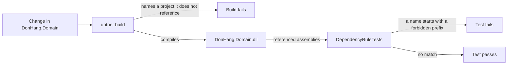

## Before you start

- [[design.l2.composition-root]] — you know `DonHang.Api` is the one project that has to know every other one, while `DonHang.Domain` references none.
- [[design.l1.writing-a-unit-test]] — you know xUnit runs every `[Fact]` method, and that an `Assert` call fails the test when its check does not hold.

## The situation

At stage-2 a comment on `Order.IdempotencyKey` says a unique index guards it, and that index is set up in `DonHangDbContext`, far from the property. A teammate would rather put EF Core's attribute for an index on `Order` itself. To use it, he adds an EF Core package to `DonHang.Domain.csproj`. The solution builds, the change is a few lines, and reviewers read the attribute as a helpful note. The build stays green, yet the core now depends on EF Core. What in the repository could refuse this change before anyone has to spot it?

## Core concepts

- assembly — the compiled `.dll` file a project builds into; `DonHang.Domain` builds into `DonHang.Domain.dll`.
- referenced assemblies — the names an assembly records of every other assembly its compiled code uses.
- package — a library downloaded by name, such as EF Core; a `PackageReference` line in a project file makes its assemblies, and those of the packages it depends on, available to that project.
- **architecture test** — a unit test that checks how the code is structured, such as which assemblies a project uses, instead of how it behaves.

## How it works



Two checks guard the core, and they catch different mistakes. The first is the build. `DonHang.Domain.csproj` has no `ProjectReference`, so if code in the core names a type from `DonHang.Infrastructure`, the compiler cannot find it and the build fails. But the build obeys the project file, and anyone can add a `PackageReference` to it. In the situation above, the teammate added an EF Core package, the attribute compiled, and the build stayed green.

The second check is `DependencyRuleTests`, an architecture test. It takes `typeof(OrderService).Assembly`, the compiled `DonHang.Domain.dll`, and reads its referenced assemblies. It compares each name with seven forbidden prefixes, one per outer project or library: `DonHang.Infrastructure`, `DonHang.Api`, `Microsoft.EntityFrameworkCore`, `Microsoft.AspNetCore`, `Npgsql`, `StackExchange.Redis` and `MailKit`. It compares prefixes, not exact names, because one library can ship several assemblies. With the attribute on `Order`, the list holds `Microsoft.EntityFrameworkCore.Abstractions`, the EF Core assembly that declares that attribute, so the test fails and names it.

An assembly records a reference only when its compiled code uses a type from that assembly. A package added to the project file but never used leaves no trace, so the test stays green until the first line of code uses it. That line is the moment the rule breaks, and the moment the test notices.

The test is an ordinary `[Fact]` in `DonHang.Tests`, so it runs with every other test. A change that breaks the rule shows up as a failing test before code review, not as a comment during it.

## In the Đơn Hàng system

The architecture test:

```csharp file=DonHang.Tests/Architecture/DependencyRuleTests.cs tag=stage-2 lines=11-33
    private static readonly string[] ForbiddenPrefixes =
    [
        "DonHang.Infrastructure",
        "DonHang.Api",
        "Microsoft.EntityFrameworkCore",
        "Microsoft.AspNetCore",
        "Npgsql",
        "StackExchange.Redis",
        "MailKit",
    ];

    [Fact]
    public void DomainReferencesNoOuterAssembly()
    {
        var referenced = typeof(OrderService).Assembly.GetReferencedAssemblies();

        var forbidden = referenced
            .Select(assembly => assembly.Name!)
            .Where(name => ForbiddenPrefixes.Any(prefix => name.StartsWith(prefix)))
            .ToList();

        Assert.Empty(forbidden);
    }
```

`typeof(OrderService).Assembly` is the assembly that contains `OrderService`, which is `DonHang.Domain.dll`. `GetReferencedAssemblies` is a method .NET provides for reading the names that assembly recorded. The query keeps every name that starts with a forbidden prefix, and `Assert.Empty` fails if any remain, listing them. Nothing here runs `OrderService`: the test looks only at what the core is built against.

The test project itself references more than the core:

```xml file=DonHang.Tests/DonHang.Tests.csproj tag=stage-2 lines=27-34
  <!-- lesson: design.l2.testing-the-dependency-rule -->
  <!-- The tests reference every layer; only DonHang.Domain's own .csproj
       decides what the core is built against, and DependencyRuleTests checks it. -->
  <ItemGroup>
    <ProjectReference Include="..\DonHang.Domain\DonHang.Domain.csproj" />
    <ProjectReference Include="..\DonHang.Infrastructure\DonHang.Infrastructure.csproj" />
    <ProjectReference Include="..\DonHang.Api\DonHang.Api.csproj" />
  </ItemGroup>
```

`DonHang.Tests` can name all three projects, because other tests at stage-2 exercise `EfOrderRepository` and the whole API. That does not weaken the check: the test reads `DonHang.Domain.dll`, which is built only from `DonHang.Domain.csproj`.

## Beginners often think…

- **"If the solution builds, the core cannot depend on a framework."** → Actually the build checks code against the project file, and the project file is just another file a change can edit. Adding an EF Core package to `DonHang.Domain.csproj` is allowed, and code that uses it compiles. You notice this when a pull request adds one `PackageReference` line to the core's project file and every build stays green.
- **"Unit tests can only check behaviour, so structure needs a separate tool."** → Actually `DependencyRuleTests` is a plain xUnit `[Fact]`: it reads data about the compiled core with a method .NET already has and asserts on it. Đơn Hàng adds no package for it. You notice the belief when a team postpones guarding the rule "until we pick a tool", while the check fits in one test method.
- **"If the architecture test passes, the design is clean."** → Actually it proves only its own rule: the core's compiled code uses no outer assembly. It says nothing about where a business rule lives; `ProductsController.List` could hold one, and the test would still pass. You notice the mistake when a green test is offered as the answer in a review whose question was whether a rule belongs in a controller.

## Try it (3 minutes)

In the root folder of the example repository, checked out at `stage-2`, with the .NET SDK installed (this one test needs no database):

1. In `DonHang.Domain/DonHang.Domain.csproj`, add an `ItemGroup` holding `<PackageReference Include="Npgsql.EntityFrameworkCore.PostgreSQL" />`, then run `dotnet test DonHang.Tests --filter DependencyRuleTests`.
2. In `DonHang.Domain/Entities.cs`, add to the class `Order` a property `public Microsoft.EntityFrameworkCore.DbContext? Db { get; set; }`, run the same command again, then undo both changes.

Expected result: the first run ends with a line starting `Passed!`: the package is referenced, but no code uses it. The second ends with `Failed!`, after `Assert.Empty() Failure: Collection was not empty` and `Collection: ["Microsoft.EntityFrameworkCore"]`, the EF Core assembly that declares `DbContext`. The build stayed green both times; only the test noticed.

## Connections

- [[design.l2.dependency-rule]] — the rule this test turns into a check that can fail.
- [[design.l2.composition-root]] — the one place allowed to know every project; this test guards the opposite end, the core that knows none.
- [[design.l1.writing-a-unit-test]] — the same `[Fact]` and `Assert`, pointed at structure instead of behaviour.

## Five-line summary

1. An architecture test is a unit test that checks how code is structured, such as which assemblies a project uses, not how it behaves.
2. `DependencyRuleTests` reads the referenced assemblies of `DonHang.Domain.dll` and fails on seven outer prefixes, such as `Npgsql` and `DonHang.Api`.
3. The build stops the core from naming an unreferenced project, but not from gaining an EF Core package.
4. The test runs with every other test, so a broken rule shows up as a failure before code review.
5. A passing architecture test proves only its rule, not that each business rule sits in the core.
