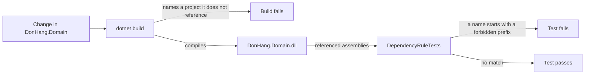

## Bạn cần biết trước

- [[design.l2.composition-root]] — bạn biết `DonHang.Api` là project duy nhất phải biết mọi project khác, còn `DonHang.Domain` không tham chiếu project nào.
- [[design.l1.writing-a-unit-test]] — bạn biết xUnit chạy mọi phương thức `[Fact]`, và một lời gọi `Assert` làm test fail khi điều nó kiểm tra không đúng.

## Tình huống

Ở stage-2, một comment trên `Order.IdempotencyKey` nói rằng có một unique index canh giữ nó, và index đó được khai báo trong `DonHangDbContext`, cách xa property. Một đồng đội muốn gắn thẳng attribute khai báo index của EF Core lên `Order`. Để dùng được attribute đó, anh ấy thêm một package EF Core vào `DonHang.Domain.csproj`. Solution vẫn build được, thay đổi chỉ vài dòng, và người review đọc attribute như một ghi chú có ích. Build vẫn xanh, vậy mà lõi giờ đã phụ thuộc vào EF Core. Thứ gì trong repo có thể từ chối thay đổi này trước khi có ai phải tự phát hiện ra?

## Khái niệm cốt lõi

- assembly — file `.dll` đã biên dịch mà một project build ra; `DonHang.Domain` build ra `DonHang.Domain.dll`.
- referenced assembly — những cái tên mà một assembly ghi lại cho mọi assembly khác mà code đã biên dịch của nó dùng tới.
- package — một thư viện tải về theo tên, như EF Core; một dòng `PackageReference` trong file project đưa các assembly của package đó, cùng assembly của những package nó phụ thuộc, vào tầm dùng của project.
- **architecture test** (test kiểm cấu trúc code, như project nào dùng assembly nào, thay vì hành vi) — một unit test kiểm tra code được cấu trúc ra sao, chẳng hạn một project dùng những assembly nào, thay vì code làm gì.

## Cơ chế hoạt động



Có hai lớp kiểm tra canh giữ lõi, và chúng bắt những lỗi khác nhau. Lớp đầu là build. `DonHang.Domain.csproj` không có `ProjectReference` nào, nên nếu code trong lõi gọi tên một kiểu của `DonHang.Infrastructure`, compiler không tìm thấy kiểu đó và build fail. Nhưng build làm theo file project, và ai cũng thêm được một `PackageReference` vào file đó. Trong tình huống trên, đồng đội đã thêm một package EF Core, attribute biên dịch bình thường, và build vẫn xanh.

Lớp thứ hai là `DependencyRuleTests`, một architecture test. Nó lấy `typeof(OrderService).Assembly`, tức `DonHang.Domain.dll` đã biên dịch, rồi đọc các referenced assembly của nó. Nó so từng tên với bảy tiền tố bị cấm, mỗi tiền tố ứng với một project hay thư viện bên ngoài: `DonHang.Infrastructure`, `DonHang.Api`, `Microsoft.EntityFrameworkCore`, `Microsoft.AspNetCore`, `Npgsql`, `StackExchange.Redis` và `MailKit`. Nó so theo tiền tố chứ không so đúng tên, vì một thư viện có thể gồm nhiều assembly. Khi attribute đã nằm trên `Order`, danh sách có `Microsoft.EntityFrameworkCore.Abstractions`, assembly của EF Core khai báo attribute đó, nên test fail và nêu đúng tên này.

Một assembly chỉ ghi lại tham chiếu khi code đã biên dịch của nó dùng một kiểu từ assembly kia. Một package được thêm vào file project mà chưa ai dùng thì không để lại dấu vết gì, nên test vẫn xanh cho tới khi dòng code đầu tiên dùng tới nó. Dòng đó chính là lúc quy tắc bị phá, và cũng là lúc test phát hiện ra.

Test này là một `[Fact]` bình thường trong `DonHang.Tests`, nên nó chạy cùng mọi test khác. Một thay đổi phá quy tắc sẽ hiện ra thành một test fail trước khi tới code review, chứ không phải thành một comment trong lúc review.

## Trong hệ thống Đơn Hàng

Architecture test:

```csharp file=DonHang.Tests/Architecture/DependencyRuleTests.cs tag=stage-2 lines=11-33
    private static readonly string[] ForbiddenPrefixes =
    [
        "DonHang.Infrastructure",
        "DonHang.Api",
        "Microsoft.EntityFrameworkCore",
        "Microsoft.AspNetCore",
        "Npgsql",
        "StackExchange.Redis",
        "MailKit",
    ];

    [Fact]
    public void DomainReferencesNoOuterAssembly()
    {
        var referenced = typeof(OrderService).Assembly.GetReferencedAssemblies();

        var forbidden = referenced
            .Select(assembly => assembly.Name!)
            .Where(name => ForbiddenPrefixes.Any(prefix => name.StartsWith(prefix)))
            .ToList();

        Assert.Empty(forbidden);
    }
```

`typeof(OrderService).Assembly` là assembly chứa `OrderService`, tức `DonHang.Domain.dll`. `GetReferencedAssemblies` là một phương thức có sẵn trong .NET để đọc những cái tên mà assembly đó đã ghi lại. Câu truy vấn giữ lại mọi tên bắt đầu bằng một tiền tố bị cấm, và `Assert.Empty` fail nếu còn tên nào, kèm danh sách các tên đó. Không chỗ nào ở đây chạy `OrderService`: test chỉ nhìn vào những gì lõi được build dựa trên.

Bản thân project test tham chiếu nhiều hơn lõi:

```xml file=DonHang.Tests/DonHang.Tests.csproj tag=stage-2 lines=27-34
  <!-- lesson: design.l2.testing-the-dependency-rule -->
  <!-- The tests reference every layer; only DonHang.Domain's own .csproj
       decides what the core is built against, and DependencyRuleTests checks it. -->
  <ItemGroup>
    <ProjectReference Include="..\DonHang.Domain\DonHang.Domain.csproj" />
    <ProjectReference Include="..\DonHang.Infrastructure\DonHang.Infrastructure.csproj" />
    <ProjectReference Include="..\DonHang.Api\DonHang.Api.csproj" />
  </ItemGroup>
```

`DonHang.Tests` gọi tên được cả ba project, vì các test khác ở stage-2 chạy thử `EfOrderRepository` và toàn bộ API. Điều đó không làm yếu phép kiểm tra: test đọc `DonHang.Domain.dll`, file chỉ được build từ `DonHang.Domain.csproj`.

## Người mới hay nghĩ rằng…

- **"Nếu solution build được thì lõi không thể phụ thuộc vào framework nào."** → Thực ra build kiểm tra code dựa trên file project, mà file project cũng chỉ là một file mà thay đổi nào cũng sửa được. Thêm một package EF Core vào `DonHang.Domain.csproj` là được phép, và code dùng nó vẫn biên dịch được. Bạn sẽ nhận ra khi một pull request thêm đúng một dòng `PackageReference` vào file project của lõi mà build nào cũng vẫn xanh.
- **"Unit test chỉ kiểm được hành vi, nên muốn kiểm cấu trúc phải có công cụ riêng."** → Thực ra `DependencyRuleTests` là một `[Fact]` xUnit bình thường: nó đọc thông tin về lõi đã biên dịch bằng một phương thức .NET có sẵn rồi assert trên đó. Đơn Hàng không thêm package nào cho nó. Bạn sẽ nhận ra niềm tin này khi một team hoãn việc canh giữ quy tắc "cho tới khi chọn xong công cụ", trong khi phép kiểm tra chỉ gói gọn trong một phương thức test.
- **"Nếu architecture test pass thì thiết kế đã sạch."** → Thực ra nó chỉ chứng minh đúng quy tắc của nó: code đã biên dịch của lõi không dùng assembly nào bên ngoài. Nó không nói gì về chỗ một quy tắc nghiệp vụ nằm; `ProductsController.List` có thể chứa một quy tắc như vậy mà test vẫn pass. Bạn sẽ nhận ra sai lầm khi một test xanh được đưa ra làm câu trả lời trong một buổi review mà câu hỏi là quy tắc có nên nằm trong controller hay không.

## Thử ngay (3 phút)

Ở thư mục gốc của repo ví dụ, đã checkout tại `stage-2`, có cài .NET SDK (riêng test này không cần database):

1. Trong `DonHang.Domain/DonHang.Domain.csproj`, thêm một `ItemGroup` chứa `<PackageReference Include="Npgsql.EntityFrameworkCore.PostgreSQL" />`, rồi chạy `dotnet test DonHang.Tests --filter DependencyRuleTests`.
2. Trong `DonHang.Domain/Entities.cs`, thêm vào class `Order` một property `public Microsoft.EntityFrameworkCore.DbContext? Db { get; set; }`, chạy lại đúng lệnh đó, rồi hoàn tác cả hai thay đổi.

Kết quả mong đợi: lần chạy đầu kết thúc bằng một dòng bắt đầu bằng `Passed!`: package đã được tham chiếu nhưng chưa code nào dùng. Lần thứ hai kết thúc bằng `Failed!`, sau hai dòng `Assert.Empty() Failure: Collection was not empty` và `Collection: ["Microsoft.EntityFrameworkCore"]`, assembly của EF Core khai báo `DbContext`. Cả hai lần build đều xanh; chỉ có test phát hiện ra.

## Liên hệ

- [[design.l2.dependency-rule]] — quy tắc mà test này biến thành một phép kiểm tra có thể fail.
- [[design.l2.composition-root]] — nơi duy nhất được phép biết mọi project; test này canh giữ đầu bên kia, phần lõi không biết project nào.
- [[design.l1.writing-a-unit-test]] — vẫn là `[Fact]` và `Assert` đó, nhưng hướng vào cấu trúc thay vì hành vi.

## Tóm tắt 5 dòng

1. Architecture test là unit test kiểm tra code được cấu trúc ra sao, như project dùng những assembly nào, chứ không kiểm tra hành vi.
2. `DependencyRuleTests` đọc các referenced assembly của `DonHang.Domain.dll` và fail khi gặp bảy tiền tố bên ngoài, như `Npgsql` và `DonHang.Api`.
3. Build chặn được việc lõi gọi tên một project không tham chiếu, nhưng không chặn được việc lõi nhận thêm một package EF Core.
4. Test chạy cùng mọi test khác, nên quy tắc bị phá sẽ hiện ra thành test fail trước khi tới code review.
5. Architecture test pass chỉ chứng minh quy tắc của nó, không chứng minh mọi quy tắc nghiệp vụ đều nằm trong lõi.
