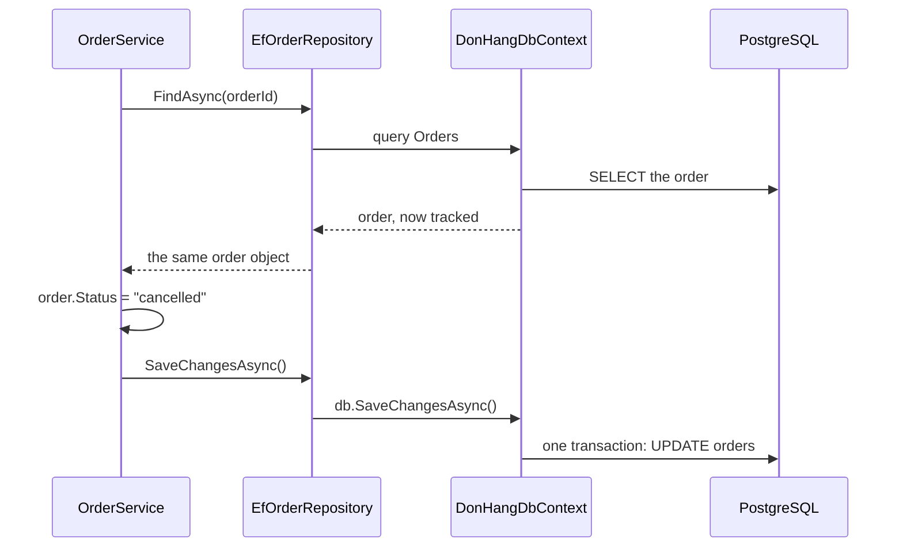

## Before you start

- [[design.l2.ports-and-adapters]] — you know `IOrderRepository` is a port of the core and `EfOrderRepository` is its adapter, built on EF Core.
- [[backend.l2.no-tracking-queries]] — you know the change tracker keeps a snapshot of each tracked entity, so `SaveChangesAsync` writes only what changed.
- [[design.l1.service-lifetimes]] — you know `DonHangDbContext` and `EfOrderRepository` are scoped, so one request shares one instance of each.

## The situation

A teammate asks you to review `CancelOrderAsync` in `OrderService`. It loads the order with `repository.FindAsync(orderId)`, sets `order.Status = "cancelled"`, and calls `repository.SaveChangesAsync()`. You look in `IOrderRepository` for an `Update` method that hands the changed order back to be saved. There is none: the interface has four methods, and `SaveChangesAsync` takes no argument at all. Yet `PATCH /api/v1/orders/{id}/cancel` works, and afterwards the order's row in `orders` says `cancelled`. How does a save call that is given nothing know what to write?

## Core concepts

- **unit of work** — an object that keeps track of everything one business operation changes and writes all of it together at the end, so the operation is saved completely or not at all.
- change tracker — the part of a `DbContext` that remembers each entity it loaded or was given, and compares it with its snapshot when you save.
- `SaveChangesAsync` on a `DbContext` — the one call that turns every change the change tracker found into SQL and sends it in a single transaction.
- one `DonHangDbContext` per request — the scoped instance that every class built for that request and asking for a `DonHangDbContext` receives.

## How it works



In the situation above, the unit of work is the `DonHangDbContext` behind `EfOrderRepository`. EF Core's `DbContext` is a unit of work: its change tracker records what was added or modified, and one `SaveChangesAsync` writes all of it in a single transaction.

Follow the diagram from the top. `FindAsync` runs a tracked query, so the `Order` object that comes back is one the context remembers, with a snapshot of its values. `OrderService` then changes `Status` on that object. Nothing is sent to PostgreSQL at this point; the change exists only in the api's memory.

Then `OrderService` calls `SaveChangesAsync()` on the repository, which passes the call to `db.SaveChangesAsync()`. The context compares each tracked entity with its snapshot, finds that `Status` changed, and sends an `UPDATE` for that row. That is the answer to the situation: the save call needs no argument, because the context already knows what the operation changed.

The context does not track "changes made through `EfOrderRepository`". It tracks every entity loaded or added through that instance of `DonHangDbContext`. Because the context is scoped, any other class given the same instance in that request adds its changes to the same list, and the one `db.SaveChangesAsync()` writes them all in the same transaction. If one of the writes fails, the transaction is rolled back and none of them is saved.

## In the Đơn Hàng system

The operation, in the core:

```csharp file=DonHang.Domain/OrderService.cs tag=stage-1 lines=29-38
    public async Task<Order> CancelOrderAsync(int orderId)
    {
        var order = await repository.FindAsync(orderId)
            ?? throw new KeyNotFoundException($"order {orderId} not found");

        order.Status = "cancelled";
        await repository.SaveChangesAsync();
        notifier.Send(order.Id, "order cancelled");
        return order;
    }
```

Look at what the method never says. It does not tell the repository which order changed or which field. It changes `Status` on the object `FindAsync` returned and then says "this operation is finished" by calling `SaveChangesAsync`. The tracked `DbContext` behind the repository noticed the rest.

The adapter, outside the core:

```csharp file=DonHang.Infrastructure/EfOrderRepository.cs tag=stage-1 lines=7-19
public sealed class EfOrderRepository(DonHangDbContext db) : IOrderRepository
{
    public Task<Order?> FindAsync(int id) =>
        db.Orders.Include(o => o.Items).FirstOrDefaultAsync(o => o.Id == id);

    // lesson: backend.l1.efcore-n-plus-one
    public Task<List<Order>> ListByCustomerAsync(int customerId) =>
        db.Orders.Where(o => o.CustomerId == customerId).Include(o => o.Customer).OrderBy(o => o.Id).ToListAsync();

    public async Task AddAsync(Order order) => await db.Orders.AddAsync(order);

    public Task SaveChangesAsync() => db.SaveChangesAsync();
}
```

The last line is the whole unit of work on the adapter side: one line that forwards to the context. It saves every change that scoped `DbContext` tracks, not only changes to orders.

`SaveChangesAsync` is declared on the port, `IOrderRepository`, in `DonHang.Domain`. That lets `OrderService` decide when an operation is finished without naming EF Core. In `DonHang.Tests`, `FakeOrderRepository` implements it as `Task.CompletedTask`: it does nothing, because its `FindAsync` returns the object stored in its dictionary, so the service's change is already there.

When is a separate unit-of-work class worth writing? A class of your own around the `DbContext` with one `SaveChangesAsync` repeats what EF Core already does. It pays off when the core coordinates several repositories in one operation and needs one save call that belongs to none of them. Calling the save on one of them also works, but then that repository saves changes it does not own, and a reader cannot tell. At stage-1 `OrderService` has one repository, so the call sits on that port.

## Beginners often think…

- **"A unit of work is just another name for a database transaction."** → Actually the unit of work is bookkeeping inside the api for the whole operation, while the transaction is the database's promise of all or nothing. Here the transaction covers only the final `SaveChangesAsync`; `FindAsync` ran before it, on its own. You notice this when a teammate expects the order to be locked from `FindAsync` until the save: another request can read and change it in between.
- **"`IOrderRepository` has no `Update` method, so changing `order.Status` is never saved."** → Actually the order came from a tracked query, so the context compares it with its snapshot and writes the change at `SaveChangesAsync`. You notice the real rule when a changed order is one this context never loaded: saving writes nothing for it.
- **"Each repository saves its own changes, so two repositories used in one request always write in two separate transactions."** → Actually `SaveChangesAsync` on a repository saves everything its scoped `DbContext` tracks. Two repositories given the same instance share one change tracker, so one call writes the changes of both in one transaction. You notice it when a save through one repository also writes an entity changed through the other.
- **"Clean code needs a generic repository and a unit-of-work class wrapped around EF Core."** → Actually `DbContext` already is a unit of work. Wrapping it in a generic repository, one repository class with the same add, find and save methods for every entity type, plus a class whose `Save` only calls `SaveChangesAsync`, adds a layer and no behaviour. The opposing view has a point when one operation uses several repositories and the save should not sit on any one of them: then a small unit-of-work port keeps it out of every repository. You notice the empty wrapper when every method in it is one line that forwards to EF Core.

## Try it (3 minutes)

In the root folder of the example repository, checked out at `stage-1`:

1. Run `git grep -n "SaveChanges" -- "DonHang.*/*.cs"` to list every line that declares, implements or calls a save.
2. Run `git grep -n "Update" -- "DonHang.*/*.cs"` to look for an update method anywhere in the `DonHang.*` projects.

Expected result: the first command prints five lines. `IOrderRepository.cs` declares `SaveChangesAsync`, `OrderService.cs` calls it twice (once in `PlaceOrderAsync`, once in `CancelOrderAsync`), `EfOrderRepository.cs` forwards it to `db.SaveChangesAsync()`, and `FakeOrderRepository.cs` returns `Task.CompletedTask`. The second command prints nothing: no code in these projects tells EF Core that an order was updated, yet cancelling works.

## Connections

- [[design.l2.ports-and-adapters]] — the port and adapter this lesson looks inside: `SaveChangesAsync` on the port, one forwarding line in the adapter.
- [[backend.l2.no-tracking-queries]] — the other side of the same mechanism: which entities the context tracks decides what a save can write.
- [[backend.l2.database-job-queue]] — the payoff at stage-2: a second class shares the request's `DonHangDbContext`, so one `SaveChangesAsync` writes the order and its job together.
- [[backend.l2.transactions-in-practice]] — what a unit of work does not give you: the transaction covers only the save, and what other requests do in between is that lesson's topic.
- [[design.l1.the-repository-layer]] — the repository this lesson completes: that lesson hid the `DbContext` behind four methods; this one explains why `SaveChangesAsync` needs no argument.

## Five-line summary

1. A unit of work tracks everything one operation changes and writes it all together, and EF Core's `DbContext` already is one.
2. `CancelOrderAsync` changes `Status` on a tracked order and calls `SaveChangesAsync`; the context noticed the change, so no `Update` method is needed.
3. `db.SaveChangesAsync()` writes every change the scoped `DbContext` tracks, from any class sharing it in the request, in one transaction.
4. `SaveChangesAsync` on `IOrderRepository` lets the core end an operation without naming EF Core; the fake implements it as doing nothing.
5. Write your own unit-of-work class only when one operation spans several repositories and the save belongs to none of them.
