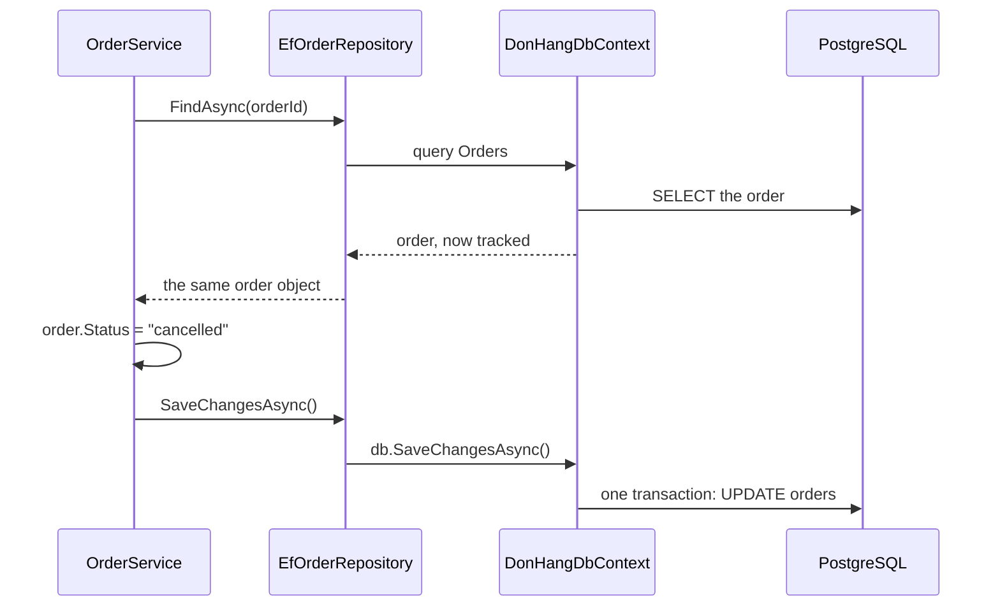

## Bạn cần biết trước

- [[design.l2.ports-and-adapters]] — bạn biết `IOrderRepository` là một port của lõi, còn `EfOrderRepository` là adapter của nó, xây trên EF Core.
- [[backend.l2.no-tracking-queries]] — bạn biết change tracker giữ một snapshot của mỗi entity được theo dõi, nên `SaveChangesAsync` chỉ ghi những gì đã đổi.
- [[design.l1.service-lifetimes]] — bạn biết `DonHangDbContext` và `EfOrderRepository` là scoped, nên trong một request chỉ có một instance của mỗi cái, dùng chung.

## Tình huống

Một đồng đội nhờ bạn review `CancelOrderAsync` trong `OrderService`. Hàm tải đơn bằng `repository.FindAsync(orderId)`, gán `order.Status = "cancelled"`, rồi gọi `repository.SaveChangesAsync()`. Bạn tìm trong `IOrderRepository` một phương thức `Update` để đưa đơn đã đổi trở lại cho repository lưu. Không có: interface chỉ có bốn phương thức, và `SaveChangesAsync` không nhận tham số nào. Vậy mà `PATCH /api/v1/orders/{id}/cancel` vẫn chạy đúng, và sau đó dòng của đơn trong `orders` ghi `cancelled`. Một lời gọi lưu không được đưa gì cả thì làm sao biết phải ghi cái gì?

## Khái niệm cốt lõi

- **unit of work** (Theo dõi mọi thay đổi của một thao tác nghiệp vụ rồi ghi tất cả cùng lúc; DbContext của EF Core là một ví dụ) — một object theo dõi mọi thứ mà một thao tác nghiệp vụ thay đổi và ghi tất cả cùng lúc ở cuối, để thao tác được lưu trọn vẹn hoặc không lưu gì.
- change tracker — phần của một `DbContext` nhớ từng entity nó đã tải hoặc được đưa vào, và so entity đó với snapshot khi bạn lưu.
- `SaveChangesAsync` trên một `DbContext` — lời gọi duy nhất biến mọi thay đổi mà change tracker tìm ra thành SQL và gửi đi trong một giao dịch.
- một `DonHangDbContext` cho mỗi request — instance scoped mà mọi class được tạo cho request đó và có xin một `DonHangDbContext` đều nhận được.

## Cơ chế hoạt động



Trong tình huống trên, unit of work chính là `DonHangDbContext` nằm sau `EfOrderRepository`. `DbContext` của EF Core là một unit of work: change tracker của nó ghi lại những gì được thêm hay sửa, và một lần `SaveChangesAsync` ghi tất cả trong một giao dịch.

Đi theo sơ đồ từ trên xuống. `FindAsync` chạy một truy vấn có theo dõi, nên object `Order` trả về là object mà context nhớ, kèm một snapshot các giá trị của nó. Sau đó `OrderService` đổi `Status` trên chính object đó. Lúc này chưa có gì gửi tới PostgreSQL. Thay đổi chỉ nằm trong bộ nhớ của api.

Tiếp theo, `OrderService` gọi `SaveChangesAsync()` trên repository, repository chuyển lời gọi sang `db.SaveChangesAsync()`. Context so từng entity đang theo dõi với snapshot của nó, thấy `Status` đã đổi, và gửi một lệnh `UPDATE` cho dòng đó. Đó là câu trả lời cho tình huống: lời gọi lưu không cần tham số, vì context đã biết thao tác đổi những gì.

Context không theo dõi "những thay đổi đi qua `EfOrderRepository`". Nó theo dõi mọi entity được tải hoặc thêm qua instance `DonHangDbContext` đó. Vì context là scoped, bất kỳ class nào khác nhận cùng instance trong request đó cũng thêm thay đổi của mình vào cùng danh sách, và một lần `db.SaveChangesAsync()` ghi tất cả trong cùng một giao dịch. Nếu một lệnh ghi thất bại, giao dịch bị rollback và không thay đổi nào được lưu.

## Trong hệ thống Đơn Hàng

Thao tác, nằm trong lõi:

```csharp file=DonHang.Domain/OrderService.cs tag=stage-1 lines=29-38
    public async Task<Order> CancelOrderAsync(int orderId)
    {
        var order = await repository.FindAsync(orderId)
            ?? throw new KeyNotFoundException($"order {orderId} not found");

        order.Status = "cancelled";
        await repository.SaveChangesAsync();
        notifier.Send(order.Id, "order cancelled");
        return order;
    }
```

Hãy để ý những gì hàm này không hề nói. Nó không báo cho repository đơn nào đã đổi hay trường nào đã đổi. Nó đổi `Status` trên object mà `FindAsync` trả về, rồi nói "thao tác này xong rồi" bằng cách gọi `SaveChangesAsync`. Phần còn lại do `DbContext` có theo dõi đứng sau repository tự nhận ra.

Adapter, nằm ngoài lõi:

```csharp file=DonHang.Infrastructure/EfOrderRepository.cs tag=stage-1 lines=7-19
public sealed class EfOrderRepository(DonHangDbContext db) : IOrderRepository
{
    public Task<Order?> FindAsync(int id) =>
        db.Orders.Include(o => o.Items).FirstOrDefaultAsync(o => o.Id == id);

    // lesson: backend.l1.efcore-n-plus-one
    public Task<List<Order>> ListByCustomerAsync(int customerId) =>
        db.Orders.Where(o => o.CustomerId == customerId).Include(o => o.Customer).OrderBy(o => o.Id).ToListAsync();

    public async Task AddAsync(Order order) => await db.Orders.AddAsync(order);

    public Task SaveChangesAsync() => db.SaveChangesAsync();
}
```

Dòng cuối là toàn bộ unit of work ở phía adapter: một dòng chuyển lời gọi sang context. Nó lưu mọi thay đổi mà `DbContext` scoped đó theo dõi, không chỉ thay đổi trên đơn hàng.

`SaveChangesAsync` được khai báo trên port `IOrderRepository`, trong `DonHang.Domain`. Nhờ vậy `OrderService` tự quyết khi nào một thao tác kết thúc mà không cần gọi tên EF Core. Trong `DonHang.Tests`, `FakeOrderRepository` cài đặt nó bằng `Task.CompletedTask`: không làm gì cả, vì `FindAsync` của nó trả về chính object đang nằm trong dictionary, nên thay đổi của service đã có sẵn ở đó.

Khi nào đáng viết riêng một class unit of work? Một class của bạn bọc quanh `DbContext` với một `SaveChangesAsync` chỉ lặp lại điều EF Core đã làm. Nó có giá trị khi lõi điều phối nhiều repository trong một thao tác và cần một lời gọi lưu không thuộc về repository nào. Gọi lưu trên một trong số chúng cũng chạy được, nhưng khi đó repository ấy lưu cả những thay đổi nó không sở hữu, và người đọc không nhìn ra. Ở stage-1, `OrderService` chỉ có một repository, nên lời gọi nằm trên port đó.

## Người mới hay nghĩ rằng…

- **"Unit of work chỉ là tên khác của giao dịch trong database."** → Thực ra unit of work là việc ghi chép bên trong api suốt cả thao tác, còn giao dịch là lời hứa tất cả hoặc không gì của database. Ở đây giao dịch chỉ bao lần `SaveChangesAsync` cuối cùng, còn `FindAsync` đã chạy riêng trước đó. Bạn sẽ nhận ra khi một đồng đội tưởng đơn bị khóa từ lúc `FindAsync` tới lúc lưu: thật ra một request khác vẫn đọc và đổi được đơn ở giữa.
- **"`IOrderRepository` không có phương thức `Update`, nên đổi `order.Status` sẽ không bao giờ được lưu."** → Thực ra đơn đến từ một truy vấn có theo dõi, nên context so nó với snapshot và ghi thay đổi khi `SaveChangesAsync` chạy. Bạn sẽ thấy quy tắc thật khi đơn bị đổi là đơn mà context này chưa từng tải: lưu không ghi gì cho nó.
- **"Mỗi repository tự lưu thay đổi của mình, nên hai repository dùng trong một request luôn ghi trong hai giao dịch riêng."** → Thực ra `SaveChangesAsync` trên một repository lưu mọi thứ mà `DbContext` scoped của nó theo dõi. Hai repository nhận cùng instance thì dùng chung một change tracker, nên một lời gọi ghi thay đổi của cả hai trong một giao dịch. Bạn sẽ nhận ra khi lưu qua một repository lại ghi luôn một entity đã đổi qua repository kia.
- **"Code sạch cần một generic repository và một class unit of work bọc quanh EF Core."** → Thực ra `DbContext` vốn đã là một unit of work. Bọc nó trong một generic repository, tức một class repository với cùng các phương thức thêm, tìm và lưu cho mọi loại entity, cộng thêm một class có `Save` chỉ gọi `SaveChangesAsync`, là thêm một tầng mà không thêm hành vi nào. Quan điểm ngược lại có lý khi một thao tác dùng nhiều repository và lời gọi lưu không nên nằm trên riêng repository nào: khi đó một port unit of work nhỏ giữ lời gọi lưu ngoài mọi repository. Bạn sẽ nhận ra lớp bọc rỗng khi mọi phương thức trong nó chỉ là một dòng chuyển tiếp sang EF Core.

## Thử ngay (3 phút)

Trong thư mục gốc của repo ví dụ, đã checkout ở `stage-1`:

1. Chạy `git grep -n "SaveChanges" -- "DonHang.*/*.cs"` để liệt kê mọi dòng khai báo, cài đặt hoặc gọi lời gọi lưu.
2. Chạy `git grep -n "Update" -- "DonHang.*/*.cs"` để tìm một phương thức update ở bất kỳ đâu trong các project `DonHang.*`.

Kết quả mong đợi: lệnh đầu in ra năm dòng. `IOrderRepository.cs` khai báo `SaveChangesAsync`, `OrderService.cs` gọi nó hai lần (một lần trong `PlaceOrderAsync`, một lần trong `CancelOrderAsync`), `EfOrderRepository.cs` chuyển nó sang `db.SaveChangesAsync()`, và `FakeOrderRepository.cs` trả về `Task.CompletedTask`. Lệnh thứ hai không in gì: không dòng code nào trong các project này báo cho EF Core rằng một đơn đã được cập nhật, vậy mà hủy đơn vẫn chạy.

## Liên hệ

- [[design.l2.ports-and-adapters]] — port và adapter mà bài này nhìn vào bên trong: `SaveChangesAsync` nằm trên port, một dòng chuyển tiếp nằm trong adapter.
- [[backend.l2.no-tracking-queries]] — mặt kia của cùng cơ chế: context theo dõi những entity nào quyết định một lần lưu ghi được gì.
- [[backend.l2.database-job-queue]] — thành quả ở stage-2: một class thứ hai dùng chung `DonHangDbContext` của request, nên một lần `SaveChangesAsync` ghi đơn và job của nó cùng lúc.
- [[backend.l2.transactions-in-practice]] — điều unit of work không cho bạn: giao dịch chỉ bao lần lưu, còn các request khác làm gì ở giữa là chủ đề của bài đó.
- [[design.l1.the-repository-layer]] — repository mà bài này làm trọn: bài đó giấu `DbContext` sau bốn phương thức, bài này giải thích vì sao `SaveChangesAsync` không cần tham số.

## Tóm tắt 5 dòng

1. Unit of work theo dõi mọi thứ một thao tác thay đổi và ghi tất cả cùng lúc, và `DbContext` của EF Core vốn đã là một unit of work.
2. `CancelOrderAsync` đổi `Status` trên một đơn đang được theo dõi rồi gọi `SaveChangesAsync`. Context đã nhận ra thay đổi, nên không cần phương thức `Update`.
3. `db.SaveChangesAsync()` ghi mọi thay đổi mà `DbContext` scoped theo dõi, từ bất kỳ class nào dùng chung nó trong request, trong một giao dịch.
4. `SaveChangesAsync` trên `IOrderRepository` cho lõi kết thúc một thao tác mà không gọi tên EF Core. Bản fake cài đặt nó bằng cách không làm gì.
5. Chỉ tự viết class unit of work khi một thao tác trải trên nhiều repository và lời gọi lưu không thuộc về repository nào.
