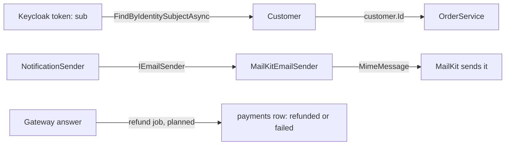

## Before you start

- [[design.l3.conformist]] — you know the API takes Keycloak's names `sub`, `roles` and `staff` as they are, and that conforming is a choice.
- [[design.l2.adapter-pattern]] — you know `MailKitEmailSender` implements `IEmailSender` and turns each call into MailKit's calls.
- [[backend.l2.resource-based-authorization]] — you know `OrderOwnerHandler` lets a caller reach an order only if they own it or have the `staff` role.

## The situation

`refund-design.md` is Đơn Hàng's design for refunds, not built yet: a background job will call the payment gateway, the outside system that moves the money back, and record the outcome in new columns of the `payments` table. A teammate suggests a shortcut: copy whatever status text the gateway returns straight into the new `status` column. First, look at how Đơn Hàng already treats outsiders. Every order request arrives with a Keycloak token, yet `OrderService.PlaceOrderAsync` takes a plain `customerId`. Every email leaves through MailKit, yet `NotificationSender` never touches a MailKit type. Something turns other systems' words into Đơn Hàng's own at the door.

Where should another system's model be turned into yours, and when is that worth the code?

## Core concepts

- **anti-corruption layer** — code at the edge of a downstream context that translates between the upstream model and the downstream one, in whichever direction the words cross, so the upstream words never spread inside.
- translation — turning another model's words, values and rules into your own, such as turning a token's `sub` into a `Customer`; renaming a field is the smallest part of it.
- edge — the few places where a context touches another one: here, where the caller of a request is read, where an email leaves, and where a gateway would answer.

## How it works



In the top row, a token carries `sub`, Keycloak's id for the user. Each place in `DonHang.Api` that reads `sub` passes that string to `FindByIdentitySubjectAsync` and gets back Đơn Hàng's `Customer`. `OrderService.PlaceOrderAsync` then receives only the customer's `Id`. These lookups are the anti-corruption layer toward Keycloak.

In the middle row the translation runs outward. MailKit is upstream here, since Đơn Hàng must follow its model to send mail. `NotificationSender` asks `IEmailSender` for an address, a subject and a body. `MailKitEmailSender` turns those into a `MimeMessage`, a type from MimeKit, the library MailKit is built on, which MailKit then sends. MimeKit's model never reaches the inside.

That class is also an adapter: it implements `IEmailSender` with MailKit. Adapter is one tool for such a layer, whose job is wider: words, values and rules. A layer may hold several adapters, or none. Toward Keycloak, the translation is one lookup in three places (`OrderOwnerHandler`, `OrdersController` and `OrdersV2Controller`), and no class wraps Keycloak.

The bottom row is a plan: `refund-design.md` puts every gateway call in one background job, where the gateway's answers would become `refunded` and `failed`.

Translation is code that must keep up with the upstream model. It pays off when that model differs from yours or changes outside your control, because an upstream change then lands only at the edge. A Keycloak user is not a customer, so Đơn Hàng translates the user; the role `staff` already means what Đơn Hàng means, so the API conforms on it. Where the upstream words already mean what yours mean, conforming costs less, because there is no translation to keep up. The gateway is an outside system whose status words Đơn Hàng does not control, so copying them into `status` would spread them inside.

## In the Đơn Hàng system

The Keycloak side, in `OrderOwnerHandler`, the check for "owner of the order, or staff":

```csharp file=DonHang.Api/Authorization/OrderOwnerHandler.cs tag=stage-2 lines=16-35
public sealed class OrderOwnerHandler(ICustomerRepository customers)
    : AuthorizationHandler<OrderOwnerRequirement, Order>
{
    protected override async Task HandleRequirementAsync(
        AuthorizationHandlerContext context, OrderOwnerRequirement requirement, Order order)
    {
        if (context.User.IsInRole("staff"))
        {
            context.Succeed(requirement);
            return;
        }

        var subject = context.User.FindFirstValue("sub");
        var caller = subject is null ? null : await customers.FindByIdentitySubjectAsync(subject);
        if (caller is not null && caller.Id == order.CustomerId)
        {
            context.Succeed(requirement);
        }
    }
}
```

The `IsInRole("staff")` check at the top is the conforming half: the role is used as Keycloak spells it. Then `FindFirstValue("sub")` reads Keycloak's word, and the next line hands the string to `ICustomerRepository`, an interface of `DonHang.Domain`, which answers with a `Customer`. The ownership rule compares `caller.Id` with `order.CustomerId`, two Đơn Hàng ids, so Keycloak's id is gone before the rule runs. A caller without the `staff` role and with no customer row ends as `null` and never meets the requirement: the translation carries a rule, Đơn Hàng's rule that a Keycloak user with no customer row owns no order, not only a name. Outside the excerpt, `OrdersController` and `OrdersV2Controller` repeat the same lookup and pass `customer.Id` to `PlaceOrderAsync`.

The email side, where the translation runs toward a library:

```csharp file=DonHang.Infrastructure/MailKitEmailSender.cs tag=stage-2 lines=15-34
// lesson: design.l2.adapter-pattern
// Implements Đơn Hàng's IEmailSender with MailKit: builds a MimeMessage and
// hands it to MailKit's SmtpClient. Only this class knows MailKit exists.
public sealed class MailKitEmailSender(SmtpSettings smtp) : IEmailSender
{
    public async Task SendAsync(string toAddress, string subject, string body, CancellationToken cancellationToken)
    {
        var message = new MimeMessage();
        message.From.Add(new MailboxAddress("Đơn Hàng", "orders@donhang.local"));
        message.To.Add(MailboxAddress.Parse(toAddress));
        message.Subject = subject;
        message.Body = new TextPart("plain") { Text = body };

        using var client = new SmtpClient { Timeout = 10_000 };
        // Mailpit in the lab speaks plain SMTP, without TLS.
        await client.ConnectAsync(smtp.Host, smtp.Port, SecureSocketOptions.None, cancellationToken);
        await client.SendAsync(message, cancellationToken);
        await client.DisconnectAsync(quit: true, cancellationToken);
    }
}
```

`SendAsync` takes the three things `IEmailSender` names, in Đơn Hàng's words. The five lines from `new MimeMessage()` to the `TextPart` body rebuild them as MimeKit's model. Mailpit is the test mail server the lab runs, and SMTP is the protocol mail is sent with; the three `client` calls after the message is built are MailKit's own sending. A `MimeMessage` needs a `From` address, which `IEmailSender` does not name, so filling it with Đơn Hàng's own value is part of the translation. The comment above the class states the edge: only this class knows MailKit exists.

The third edge is only on paper. In `docs/design/refund-design.md`, step 3 puts the gateway calls in one job, step 5 marks a refund row `failed` after a hard refusal (the gateway refusing the refund outright, so the job stops retrying) or after 24 hours of retries, and step 6 marks it `refunded` when the gateway confirms. That 24-hour limit is Đơn Hàng's rule, not the gateway's, so the job decides what 24 hours without a confirmation from the gateway means.

## Seniors often assume…

- **"An anti-corruption layer is just another name for the Adapter pattern."** → Actually Adapter is one tool; the layer is a job, translating another model's words, values and rules at the edge of a context. `MailKitEmailSender` is both, while toward Keycloak no class wraps Keycloak in the Adapter pattern: the translation is one lookup repeated in three places. You notice this when a class implements your interface correctly, yet returns the gateway's own status text, and checks on that text start to appear in business code.
- **"An anti-corruption layer has to be a separate service standing between the two systems."** → Actually at stage-2 every part of it is ordinary code in the same process: the lookups in `DonHang.Api`, the email class in `DonHang.Infrastructure`. The job is translation, and where the code runs is a separate decision. You notice this when a proposal to "add a translation layer" comes with a new deployment and a new network call, while the translation itself is one lookup.
- **"A translation layer only renames fields; the values and rules pass through unchanged."** → Actually `sub` does not become a customer id by renaming: it takes a lookup, and a caller with no customer row becomes "no owner". The planned refund job adds a rule of its own, the 24-hour limit. You notice this when a gateway answers with a value nobody expected and it lands in `payments` as a status no part of Đơn Hàng knows how to handle.

## Try it (3 minutes)

1. In the `don-hang` repository, run `git grep -n FindByIdentitySubjectAsync stage-2 -- 'DonHang.Api/*'` to list every place in the API that turns `sub` into a `Customer`.
2. Run `git grep -n MimeMessage stage-2 -- '*.cs'` to list every C# line that names MimeKit's message type.

Expected result: the first command prints three lines, in `Authorization/OrderOwnerHandler.cs`, `Controllers/OrdersController.cs` and `Controllers/V2/OrdersV2Controller.cs`. The second prints two lines, both in `DonHang.Infrastructure/MailKitEmailSender.cs`: the comment above the class and the line that creates the message. The first edge is spread over three files; the second is one class.

## Connections

- [[design.l3.conformist]] — the opposite choice: taking the upstream model as it is; Đơn Hàng makes both choices toward Keycloak, for different parts of its model.
- [[design.l2.adapter-pattern]] — the tool one level down: `MailKitEmailSender` was built there as an adapter; here it is read as part of a translation layer.
- [[backend.l2.resource-based-authorization]] — where `OrderOwnerHandler` was written; here its `sub` lookup is read as the edge toward Keycloak.
- [[design.l2.ports-and-adapters]] — the same edge seen from the core: Đơn Hàng declares the interfaces in its own words, and the outside code fits them.
- [[backend.l2.database-job-queue]] — the background job model the planned refund job would follow, and so the place its translation would live.
- [[design.l3.context-map]] — the map that drew the upstream arrows this lesson's layer sits on.

## Five-line summary

1. An anti-corruption layer translates, at a downstream context's edge, between the upstream model and its own, in either direction, so upstream words stay out.
2. At stage-2, each place in `DonHang.Api` that reads `sub` turns it into a `Customer` through `FindByIdentitySubjectAsync`, so `OrderService` sees customer ids only.
3. `MailKitEmailSender` is the edge toward MailKit, translating outward: `MimeMessage` exists only inside it, and the rest of Đơn Hàng sends mail through `IEmailSender`.
4. Adapter is one tool for such a layer, which translates words, values and rules; it may hold several adapters, or none.
5. Translation is code that must keep up, so it pays when the upstream model differs or changes outside your control; otherwise conforming is cheaper.
