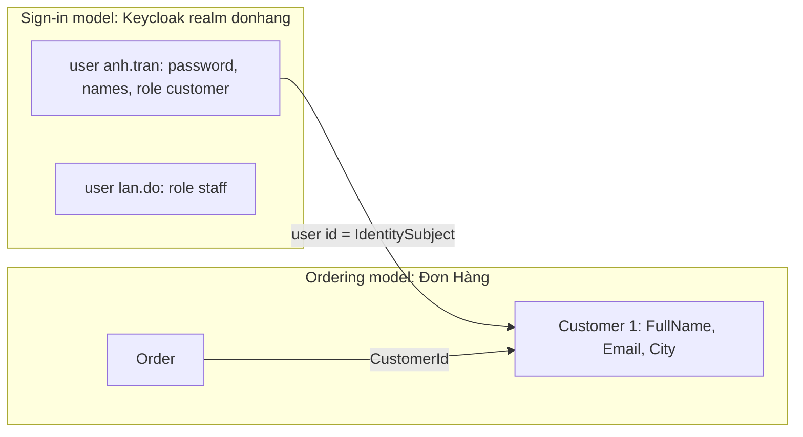

## Before you start

- [[design.l3.ubiquitous-language]] — you know that a ubiquitous language gives each word one agreed meaning; this lesson asks how far that agreement reaches.
- [[backend.l2.validating-provider-tokens]] — you know that `sub` in a Keycloak token is Keycloak's id for the user, and that the API finds the customer through `customers.identity_subject`.
- [[backend.l2.role-based-access]] — you know that Keycloak gives each user realm roles such as `customer` and `staff`, which the API reads from the access token.

## The situation

A stakeholder asks how many customers Đơn Hàng has. You open `keycloak/donhang-realm.json`, the file that sets up Keycloak's realm for the lab, and count six users. A teammate counts the rows of `customers` in the lab database and gets five. The sixth user is `lan.do@example.com`, the staff account that ships orders.

Your teammate also notices that Keycloak keeps a first and a last name, while `customers` keeps one full name and a city. They suggest deleting one of the two records of the same people. Which of the two is the real customer?

## Core concepts

- **bounded context** — a boundary inside which one model and its language apply; outside it, the same word may mean something else, and that is not an error.
- the sign-in model — Keycloak's realm `donhang` (the set of users, passwords and roles Keycloak keeps for Đơn Hàng), where a person is a user with a username, a password, a first and a last name, and realm roles.
- the ordering model — Đơn Hàng's own classes and tables, where a person who orders is a `Customer` with a full name, an email and a city.
- the link value — Keycloak's id for a user, which Đơn Hàng stores in `customers.identity_subject` so that each model's record of a person can be matched to the other's.

## How it works



In the situation above, two models describe the same people, and each applies inside its own boundary. Inside Keycloak's realm, the words are user, username, password and realm role. A person there is anyone who signs in, so the staff member Đỗ Ngọc Lan is a user too. Inside Đơn Hàng, a customer is someone orders belong to, and each `Order` points to its customer through `CustomerId`. Each model is a bounded context, and each count answers its own question correctly. Six people can sign in; five can place orders.

So who counts as a customer depends on which model you ask. Lan signs in successfully, but `customers` has no row for her. `GET /api/v1/orders` looks for the customer whose `identity_subject` matches her token, finds none, and answers `403` instead of listing anything.

The two models are linked by one value, not by a shared class. The realm file gives each user a fixed `id`, and a migration copied the ids of the five customer users into `customers.identity_subject`. A token's `sub` carries that id, and the API looks the customer up by it. Each side keeps only the fields it needs, so the email address is stored twice.

Merging them into one class would put sign-in data next to ordering data. A change made for signing in, such as a new rule about passwords, would then touch the class that orders use, and a new ordering field would reach the sign-in code. Today a new password rule does not reach ordering code, because Đơn Hàng's own classes and tables hold no user passwords.

## In the Đơn Hàng system

Trần Minh Anh in the sign-in model:

```json file=keycloak/donhang-realm.json tag=stage-2 lines=64-74
    {
      "id": "92f6ba26-729c-4d61-854b-c04c9f2db11a",
      "username": "anh.tran@example.com",
      "email": "anh.tran@example.com",
      "emailVerified": true,
      "firstName": "Minh Anh",
      "lastName": "Trần",
      "enabled": true,
      "credentials": [{ "type": "password", "value": "donhang-dev-password", "temporary": false }],
      "realmRoles": ["customer"]
    },
```

Look at what this model cares about: how she signs in (`username`, `credentials`), whether her email was checked, and which realm role she has. Her name is split into `firstName` and `lastName`. The entry for `lan.do@example.com`, at the end of the same file, has the same shape with `realmRoles` set to `["staff"]`. The `id` line is the value Đơn Hàng stores.

The same person in the ordering model:

```csharp file=DonHang.Domain/Entities.cs tag=stage-2 lines=6-16
public sealed class Customer
{
    public int Id { get; set; }
    public required string FullName { get; set; }
    public required string Email { get; set; }
    public required string City { get; set; }

    // lesson: backend.l2.validating-provider-tokens
    // Keycloak's id for this customer (the `sub` of their tokens); null until they have an account there.
    public string? IdentitySubject { get; set; }
}
```

Here there is no username, password or role, but there is a `City` and a single `FullName`. `db/seed.sql`, the script that fills the lab database with sample rows when the database is first created, inserts her as `(1, 'Trần Minh Anh', 'anh.tran@example.com', 'Hà Nội')` and four other customers, none of them Lan.

`IdentitySubject` is the link value; its type `string?` lets it be null, and the comment says when: until the customer has an account in Keycloak. `ICustomerRepository.FindByIdentitySubjectAsync` is how the API crosses from a token to this class. The migration `AddCustomerIdentitySubject`, outside these excerpts, adds the column and then runs an `UPDATE` for each of the five emails.

## Seniors often assume…

- **"A bounded context is the same thing as a separately deployed service."** → Actually it is the boundary of a model and its words, not of a process. Keycloak happens to run in its own container, but what makes it a separate context is that its model of a person differs from Đơn Hàng's. You notice this when code is split into two deployed programs but both still use one shared class with fields for both purposes. Then a change to either purpose still means changing both programs.
- **"Keycloak's user and Đơn Hàng's `Customer` describe the same person, so one of them is a duplicate that should be removed."** → Actually they share a person and one value, not a purpose. Removing `customers` would lose the city and the rows that orders point to; removing Keycloak's user would leave Đơn Hàng to handle sign-in, and passwords, itself. Even the name has a different shape in each. You notice this when a script that copies names across has to decide how to join `firstName` and `lastName` into `FullName`.
- **"Inside one company, every business word should have exactly one meaning everywhere."** → Actually one meaning per word is what the language promises inside one boundary. Across boundaries, `customer` is a realm role in Keycloak and a class with a city in Đơn Hàng. One company-wide meaning often ends up too broad for both, or takes a long negotiation. When a report spans the whole business, a team may still agree one definition for that report. You notice this when a discussion about the "one true" customer adds fields that only one side ever reads.

## Try it (3 minutes)

In the root folder of the example repository, in a terminal:

1. Run `git grep -n -F "lan.do@example.com" stage-2 -- keycloak/donhang-realm.json db/seed.sql`. `git grep -n` prints every line containing the text, with file name and line number; the paths after `--` limit the search to those two files. `-F` matches the text literally, and `stage-2` searches the files as they are at that tag.
2. Run the same command with `anh.tran@example.com` instead.
3. For Anh, list which fields only the sign-in model holds, which only the ordering model holds, and which both hold.

Expected result: the first command prints two lines, both from `keycloak/donhang-realm.json` (username and email), and nothing from `db/seed.sql`. The second prints two lines of the realm file and one line of `db/seed.sql`.

<details><summary>Suggested answer</summary>

Only the sign-in model: `username`, the password credential, `emailVerified`, `enabled`, the split name and the realm role `customer`. Only the ordering model: `Customer.Id` 1, the single full name and the city `Hà Nội`. Both: the email address. Keycloak's `id` is the link value: in these files only the sign-in model has it, and `customers` gets it from the migration, not from `db/seed.sql`.

</details>

## Connections

- [[design.l3.ubiquitous-language]] — the same idea with its edge drawn: one meaning per word holds inside a bounded context, not across all of them.
- [[design.l3.entities-and-identity]] — an entity's identity belongs to one model; `Customer.Id` and Keycloak's user id identify the same person in two models.
- [[backend.l2.validating-provider-tokens]] — where `identity_subject` came from; this lesson explains why the link is one value rather than one shared class.
- [[design.l3.contexts-inside-don-hang]] — what comes next: boundaries inside Đơn Hàng's own code.

## Five-line summary

1. A bounded context is a boundary inside which one model and its words apply; outside it, the same word may mean something else.
2. In Keycloak, Trần Minh Anh is a user with a username, a password, a first and a last name, and the realm role `customer`.
3. In Đơn Hàng she is a `Customer` with a full name, an email and a city; staff user `lan.do@example.com` has no such row.
4. One value links them, Keycloak's user id in `customers.identity_subject`; each side keeps its own fields, so the email is stored twice.
5. One shared class would mix passwords with cities, so a change made for signing in would touch the code written for ordering.
