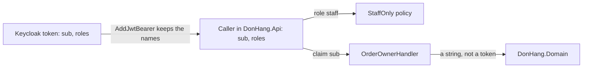

## Before you start

- [[design.l3.context-map]] — you know Keycloak is upstream of Đơn Hàng, and the API keeps Keycloak's claim names `sub` and `roles` as written.
- [[backend.l2.role-based-access]] — you know the `StaffOnly` policy requires the `staff` role, which the API reads from the `roles` claim.

## The situation

You add a second staff-only endpoint to `DonHang.Api` and open a pull request. A reviewer leaves one comment: "We say `staff` and `sub` only because Keycloak does. Shouldn't the API have words of its own, say an `IsEmployee` flag and a `UserId`, and convert each token into them? Right now we just copy what Keycloak sends." A second reviewer answers that conversion code is one more thing to keep working. Both sound reasonable, and the pull request waits.

Is taking Keycloak's names as they are a design decision, and when is it the right one?

## Core concepts

- **conformist** — a downstream context that uses the upstream context's model as it is, with no translation of its own; the word also names that relationship on a context map.
- translation — code on the downstream side that turns the upstream's names and values into words of its own, such as turning the `roles` claim into an `IsEmployee` flag; the first reviewer asks for one.
- claim type — the name a claim goes by inside ASP.NET Core once a token has been read, which need not be the name written in the token.
- realm — Keycloak's settings for Đơn Hàng: its users, its roles and what goes into each token.

## How it works



Keycloak writes the token: `sub`, its own id for the user, and `roles`, a list set by the realm. In `DonHang.Api`, `AddJwtBearer` reads the token into the caller, the `User` that controllers and handlers see, and keeps both claim types as written. The `StaffOnly` policy asks for the role `staff`, spelled as in the realm. `OrderOwnerHandler`, the check behind the `OrderOwner` policy that lets a customer reach only their own orders, reads `sub`.

Nowhere does Đơn Hàng put a word of its own between Keycloak and a rule. That makes the API a conformist: `staff` in `Program.cs` is Keycloak's word itself, not one some conversion code maps to.

Conforming does not let Keycloak in everywhere. The last arrow stops at `DonHang.Domain`, the project that holds business classes such as `Order` and `Customer`. `OrderOwnerHandler` passes it only the value of `sub`, a plain string the domain's customer lookup calls `identitySubject`. The domain never sees the claim name `sub`, the `roles` claim or a token.

Conforming costs nothing to build: no conversion class, no mapping to test, and a `UserId` would only hold the value of `sub` under a new name. The bill comes later, if Keycloak's names change, because the lines that spell `sub`, `roles` or `staff` have to follow them. Conforming suits a generic subdomain such as sign-in when its model fits yours, and here it fits: Đơn Hàng's idea of staff is the realm role `staff`, nothing more. The realm's settings live in this repository, in `keycloak/donhang-realm.json`, which Keycloak imports when it first starts; as long as the team changes the realm only through that file, a rename arrives in a pull request beside the code it breaks.

## In the Đơn Hàng system

The production side of the decision is three lines in `Program.cs`.

```csharp file=DonHang.Api/Program.cs tag=stage-2 lines=52-66
        // Keep claim names as Keycloak wrote them ("sub", "roles"), and read
        // the caller's roles from the flat "roles" claim the realm adds.
        options.MapInboundClaims = false;
        options.TokenValidationParameters.RoleClaimType = "roles";
    });

// lesson: backend.l2.role-based-access
// lesson: backend.l2.resource-based-authorization
// Neither policy names an authentication scheme: they ask about the caller,
// not about how the caller signed in.
builder.Services.AddAuthorization(options =>
{
    options.AddPolicy("StaffOnly", policy => policy.RequireRole("staff"));
    options.AddPolicy("OrderOwner", policy => policy.AddRequirements(new OrderOwnerRequirement()));
});
```

The first lines are the end of the `AddJwtBearer` setup; `options` are its settings. `MapInboundClaims = false` turns off ASP.NET Core's renaming of incoming claims. Left on, it would give some well-known names, `sub` among them, longer claim types of its own. `RoleClaimType = "roles"` then makes every role check read the `roles` claim. Further down, `RequireRole("staff")` names the role exactly as the realm does; the comment above `AddAuthorization` and the `OrderOwner` line belong to earlier lessons. Outside the excerpt, `OrderOwnerHandler` repeats the pattern with `IsInRole("staff")`, which lets staff through to any order, and `FindFirstValue("sub")`, and both orders controllers, `OrdersController` and `OrdersV2Controller`, read `sub` the same way.

The tests make the same choice.

```csharp file=DonHang.Tests/Integration/TestAuthHandler.cs tag=stage-2 lines=20-32
    protected override Task<AuthenticateResult> HandleAuthenticateAsync()
    {
        var subject = Request.Headers["X-Test-Subject"].ToString();
        if (subject.Length == 0) return Task.FromResult(AuthenticateResult.NoResult());

        var claims = new List<Claim> { new("sub", subject) };
        var roles = Request.Headers["X-Test-Roles"].ToString();
        claims.AddRange(roles.Split(',', StringSplitOptions.RemoveEmptyEntries).Select(role => new Claim("roles", role)));

        var identity = new ClaimsIdentity(claims, SchemeName, nameType: "sub", roleType: "roles");
        var ticket = new AuthenticationTicket(new ClaimsPrincipal(identity), SchemeName);
        return Task.FromResult(AuthenticateResult.Success(ticket));
    }
```

`TestAuthHandler` builds the caller from two headers, `X-Test-Subject` and `X-Test-Roles`, instead of from a token; with no `X-Test-Subject` header it reports no caller at all, like a request without a token. Look at the names it gives the claims: `sub` and `roles`, and the same pair as `nameType` and `roleType`, which tell ASP.NET Core which claim holds the caller's name and which holds roles, the test-side twin of `RoleClaimType` in `Program.cs`. The last three lines wrap these claims into the caller, the `User`, and report that sign-in succeeded. The tests conform too, so the code under test reads one shape of caller and needs no special case for tests. It also means the tests spell Keycloak's names, so a rename has to be copied into them too.

## Seniors often assume…

- **"A conformist downstream team simply did no design work."** → Actually conforming is a decision about whose words to use, and it comes with a boundary. The comment above `MapInboundClaims` states the choice, and the API switches off a framework default to make it. Authentication sits in `DonHang.Api`; the `DonHang.Domain` project references no ASP.NET Core package, and no class in it reads a token. You notice this when someone proposes to "add some design" by mapping roles to an enum, and the change touches every role check yet changes no answer the API gives.
- **"Using Keycloak's role names directly is always wrong; every name that comes from outside must be translated."** → Actually translation pays when the outside model differs from yours or changes outside your control, and neither holds here. Đơn Hàng's idea of staff is exactly the realm role `staff`. The realm's settings live in the same repository, in `keycloak/donhang-realm.json`, which Keycloak imports when it first starts, and the team changes the realm only through that file, so a rename arrives in a pull request beside the code it breaks. You notice this when a mapping class grows one line per role, and each line turns a name into the same name.

## Try it (3 minutes)

1. In the `don-hang` repository, run `git grep -l -E '"(sub|roles|staff)"' stage-2 -- '*.cs'` to list every C# file at `stage-2` that spells one of Keycloak's three names as a string.
2. Group the files by project, and check whether any file is in `DonHang.Domain`.

Expected result: six files, each prefixed with `stage-2:`, four in `DonHang.Api` and two in `DonHang.Tests`, and none in `DonHang.Domain`. These six files are the price of conforming: each spells at least one of Keycloak's names, so a rename has to be carried into them.

<details><summary>Suggested answer</summary>

`DonHang.Api`: `Authorization/OrderOwnerHandler.cs`, `Controllers/OrdersController.cs`, `Controllers/V2/OrdersV2Controller.cs`, `Program.cs`. `DonHang.Tests`: `Integration/OrdersApiTests.cs`, `Integration/TestAuthHandler.cs`. `DonHang.Domain` is missing, because authentication stays in `DonHang.Api` and the domain never reads a token.

</details>

## Connections

- [[design.l3.context-map]] — prerequisite: the map drew the arrow from Keycloak to Đơn Hàng; this lesson names the kind of relationship on that arrow.
- [[backend.l2.role-based-access]] — where `RoleClaimType` and `StaffOnly` were set up; here the same lines are read as a design choice.
- [[design.l2.testing-protected-endpoints]] — where `TestAuthHandler` was built; its claim names show the tests follow Keycloak too.
- [[design.l3.subdomains]] — why conforming fits here: sign-in is a generic subdomain, reused rather than designed.
- [[design.l3.anti-corruption-layer]] — the opposite choice: translating an upstream model at the edge instead of taking it as it is.

## Five-line summary

1. A downstream context is a conformist when it uses the upstream model as it is, and that is a choice of whose words to use.
2. At stage-2, `MapInboundClaims = false` and `RoleClaimType = "roles"` keep Keycloak's names, so `StaffOnly` checks the realm's own role `staff`.
3. `TestAuthHandler` builds its test caller with the same claim types, `sub` and `roles`, so the tests conform too.
4. Conforming costs nothing to build; the cost comes later, when Keycloak's names change and every file that spells them has to follow.
5. Keycloak's words stay in `DonHang.Api`: no class in `DonHang.Domain` reads a token.
