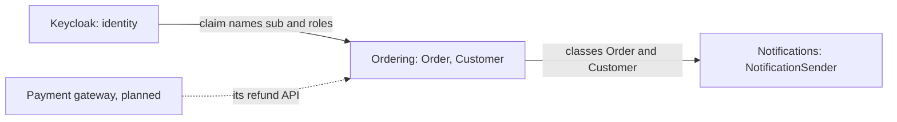

## Before you start

- [[design.l3.subdomains]] — you know Đơn Hàng reuses Keycloak for signing in, a generic subdomain, and puts its design effort into ordering.
- [[backend.l2.validating-provider-tokens]] — you know the API checks Keycloak's tokens itself and finds the customer through `sub` and `customers.identity_subject`.
- [[management.l2.design-doc]] — you know `refund-design.md` plans a background job that calls a payment gateway with an idempotency key, and lists open questions.

## The situation

Two pull requests arrive in the same week. One tidies Keycloak's settings for Đơn Hàng and renames the `roles` claim, the named field in each access token's payload that lists the user's roles. The other renames properties of `Customer` in `Entities.cs` to match the words in the meeting notes. Each author checked only their own side. Meanwhile, the refund design waits for answers from a payment gateway that nobody on the team controls.

Nobody has a picture of which part of Đơn Hàng leans on which. When one part changes its names or its rules, which other part has to change with it?

## Core concepts

- **context map** — a picture of the bounded contexts and of how each pair depends on the other, drawn so the team sees where a change on one side reaches the other.
- **upstream context** — in one relationship, the context whose model the other depends on; its changes reach the other side, not the reverse.
- **downstream context** — in the same relationship, the context that must adapt when the upstream context's model changes.

## How it works



This is part of the context map of stage-2: three relationships where a change on one side reaches the other. Each box is a bounded context. Each arrow points from the upstream context to the downstream one and names what the downstream side takes as given.

Start with Keycloak, the first pull request in the situation above: the API keeps Keycloak's claim names as Keycloak wrote them and reads roles from the `roles` claim. Rename that claim in Keycloak's settings and Keycloak still works, but the API finds no roles, so staff are refused on staff-only endpoints. Nothing fails to compile: `"roles"` is only a string in the API's code, so the break shows when a staff member calls. Keycloak reads nothing of Đơn Hàng's model, so no rename inside Đơn Hàng can break Keycloak. Keycloak is upstream; Đơn Hàng is downstream. On the map, the arrow ends at ordering, the part that reads the claims and would call the gateway; the email job runs with no caller and reads no claims.

The second pull request crosses a line inside Đơn Hàng's one API, which holds several contexts: ordering, the product catalogue and notifications, each with its own words, as `Order.Status` and `Notification.Status` show. Ordering owns `Order` and `Customer`; notifications reads them directly to address each email. Ordering is upstream, so a rename made for ordering's reasons reaches the email job, and notifications has to follow.

The dashed arrow is a relationship that does not exist yet. The refund design plans a payment gateway, and Đơn Hàng would have to work with whatever its refund API accepts, which makes the gateway upstream too.

Read any change on the map in one direction: it travels from upstream to downstream.

## In the Đơn Hàng system

Đơn Hàng downstream of Keycloak: the API takes Keycloak's names as they are.

```csharp file=DonHang.Api/Program.cs tag=stage-2 lines=52-55
        // Keep claim names as Keycloak wrote them ("sub", "roles"), and read
        // the caller's roles from the flat "roles" claim the realm adds.
        options.MapInboundClaims = false;
        options.TokenValidationParameters.RoleClaimType = "roles";
```

`MapInboundClaims = false` turns off ASP.NET Core's renaming of incoming claims, so the API sees `sub` and `roles` exactly as Keycloak wrote them. `RoleClaimType = "roles"` makes every role check read that one claim, which the realm (Keycloak's settings for Đơn Hàng, the ones the first pull request edits) adds. Outside the excerpt, `OrderOwnerHandler`, the check that a customer sees only their own orders, reads the caller's `sub` with `FindFirstValue("sub")` to find the customer. None of these names is Đơn Hàng's choice; the API repeats Keycloak's.

Notifications downstream of ordering: the email job reads ordering's classes.

```csharp file=DonHang.Api/Jobs/NotificationSender.cs tag=stage-2 lines=65-81
    private async Task SendOneAsync(IEmailSender email, Notification notification, CancellationToken stoppingToken)
    {
        try
        {
            var customer = notification.Order!.Customer!;
            await email.SendAsync(customer.Email, $"Order {notification.OrderId}: {notification.Subject}",
                $"Hello {customer.FullName}, this is about your order {notification.OrderId}: {notification.Subject}.",
                stoppingToken);
            notification.Status = "sent";
            notification.SentAt = DateTimeOffset.UtcNow;
            logger.LogInformation("Sent notification {NotificationId} for order {OrderId}", notification.Id, notification.OrderId);
        }
        catch (Exception ex) when (!stoppingToken.IsCancellationRequested)
        {
            RecordFailure(notification, ex);
        }
    }
```

The first line inside `try`, `notification.Order!.Customer!`, walks from the notification, the job's record of one email to send, to its `Order` and on to that order's `Customer`. The next two lines read `customer.Email` and `customer.FullName`, two properties of ordering's `Customer`. Notifications has no class of its own for the person it writes to. Rename `FullName` and this file is among those that stop compiling: the second pull request breaks the email job, which it never touched.

The third relationship lives only in `refund-design.md`. Its open questions name two answers the gateway has not given. If the gateway does not accept idempotency keys, a retry after a lost answer could refund twice. Step 4, the call that sends the key, would then have to ask for the refund's status before each new attempt. If the gateway reports results only later, by calling back into Đơn Hàng, step 6, where the job records the gateway's confirmation, must change. In both cases Đơn Hàng adapts and the gateway does not.

Across all three relationships, where a break shows first depends on how the downstream side holds the upstream model: as text checked at run time, as classes compiled against, or as a plan.

## Seniors often assume…

- **"A context map is the same as a diagram of servers and the network calls between them."** → Actually it shows whose model each side follows, and that need not match any network call. Ordering and notifications run in the same process, `DonHang.Api`, with no call between them, yet notifications depends on ordering's classes. The API calls Keycloak only to fetch its metadata and keys, not on every request, yet relies on Keycloak's claim names on every request. You notice this when a drawing of the running servers shows one box for the API, while a rename in `Entities.cs` breaks the email job.
- **"Upstream simply means the side that sends the request."** → Actually upstream is the side whose model the other depends on, and requests can flow either way. The API sends the requests that fetch Keycloak's keys, and Keycloak is still upstream. Take the gateway separately. Under the refund design, Đơn Hàng would call it. If the gateway called back, requests would flow the other way, and Đơn Hàng would still have to accept the gateway's format. You notice this when a map drawn from request arrows puts Đơn Hàng upstream of the gateway, then the gateway changes its refund API and only Đơn Hàng has to change.
- **"Being downstream of another context is a design mistake that should be removed."** → Actually being downstream is the usual price of reusing others' work. Đơn Hàng chose Keycloak for a generic subdomain, and following Keycloak's claim names is part of that choice. Removing the relationship would mean building sign-in again, the work the previous lesson showed buys no difference. What the map adds is that the dependency is written down, so a change upstream comes with a check downstream. You notice this when a plan to "remove the dependency on Keycloak" turns into rebuilding the in-house sign-in that stage-2 replaced with Keycloak.

## Try it (3 minutes)

Without running anything, take each change below and write one line: the upstream context, the downstream context, and where the break shows up first.

1. Keycloak's settings stop adding the `roles` claim to its tokens.
2. Someone renames `Customer.FullName` to `Customer.Name` in `Entities.cs`.
3. The payment gateway says it will not accept idempotency keys.

Expected result: three lines, each naming one upstream and one downstream context, with a different first symptom for each: one at run time, one at build time, one in a design document.

<details><summary>Suggested answer</summary>

1. Keycloak is upstream, Đơn Hàng (on the map, ordering) downstream. The build still passes; at run time, staff are refused on staff-only endpoints, because the API reads roles only from `roles`.
2. Ordering is upstream, notifications downstream. `NotificationSender.cs` no longer compiles, because `SendOneAsync` reads `FullName`, so the build fails before anything ships.
3. The gateway is upstream, Đơn Hàng (on the map, ordering) downstream. No code exists yet; step 4 of `refund-design.md` must change to ask for the refund's status before each new attempt, as its open questions already say.

</details>

## Connections

- [[design.l3.subdomains]] — the choice behind the first arrow: Keycloak was reused for a generic subdomain, and this lesson shows the dependency that reuse creates.
- [[backend.l2.validating-provider-tokens]] — where the API learned to read Keycloak's tokens, the upstream model this map points at.
- [[management.l2.design-doc]] — the refund design whose open questions show the cost of an upstream the team does not control.
- [[backend.l2.idempotent-endpoints]] — the same idea from the other side: there Đơn Hàng accepts idempotency keys from its callers; here it needs its upstream gateway to accept them.
- [[backend.l2.retry-with-backoff]] — the backoff idea the refund job reuses with its own schedule in step 5, and why step 4 must change if the gateway ignores idempotency keys.
- [[design.l3.conformist]] — what comes next: one way a downstream context can live with an upstream model.
- [[design.l3.anti-corruption-layer]] — the other way, after that one.

## Five-line summary

1. A context map shows, for each pair of bounded contexts, whose model the other must follow, so the team sees where a change reaches.
2. The upstream context owns the model; the downstream context adapts when it changes, whichever side sends the requests.
3. Keycloak is upstream of Đơn Hàng: the API keeps Keycloak's claim names `sub` and `roles` and reads them as written.
4. Inside one process, notifications is downstream of ordering: `NotificationSender` reads `Order` and `Customer` directly.
5. A planned payment gateway would be upstream too; the refund design's open questions already list where Đơn Hàng would adapt.
