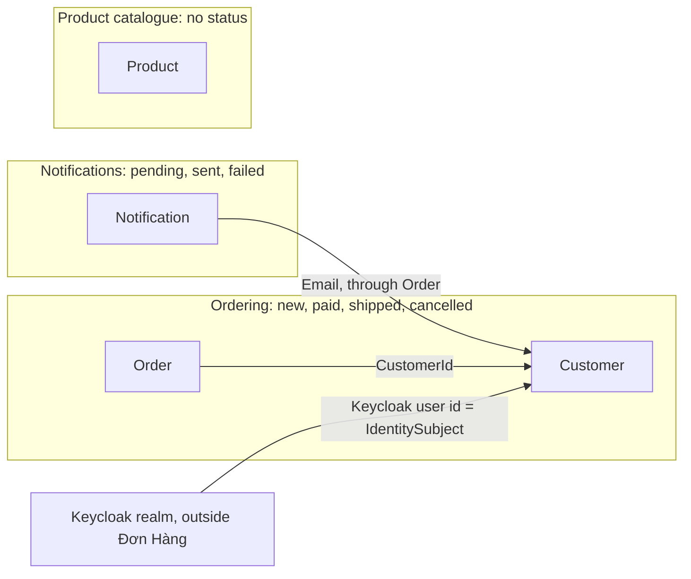

## Before you start

- [[design.l3.bounded-context]] — you know that a bounded context is where one model and its words apply, and that Keycloak's realm and Đơn Hàng are two of them.
- [[backend.l2.database-job-queue]] — you know that each `notifications` row is an email job that `NotificationSender` picks up and marks `sent`.
- [[design.l3.reference-other-aggregates-by-id]] — you know that `Order` refers to its customer by `CustomerId`, and that `Order.Customer` stays for reading.

## The situation

Your team lead asks how many orders failed last week. You search `DonHang.Domain/Entities.cs` for `Status` and find it in two classes: on `Order` and on `Notification`. Only one of them can ever be `failed`, and it is not the order.

A teammate suggests one shared `Status` type for both classes. They live in the same file, are saved through the same `DonHangDbContext`, and end up in the same PostgreSQL database. The previous lesson drew a boundary between Keycloak and Đơn Hàng, two separate programs. Đơn Hàng itself is one solution with one database. Does it hold one bounded context, or several?

## Core concepts

- the ordering model — `Order` with its items and its `Customer`, where `Status` is `new`, `paid`, `shipped` or `cancelled`, and methods such as `Cancel()` refuse a change the rules forbid.
- the notifications model — the `Notification` class and its `notifications` rows, where `Status` is `pending`, `sent` or `failed`, and code outside the class decides which applies.
- the product catalogue — `Product`, with a name and a price, no status and no methods at stage-2.
- a boundary in words only — a line the team can name but no code checks: both sides share files, a `DbContext` and a database, and code on one side reads the other side's classes directly.

## How it works



In the situation above, the word `Status` belongs to two languages. On `Order` it says where an order is in its life, and `Cancel()` or `Ship()` refuses a change from the wrong status. On `Notification` it says where an email job is. A `failed` notification says nothing about its order. One shared type would hold seven values, each class accepting only three or four.

A bounded context is drawn where a model's words and rules stop, not by projects, folders or databases; one database can hold several. Ordering and notifications share `Entities.cs`, `DonHangDbContext` and one database, yet their words differ. Their boundary exists only in words: nothing stops code on one side from reading the other's classes. The arrow from `Notification` to `Customer` is that reading: the email job walks through `Order` to `Customer` for an email address.

The other two arrows: `Order` points to `Customer` by `CustomerId`; Keycloak's realm links to `Customer` by `IdentitySubject`.

A `Product`, the third model, has a name and a price, no status and no methods; its one check, a price above zero, sits in `db/schema.sql` and the price-update request. This reading is weaker than the one for notifications: products have no rules in their class rather than different ones, and none of `Order`'s status methods reads or changes a `Product`.

Where to draw the lines is a design choice. One reasonable reading of stage-2 is three contexts: ordering, the product catalogue and notifications, with Keycloak's realm outside. `Payment`, also in `Entities.cs`, is not used yet outside that file and `DonHangDbContext`, so it changes nothing. Another team could read notifications as part of ordering, because every notification belongs to one order. Either reading should follow a change in words and rules, not the file layout.

## In the Đơn Hàng system

The notifications model, in the same file as `Order`:

```csharp file=DonHang.Domain/Entities.cs tag=stage-2 lines=116-131
// lesson: backend.l2.database-job-queue
// From stage-2 each row is also a job: an email waiting to be sent (pending),
// sent, or given up on after too many failed attempts (failed).
public sealed class Notification
{
    public int Id { get; set; }
    public int OrderId { get; set; }
    public Order? Order { get; set; }
    public required string Channel { get; set; }
    public required string Subject { get; set; }
    public required string Status { get; set; }
    public int Attempts { get; set; }
    public DateTimeOffset CreatedAt { get; set; }
    public DateTimeOffset NextAttemptAt { get; set; }
    public DateTimeOffset? SentAt { get; set; }
}
```

The comment gives this `Status` its three values, and they are words about a job, not about an order. `Attempts` and `NextAttemptAt` belong to the same language: they count tries at sending an email. `Order`'s `Status`, earlier in the same file, has a private setter: the constructor sets `new`, and after that it changes only through `MarkPaid()`, `Cancel()` and `Ship()`; you will see these lines in Try it. Here the setter is public, and code outside the class sets the value: `pending` when the email is queued, `sent` or `failed` in `NotificationSender`.

The notifications model crossing into the ordering model:

```csharp file=DonHang.Api/Jobs/NotificationSender.cs tag=stage-2 lines=65-81
    private async Task SendOneAsync(IEmailSender email, Notification notification, CancellationToken stoppingToken)
    {
        try
        {
            var customer = notification.Order!.Customer!;
            await email.SendAsync(customer.Email, $"Order {notification.OrderId}: {notification.Subject}",
                $"Hello {customer.FullName}, this is about your order {notification.OrderId}: {notification.Subject}.",
                stoppingToken);
            notification.Status = "sent";
            notification.SentAt = DateTimeOffset.UtcNow;
            logger.LogInformation("Sent notification {NotificationId} for order {OrderId}", notification.Id, notification.OrderId);
        }
        catch (Exception ex) when (!stoppingToken.IsCancellationRequested)
        {
            RecordFailure(notification, ex);
        }
    }
```

Look at the first line inside `try`. To find an email address, the job walks from its `Notification` to ordering's `Order` and then to its `Customer`. Nothing in the compiler or the tests stops this walk. The line between notifications and ordering is something the team can say, not something the code checks.

The product catalogue needs no excerpt of its own. `ProductsController.List` starts from `db.Products` and shapes a page with `OrderBy`, `Skip`, `Take` and `Select`; its comment reads: "it has no rule to apply, only a query to shape."

## Seniors often assume…

- **"Each bounded context needs its own project and its own database from the start."** → Actually a context is the boundary of a model's words and rules; projects and databases are one way to make code respect that boundary later. In the reading above, stage-2 holds three contexts in one solution and one database, and inside each one the words stay consistent. When the lines are still moving, splitting projects early fixes in place a boundary the team may soon redraw. You notice this when a class moves back and forth between two projects as the team changes its mind.
- **"Since `Order` and `Notification` are declared in the same file, they belong to the same bounded context."** → Actually `Entities.cs` is organised by table, not by model; its opening comment reads "One class per table in db/schema.sql". The two classes share a file and the word `Status`, but not its values or its rules. You notice this when a change to email retries, such as a new property on `Notification`, arrives in a pull request that touches the file holding the order's rules.
- **"A bounded context is just a bigger aggregate."** → Actually an aggregate is one unit of change that keeps its invariants, while a context is where a language applies and can hold several aggregates. Ordering holds at least two, `Order` and `Customer`, and `Order` refers to its customer by id. You notice this when someone tries to make one class guard every rule of a context, and cancelling an order starts to require loading its customer.

## Try it (3 minutes)

In the root folder of the example repository, in a terminal:

1. Run `git grep -n -w Status stage-2 -- DonHang.Domain/Entities.cs`. `-w` matches `Status` only as a whole word, so `OrderStatusException` does not count.
2. For each printed line, note its class: `Order` starts at line 30, `Notification` at line 119.
3. Write down which values each class's `Status` takes, and where those values are checked.

Expected result: 14 lines. Thirteen fall between lines 35 and 95, inside `Order`. One, line 126, is the declaration of `Notification.Status`. One `Order` line sets an empty string in a private constructor; it is not a real status.

<details><summary>Suggested answer</summary>

`Order` assigns `new`, `paid`, `shipped` and `cancelled`, and its own methods check the starting status before each change; the private constructor's empty string is never a real status: EF Core uses that constructor when it loads an order, then fills `Status` from the row. `Notification` declares the property and nothing else in this file. Its values, `pending`, `sent` and `failed`, appear in the comment above the class and are set by code outside the class: `pending` when the email is queued, `sent` or `failed` by the code that sends emails. One word, two value sets, two places where the rules live: two languages in one file.

</details>

## Connections

- [[design.l3.bounded-context]] — the same idea applied inside one codebase: there the boundary ran between two programs, here it runs between classes in one file.
- [[design.l2.where-a-rule-belongs]] — where a rule lives shows which model it belongs to: `Order`'s status rules sit in its methods, the notification's in code outside the class.
- [[design.l3.reference-other-aggregates-by-id]] — a context holds several aggregates; ordering's `Order` and `Customer` are linked by `CustomerId`.
- [[design.l3.context-map]] — what comes next: how the contexts found here relate to each other.
- [[design.l3.subdomains]] — the next question about these three contexts: which deserves the most design effort.

## Five-line summary

1. A bounded context is drawn where a model's words and rules stop, not by projects, folders or databases; one codebase can hold several.
2. At stage-2, `Order.Status` is `new`, `paid`, `shipped` or `cancelled`, while `Notification.Status` is `pending`, `sent` or `failed`.
3. Ordering and notifications share `Entities.cs` and `DonHangDbContext`, and `NotificationSender` reads the customer's email through `Order` and `Customer`.
4. Products have no status and no rules in their class, so `ProductsController` lists them straight from `DonHangDbContext`.
5. Drawing the lines is a design choice; one reasonable reading of stage-2 is ordering, the product catalogue and notifications, with Keycloak outside.
