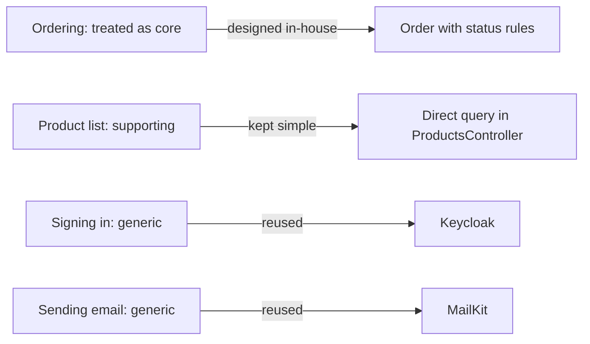

## Before you start

- [[design.l3.contexts-inside-don-hang]] — you know one reasonable reading of stage-2: three contexts, ordering, the product catalogue and notifications, with Keycloak outside.
- [[design.l2.where-a-rule-belongs]] — you know that a domain model is worth its methods where rules exist, and that listing products stays a direct query.
- [[design.l2.adapter-pattern]] — you know that `MailKitEmailSender` adapts MailKit to Đơn Hàng's own `IEmailSender`.

## The situation

In sprint planning, a teammate proposes two tasks. First, give `Product` and `Payment` constructor checks and methods like `Order`'s, so every class in `Entities.cs` is designed the same way. Second, bring sign-in back into the API. At stage-1 Đơn Hàng checked passwords itself; at stage-2 that code is gone and Keycloak signs people in. "Signing in is critical," the teammate says, "so we should own it."

Both tasks sound careful, and both cost a sprint. Which parts of Đơn Hàng deserve that design effort, and who decides?

## Core concepts

- **subdomain (DDD)** — one part of the problem the business solves, such as taking orders, showing products, sending emails or signing people in; a bounded context is a boundary in the software, and the two often match without having to.
- **core domain** — the subdomain that sets the business apart from others doing similar work, and so earns the most design care; which subdomain that is, is a business decision, not a technical one.
- **supporting subdomain** — a subdomain specific to this business but simple, such as Đơn Hàng's product list: needed, yet not what sets the business apart.
- **generic subdomain** — a problem most businesses share, such as signing in or sending email, which is usually solved by reusing work others have already done.

## How it works



The diagram shows four problems and the answer each got at stage-2.

Start from the business, not the code. A subdomain is a part of the problem; the three contexts of the previous lesson are boundaries in the software. Here each of the three contexts answers one subdomain, and signing in has no context inside Đơn Hàng because Keycloak handles it outside. They do not have to line up. Two subdomains can share one context, as ordering and the product list would if the team treated them as one model with one set of names, and one subdomain can be split across two contexts.

Then ask which part sets the business apart. Signing in is critical: no customer orders without it. But almost every business has the same sign-in problem, so being critical does not make it core. Deciding what is core belongs to the people who run the business. This lesson has no record of that decision for Đơn Hàng, so it reads the code's effort as a stand-in: the code treats ordering as core.

The other two kinds get less effort on purpose. The product list is Đơn Hàng's own data, but it has no rule in its class, so a direct query serves it. It is not generic: no tool others built holds Đơn Hàng's own products and prices, so the team writes it, kept simple. Signing in and sending email are generic, so Đơn Hàng reuses others' work: Keycloak issues the tokens, and MailKit sends the email behind an adapter Đơn Hàng wrote.

Effort on a generic subdomain buys the same result other businesses get, and effort on a rule-free supporting subdomain buys code with nothing to protect. When the team has to choose, the core domain is where a better design pays back.

## In the Đơn Hàng system

Where the design effort sits: the ordering rules in `Order`.

```csharp file=DonHang.Domain/Entities.cs tag=stage-2 lines=72-96
    // lesson: design.l2.status-changes-through-methods
    // One method per allowed change, each checking the status it starts from.
    // No endpoint takes payments at stage-2; OrderTests uses this to get a paid order.
    public void MarkPaid()
    {
        if (Status == "cancelled") throw new OrderStatusException(Id, "already-cancelled", $"order {Id} is cancelled");
        if (Status != "new") throw new OrderStatusException(Id, "already-paid", $"order {Id} is already paid");
        Status = "paid";
    }

    // lesson: design.l2.domain-model
    public void Cancel()
    {
        if (Status == "cancelled") throw new OrderStatusException(Id, "already-cancelled", $"order {Id} is already cancelled");
        if (Status == "shipped") throw new OrderStatusException(Id, "already-shipped", $"order {Id} has already shipped");
        Status = "cancelled";
    }

    public void Ship()
    {
        if (Status == "cancelled") throw new OrderStatusException(Id, "already-cancelled", $"order {Id} is cancelled");
        if (Status == "shipped") throw new OrderStatusException(Id, "already-shipped", $"order {Id} has already shipped");
        if (Status != "paid") throw new OrderStatusException(Id, "not-paid", $"order {Id} is not paid yet");
        Status = "shipped";
    }
```

These three methods are the only methods in `Entities.cs`, and each one refuses a change the ordering rules forbid; `Order`'s constructor, outside the excerpt, also refuses an order with no items. `Product`, earlier in the same file, has only `Id`, `Name` and `PriceVnd`. `Payment` is plain data too; nothing at stage-2 needs more, since, as the comment above `MarkPaid` notes, no endpoint takes payments yet. `ProductsController.List` reads products straight from `DonHangDbContext`; its comment says the list "has no rule to apply, only a query to shape."

Where the effort is not spent: signing in.

```csharp file=DonHang.Api/Program.cs tag=stage-2 lines=34-39
// lesson: backend.l2.oauth2-roles
// lesson: backend.l2.openid-connect-id-token
// lesson: backend.l2.validating-provider-tokens
// Keycloak issues the tokens; the api only checks them. AddJwtBearer reads
// Keycloak's metadata and public keys once, then checks each token's
// signature, issuer, audience and expiry itself, without calling Keycloak.
```

For this lesson, read the fourth comment line: "Keycloak issues the tokens; the api only checks them." You do not need the other words in these lines for this lesson; one of them is also loose, since the API fetches Keycloak's keys again from time to time, not only once. The setup after these lines, outside the excerpt, says how the token is checked; an earlier lesson covered it. What matters here is what is missing: stage-1's `AuthController` and `PasswordHasher` are gone at stage-2, and a migration dropped the `password_hash` column they used. Email follows the same pattern: `MailKitEmailSender` is the only class that uses MailKit.

## Seniors often assume…

- **"Every subdomain should get a rich domain model, so the whole codebase is designed the same way."** → Actually a domain model pays for its methods where there are rules to keep, and `Product` has none in its class: its one check, a price above zero, sits outside the class, in a check the database runs on the price column, which refuses a price of zero or less, and in the request type for updating a price. Methods there would guard nothing. You notice this when a new method on `Product` only copies its argument into a property, and its test checks nothing but that copy.
- **"The core domain is simply the part with the most code."** → Actually the core is the part that sets the business apart, and code size follows other things too, such as setup and wiring. At stage-2 `Program.cs` is 126 lines long, almost all of it setup for services, authentication, metrics and health checks, while the ordering rules fit in `Order`: its constructor and three methods. You notice this when a ranking by line count puts startup code above the rules the business competes on.
- **"Signing in is critical to the business, so it must be part of the core domain and built in-house."** → Actually critical and distinctive are different questions. Customers cannot order without signing in, but most businesses share the same sign-in problem, and a tool built for it, such as Keycloak, already covers it. When the team builds it anyway, its design effort goes where it buys no difference. You notice this when a sprint goes to password resets while an ordering rule waits to be built.

## Try it (3 minutes)

In the root folder of the example repository, in a terminal:

1. Run `git grep -n "public void" stage-2 -- DonHang.Domain/Entities.cs`.
2. Note which class each printed line belongs to: `Order` runs from line 30 to line 97.
3. Then, without running anything, sort these four parts of Đơn Hàng into core, supporting and generic: taking orders, the product list, signing in, sending order emails. For each, write one sentence on what the code does about it at stage-2.

Expected result: three lines, 75, 83 and 90, for `MarkPaid`, `Cancel` and `Ship`, all inside `Order`. No other class in the file has a `public void` method.

<details><summary>Suggested answer</summary>

Taking orders is treated as core: `Order` owns its status rules in the three methods you just found. The product list is supporting: it is Đơn Hàng's own data, but `ProductsController.List` reads it straight from `DonHangDbContext` because there is no rule to apply. Signing in is generic: Keycloak issues the tokens and the API only checks them. Sending order emails is generic too: MailKit sends them, and only `MailKitEmailSender` uses it. The first answer is a business decision the code reflects; if the business competed on its catalogue instead, the effort would belong there.

</details>

## Connections

- [[design.l3.contexts-inside-don-hang]] — the same three parts seen from the other side: there as boundaries in the software, here as parts of the problem, ranked by how much they deserve.
- [[design.l2.where-a-rule-belongs]] — the rule this lesson applies at a larger scale: a model earns its methods where rules exist.
- [[design.l2.transaction-script]] — a simpler style that suits a supporting subdomain whose operations have few rules.
- [[design.l2.adapter-pattern]] — how a generic subdomain is plugged in: MailKit behind Đơn Hàng's own `IEmailSender`.
- [[backend.l2.oauth2-roles]] — where sign-in moved from Đơn Hàng's code to Keycloak, the reuse this lesson calls generic.
- [[design.l3.context-map]] — what comes next: how Đơn Hàng's contexts depend on each other and on Keycloak.

## Five-line summary

1. When effort must be chosen, it pays most where the business competes: the core domain earns a rich model, others usually get something simpler.
2. A subdomain is a part of the business problem; a bounded context is a software boundary, and the two often match without having to.
3. Which subdomain is core is a business decision; a part can be critical, like signing in, without setting the business apart.
4. A supporting subdomain gets something simple, here the product list's direct query; a generic one, like sign-in or email, reuses Keycloak or MailKit.
5. At stage-2 Đơn Hàng's design effort sits in ordering: only `Order` has methods, and they guard its status rules.
