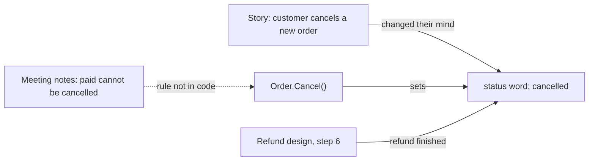

## Before you start

- [[design.l2.status-changes-through-methods]] — you know that each allowed status change of an order is a method of `Order`, such as `Cancel()`, that checks the status it starts from.
- [[design.l3.domain-events]] — you know that a domain event is named after something the business cares about, such as `OrderCancelled`, so its name is a business word.
- [[management.l2.design-doc]] — you have read the refund design in `docs/design/refund-design.md`, the team's plan for refunds at stage-2.

## The situation

The product owner, who decides for the business what Đơn Hàng should do, asks you: at stage-2, can a customer still cancel an order they have already paid for? The meeting notes in `docs/team/meeting-notes-example.md` say no: the customer must ask for a refund instead. Yet `Order.Cancel()` refuses only `cancelled` and `shipped` orders, so a `paid` order goes through.

The refund design also ends a finished refund by setting the order to `cancelled`. In the cancel-order user story, `docs/team/story-example.md`, that word means a customer who changed their mind. Documents and code share words but no longer say the same thing. What has to stay in step so that one word means one thing everywhere?

## Core concepts

- **ubiquitous language** — the set of words that business people, documents and code all use for the same things, each word with one agreed meaning.
- a status word — one of the four values of `Order.Status` at stage-2, `new`, `paid`, `shipped` and `cancelled`, which the team's documents write exactly as the code does.
- a rule only in a document — a decision the team wrote down, such as "a `paid` order cannot be cancelled", that no check in the code enforces yet.

## How it works



In the situation above, the ubiquitous language is what let you check the product owner's question in minutes. The story's acceptance criteria say a customer can cancel a `new` order, which then becomes `cancelled`. The meeting notes decide that a `paid` order cannot be cancelled from the app. `Order` has a `Status` property holding exactly those strings and a method named `Cancel()`, which sets `Status` to `cancelled`. Because the words match, a sentence in a document points straight at a few lines of code, and you can read whether the rule is there.

Here it is not. The notes list a task to add that status check to the cancel API in the same sprint, yet at stage-2 `Cancel()` still accepts a `paid` order. The refund design notices the gap and lists it under its open questions for the product owner. At stage-2, the rule lives only in a document, which is why the diagram draws that arrow dashed.

The second problem sits in the word itself. The refund design's last step, step 6, moves a refunded order to `cancelled`. Once refunds exist, one word would cover two business events: a customer changing their mind about an unpaid order, and a refund that has finished. A question such as "how many orders did customers cancel?" would then count refunds too.

Both are signs that the language needs work. A rule that exists only in a document needs a check in the code; for a rule about status changes, that is `Order`, where the other status checks already sit. A word with two meanings needs a sharper word, agreed with the business. In both cases the code changes together with the documents.

## In the Đơn Hàng system

The status words, as the code holds them:

```csharp file=DonHang.Domain/Entities.cs tag=stage-2 lines=72-96
    // lesson: design.l2.status-changes-through-methods
    // One method per allowed change, each checking the status it starts from.
    // No endpoint takes payments at stage-2; OrderTests uses this to get a paid order.
    public void MarkPaid()
    {
        if (Status == "cancelled") throw new OrderStatusException(Id, "already-cancelled", $"order {Id} is cancelled");
        if (Status != "new") throw new OrderStatusException(Id, "already-paid", $"order {Id} is already paid");
        Status = "paid";
    }

    // lesson: design.l2.domain-model
    public void Cancel()
    {
        if (Status == "cancelled") throw new OrderStatusException(Id, "already-cancelled", $"order {Id} is already cancelled");
        if (Status == "shipped") throw new OrderStatusException(Id, "already-shipped", $"order {Id} has already shipped");
        Status = "cancelled";
    }

    public void Ship()
    {
        if (Status == "cancelled") throw new OrderStatusException(Id, "already-cancelled", $"order {Id} is cancelled");
        if (Status == "shipped") throw new OrderStatusException(Id, "already-shipped", $"order {Id} has already shipped");
        if (Status != "paid") throw new OrderStatusException(Id, "not-paid", $"order {Id} is not paid yet");
        Status = "shipped";
    }
```

All four status words of the story's acceptance criteria appear here unchanged, and each method is named after a business action. Now read `Cancel()` against the meeting notes: it has a check for `cancelled` and one for `shipped`, and none for `paid`. That missing line is the meeting's decision, which never reached the code.

`PATCH /api/v1/orders/{id}/cancel` reaches this method through `OrderService.CancelOrderAsync`, so a `paid` order its owner sends there is cancelled. `OrderStatusException` is what each refused change throws, and `OrderTests` is the unit test class for `Order`. As the comment says, no endpoint takes payments at stage-2, and in code only `OrderTests` calls `MarkPaid()`; but the sample data loaded into the database already holds five `paid` orders, so the gap is live today.

Step 6 of the refund design, which is written in Vietnamese; the paragraph after it says what the step does, and YC-5 is a numbered requirement in `docs/team/refund-requirements.md`:

```markdown file=docs/design/refund-design.md tag=stage-2 lines=35-37
6. Cổng xác nhận: trong cùng một transaction, dòng thành `refunded` với
   `paid_at`, đơn chuyển sang `cancelled`, và một dòng `notifications`
   `pending` được thêm; email đi theo đường của mọi thông báo khác (YC-5).
```

When the payment gateway confirms a refund, one transaction marks the refund row `refunded` with its `paid_at`, moves the order to `cancelled`, and adds a `pending` row to `notifications`. The order's status is the same `cancelled` that the story's acceptance criteria set when a customer cancels a `new` order. In its section on risks and open questions, the design records the other gap: the cancel endpoint still cancels a `paid` order, because `Order.Cancel()` blocks only `cancelled` and `shipped`, and the product owner is to decide whether to block it now.

This is the stage-2 snapshot: by stage-3, the `Cancel()` you read in [[design.l3.domain-events]] refuses a `paid` order, so the meeting's decision did reach `Order`.

## Seniors often assume…

- **"The ubiquitous language is a glossary document the team writes once at the start of a project and then files away."** → Actually it is the words people use in meetings, stories, designs and `Order` itself, and it changes as the business does. The refund design, added to the repository after the story, is about to give `cancelled` a second meaning. A list written at the start would not mention refunds at all. You notice this when the list says one thing and the newest design document uses the word differently.
- **"Code may use its own technical names, as long as the documents use the business's words."** → Actually the match is what made the check in the situation quick. If `Order` had one general method that set a status number instead of `Cancel()`, and stored a number instead of `cancelled`, nothing in the meeting notes would point at a line of code. You notice this when answering "can a paid order be cancelled?" means tracing numbers through several classes instead of reading one method.
- **"When the code and the meeting notes disagree, the code is right, because the code is what runs."** → Actually the code shows what happens, not what the business decided. Here the code lets a paid order be cancelled without a refund, which the meeting notes reject because it leaves an order cancelled while the money stays taken, a state nobody handles. The disagreement is the defect, and the business decides which side changes. You notice this when a support request asks why a cancelled order was never refunded.

## Try it (3 minutes)

In the root folder of the example repository, in Git Bash:

1. Run `git grep -n -w "cancelled" stage-2 -- docs/team/story-example.md docs/design/refund-design.md DonHang.Domain/Entities.cs`. `-n` prints line numbers, `-w` matches the whole word only, and `stage-2` searches the files as they are at that tag; each line starts with `stage-2:`, the path and the line number.
2. For each line from the two documents, write down in business words what happened to the order. Which line describes a different business event from the others?

Expected result: nine lines, four from `DonHang.Domain/Entities.cs`, two from `docs/design/refund-design.md` and three from `docs/team/story-example.md`.

<details><summary>Suggested answer</summary>

The three story lines (12, 14, 19) all mean a customer cancelling an order, or the cancel button. Line 61 of the refund design quotes the checks in `Order.Cancel()`. Line 36 is the odd one: it means a refund has finished. If the team agrees that a refunded order deserves its own word, the change does not end in the documents. `Order` then needs a matching status and a method that sets it, and the story and the design use that word too.

</details>

## Connections

- [[design.l3.bounded-context]] — what comes next: where one model and its words stop applying, and the same word may mean something else.
- [[design.l2.status-changes-through-methods]] — the methods that turned the status words into code; this lesson reads them against the documents.
- [[management.l1.meetings-and-communication]] — where the meeting notes come from; a decision written there counts only once the code carries it too.
- [[management.l1.user-story-and-ac]] — the story whose acceptance criteria use the same status words as `Order`.
- [[management.l2.design-doc]] — the refund design, read here for its words rather than its plan.

## Five-line summary

1. A ubiquitous language is the set of words business people, documents and code share, each word with one agreed meaning.
2. At stage-2 `new`, `paid`, `shipped` and `cancelled` appear unchanged in the story's criteria and `Order`; the meeting notes use the same `paid`.
3. The meeting notes forbid cancelling a `paid` order, yet `Order.Cancel()` still accepts one; the refund design lists this as open.
4. The refund design moves a refunded order to `cancelled`, so one word would cover a changed mind and a finished refund.
5. A word with two meanings or a rule only in a document needs a sharper word or rule, changed in code too.
