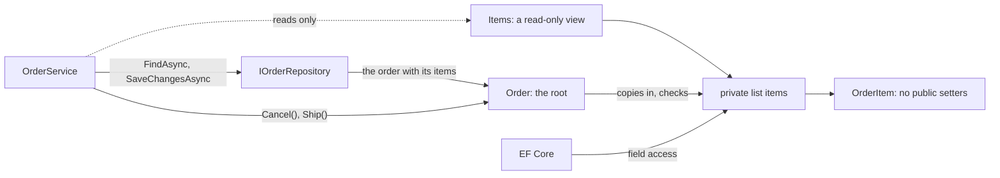

## Before you start

- [[design.l3.aggregates-and-invariants]] — you know the gap at stage-2: `Order`'s constructor checks the items, then keeps the caller's list and hands it out through `Items`, and `OrderItem` has public setters.
- [[design.l3.storing-value-objects]] — you know `OrderItem.UnitPrice` is a `Vnd` at stage-3, stored in its item's own row.
- [[design.l2.ef-core-and-private-setters]] — you know EF Core fills properties whose setters are private, and loads an `Order` through its private constructor.

## The situation

A customer phones support: order 12 should no longer include the keyboard. At stage-2 a teammate could write the fix inside a use case in three lines: load the order, set the keyboard item's `Quantity` to 0, save. Nothing in `Order` would see the change; only a rule on the `order_items` table that rejects a quantity below 1 would refuse the save, as a database error far from the class that states the rule. At stage-3 that assignment does not compile, and neither does `order.Items.Clear()`. Yet `FindAsync` still returns order 12 with both its items filled in. What changed so that only `Order` can touch its items, and how does EF Core still reach them?

## Core concepts

- **aggregate root** — the one entity of an aggregate that outside code holds and calls, so every change inside the aggregate goes through its methods; in Đơn Hàng, `Order`.
- the private list — the field `items` inside `Order`, the only place an order's items are kept; no code outside `Order` can name it.
- a read-only view — what `items.AsReadOnly()` returns: an object that lets any code read the list and refuses every change to the list itself (add, remove, clear); it does not stop changes to the items it holds.
- field access — EF Core reading and writing a field directly instead of going through the property that wraps it.

## How it works



In the situation above, the aggregate is order 12 with its items, and the aggregate root is `Order`. `OrderService` gets the order from `IOrderRepository` with `FindAsync`, calls methods such as `Cancel()` or `Ship()` on it, and saves it with `SaveChangesAsync`. It never holds an item it could change on its own.

Follow the arrows into the private list. The public constructor copies the items it receives into `items` and checks the copy, so the checks see exactly what the order keeps. Clearing the caller's list, or adding an item with quantity 0 to it, then changes nothing inside the order. Each method that changes an order lives on `Order`; none adds or removes an item after the constructor. A few values are still set from outside, such as the id, which the repository assigns.

Outside code reads the items through `Items`, a read-only view of the private list typed `IReadOnlyList<OrderItem>`. The type has no `Add`, `Remove` or `Clear`, so `order.Items.Clear()` does not compile. Code that casts the view to `IList<OrderItem>` and calls `Clear()` compiles, but the call throws `NotSupportedException`.

The copy still holds the same `OrderItem` objects the caller built, so the caller could change a quantity through one of them. At stage-3 `OrderItem` takes its product, quantity and price through its constructor and has only private setters (EF Core fills `OrderId`, the link to its order, itself). Once `Order` has checked an item, no code outside `OrderItem` can assign its quantity.

EF Core needs more than a view. The mapping tells it to use field access for `Items`, so it fills the private list when it loads an order and reads it when it saves.

## In the Đơn Hàng system

The private list and its view, inside `Order`:

```csharp file=DonHang.Domain/Entities.cs tag=stage-3 lines=36-41
    // lesson: design.l3.aggregate-root
    // The items live in this private list; outside code gets only a read-only
    // view of it, so nothing but Order can add, remove or clear an item.
    // EF Core reads and writes the list itself (DonHangDbContext says so).
    private readonly List<OrderItem> items = [];
    public IReadOnlyList<OrderItem> Items => items.AsReadOnly();
```

`readonly` on the field means no code, not even `Order`, can swap the list for another one after the object is built; `Order` can only change the contents of the list it has. Further down in `Order`, the public constructor's first statement is `this.items.AddRange(items);`, and its two checks run on that copy. Compare stage-2, where `Items` was a `List<OrderItem>` with a private setter, and the constructor assigned the caller's list to it.

How EF Core gets past the view, in `DonHangDbContext`:

```csharp file=DonHang.Infrastructure/DonHangDbContext.cs tag=stage-3 lines=49-54
            e.HasMany(o => o.Items).WithOne().HasForeignKey(i => i.OrderId);

            // lesson: design.l3.aggregate-root
            // Items is a read-only view; EF Core fills and reads the private
            // `items` list behind it instead of going through the property.
            e.Navigation(o => o.Items).HasField("items").UsePropertyAccessMode(PropertyAccessMode.Field);
```

The last line names the field behind the navigation with `HasField("items")` and tells EF Core to use that field for both reading and writing. The table and its columns stay as they were; only how EF Core reaches the items changed.

None of the six methods of `IOrderRepository` at stage-3 takes or returns an `OrderItem` on its own. `FindAsync` loads an order together with its items. Through `IOrderRepository`, code reaches an item only by loading its order, and at stage-3 the order offers no method that changes an item. Support's request therefore needs a new `Order` method that changes the item and checks the rules, called by a use case that loads the order.

## Seniors often assume…

- **"A private setter on `Items` already stops other code from changing the items."** → Actually a private setter stops other code from replacing the list, not from changing the list the getter returns, because the getter hands out the list itself. You notice this at stage-2, where `Items` is a `List<OrderItem>` with a private setter and `order.Items.Clear()` compiles and empties an order its constructor accepted.
- **"Every entity needs its own repository, so `OrderItem` should get one too."** → Actually an item has no meaning apart from its order, and a repository for items would let code load, change and save one without `Order` checking its rules. You notice this when you look for an item method in `IOrderRepository`: there is none.
- **"Exposing the items as read-only means EF Core can no longer fill them when it loads an order."** → Actually the mapping points EF Core at the private list, and EF Core adds the loaded items to that list directly, so the view never stands in its way. You notice this when `FindAsync` returns an order whose `Items` holds every row of `order_items` for that order, as before.

## Try it (3 minutes)

In the root folder of the example repository, in Git Bash:

1. Run `git grep -n -e "Quantity {" -e " Items" stage-2 stage-3 -- DonHang.Domain/Entities.cs`.
2. Read the lines for each tag, then answer: at stage-2, which lines each give a use case its own way to break the rule "every quantity at least 1" after the order was placed, and which stage-3 lines close each of them?

Expected result: lines from both tags. For `stage-2` they include `public List<OrderItem> Items { get; private set; } = [];`, `Items = items;` and `public int Quantity { get; set; }`. For `stage-3` they include `public IReadOnlyList<OrderItem> Items => items.AsReadOnly();` and `public int Quantity { get; private set; } = quantity;`. Each tag also prints the comment about the `Items` navigation above the private constructor.

<details><summary>Suggested answer</summary>

At stage-2, `Items { get; private set; }` hands out the list itself, so a use case can add an item whose quantity is 0. `Quantity { get; set; }` lets it set an existing item's quantity to 0; a read-only view alone would not stop that, because it still lets code reach every item. At stage-3, `Items => items.AsReadOnly()` hands out only a view with no way to add, remove or clear, and `Quantity { get; private set; }` lets only `OrderItem` assign the quantity, in its constructor.

`Items = items;` is a third way in: the caller keeps the same list and can still change it. Stage-3 closes it in the constructor with `this.items.AddRange(items);`, a line this grep does not print. Each of these lines closes one way in; leaving any one open breaks the rule.

</details>

## Connections

- [[design.l3.aggregates-and-invariants]] — the fix for the problem in that lesson: the gap it found at stage-2 is closed here at stage-3.
- [[design.l2.ef-core-and-private-setters]] — the same idea one step further: EF Core reaches a private field as it reached private setters.
- [[design.l1.the-repository-layer]] — the repository from that lesson, now shaped by the aggregate: one per root, none for the parts.
- [[design.l3.reference-other-aggregates-by-id]] — what comes next: where one aggregate ends and how it points to another.

## Five-line summary

1. The aggregate root is the one entity outside code holds and calls, so every change inside the aggregate goes through the root's methods.
2. At stage-3 `Order` copies its items into a private list and hands out a read-only view; only `Order` and EF Core's mapping change the list.
3. `OrderItem` takes its values through its constructor and has no public setters, so no other class can assign a checked quantity again.
4. EF Core still loads and saves the items, because the mapping makes it read and write the private list instead of the property.
5. `IOrderRepository` loads whole orders and has no item method, so code using it, as `OrderService` does, reaches an item only through its order.
