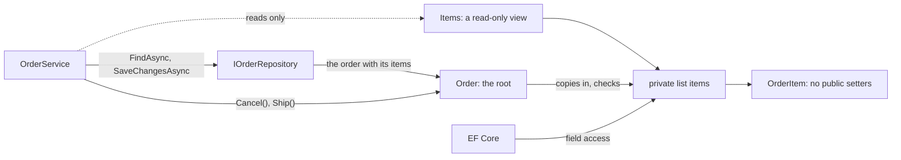

## Bạn cần biết trước

- [[design.l3.aggregates-and-invariants]] — bạn biết lỗ hổng ở stage-2: constructor của `Order` kiểm tra các item, rồi giữ luôn danh sách của bên gọi và đưa nó ra ngoài qua `Items`, còn `OrderItem` có setter public.
- [[design.l3.storing-value-objects]] — bạn biết ở stage-3 `OrderItem.UnitPrice` là một `Vnd`, lưu ngay trong dòng của item đó.
- [[design.l2.ef-core-and-private-setters]] — bạn biết EF Core điền được các property có setter private, và tải một `Order` qua constructor private của nó.

## Tình huống

Một khách gọi cho bộ phận hỗ trợ: đơn 12 không lấy bàn phím nữa. Ở stage-2, một đồng đội có thể viết bản sửa ngay trong một use case, gói gọn trong ba dòng: tải đơn, đặt `Quantity` của item bàn phím về 0, lưu. `Order` không hề thấy thay đổi này. Thứ duy nhất chặn lại là một quy tắc trên bảng `order_items` từ chối số lượng dưới 1, và nó báo ra thành lỗi database, ở xa class nơi quy tắc được phát biểu. Ở stage-3, phép gán đó không compile, `order.Items.Clear()` cũng vậy. Thế nhưng `FindAsync` vẫn trả về đơn 12 với đủ cả hai item. Điều gì đã đổi để chỉ `Order` chạm được vào các item của nó, và EF Core vẫn tới được chúng bằng cách nào?

## Khái niệm cốt lõi

- **aggregate root** (entity duy nhất của aggregate mà code bên ngoài được giữ và gọi; mọi thay đổi đều đi qua nó) — code bên ngoài chỉ giữ và gọi entity này, nên mọi thay đổi bên trong aggregate đều đi qua các method của nó. Trong Đơn Hàng, đó là `Order`.
- danh sách private — field `items` bên trong `Order`, nơi duy nhất giữ các item của một đơn. Không code nào bên ngoài `Order` gọi được tên nó.
- view chỉ đọc — thứ `items.AsReadOnly()` trả về: một object cho mọi code đọc danh sách nhưng từ chối mọi thay đổi lên chính danh sách (thêm, xóa, làm rỗng). Nó không ngăn thay đổi lên các item nằm trong danh sách.
- truy cập qua field — EF Core đọc và ghi thẳng một field thay vì đi qua property bọc ngoài field đó.

## Cơ chế hoạt động



Trong tình huống trên, aggregate là đơn 12 cùng các item của nó, còn aggregate root là `Order`. `OrderService` lấy đơn từ `IOrderRepository` bằng `FindAsync`, gọi các method như `Cancel()` hay `Ship()` trên đơn, rồi lưu bằng `SaveChangesAsync`. Nó không bao giờ cầm một item mà nó tự đổi được.

Lần theo các mũi tên vào danh sách private. Constructor public chép các item nhận được vào `items` rồi kiểm tra bản chép, nên các bước kiểm tra thấy đúng những gì đơn giữ. Sau đó, làm rỗng danh sách của bên gọi, hay thêm vào đó một item số lượng 0, không đổi gì bên trong đơn. Mọi method thay đổi một đơn đều nằm trên `Order`, và không method nào thêm hay xóa item sau constructor. Vài giá trị vẫn được đặt từ bên ngoài, như id, do repository gán.

Code bên ngoài đọc các item qua `Items`, một view chỉ đọc của danh sách private, có kiểu `IReadOnlyList<OrderItem>`. Kiểu này không có `Add`, `Remove` hay `Clear`, nên `order.Items.Clear()` không compile. Code ép view sang `IList<OrderItem>` rồi gọi `Clear()` thì compile được, nhưng lời gọi ném `NotSupportedException`.

Bản chép vẫn giữ đúng những object `OrderItem` mà bên gọi đã tạo, nên bên gọi có thể đổi số lượng qua một trong số chúng. Ở stage-3, `OrderItem` nhận sản phẩm, số lượng và giá qua constructor và chỉ có setter private (riêng `OrderId`, liên kết tới đơn của item, do EF Core tự điền). Một khi `Order` đã kiểm tra một item, không code nào bên ngoài `OrderItem` gán lại được số lượng của nó.

EF Core cần nhiều hơn một view. Phần map bảo nó dùng truy cập qua field cho `Items`, nên nó điền danh sách private khi tải một đơn và đọc danh sách đó khi lưu.

## Trong hệ thống Đơn Hàng

Danh sách private và view của nó, bên trong `Order`:

```csharp file=DonHang.Domain/Entities.cs tag=stage-3 lines=36-41
    // lesson: design.l3.aggregate-root
    // The items live in this private list; outside code gets only a read-only
    // view of it, so nothing but Order can add, remove or clear an item.
    // EF Core reads and writes the list itself (DonHangDbContext says so).
    private readonly List<OrderItem> items = [];
    public IReadOnlyList<OrderItem> Items => items.AsReadOnly();
```

`readonly` trên field nghĩa là sau khi object đã dựng xong, không code nào, kể cả `Order`, thay được danh sách này bằng một danh sách khác. `Order` chỉ đổi được nội dung của danh sách nó đang có. Xuống dưới trong `Order`, câu lệnh đầu tiên của constructor public là `this.items.AddRange(items);`, và hai bước kiểm tra của nó chạy trên bản chép đó. Hãy so với stage-2: khi ấy `Items` là một `List<OrderItem>` có setter private, và constructor gán thẳng danh sách của bên gọi vào nó.

EF Core vượt qua view thế nào, trong `DonHangDbContext`:

```csharp file=DonHang.Infrastructure/DonHangDbContext.cs tag=stage-3 lines=49-54
            e.HasMany(o => o.Items).WithOne().HasForeignKey(i => i.OrderId);

            // lesson: design.l3.aggregate-root
            // Items is a read-only view; EF Core fills and reads the private
            // `items` list behind it instead of going through the property.
            e.Navigation(o => o.Items).HasField("items").UsePropertyAccessMode(PropertyAccessMode.Field);
```

Dòng cuối chỉ ra field đứng sau navigation bằng `HasField("items")`, và bảo EF Core dùng field đó cho cả đọc lẫn ghi. Bảng và các cột giữ nguyên, chỉ cách EF Core tới các item là đổi.

Trong sáu method của `IOrderRepository` ở stage-3, không method nào nhận hay trả về một `OrderItem` riêng lẻ. `FindAsync` tải một đơn cùng các item của nó. Qua `IOrderRepository`, code chỉ tới được một item bằng cách tải đơn chứa nó, và ở stage-3 đơn không có method nào đổi một item. Vì vậy yêu cầu của bộ phận hỗ trợ cần một method mới trên `Order`, vừa đổi item vừa kiểm tra quy tắc, được gọi từ một use case có tải đơn.

## Senior hay nhầm rằng…

- **"Setter private trên `Items` đã chặn code khác đổi các item rồi."** → Thực ra setter private chặn code khác thay cả danh sách, chứ không chặn code đổi danh sách mà getter trả ra, vì getter đưa ra chính danh sách đó. Bạn sẽ nhận ra ở stage-2: `Items` là một `List<OrderItem>` có setter private, vậy mà `order.Items.Clear()` vẫn compile và làm rỗng một đơn mà constructor đã chấp nhận.
- **"Entity nào cũng cần repository riêng, nên `OrderItem` cũng phải có một cái."** → Thực ra một item không có nghĩa gì khi tách khỏi đơn của nó, và repository cho item sẽ cho code tải, đổi rồi lưu một item mà `Order` không kiểm tra quy tắc của mình. Bạn sẽ nhận ra khi tìm một method cho item trong `IOrderRepository`: không có cái nào.
- **"Đưa các item ra dưới dạng chỉ đọc thì EF Core không điền chúng được khi tải đơn nữa."** → Thực ra phần map trỏ EF Core vào danh sách private, và EF Core thêm thẳng các item đã tải vào danh sách đó, nên view không bao giờ cản đường nó. Bạn sẽ nhận ra khi `FindAsync` trả về một đơn có `Items` chứa mọi dòng `order_items` của đơn đó, như trước.

## Thử ngay (3 phút)

Trong thư mục gốc của repo ví dụ, dùng Git Bash:

1. Chạy `git grep -n -e "Quantity {" -e " Items" stage-2 stage-3 -- DonHang.Domain/Entities.cs`.
2. Đọc các dòng của từng tag, rồi trả lời: ở stage-2, những dòng nào mỗi dòng mở cho use case một lối riêng để phá quy tắc "mọi số lượng ít nhất là 1" sau khi đơn đã đặt, và những dòng nào ở stage-3 đóng từng lối đó?

Kết quả mong đợi: các dòng của cả hai tag. Với `stage-2`, trong đó có `public List<OrderItem> Items { get; private set; } = [];`, `Items = items;` và `public int Quantity { get; set; }`. Với `stage-3`, trong đó có `public IReadOnlyList<OrderItem> Items => items.AsReadOnly();` và `public int Quantity { get; private set; } = quantity;`. Mỗi tag cũng in ra comment về navigation `Items` nằm phía trên constructor private.

<details><summary>Gợi ý đáp án</summary>

Ở stage-2, `Items { get; private set; }` đưa ra chính danh sách, nên một use case có thể thêm một item số lượng 0. `Quantity { get; set; }` cho nó đặt số lượng của một item có sẵn về 0. Chỉ một view chỉ đọc thì không chặn được lối này, vì view vẫn cho code chạm tới từng item. Ở stage-3, `Items => items.AsReadOnly()` chỉ đưa ra một view không có cách nào thêm, xóa hay làm rỗng, còn `Quantity { get; private set; }` chỉ cho `OrderItem` gán số lượng, trong constructor của nó.

`Items = items;` là lối thứ ba: bên gọi vẫn giữ cùng danh sách đó và vẫn đổi được nó. Stage-3 đóng lối này trong constructor bằng `this.items.AddRange(items);`, một dòng mà lệnh grep này không in ra. Mỗi dòng kể trên đóng một lối, và để hở bất kỳ lối nào cũng làm vỡ quy tắc.

</details>

## Liên hệ

- [[design.l3.aggregates-and-invariants]] — lời giải cho vấn đề của bài đó: lỗ hổng tìm thấy ở stage-2 được đóng lại ở đây, tại stage-3.
- [[design.l2.ef-core-and-private-setters]] — cùng ý tưởng, tiến thêm một bước: EF Core chạm tới field private như từng chạm tới setter private.
- [[design.l1.the-repository-layer]] — repository của bài đó, giờ được định hình theo aggregate: mỗi root một cái, không cái nào cho các phần bên trong.
- [[design.l3.reference-other-aggregates-by-id]] — bài tiếp theo: một aggregate kết thúc ở đâu và trỏ tới aggregate khác ra sao.

## Tóm tắt 5 dòng

1. Aggregate root là entity duy nhất mà code bên ngoài giữ và gọi, nên mọi thay đổi bên trong aggregate đều đi qua các method của root.
2. Ở stage-3, `Order` chép các item vào một danh sách private và chỉ đưa ra một view chỉ đọc. Chỉ `Order` và phần map của EF Core đổi được danh sách.
3. `OrderItem` nhận giá trị qua constructor và không có setter public, nên không class nào khác gán lại được một số lượng đã kiểm tra.
4. EF Core vẫn tải và lưu các item, vì phần map bắt nó đọc và ghi danh sách private thay vì property.
5. `IOrderRepository` tải nguyên đơn và không có method nào cho item, nên code dùng nó, như `OrderService`, chỉ tới được một item qua đơn của item đó.
