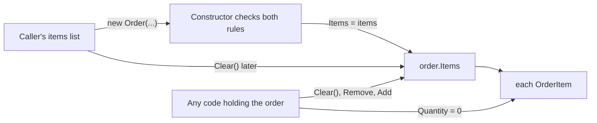

## Before you start

- [[design.l3.entities-and-identity]] — you know `Order` is an entity, followed over time by its `Id`; this lesson asks which objects change together with it.
- [[design.l2.valid-from-construction]] — you know `Order`'s public constructor refuses an order with no items, so every new order starts in an allowed state.
- [[design.l2.testing-the-entity]] — you know `OrderTests` creates an `Order` with its constructor and then calls only its methods.

## The situation

Support asks for a small feature: staff should be able to remove an out-of-stock product from a `new` order before it is paid. You open `OrderService` to add the method and notice you can write it without touching `Order`: load the order, remove the line from `order.Items`, save. The compiler accepts it, and `OrderTests` stays green. Then you think of an order whose only item is that product. The constructor refuses an order with no items, yet nothing stops your method from leaving one. Where must a rule about an order and all of its items be checked, so that it holds after every change and not only at creation?

## Core concepts

- **invariant** — a business rule that must be true whenever the data is saved; in Đơn Hàng, an order has at least one item, and every item has a quantity of at least 1.
- **aggregate (DDD)** — a group of objects, such as an order and its items, that changes as one unit, so that the invariants spanning the group hold after every change.
- shared list — one `List<OrderItem>` object that two variables point to; a change made through either variable is seen through both.
- single way in — the one place, such as a method of `Order`, that every change to the group must pass through, so the check there cannot be skipped.

## How it works



The diagram shows the ways C# code holding a stage-2 order, or the list it was built from, can reach its items. Only one arrow passes through a check.

Start on the left. The controller builds a `List<OrderItem>` and passes it to `OrderService.PlaceOrderAsync`, which passes it on to `new Order(...)`. The constructor checks both invariants: the list is not empty, and no item has a quantity below 1. If either fails, it throws `ArgumentException` and no order exists. At this moment the rules hold.

The constructor then stores that same list in `Items`; it does not copy it. The caller's variable and `order.Items` are now a shared list. Clearing the caller's list after `new Order(...)` empties the order too, and the constructor never runs again to notice.

The middle arrow is any code that holds the order, such as the method in the situation above. `Items` has a private setter, so outside code cannot assign a different list to it. But the getter returns the list itself, and `List<OrderItem>` has public `Clear()`, `Remove` and `Add` methods.

The last arrow goes one level deeper. Each `OrderItem` has public setters, so code holding an item can set its `Quantity` to `0`, and `Order` is not told.

That is why the order and its items form one aggregate. The two invariants mention both of them, so they can be kept only if every change to either passes through a single way in that checks them. At stage-2 the only check in the C# code is the constructor: it guards the way in, not the changes that follow.

## In the Đơn Hàng system

The only C# code that checks the item rules, in `DonHang.Domain/Entities.cs`:

```csharp file=DonHang.Domain/Entities.cs tag=stage-2 lines=60-70
    // lesson: design.l2.valid-from-construction
    public Order(int customerId, List<OrderItem> items, DateTimeOffset placedAt)
    {
        if (items.Count == 0) throw new ArgumentException("an order needs at least one item");
        if (items.Any(item => item.Quantity < 1)) throw new ArgumentException("every item needs a quantity of at least 1");

        CustomerId = customerId;
        Items = items;
        PlacedAt = placedAt;
        Status = "new";
    }
```

Look at the two checks, then at `Items = items`. The order keeps the caller's list object, not a copy of it. Earlier in the same class, the property is declared as `public List<OrderItem> Items { get; private set; } = [];`. The private setter stops other code from replacing the list, but the getter hands out the list itself, with every method that changes it.

The items themselves, in the same file:

```csharp file=DonHang.Domain/Entities.cs tag=stage-2 lines=99-105
public sealed class OrderItem
{
    public int OrderId { get; set; }
    public int ProductId { get; set; }
    public int Quantity { get; set; }
    public int UnitPriceVnd { get; set; }
}
```

Every property has a public setter. The constructor checks `Quantity` once, when the order is created; after that, any code holding an item can set it to `0`.

No stage-2 code does that yet. `OrdersController.Create` builds the list, passes it to `PlaceOrderAsync` and does not touch it again, and after creating the order `OrderService` only calls `Cancel()` or `Ship()`, which change `Status`. The gap is in what the types allow, not in what today's code does.

`OrderTests` does not show the gap either. `Constructor_NoItems_Throws` and `Constructor_QuantityBelowOne_Throws` check the item rules by passing a bad list to the constructor. Every other test builds an order with `NewOrder()` and calls only `MarkPaid()`, `Ship()` or `Cancel()`. None of them changes the items after construction, so the suite stays green while any code holding an order can still break both rules.

## Seniors often assume…

- **"An aggregate is any set of tables joined by foreign keys."** → Actually an aggregate is drawn around the rules that must hold together, not around the foreign keys. `order_items` points to `products` by a foreign key, yet neither item rule mentions anything about a product, so a product's price can change without checking any order. You notice this when grouping by foreign keys pulls `customers` and `products` into the order, and changing one product seems to require loading every order that lists it.
- **"Once the constructor has checked the items, the order stays valid for good."** → Actually the constructor runs once, so its checks guard only the moment of creation. The shared list and the public setters on `OrderItem` stay open afterwards. You notice this when a bug report shows a saved order with no items, while every test in `OrderTests` passes.
- **"An invariant is just input validation, moved from the controller into the domain."** → Actually input validation checks one request when it arrives, while an invariant must hold for the saved data after every change, whichever code made it. A request is only one way in; a new service method, a background job or a test is another. You notice this when a new code path that never goes through the controller saves data the controller would have refused.

## Try it (3 minutes)

In the root folder of the example repository, in Git Bash:

1. Run `git show stage-2:DonHang.Tests/Domain/OrderTests.cs`.
2. For each test, note whether it reads or changes the order's items after the order exists.
3. Then answer: which test would you add to show the gap, and what would it do?

Expected result: only `Constructor_NoItems_Throws` and `Constructor_QuantityBelowOne_Throws` test the item rules, and both hand a bad list to the constructor. No test mentions `Items` after an order is created.

<details><summary>Suggested answer</summary>

A test that exposes the gap creates a valid order with one item, then breaks a rule from outside: it clears `order.Items`, clears the list it passed to the constructor, or sets that item's `Quantity` to `0`. It then asserts that the order refused the change. At stage-2 that test cannot pass, because nothing in `Order` runs when its items change. Making it pass means routing every change to the items through `Order`, which the next lesson does.

</details>

## Connections

- [[design.l3.entities-and-identity]] — prerequisite: `Order` is the entity; this lesson adds the objects that must change together with it.
- [[design.l2.valid-from-construction]] — the constructor check this lesson builds on, and shows is not enough on its own.
- [[design.l2.testing-the-entity]] — the tests there check the item rules only at creation; this lesson names what they leave out.
- [[foundation.l1.oop-encapsulation]] — the same idea at the scale of one class: data changed only through the class's own methods.
- [[design.l2.where-a-rule-belongs]] — a rule lives with its data; here the data of one rule spans an order and its items.
- [[design.l3.aggregate-root]] — the fix for the gap shown here.

## Five-line summary

1. An aggregate is a group of objects that changes as one unit, so the invariants spanning the group hold after every change.
2. An invariant is a rule true whenever data is saved: an order has at least one item, each with quantity at least 1.
3. At stage-2 only `Order`'s constructor, in C#, checks both rules; it keeps the caller's list, and `Items` returns that list itself.
4. `OrderItem` has public setters, and `OrderTests` never changes items after creation, so the gap stays hidden.
5. A rule spanning several objects holds only if every change to them passes through one place that checks it.
