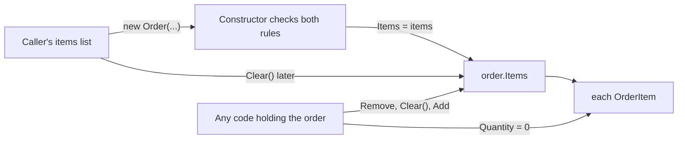

## Bạn cần biết trước

- [[design.l3.entities-and-identity]] — bạn biết `Order` là một entity, được theo dõi theo thời gian qua `Id` của nó. Bài này hỏi những object nào thay đổi cùng với nó.
- [[design.l2.valid-from-construction]] — bạn biết constructor public của `Order` từ chối một đơn không có item nào, và ở stage-2 còn từ chối mọi item có số lượng dưới 1.
- [[design.l2.testing-the-entity]] — bạn biết `OrderTests` tạo một `Order` bằng constructor rồi chỉ gọi các method của nó.

## Tình huống

Bộ phận hỗ trợ xin một tính năng nhỏ: nhân viên được bỏ một sản phẩm hết hàng khỏi một đơn `new` trước khi khách thanh toán. Bạn mở `OrderService` để thêm method và thấy có thể viết nó mà không đụng tới `Order`: tải đơn, xóa item đó khỏi `order.Items`, lưu. Code compile được, và mọi test trong `OrderTests` vẫn qua. Rồi bạn hình dung một đơn chỉ có đúng một item là sản phẩm đó. Constructor từ chối tạo một đơn không có item nào, vậy mà method của bạn lại để lại đúng một đơn như thế. Một quy tắc về một đơn và toàn bộ item của nó phải được kiểm tra ở đâu, để nó vẫn đúng sau mọi thay đổi chứ không chỉ lúc tạo?

## Khái niệm cốt lõi

- **invariant** (quy tắc nghiệp vụ phải luôn đúng mỗi khi dữ liệu được lưu, như đơn phải có ít nhất một dòng hàng) — trong Đơn Hàng, một đơn có ít nhất một item, và mọi item có số lượng ít nhất là 1.
- **aggregate (DDD)** (nhóm đối tượng, như đơn và các dòng hàng, được thay đổi như một khối để quy tắc của nhóm luôn đúng) — một nhóm object, như một đơn và các item của nó, thay đổi như một đơn vị, để các invariant trải trên cả nhóm vẫn đúng sau mọi thay đổi.
- danh sách dùng chung — một object `List<OrderItem>` duy nhất mà hai biến cùng trỏ tới, như biến của bên gọi và `order.Items`. Đổi qua biến nào thì thay đổi cũng hiện ra ở cả hai.
- lối vào duy nhất — nơi duy nhất, như một method của `Order`, mà mọi thay đổi lên nhóm đều phải đi qua, nên bước kiểm tra ở đó không thể bị bỏ qua.

## Cơ chế hoạt động



Sơ đồ cho thấy code tới các item của một đơn ở stage-2 bằng những đường nào, trực tiếp hoặc qua danh sách đã dùng để tạo đơn. Chỉ một mũi tên đi qua bước kiểm tra.

Controller dựng một `List<OrderItem>` từ request, và `OrderService.PlaceOrderAsync` truyền nó vào `new Order(...)`. Constructor kiểm tra cả hai invariant: danh sách không rỗng, và không item nào có số lượng dưới 1. Nếu một trong hai không đạt, nó ném `ArgumentException` và không có đơn nào tồn tại.

Sau đó constructor lưu chính danh sách ấy vào `Items`, không chép ra bản mới. Giờ biến của bên gọi và `order.Items` cùng trỏ tới một danh sách dùng chung, nên làm rỗng danh sách của bên gọi sau `new Order(...)` cũng làm rỗng luôn đơn. Constructor không chạy lại lần nào để phát hiện.

Mũi tên từ "Any code holding the order" là những code như method trong tình huống trên. `Items` có setter private, nên code bên ngoài không gán được một danh sách khác vào đó. Nhưng getter trả về chính danh sách, và `List<OrderItem>` có các method public `Remove`, `Clear()` và `Add`.

Mũi tên cuối đi sâu thêm một tầng: mỗi `OrderItem` có setter public, nên code đang giữ một item có thể đặt `Quantity` của item đó về `0` mà `Order` không hề hay biết.

Invariant thứ nhất nói về đơn và toàn bộ item của nó cùng lúc, invariant thứ hai nói về từng item mà đơn giữ. Quy tắc thứ hai cũng là quy tắc của đơn: mỗi `OrderItem` mang một `OrderId`, nên một item có số lượng `0` khiến đơn chứa nó vi phạm quy tắc. Cả hai chỉ luôn đúng khi mọi thay đổi lên đơn hay bất kỳ item nào của đơn đều đi qua một lối vào duy nhất có kiểm tra chúng. Đó là lý do đơn và các item của nó nên hợp thành một aggregate. Ở stage-2 chúng chưa thay đổi như một đơn vị: bước kiểm tra duy nhất của `Order` là constructor, thứ canh lúc tạo chứ không canh những thay đổi sau đó.

## Trong hệ thống Đơn Hàng

Đoạn code trong `Order` kiểm tra các quy tắc về item, nằm trong `DonHang.Domain/Entities.cs`:

```csharp file=DonHang.Domain/Entities.cs tag=stage-2 lines=60-70
    // lesson: design.l2.valid-from-construction
    public Order(int customerId, List<OrderItem> items, DateTimeOffset placedAt)
    {
        if (items.Count == 0) throw new ArgumentException("an order needs at least one item");
        if (items.Any(item => item.Quantity < 1)) throw new ArgumentException("every item needs a quantity of at least 1");

        CustomerId = customerId;
        Items = items;
        PlacedAt = placedAt;
        Status = "new";
    }
```

Sau hai bước kiểm tra, `Items = items` giữ lại object danh sách của bên gọi, không phải một bản chép. Phía trên trong cùng class, property được khai báo là `public List<OrderItem> Items { get; private set; } = [];`. Setter private chặn code khác thay danh sách, nhưng getter đưa ra chính danh sách, kèm mọi method làm thay đổi nó.

Bản thân các item, trong cùng file:

```csharp file=DonHang.Domain/Entities.cs tag=stage-2 lines=99-105
public sealed class OrderItem
{
    public int OrderId { get; set; }
    public int ProductId { get; set; }
    public int Quantity { get; set; }
    public int UnitPriceVnd { get; set; }
}
```

Property nào cũng có setter public, nên sau lần kiểm tra duy nhất của constructor, bất kỳ code nào giữ một item cũng đặt được `Quantity` về `0`.

Chưa code nào ở stage-2 làm vậy. Cả hai endpoint tạo đơn, `OrdersController.Create` và bản v2 tương ứng trong `OrdersV2Controller`, đều dựng danh sách, truyền vào `PlaceOrderAsync` rồi không đụng tới nó nữa. Sau khi tạo đơn, `OrderService` chỉ gọi `Cancel()` hoặc `Ship()`, hai method chỉ đổi `Status`. Lỗ hổng nằm ở những gì các kiểu cho phép, không nằm ở những gì code hôm nay đang làm.

`OrderTests` cũng không để lộ lỗ hổng. `Constructor_NoItems_Throws` và `Constructor_QuantityBelowOne_Throws` kiểm tra các quy tắc về item bằng cách truyền một danh sách sai vào constructor. Mọi test còn lại tạo đơn bằng `NewOrder()`, một helper trong `OrderTests` gọi constructor với một item hợp lệ, rồi chỉ gọi `MarkPaid()`, `Ship()` hoặc `Cancel()`. Không test nào đổi item sau khi tạo, nên cả bộ test vẫn qua trong khi bất kỳ code nào giữ một đơn vẫn phá được một trong hai quy tắc.

## Senior hay nhầm rằng…

- **"Aggregate là bất kỳ tập bảng nào nối với nhau bằng khóa ngoại."** → Thực ra aggregate được vạch quanh những quy tắc phải cùng đúng, không phải quanh khóa ngoại. `order_items`, bảng đứng sau `OrderItem`, trỏ tới `products` bằng một khóa ngoại, nhưng không quy tắc nào về item nhắc tới sản phẩm, nên giá của một sản phẩm đổi được mà không cần kiểm tra đơn nào. Bạn sẽ nhận ra khi gom theo khóa ngoại kéo luôn `customers` và `products` vào trong đơn.
- **"Constructor đã kiểm tra các item thì đơn sẽ hợp lệ mãi mãi."** → Thực ra constructor chỉ chạy một lần, nên các bước kiểm tra của nó chỉ canh khoảnh khắc tạo ra đơn. Danh sách dùng chung và các setter public trên `OrderItem` vẫn để ngỏ sau đó. Bạn sẽ nhận ra khi một báo lỗi cho thấy một đơn đã lưu mà không có item nào, trong khi mọi test trong `OrderTests` đều qua.
- **"Invariant chỉ là kiểm tra đầu vào, chuyển từ controller vào `Order`."** → Thực ra kiểm tra đầu vào, tức controller kiểm tra các field của từng request trước khi gọi service, chỉ xét một request lúc nó tới. Invariant phải đúng với dữ liệu đã lưu sau mọi thay đổi, bất kể code nào gây ra. Một request chỉ là một lối vào, còn một method service mới là một lối khác. Bạn sẽ nhận ra khi một đường code không hề đi qua controller lại lưu dữ liệu mà controller lẽ ra đã từ chối.

## Thử ngay (3 phút)

Trong thư mục gốc của repo ví dụ, mở một shell:

1. Chạy `git show stage-2:DonHang.Tests/Domain/OrderTests.cs`.
2. Với từng test, ghi lại test đó có đọc hay đổi các item của đơn sau khi đơn đã tồn tại không.
3. Rồi trả lời: bạn sẽ thêm test nào để chỉ ra lỗ hổng, và test đó làm gì?

Kết quả mong đợi: chỉ `Constructor_NoItems_Throws` và `Constructor_QuantityBelowOne_Throws` kiểm tra các quy tắc về item, và cả hai đưa một danh sách sai vào constructor. Không test nào nhắc tới `Items` sau khi đơn đã được tạo.

<details><summary>Gợi ý đáp án</summary>

Một test làm lộ lỗ hổng sẽ tạo một đơn hợp lệ có một item, rồi phá một quy tắc từ bên ngoài: làm rỗng `order.Items`, làm rỗng danh sách đã truyền vào constructor, hoặc đặt `Quantity` của item đó về `0`. Sau đó test kiểm tra rằng thay đổi ấy ném exception, hoặc đơn vẫn còn item với số lượng 1. Ở stage-2 test đó không thể qua, vì không có gì trong `Order` chạy khi item của đơn thay đổi. Muốn nó qua, phải bắt mọi thay đổi lên item đi qua `Order`, và bài tiếp theo làm đúng điều đó.

</details>

## Liên hệ

- [[design.l3.entities-and-identity]] — kiến thức nền: `Order` là entity, bài này thêm những object phải thay đổi cùng nó.
- [[design.l2.valid-from-construction]] — bước kiểm tra trong constructor mà bài này dựa vào, và chỉ ra là chưa đủ khi đứng một mình.
- [[design.l2.testing-the-entity]] — các test ở bài đó chỉ kiểm tra quy tắc về item lúc tạo. Bài này gọi tên phần chúng bỏ sót.
- [[foundation.l1.oop-encapsulation]] — cùng ý tưởng ở quy mô một class: dữ liệu chỉ đổi qua chính các method của class đó.
- [[design.l2.where-a-rule-belongs]] — quy tắc nằm cùng dữ liệu của nó. Ở đây dữ liệu của một quy tắc trải trên một đơn và các item của đơn.
- [[design.l3.aggregate-root]] — cách vá lỗ hổng chỉ ra ở bài này.

## Tóm tắt 5 dòng

1. Aggregate là một nhóm object thay đổi như một đơn vị, nên các invariant trải trên cả nhóm vẫn đúng sau mọi thay đổi.
2. Invariant là quy tắc đúng mỗi khi dữ liệu được lưu: một đơn có ít nhất một item, mỗi item có số lượng ít nhất là 1.
3. Ở stage-2 chỉ constructor của `Order` kiểm tra cả hai quy tắc. Nó giữ luôn danh sách của bên gọi, và `Items` trả về chính danh sách đó.
4. `OrderItem` có setter public, còn `OrderTests` không bao giờ đổi item sau khi tạo, nên lỗ hổng vẫn bị che khuất.
5. Một quy tắc trải trên nhiều object chỉ đúng khi mọi thay đổi lên chúng đều đi qua một nơi có kiểm tra quy tắc đó.
