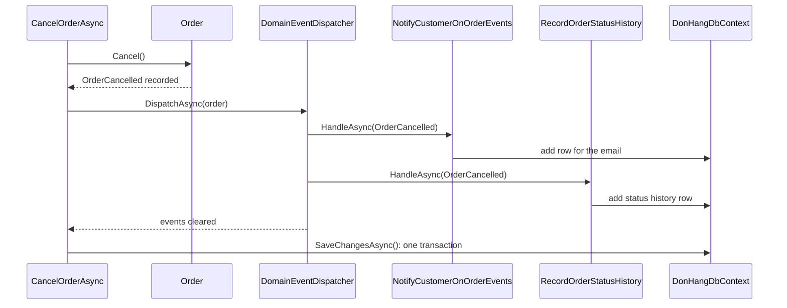

## Before you start

- [[design.l3.domain-events]] — you know that `Order.Cancel()` only adds `OrderCancelled` to its `DomainEvents` list and calls no one.
- [[backend.l2.database-job-queue]] — you know that at stage-2 the email job was a `notifications` row saved in the order's own transaction.
- [[design.l2.unit-of-work]] — you know that one `SaveChangesAsync` writes everything the request's `DbContext` tracks, in one transaction.

## The situation

At stage-2 you knew exactly when the cancellation email job was stored: `notifier.Send` added a `notifications` row, and the one `SaveChangesAsync` in `CancelOrderAsync` wrote it together with the cancelled order. At stage-3 you open the same method and find no `notifier.Send`. `Order.Cancel()` only records `OrderCancelled` and calls no one. Yet a customer who cancels still gets an email, and the order's status history gains a line. Some code must hand the event to whatever reacts. Does that code run before the order is saved or after, and what happens to the order if it fails?

## Core concepts

- a handler — a class implementing `IDomainEventHandler<TEvent>` once for each kind of event it reacts to, with one `HandleAsync` per kind, such as the one adding the row for the cancellation email.
- the dispatcher — `DomainEventDispatcher`, which hands each event an order has recorded to every handler registered for that kind of event, then clears the order's list.
- registering a handler — one `AddScoped` line in `AddDonHangInfrastructure` telling the DI container that a class handles a kind of event.
- the save — the single `SaveChangesAsync` that ends the use case and writes everything the `DbContext` tracks in one transaction.

## How it works



In the situation above, the code that hands the event over is the dispatcher. `CancelOrderAsync` calls it between `order.Cancel()` and `SaveChangesAsync`.

`DispatchAsync` walks the order's `DomainEvents`. For each event, a `switch` picks the handlers registered for that kind of event and awaits each `HandleAsync` in turn. For `OrderCancelled` there are two. When the loop ends, the dispatcher clears the order's list.

`NotifyCustomerOnOrderEvents` looks up the customer and calls `IOutbox`, which, like `QueuedNotifier` at stage-2, only adds a row to the `DbContext`. The row goes to `outbox_messages`, not stage-2's `notifications`. `RecordOrderStatusHistory` adds a row to `order_status_history`. Both add to the same scoped `DonHangDbContext` that tracks the cancelled order, and neither saves.

Only then does `SaveChangesAsync` run. It writes the status change and both rows in one transaction, as at stage-2: all three are stored, or none is. Passing the row on to `DonHang.Notifications`, the separate program that now runs `NotificationSender` and sends the email, starts only after the save; how the row travels is outside this lesson.

If a handler throws, the exception leaves `DispatchAsync`, and `CancelOrderAsync` never reaches `SaveChangesAsync`. The order keeps its old status and no reaction is stored.

That guarantee covers only work that joins the save. A handler that called another program over the network could not take that call back if the save then failed. This module therefore keeps every handler to rows added to the same `DbContext`; designs that need such calls run them after the save, which is outside this module.

## In the Đơn Hàng system

The use case, in its stage-3 order:

```csharp file=DonHang.Domain/OrderService.cs tag=stage-3 lines=59-68
    public async Task<Order> CancelOrderAsync(int orderId)
    {
        var order = await repository.FindAsync(orderId)
            ?? throw new KeyNotFoundException($"order {orderId} not found");

        order.Cancel();
        await events.DispatchAsync(order);
        await repository.SaveChangesAsync();
        return order;
    }
```

Read the three lines after the lookup: decide, dispatch, save. `events` is the `DomainEventDispatcher` that `OrderService` receives through its constructor. A refused `Cancel()` throws before `DispatchAsync`, and a throwing handler stops the method before `SaveChangesAsync`. Every other use case in the file ends with the same two lines.

The handlers are registered inside `AddDonHangInfrastructure`, the method `Program.cs`, the composition root, calls to register the infrastructure classes the order use cases need:

```csharp file=DonHang.Infrastructure/ServiceCollectionExtensions.cs tag=stage-3 lines=26-42
        // lesson: design.l3.dispatching-domain-events
        // One line per reaction to one kind of event. A new reaction to a
        // cancelled order is one more line here; Order and OrderService stay
        // as they are. DomainEventDispatcher gets every handler of each kind.
        services.AddScoped<IDomainEventHandler<OrderPlaced>, NotifyCustomerOnOrderEvents>();
        services.AddScoped<IDomainEventHandler<OrderCancelled>, NotifyCustomerOnOrderEvents>();
        services.AddScoped<IDomainEventHandler<OrderShipped>, NotifyCustomerOnOrderEvents>();
        services.AddScoped<IDomainEventHandler<OrderRefundRequested>, NotifyCustomerOnOrderEvents>();
        services.AddScoped<IDomainEventHandler<OrderRefunded>, NotifyCustomerOnOrderEvents>();
        services.AddScoped<IDomainEventHandler<OrderRefundFailed>, NotifyCustomerOnOrderEvents>();
        services.AddScoped<IDomainEventHandler<OrderPlaced>, RecordOrderStatusHistory>();
        services.AddScoped<IDomainEventHandler<OrderCancelled>, RecordOrderStatusHistory>();
        services.AddScoped<IDomainEventHandler<OrderShipped>, RecordOrderStatusHistory>();
        services.AddScoped<IDomainEventHandler<OrderRefundRequested>, RecordOrderStatusHistory>();
        services.AddScoped<IDomainEventHandler<OrderRefunded>, RecordOrderStatusHistory>();
        services.AddScoped<IDomainEventHandler<OrderRefundFailed>, RecordOrderStatusHistory>();
        services.AddScoped<DomainEventDispatcher>();
```

Each handler class is registered once per kind of event it reacts to: `NotifyCustomerOnOrderEvents` implements `IDomainEventHandler<T>` for all six kinds `Order` records, with one `HandleAsync` each. Two handlers react to `OrderCancelled`, so two lines register that interface. When a constructor asks for `IEnumerable<X>`, the container passes an instance of every class registered for `X`, not only the last one. The dispatcher's constructor has one such parameter per kind of event, `IEnumerable<IDomainEventHandler<OrderCancelled>>` among them, so it receives both. To add another reaction to a cancelled order, you would write one new class implementing `IDomainEventHandler<OrderCancelled>` and add one line here; `Order` and `CancelOrderAsync` stay unchanged. Only a new kind of event needs more: one more constructor parameter and one more `case`.

## Seniors often assume…

- **"Domain event handlers run after the order is saved, so a failing handler cannot affect the order."** → Actually `DispatchAsync` runs before `SaveChangesAsync`, and an exception from any handler skips the save. The cancel and its reactions fail together. You notice this when a cancel request returns an error because the customer lookup in `NotifyCustomerOnOrderEvents` threw, and the order still shows its old status.
- **"Because the event is handled in the same use case, the email is sent at the moment the order is cancelled."** → Actually the handler only adds a row to the `DbContext`; no email exists yet. Only after the save has stored that row is it passed on, and `DonHang.Notifications` sends the email. You notice this when the API has already answered and the email appears in Mailpit a moment later.
- **"With domain events, `OrderService` no longer calls `SaveChangesAsync`, since each handler saves its own work."** → Actually no handler saves; each only adds to the shared `DbContext`, and the use case saves once. If a handler saved, it would write everything the shared `DbContext` tracks at that point, the cancel included, before the later handlers ran; a later handler that threw could no longer undo it. For example, `NotifyCustomerOnOrderEvents`, registered first and so run first, saves, then `RecordOrderStatusHistory` throws. You notice this when an order is `cancelled` in `orders` but has no `cancelled` line in `order_status_history`.

## Try it (3 minutes)

1. With the example repository at `stage-3`, open `DonHang.Domain/OrderService.cs` in your editor and search for `events.DispatchAsync`.
2. Think: a teammate registers a third `IDomainEventHandler<OrderCancelled>` that always throws. A customer cancels an order whose status is `new`. After the request, what do `orders` and `order_status_history` hold for that order?

Expected result: step 1 finds six matches, one per use case, each on the line just before `await repository.SaveChangesAsync();`.

<details><summary>Suggested answer</summary>

The order is still `new` in `orders`, and `order_status_history` gains no `cancelled` line. Whichever handlers ran before the throwing one only added rows to the `DbContext`. The exception left `DispatchAsync`, so `SaveChangesAsync` never ran and nothing from this request was written.

</details>

## Connections

- [[design.l3.domain-events]] — prerequisite: how `Order` records the events that this lesson hands to handlers.
- [[design.l2.unit-of-work]] — the same idea one step on: handlers add to the unit of work, and the use case still ends it with one save.
- [[backend.l2.database-job-queue]] — the stage-2 guarantee, the email job saved in the order's own transaction, that dispatching before the save keeps.
- [[design.l1.solid-ocp]] — the principle at work: a new reaction is a new handler and one registration, with `Order` and `OrderService` closed to change.
- [[backend.l3.outbox-pattern]] — what comes next for the row `NotifyCustomerOnOrderEvents` adds, and how it leaves the process after the save.

## Five-line summary

1. At stage-3 an order's recorded events reach every registered handler before `SaveChangesAsync` runs, so handlers add to the same save.
2. `CancelOrderAsync` calls `order.Cancel()`, then `DispatchAsync`, then `SaveChangesAsync`; the dispatcher clears the order's events after handing them over.
3. Handlers add rows to the shared `DonHangDbContext`; one transaction stores the order's change and every reaction, or none of them.
4. A throwing handler stops the use case before the save; work outside the database could not be undone, so handlers here only add rows.
5. A new reaction is one new handler class and one `AddScoped` line; `Order` and `CancelOrderAsync` stay unchanged.
