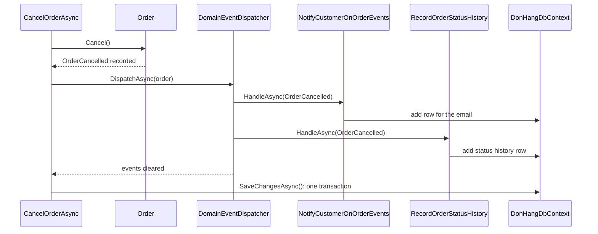

## Bạn cần biết trước

- [[design.l3.domain-events]] — bạn biết `Order.Cancel()` chỉ thêm `OrderCancelled` vào danh sách `DomainEvents` của nó và không gọi ai.
- [[backend.l2.database-job-queue]] — bạn biết ở stage-2, job gửi email là một dòng `notifications` được lưu trong chính giao dịch của đơn.
- [[design.l2.unit-of-work]] — bạn biết một lần `SaveChangesAsync` ghi mọi thứ mà `DbContext` của request theo dõi, trong một giao dịch.

## Tình huống

Ở stage-2, bạn biết chính xác lúc nào job gửi email hủy đơn được lưu: `notifier.Send` thêm một dòng `notifications`, và lần `SaveChangesAsync` duy nhất trong `CancelOrderAsync` ghi dòng đó cùng với đơn đã hủy. Sang stage-3, bạn mở lại hàm đó và không thấy `notifier.Send` đâu. `Order.Cancel()` chỉ ghi nhận `OrderCancelled` và không gọi ai. Thế nhưng khách hủy đơn vẫn nhận email, và lịch sử trạng thái của đơn vẫn có thêm một dòng. Phải có code nào đó đưa event tới những thứ phản ứng với nó. Code đó chạy trước hay sau khi đơn được lưu, và nếu nó thất bại thì đơn ra sao?

## Khái niệm cốt lõi

- handler — một class cài đặt `IDomainEventHandler<TEvent>` một lần cho mỗi loại event nó phản ứng, mỗi loại một `HandleAsync`, như class thêm dòng cho email hủy đơn.
- dispatcher — `DomainEventDispatcher`, class đưa từng event mà một đơn đã ghi nhận tới mọi handler đăng ký cho loại event đó, rồi làm rỗng danh sách của đơn.
- đăng ký một handler — một dòng `AddScoped` trong `AddDonHangInfrastructure`, báo cho DI container rằng một class xử lý một loại event.
- lần lưu — lần `SaveChangesAsync` duy nhất kết thúc use case, ghi mọi thứ `DbContext` theo dõi trong một giao dịch.

## Cơ chế hoạt động



Trong tình huống trên, code đưa event đi chính là dispatcher. `CancelOrderAsync` gọi nó giữa `order.Cancel()` và `SaveChangesAsync`.

`DispatchAsync` duyệt qua `DomainEvents` của đơn. Với mỗi event, một lệnh `switch` chọn các handler đăng ký cho loại event đó và lần lượt await từng `HandleAsync`. Với `OrderCancelled` có hai handler. Khi vòng lặp kết thúc, dispatcher làm rỗng danh sách của đơn.

`NotifyCustomerOnOrderEvents` tra khách hàng rồi gọi `IOutbox`. Giống `QueuedNotifier` ở stage-2, `IOutbox` chỉ thêm một dòng vào `DbContext`. Dòng này vào `outbox_messages`, không phải `notifications` như ở stage-2. `RecordOrderStatusHistory` thêm một dòng vào `order_status_history`. Cả hai cùng thêm vào `DonHangDbContext` scoped đang theo dõi đơn đã hủy, và không cái nào tự lưu.

Đến lúc đó `SaveChangesAsync` mới chạy. Nó ghi thay đổi trạng thái và cả hai dòng trong một giao dịch, như ở stage-2: cả ba cùng được lưu, hoặc không cái nào. Dòng đó chỉ được chuyển tiếp sang `DonHang.Notifications`, chương trình riêng giờ chạy `NotificationSender` và gửi email, sau khi lưu xong. Dòng đi bằng cách nào nằm ngoài bài này.

Nếu một handler ném exception, exception thoát ra khỏi `DispatchAsync`, và `CancelOrderAsync` không bao giờ tới `SaveChangesAsync`. Đơn giữ trạng thái cũ và không phản ứng nào được lưu.

Bảo đảm đó chỉ áp dụng cho phần việc nằm trong lần lưu. Một handler gọi sang chương trình khác qua mạng sẽ không rút lại được lời gọi đó nếu sau đó lần lưu thất bại. Vì vậy module này giữ mọi handler ở mức thêm dòng vào cùng `DbContext`. Thiết kế nào cần những lời gọi như vậy thì chạy chúng sau khi lưu, và phần đó nằm ngoài module này.

## Trong hệ thống Đơn Hàng

Use case, theo thứ tự ở stage-3:

```csharp file=DonHang.Domain/OrderService.cs tag=stage-3 lines=59-68
    public async Task<Order> CancelOrderAsync(int orderId)
    {
        var order = await repository.FindAsync(orderId)
            ?? throw new KeyNotFoundException($"order {orderId} not found");

        order.Cancel();
        await events.DispatchAsync(order);
        await repository.SaveChangesAsync();
        return order;
    }
```

Đọc ba dòng sau bước tra đơn: quyết định, dispatch, lưu. `events` là `DomainEventDispatcher` mà `OrderService` nhận qua constructor. Một lần `Cancel()` bị từ chối sẽ ném exception trước `DispatchAsync`, còn một handler ném exception sẽ dừng hàm trước `SaveChangesAsync`. Mọi use case khác trong file đều kết thúc bằng đúng hai dòng này.

Các handler được đăng ký trong `AddDonHangInfrastructure`, method mà `Program.cs`, tức composition root, gọi để đăng ký các class infrastructure mà các use case của đơn cần:

```csharp file=DonHang.Infrastructure/ServiceCollectionExtensions.cs tag=stage-3 lines=26-42
        // lesson: design.l3.dispatching-domain-events
        // One line per reaction to one kind of event. A new reaction to a
        // cancelled order is one more line here; Order and OrderService stay
        // as they are. DomainEventDispatcher gets every handler of each kind.
        services.AddScoped<IDomainEventHandler<OrderPlaced>, NotifyCustomerOnOrderEvents>();
        services.AddScoped<IDomainEventHandler<OrderCancelled>, NotifyCustomerOnOrderEvents>();
        services.AddScoped<IDomainEventHandler<OrderShipped>, NotifyCustomerOnOrderEvents>();
        services.AddScoped<IDomainEventHandler<OrderRefundRequested>, NotifyCustomerOnOrderEvents>();
        services.AddScoped<IDomainEventHandler<OrderRefunded>, NotifyCustomerOnOrderEvents>();
        services.AddScoped<IDomainEventHandler<OrderRefundFailed>, NotifyCustomerOnOrderEvents>();
        services.AddScoped<IDomainEventHandler<OrderPlaced>, RecordOrderStatusHistory>();
        services.AddScoped<IDomainEventHandler<OrderCancelled>, RecordOrderStatusHistory>();
        services.AddScoped<IDomainEventHandler<OrderShipped>, RecordOrderStatusHistory>();
        services.AddScoped<IDomainEventHandler<OrderRefundRequested>, RecordOrderStatusHistory>();
        services.AddScoped<IDomainEventHandler<OrderRefunded>, RecordOrderStatusHistory>();
        services.AddScoped<IDomainEventHandler<OrderRefundFailed>, RecordOrderStatusHistory>();
        services.AddScoped<DomainEventDispatcher>();
```

Mỗi class handler được đăng ký một lần cho mỗi loại event nó phản ứng: `NotifyCustomerOnOrderEvents` cài đặt `IDomainEventHandler<T>` cho cả sáu loại mà `Order` ghi nhận, mỗi loại một `HandleAsync`. Hai handler phản ứng với `OrderCancelled`, nên có hai dòng đăng ký interface đó. Khi một constructor xin `IEnumerable<X>`, container đưa vào một instance của mọi class đăng ký cho `X`, không chỉ class đăng ký sau cùng. Constructor của dispatcher có một tham số như vậy cho mỗi loại event, trong đó có `IEnumerable<IDomainEventHandler<OrderCancelled>>`, nên nó nhận được cả hai. Muốn thêm một phản ứng nữa cho đơn bị hủy, bạn viết một class mới cài đặt `IDomainEventHandler<OrderCancelled>` và thêm một dòng ở đây. `Order` và `CancelOrderAsync` giữ nguyên. Chỉ khi có một loại event mới thì mới cần thêm nhiều hơn: một tham số constructor và một `case`.

## Senior hay nhầm rằng…

- **"Handler của domain event chạy sau khi đơn đã lưu, nên handler lỗi không ảnh hưởng tới đơn."** → Thực ra `DispatchAsync` chạy trước `SaveChangesAsync`, và exception từ bất kỳ handler nào cũng khiến lần lưu bị bỏ qua. Hủy đơn và các phản ứng của nó cùng thất bại. Bạn sẽ nhận ra khi một request hủy đơn trả về lỗi vì bước tra khách hàng trong `NotifyCustomerOnOrderEvents` ném exception, và đơn vẫn hiện trạng thái cũ.
- **"Vì event được xử lý trong cùng use case, email được gửi ngay lúc đơn bị hủy."** → Thực ra handler chỉ thêm một dòng vào `DbContext`, lúc đó chưa có email nào. Chỉ sau khi lần lưu đã ghi dòng đó, nó mới được chuyển tiếp, và `DonHang.Notifications` gửi email. Bạn sẽ nhận ra khi API đã trả lời xong mà email chỉ xuất hiện trong Mailpit một lát sau.
- **"Có domain event rồi thì `OrderService` không gọi `SaveChangesAsync` nữa, vì mỗi handler tự lưu phần của mình."** → Thực ra không handler nào lưu. Mỗi handler chỉ thêm vào `DbContext` dùng chung, và use case lưu một lần. Nếu một handler tự lưu, nó sẽ ghi mọi thứ `DbContext` dùng chung đang theo dõi ở thời điểm đó, kể cả đơn vừa hủy, trước khi các handler sau chạy. Một handler sau đó ném exception sẽ không còn hoàn tác được nữa. Ví dụ, `NotifyCustomerOnOrderEvents`, đăng ký trước nên chạy trước, tự lưu, rồi `RecordOrderStatusHistory` ném exception. Bạn sẽ nhận ra khi một đơn là `cancelled` trong `orders` nhưng `order_status_history` không có dòng `cancelled` nào.

## Thử ngay (3 phút)

1. Với repo ví dụ ở `stage-3`, mở `DonHang.Domain/OrderService.cs` trong editor và tìm `events.DispatchAsync`.
2. Suy nghĩ: một đồng đội đăng ký thêm `IDomainEventHandler<OrderCancelled>` thứ ba, luôn ném exception. Một khách hủy một đơn đang ở trạng thái `new`. Sau request, `orders` và `order_status_history` chứa gì cho đơn đó?

Kết quả mong đợi: bước 1 tìm thấy sáu kết quả, mỗi use case một kết quả, mỗi kết quả nằm ngay trên dòng `await repository.SaveChangesAsync();`.

<details><summary>Gợi ý đáp án</summary>

Đơn vẫn là `new` trong `orders`, và `order_status_history` không có thêm dòng `cancelled` nào. Các handler chạy trước handler ném exception chỉ thêm dòng vào `DbContext`. Exception thoát ra khỏi `DispatchAsync`, nên `SaveChangesAsync` không bao giờ chạy và không gì từ request này được ghi.

</details>

## Liên hệ

- [[design.l3.domain-events]] — bài tiên quyết: cách `Order` ghi nhận các event mà bài này đưa tới handler.
- [[design.l2.unit-of-work]] — cùng ý tưởng, tiến thêm một bước: handler thêm vào unit of work, và use case vẫn kết thúc nó bằng một lần lưu.
- [[backend.l2.database-job-queue]] — bảo đảm của stage-2, job email được lưu trong chính giao dịch của đơn, mà dispatch trước khi lưu vẫn giữ được.
- [[design.l1.solid-ocp]] — nguyên lý đang vận hành: một phản ứng mới là một handler mới và một dòng đăng ký, còn `Order` và `OrderService` đóng trước thay đổi.
- [[backend.l3.outbox-pattern]] — chuyện gì xảy ra tiếp theo với dòng mà `NotifyCustomerOnOrderEvents` thêm vào, và nó rời khỏi process thế nào sau khi lưu.

## Tóm tắt 5 dòng

1. Ở stage-3, các event mà đơn ghi nhận tới mọi handler đã đăng ký trước khi `SaveChangesAsync` chạy, nên handler góp phần vào cùng lần lưu.
2. `CancelOrderAsync` gọi `order.Cancel()`, rồi `DispatchAsync`, rồi `SaveChangesAsync`. Dispatcher làm rỗng danh sách event của đơn sau khi đưa chúng đi.
3. Handler thêm dòng vào `DonHangDbContext` dùng chung. Một giao dịch lưu cả thay đổi của đơn lẫn mọi phản ứng, hoặc không lưu gì.
4. Handler ném exception sẽ dừng use case trước lần lưu. Việc nằm ngoài database thì không hoàn tác được, nên handler ở đây chỉ thêm dòng.
5. Một phản ứng mới là một class handler mới và một dòng `AddScoped`. `Order` và `CancelOrderAsync` giữ nguyên.
