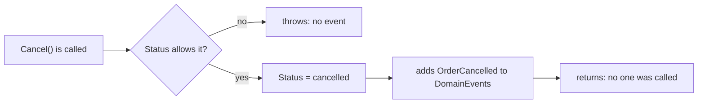

## Before you start

- [[design.l3.aggregate-root]] — you know that every change to an order goes through `Order`'s own methods, such as `Cancel()`.
- [[design.l2.observer-pattern]] — you know that a C# event calls each of its subscribers, one after another, before the method that raised it continues.

## The situation

You are asked to add a second reaction when an order is cancelled in Đơn Hàng at stage-2: besides the email, the warehouse's own program should hear about it. You open `OrderService`, where `CancelOrderAsync` calls `order.Cancel()`, then `notifier.Send(order, "order cancelled")`, which adds an email job to the `notifications` job queue, then saves. `ShipOrderAsync` repeats the same three steps with its own text. Every use case that changes a status carries its own list of reactions, and nothing reminds the next use case to call them. `Order` knows the moment it was cancelled, yet it tells nobody. What could the order record instead, so that the use case no longer has to remember who reacts?

## Core concepts

- **domain event** — a record, named in the past tense, that something the business cares about has happened, such as `OrderCancelled`.
- the order's event list — `Order.DomainEvents`, the events an order has recorded since it was created or loaded, until `ClearDomainEvents()` empties it (the next lesson shows who calls it); `Order` adds to it and calls no one.
- a reaction — work done because an event happened, such as adding the cancellation email job; it belongs to whoever reacts, not to the event.

## How it works



In the situation above, the thing the order could record is a domain event. At stage-3, `Order` keeps a private list of `IDomainEvent` objects (the interface every domain event implements, shown in the next section) and shows it to outside code as the read-only `DomainEvents`.

`Cancel()` first checks the status it starts from. If the order is already cancelled, shipped, paid or being refunded, it throws an `OrderStatusException`, so a refused change records nothing. Only after `Status` becomes `cancelled` does the method add an `OrderCancelled` to its list.

The event carries two things: the order it happened to, and when. It holds no email text, no recipient, no instruction. Sending an email is a reaction to the event, and so is telling the warehouse. Neither is part of the fact that the order was cancelled, so neither appears in it.

Then `Cancel()` returns. Compare the C# event from the Observer pattern lesson: raising it calls every subscriber before the raising method continues. `Order` does the opposite. It holds no list of subscribers and calls nothing, so cancelling an order in a unit test runs no email code. At stage-3, `CancelOrderAsync` no longer calls `notifier.Send`: code outside `Order` reads the list and reacts, and the next lesson shows that code and when it runs. The reactions are written once, in classes outside every use case, so `CancelOrderAsync` no longer lists them.

## In the Đơn Hàng system

Every domain event of an order, in one file:

```csharp file=DonHang.Domain/DomainEvents.cs tag=stage-3 lines=3-19
// lesson: design.l3.domain-events
// Something the business cares about that has happened to an order, named in
// the past tense. An event says what happened, to which order and when; it
// says nothing about what should be done about it. Each one holds the Order
// itself, not its id: a new order has no id yet when its constructor records
// OrderPlaced; the repository gives it one before the handlers run (OrderService).
public interface IDomainEvent
{
    Order Order { get; }
    DateTimeOffset OccurredAt { get; }
}

public sealed record OrderPlaced(Order Order, DateTimeOffset OccurredAt) : IDomainEvent;

public sealed record OrderCancelled(Order Order, DateTimeOffset OccurredAt) : IDomainEvent;

public sealed record OrderShipped(Order Order, DateTimeOffset OccurredAt) : IDomainEvent;
```

Read the three names: each is a verb in the past tense. `IDomainEvent` asks for exactly two values, the order and the time, and each record supplies nothing more.

This `OrderPlaced` is a record, a different type from the C# `OrderPlaced` event of the Observer pattern lesson, which lives in a separate sample class `OrderEvents`, not on `Order`. The same file also holds three refund events, built the same way.

The comment explains why an event holds the `Order` itself rather than its id: the id is the order's primary key, which the repository's `AddAsync` assigns after the constructor has already recorded `OrderPlaced`. The "handlers" are the code that reacts to events, the subject of the next lesson.

Where `OrderCancelled` is recorded:

```csharp file=DonHang.Domain/Entities.cs tag=stage-3 lines=121-133
    public void Cancel()
    {
        if (Status == "cancelled") throw new OrderStatusException(Id, "already-cancelled", $"order {Id} is already cancelled");
        if (Status == "shipped") throw new OrderStatusException(Id, "already-shipped", $"order {Id} has already shipped");
        if (Status == "paid") throw new OrderStatusException(Id, "paid", $"order {Id} is paid; request a refund instead");
        if (Status == "refunding") throw new OrderStatusException(Id, "refund-in-progress", $"order {Id} is being refunded");
        Status = "cancelled";

        // lesson: design.l3.domain-events
        // Recorded only after the change is made: a refused Cancel() throws
        // above and records nothing.
        domainEvents.Add(new OrderCancelled(this, DateTimeOffset.UtcNow));
    }
```

The four checks come first, the change comes next, and the event comes last. Nothing in the method names an email, a notifier or any other object. `OrderTests` checks both cases: a cancel that succeeds and one that is refused. Before calling `Cancel()`, each test calls `ClearDomainEvents()` to drop the events recorded during setup, such as the constructor's `OrderPlaced`. Then `Cancel_NewOrder_RecordsOrderCancelled` expects exactly one `OrderCancelled`, and `Cancel_ShippedOrder_RecordsNothing` expects an empty list. Neither test needs a fake notifier, because `Order` has nothing to call.

## Seniors often assume…

- **"A domain event is just a C# `event` declared on the entity."** → Actually `Order` declares no `event` member; it keeps a list of records. A C# event would call its subscribers inside `Cancel()`, before the use case has saved anything, and `Order` would have to hold references to them. If a subscriber sent the email at once and the save then failed, the customer would hear of a cancellation that never happened. You notice this when a unit test of `Order` fails because an email subscriber threw, in a test that never meant to send anything.
- **"A domain event can be sent as it is to another program, such as the warehouse's."** → Actually `OrderCancelled` lives in `DonHang.Domain` and holds an `Order` object, which means something only inside the same running program: the other program has no `Order` class or its rules, and needs only a few values such as the order id and the time. Sending to it is a separate step with its own DTO holding those values, taught in the messaging lessons. You notice this when you picture the warehouse's program receiving `OrderCancelled`: it would need the `Order` class itself, not just the facts.
- **"An event should be named after what must happen next, such as `SendCancellationEmail`."** → Actually that name ties the fact to one reaction. A second reaction, such as telling the warehouse, would hang off an event that says "send an email". You notice this when the event called `SendCancellationEmail` also starts triggering stock updates, and its name now lies. A past-tense name such as `OrderCancelled` stays true however many reactions follow it.

## Try it (3 minutes)

In the root folder of the example repository, in Git Bash:

1. Run `git grep -n "domainEvents.Add" stage-3 -- DonHang.Domain`.
2. Run `git grep -n "Status = " stage-3 -- DonHang.Domain/Entities.cs` and match each line to the method it sits in: open `DonHang.Domain/Entities.cs` with stage-3 checked out and go to each line number. Which public method changes `Status` but records no event?

Expected result: step 1 prints six lines, all from `DonHang.Domain/Entities.cs`: one in the constructor and one each in `Cancel`, `Ship`, `RequestRefund`, `CompleteRefund` and `FailRefund`.

<details><summary>Suggested answer</summary>

`MarkPaid()` changes `Status` from `new` to `paid` and adds nothing to `domainEvents`. So no code reading `DomainEvents` can react to an order becoming paid through that method. If such a reaction were ever needed, the first change would be a new past-tense event recorded inside `MarkPaid()`, not a new call in some use case.

</details>

## Connections

- [[design.l3.dispatching-domain-events]] — what comes next: how the recorded events reach the code that reacts to them, and when, relative to the save.
- [[design.l2.observer-pattern]] — the contrast: a C# event calls its subscribers at once, while `Order` only records and calls no one.
- [[design.l3.aggregate-root]] — the same root that guards the order's rules is the only place that records what happened to it.
- [[backend.l2.database-job-queue]] — the `notifications` job that cancelling adds at stage-2, the reaction this lesson separates from the event.

## Five-line summary

1. A domain event is a record, named in the past tense, that something the business cares about has happened, such as `OrderCancelled`.
2. At stage-2 every status-changing use case calls `notifier.Send` itself, so each one must remember its reactions.
3. At stage-3 `Order.Cancel()` adds `OrderCancelled` to its own `DomainEvents` list only after the change succeeds; a refused change records nothing.
4. The event holds which order and when, never what to do; an email is a reaction to the event, not part of it.
5. Unlike the C# event from the Observer pattern lesson, which calls subscribers at once, `Order` only records the event and calls no one.
