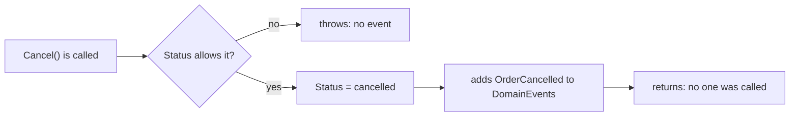

## Bạn cần biết trước

- [[design.l3.aggregate-root]] — bạn biết mọi thay đổi lên một đơn đều đi qua chính các method của `Order`, như `Cancel()`.
- [[design.l2.observer-pattern]] — bạn biết một C# event gọi lần lượt từng bên đăng ký, xong hết rồi method phát ra nó mới chạy tiếp.

## Tình huống

Bạn được giao thêm một phản ứng thứ hai khi một đơn bị hủy trong Đơn Hàng ở stage-2: ngoài email, chương trình riêng của kho hàng cũng phải biết chuyện này. Bạn mở `OrderService`. Ở đó `CancelOrderAsync` gọi `order.Cancel()`, rồi `notifier.Send(order, "order cancelled")` để thêm một job gửi email vào hàng đợi job `notifications`, rồi lưu. `ShipOrderAsync` lặp lại đúng ba bước đó với câu chữ riêng. Use case nào đổi trạng thái cũng mang theo danh sách phản ứng của riêng nó, và không có gì nhắc use case tiếp theo gọi chúng. `Order` biết đúng lúc nó bị hủy, nhưng không báo cho ai. Đơn có thể ghi lại điều gì, để use case không còn phải nhớ ai cần phản ứng?

## Khái niệm cốt lõi

- **domain event** (bản ghi, đặt tên ở thì quá khứ, rằng một việc nghiệp vụ quan tâm đã xảy ra) — một bản ghi, đặt tên ở thì quá khứ, cho biết một việc nghiệp vụ quan tâm đã xảy ra, như `OrderCancelled`.
- danh sách event của đơn — `Order.DomainEvents`, các event mà một đơn đã ghi lại từ lúc được tạo hoặc được tải, cho tới khi `ClearDomainEvents()` làm rỗng nó (bài sau chỉ ra ai gọi method này). `Order` thêm vào danh sách và không gọi ai.
- một phản ứng — việc làm vì một event đã xảy ra, như thêm job gửi email báo hủy. Phản ứng thuộc về bên phản ứng, không thuộc về event.

## Cơ chế hoạt động



Trong tình huống trên, thứ mà đơn có thể ghi lại chính là một domain event. Ở stage-3, `Order` giữ một danh sách private gồm các object `IDomainEvent` (interface mà mọi domain event đều implement, có ở phần sau), và cho code bên ngoài thấy nó dưới dạng `DomainEvents` chỉ đọc.

`Cancel()` kiểm tra trạng thái xuất phát trước. Nếu đơn đã hủy, đã giao, đã thanh toán hoặc đang hoàn tiền, method ném `OrderStatusException`, nên một thay đổi bị từ chối không ghi lại gì. Chỉ sau khi `Status` thành `cancelled`, method mới thêm một `OrderCancelled` vào danh sách.

Event mang hai thứ: đơn mà chuyện xảy ra với nó, và thời điểm. Nó không chứa nội dung email, người nhận hay chỉ thị nào. Gửi email là một phản ứng với event, báo cho kho hàng cũng vậy. Cả hai đều không thuộc về sự thật "đơn đã bị hủy", nên không cái nào xuất hiện trong event.

Rồi `Cancel()` trả về. Hãy so với C# event trong bài Observer pattern: phát event là gọi mọi bên đăng ký trước khi method phát ra nó chạy tiếp. `Order` làm ngược lại. Nó không giữ danh sách bên đăng ký nào và không gọi gì, nên hủy một đơn trong unit test không chạy chút code email nào. Ở stage-3, `CancelOrderAsync` không còn gọi `notifier.Send`: code bên ngoài `Order` đọc danh sách rồi phản ứng, và bài sau chỉ ra code đó cùng thời điểm nó chạy. Các phản ứng được viết một lần, trong những class nằm ngoài mọi use case, nên `CancelOrderAsync` không còn liệt kê chúng.

## Trong hệ thống Đơn Hàng

Mọi domain event của một đơn, trong một file:

```csharp file=DonHang.Domain/DomainEvents.cs tag=stage-3 lines=3-19
// lesson: design.l3.domain-events
// Something the business cares about that has happened to an order, named in
// the past tense. An event says what happened, to which order and when; it
// says nothing about what should be done about it. Each one holds the Order
// itself, not its id: a new order has no id yet when its constructor records
// OrderPlaced; the repository gives it one before the handlers run (OrderService).
public interface IDomainEvent
{
    Order Order { get; }
    DateTimeOffset OccurredAt { get; }
}

public sealed record OrderPlaced(Order Order, DateTimeOffset OccurredAt) : IDomainEvent;

public sealed record OrderCancelled(Order Order, DateTimeOffset OccurredAt) : IDomainEvent;

public sealed record OrderShipped(Order Order, DateTimeOffset OccurredAt) : IDomainEvent;
```

Đọc ba cái tên: cái nào cũng là động từ ở thì quá khứ. `IDomainEvent` đòi đúng hai giá trị, đơn và thời điểm, và mỗi record không đưa thêm gì.

`OrderPlaced` ở đây là một record, khác kiểu với C# event `OrderPlaced` trong bài Observer pattern. Event kia nằm trong một class mẫu riêng là `OrderEvents`, không nằm trên `Order`. Cùng file này còn có ba event về hoàn tiền, dựng theo đúng cách trên.

Comment giải thích vì sao event giữ chính `Order` chứ không giữ id của nó: id là khóa chính của đơn, do `AddAsync` của repository gán, sau khi constructor đã ghi `OrderPlaced`. "Handler" là code phản ứng với event, chủ đề của bài sau.

Nơi `OrderCancelled` được ghi lại:

```csharp file=DonHang.Domain/Entities.cs tag=stage-3 lines=121-133
    public void Cancel()
    {
        if (Status == "cancelled") throw new OrderStatusException(Id, "already-cancelled", $"order {Id} is already cancelled");
        if (Status == "shipped") throw new OrderStatusException(Id, "already-shipped", $"order {Id} has already shipped");
        if (Status == "paid") throw new OrderStatusException(Id, "paid", $"order {Id} is paid; request a refund instead");
        if (Status == "refunding") throw new OrderStatusException(Id, "refund-in-progress", $"order {Id} is being refunded");
        Status = "cancelled";

        // lesson: design.l3.domain-events
        // Recorded only after the change is made: a refused Cancel() throws
        // above and records nothing.
        domainEvents.Add(new OrderCancelled(this, DateTimeOffset.UtcNow));
    }
```

Bốn bước kiểm tra đi đầu, thay đổi đi sau, event đi cuối. Không chỗ nào trong method nhắc tới email, notifier hay bất kỳ object nào khác. `OrderTests` kiểm tra cả hai trường hợp: hủy thành công và hủy bị từ chối. Trước khi gọi `Cancel()`, mỗi test gọi `ClearDomainEvents()` để bỏ các event ghi lại lúc chuẩn bị, như `OrderPlaced` của constructor. Sau đó `Cancel_NewOrder_RecordsOrderCancelled` chờ đúng một `OrderCancelled`, còn `Cancel_ShippedOrder_RecordsNothing` chờ một danh sách rỗng. Không test nào cần notifier giả, vì `Order` chẳng có gì để gọi.

## Senior hay nhầm rằng…

- **"Domain event chỉ là một C# `event` khai báo trên entity."** → Thực ra `Order` không khai báo member `event` nào, nó giữ một danh sách record. Một C# event sẽ gọi các bên đăng ký ngay bên trong `Cancel()`, trước khi use case kịp lưu gì, và `Order` sẽ phải giữ tham chiếu tới chúng. Nếu một bên đăng ký gửi email ngay rồi lần lưu thất bại, khách sẽ nghe tin về một lần hủy chưa từng xảy ra. Bạn sẽ nhận ra khi một unit test của `Order` thất bại vì một bên đăng ký gửi email ném lỗi, trong một test vốn không hề định gửi gì.
- **"Có thể gửi nguyên domain event sang một chương trình khác, như chương trình của kho hàng."** → Thực ra `OrderCancelled` nằm trong `DonHang.Domain` và giữ một object `Order`, thứ chỉ có nghĩa bên trong cùng một chương trình đang chạy: chương trình kia không có class `Order` lẫn các quy tắc của nó, và chỉ cần vài giá trị như id đơn và thời điểm. Gửi sang đó là một bước riêng, với DTO riêng chứa các giá trị ấy, được dạy trong các bài về messaging. Bạn sẽ nhận ra khi hình dung chương trình của kho hàng nhận `OrderCancelled`: nó sẽ cần chính class `Order`, chứ không chỉ các sự thật.
- **"Event nên đặt tên theo việc phải làm tiếp, như `SendCancellationEmail`."** → Thực ra cái tên đó buộc sự thật vào một phản ứng duy nhất. Phản ứng thứ hai, như báo cho kho hàng, sẽ phải treo vào một event mang nghĩa "gửi email". Bạn sẽ nhận ra khi event tên `SendCancellationEmail` bắt đầu kích hoạt cả cập nhật tồn kho, và tên của nó giờ nói sai. Một cái tên ở thì quá khứ như `OrderCancelled` vẫn đúng, dù theo sau nó có bao nhiêu phản ứng.

## Thử ngay (3 phút)

Trong thư mục gốc của repo ví dụ, dùng Git Bash:

1. Chạy `git grep -n "domainEvents.Add" stage-3 -- DonHang.Domain`.
2. Chạy `git grep -n "Status = " stage-3 -- DonHang.Domain/Entities.cs` rồi ghép từng dòng với method chứa nó: checkout stage-3, mở `DonHang.Domain/Entities.cs` và đi tới từng số dòng. Method public nào đổi `Status` mà không ghi event nào?

Kết quả mong đợi: bước 1 in ra sáu dòng, đều từ `DonHang.Domain/Entities.cs`: một dòng trong constructor và mỗi dòng một trong `Cancel`, `Ship`, `RequestRefund`, `CompleteRefund` và `FailRefund`.

<details><summary>Gợi ý đáp án</summary>

`MarkPaid()` đổi `Status` từ `new` sang `paid` và không thêm gì vào `domainEvents`. Vì vậy không code nào đọc `DomainEvents` phản ứng được khi một đơn chuyển sang đã thanh toán qua method đó. Nếu có ngày cần một phản ứng như vậy, thay đổi đầu tiên sẽ là một event mới ở thì quá khứ, ghi lại bên trong `MarkPaid()`, chứ không phải một lời gọi mới trong use case nào đó.

</details>

## Liên hệ

- [[design.l3.dispatching-domain-events]] — bài tiếp theo: các event đã ghi tới được code phản ứng với chúng bằng cách nào, và vào lúc nào so với lần lưu.
- [[design.l2.observer-pattern]] — phép so sánh: C# event gọi các bên đăng ký ngay lập tức, còn `Order` chỉ ghi lại và không gọi ai.
- [[design.l3.aggregate-root]] — chính root canh giữ quy tắc của đơn cũng là nơi duy nhất ghi lại điều đã xảy ra với đơn.
- [[backend.l2.database-job-queue]] — job `notifications` mà thao tác hủy thêm vào ở stage-2, phản ứng mà bài này tách ra khỏi event.

## Tóm tắt 5 dòng

1. Domain event là một bản ghi, đặt tên ở thì quá khứ, cho biết một việc nghiệp vụ quan tâm đã xảy ra, như `OrderCancelled`.
2. Ở stage-2, use case nào đổi trạng thái cũng tự gọi `notifier.Send`, nên từng use case phải nhớ các phản ứng của mình.
3. Ở stage-3, `Order.Cancel()` chỉ thêm `OrderCancelled` vào danh sách `DomainEvents` của chính nó sau khi thay đổi thành công. Thay đổi bị từ chối thì không ghi gì.
4. Event giữ đơn nào và lúc nào, không bao giờ giữ việc phải làm. Email là phản ứng với event, không phải một phần của nó.
5. Khác với C# event trong bài Observer pattern, vốn gọi các bên đăng ký ngay lập tức, `Order` chỉ ghi lại event và không gọi ai.
